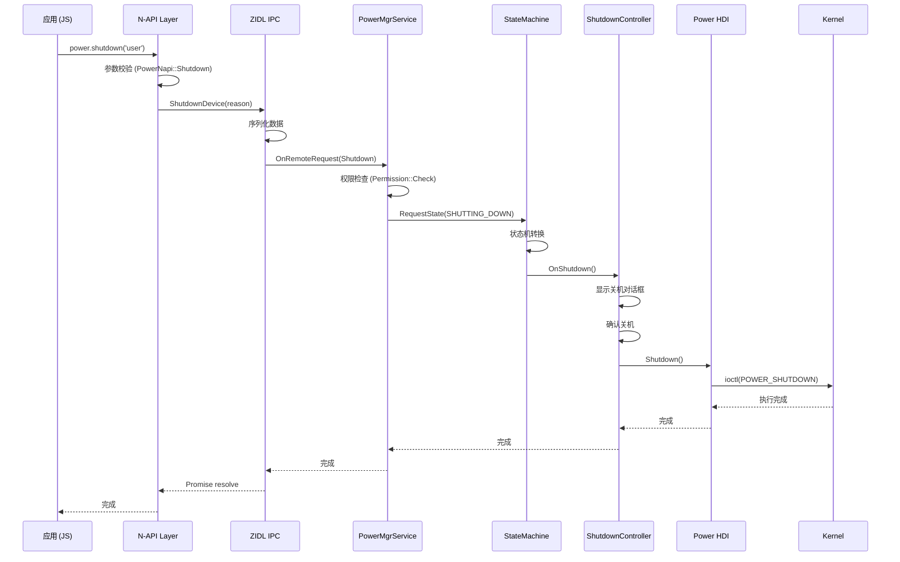
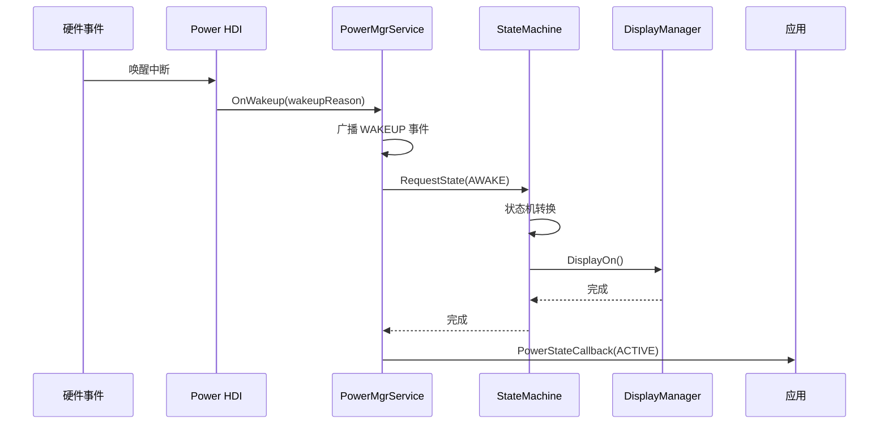
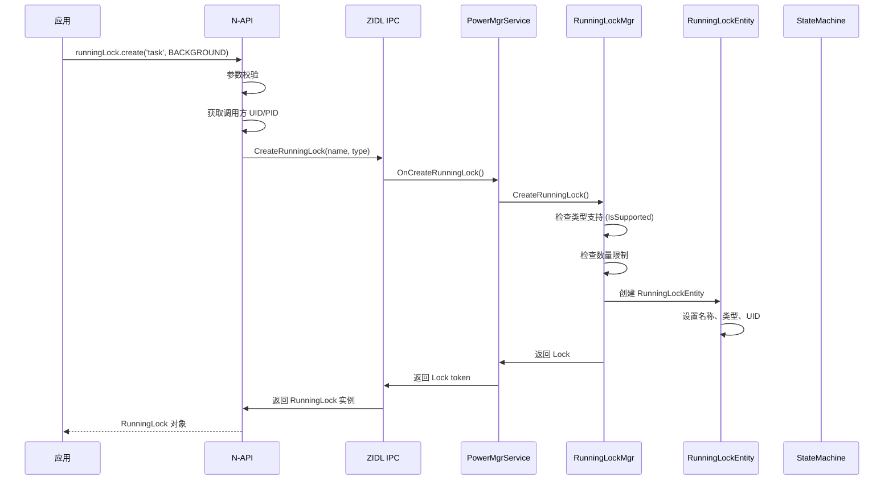
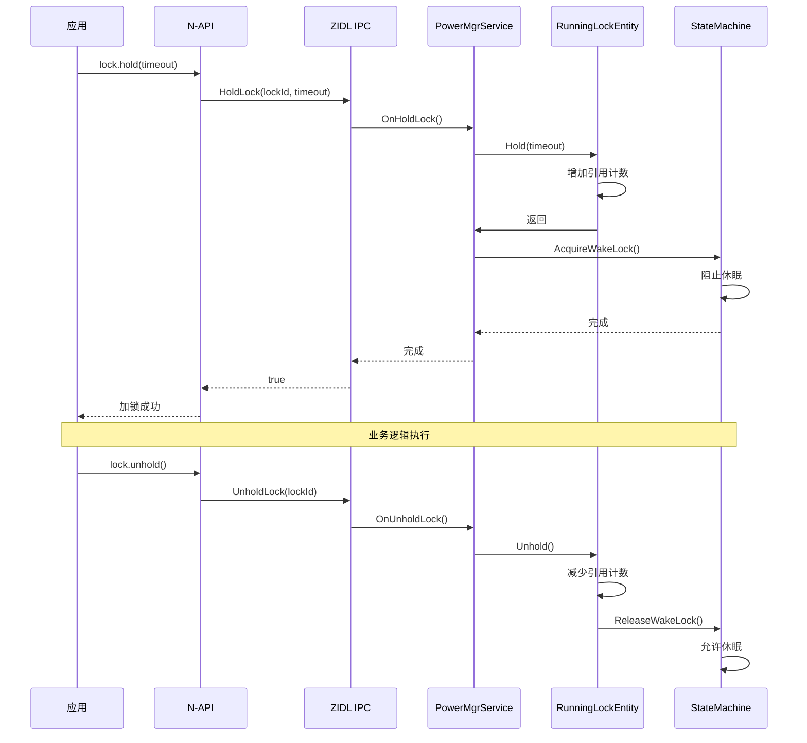
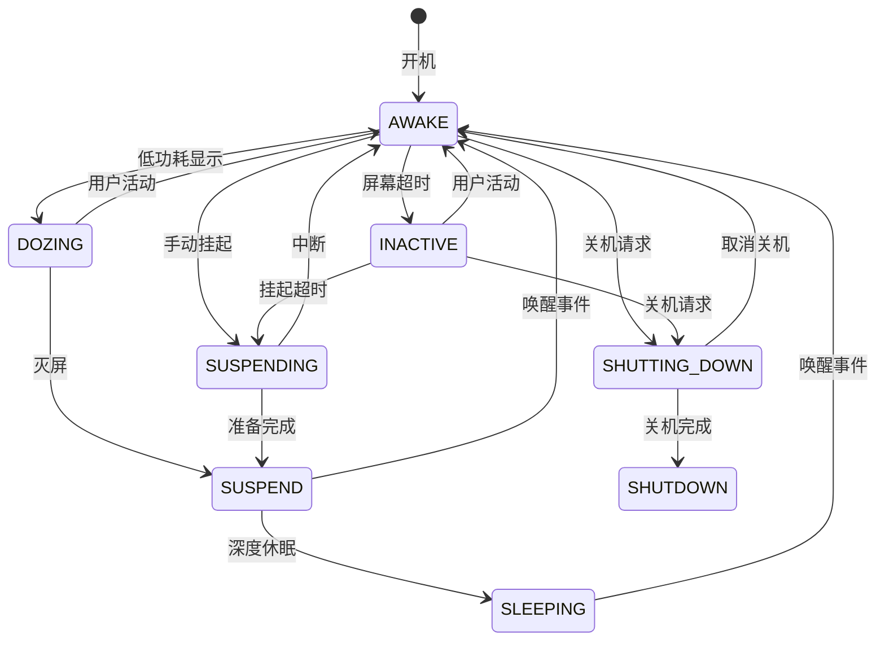
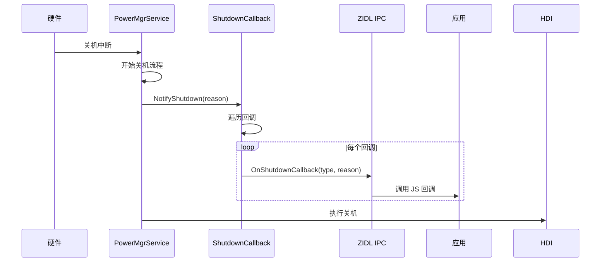
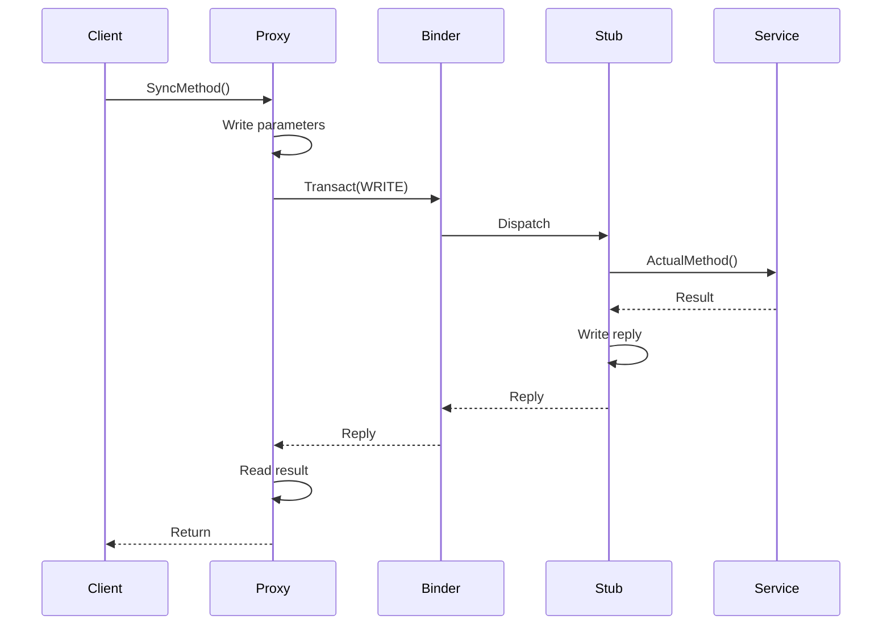
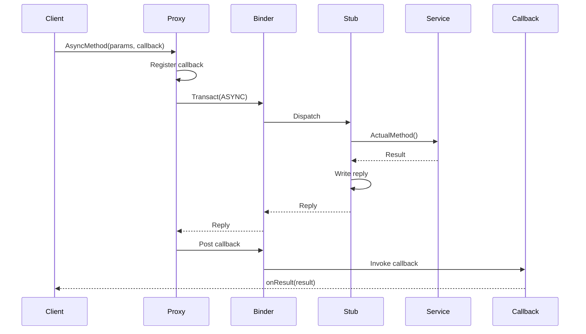

# 关键调用链

本文档描述 Power Manager 模块的关键调用链路，包括从应用到底层的完整流程。

## 1. 电源控制调用链

### 1.1 关机流程



### 1.2 唤醒流程



---

## 2. 运行锁调用链

### 2.1 创建运行锁



### 2.2 加锁/解锁



---

## 3. 状态机调用链

### 3.1 状态转换流程



### 3.2 状态机事件处理

```cpp
// services/native/src/power_state_machine.cpp

class PowerStateMachine {
    void HandleEvent(PowerStateEvent event) {
        switch (currentState_) {
            case PowerState::AWAKE:
                HandleAwakeEvent(event);
                break;
            case PowerState::INACTIVE:
                HandleInactiveEvent(event);
                break;
            case PowerState::SUSPENDING:
                HandleSuspendingEvent(event);
                break;
            case PowerState::SUSPEND:
                HandleSuspendEvent(event);
                break;
            case PowerState::SHUTTING_DOWN:
                HandleShuttingDownEvent(event);
                break;
        }
    }
};
```

---

## 4. 回调通知调用链

### 4.1 状态变化回调

```mermaid
sequenceDiagram
    participant Svc as PowerMgrService
    participant CB as CallbackRegistry
    participant IPC as ZIDL IPC
    participant NAPI as N-API
    participant App as 应用

    Svc->>Svc: 状态变化 (AWAKE -> SUSPEND)
    Svc->>CB: NotifyStateChange(newState)
    CB->>CB: 遍历注册回调
    loop 每个->>IPC: SendCallback(callbackId, state)
        IPC->>IPC: 序列化
        IPC->>NAPI: on回调
        CBStateChanged(state)
        NAPI->>App: JS 回调
    end
```

### 4.2 关机回调



---

## 5. IPC 调用时序

### 5.1 同步 IPC



### 5.2 异步 IPC



---

## 6. 关键代码路径

### 6.1 关机路径

| 层级 | 文件 | 函数 |
|------|------|------|
| N-API | `frameworks/napi/power/power_napi.cpp` | `PowerNapi::Shutdown()` |
| IPC | `services/zidl/src/...` | `PowerMgrProxyAsync::Shutdown()` |
| Service | `services/native/src/shutdown/shutdown_controller.cpp` | `ShutdownController::Shutdown()` |
| HDI | `drivers_interface_power` | `PowerHdi::Shutdown()` |

### 6.2 运行锁路径

| 层级 | 文件 | 函数 |
|------|------|------|
| N-API | `frameworks/napi/runninglock/runninglock_napi.cpp` | `RunningLockNapi::Create()` |
| Service | `services/native/src/runninglock/running_lock_mgr.cpp` | `RunningLockMgr::CreateRunningLock()` |
| State | `services/native/src/power_state_machine.cpp` | `PowerStateMachine::AcquireWakeLock()` |

### 6.3 状态机路径

| 层级 | 文件 | 函数 |
|------|------|------|
| Core | `services/native/src/power_state_machine.cpp` | `PowerStateMachine::HandleEvent()` |
| State | `services/native/src/power_state_machine.cpp` | `PowerStateMachine::TransitionTo()` |
| Action | `services/native/src/actions/...` | `DeviceStateAction::...()` |

---

## 7. 线程模型

### 7.1 线程切换

```
JS 线程
   │
   ▼ (AsyncWork)
FFRT 线程池
   │
   ▼ (IPC)
Binder 线程
   │
   ▼ (OnRemoteRequest)
主线程 (Service)
   │
   ▼ (Dispatch)
工作线程
   │
   ▼ (IOCTL)
HDI 线程
```

### 7.2 同步点

| 场景 | 同步机制 |
|------|----------|
| 状态机转换 | `std::mutex` |
| RunningLock 计数 | `std::recursive_mutex` |
| 回调注册 | `std::shared_mutex` |
| 配置读取 | `std::once_flag` |
