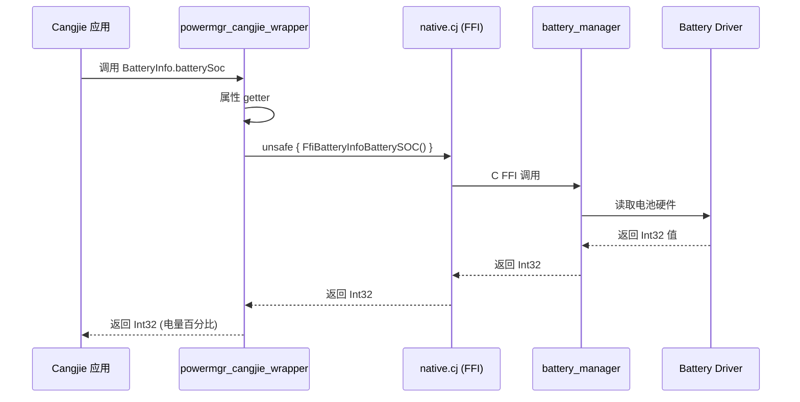
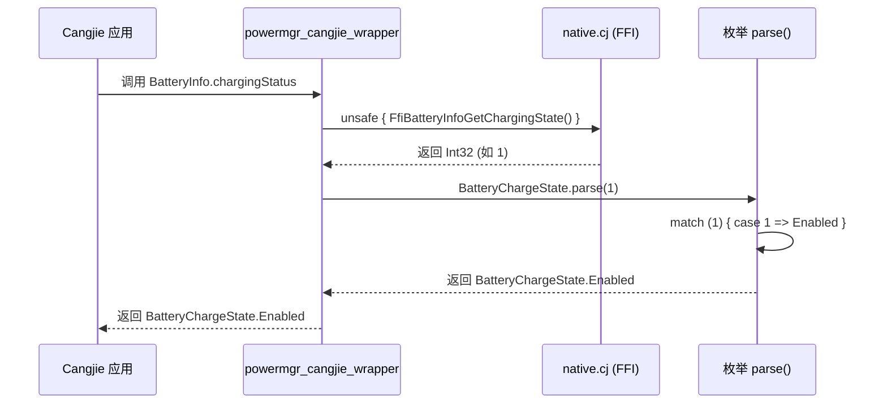
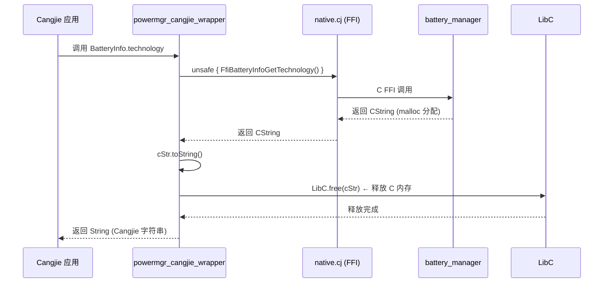
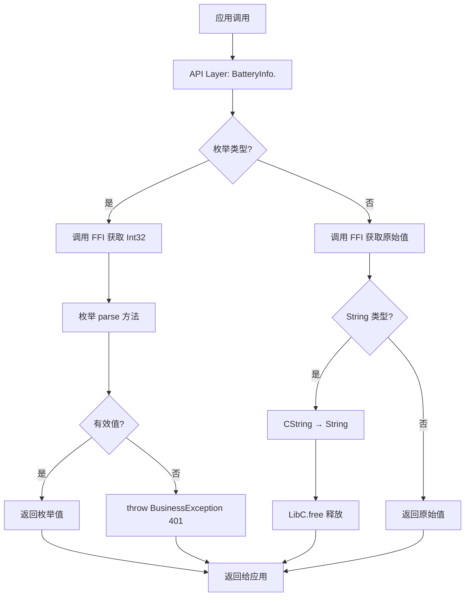
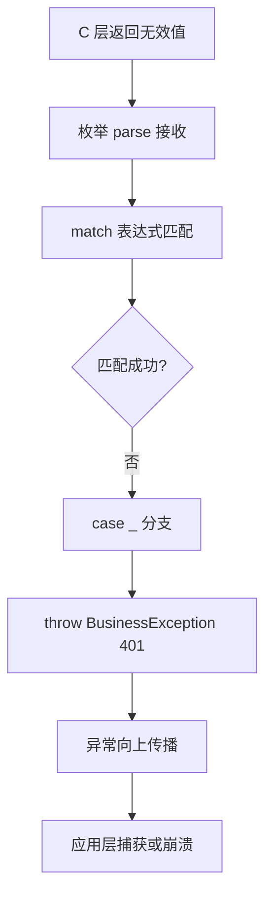

# 架构说明

> **目的**: 了解 powermgr_cangjie_wrapper 的整体架构、数据流和执行流程
> **适用范围**: 架构设计、问题排查、性能优化
> **最后更新**: 2025-02-06

---

## 组件架构图

```
┌─────────────────────────────────────────────────────────┐
│                  Cangjie 应用                          │
│                  (应用层)                              │
└──────────────────────┬──────────────────────────────────┘
                       │
                       │ 调用 ohos.battery_info API
                       │
┌──────────────────────▼──────────────────────────────────┐
│              powermgr_cangjie_wrapper                   │
│                 (封装层)                               │
│  ┌─────────────────────────────────────────────────┐   │
│  │  BatteryInfo 类 (ohos/battery_info)          │   │
│  │  - batterySoc: Int32                        │   │
│  │  - chargingStatus: BatteryChargeState        │   │
│  │  - healthStatus: BatteryHealthState          │   │
│  │  - ... (10个静态属性)                        │   │
│  └────────────────────┬────────────────────────────┘   │
│                     │                                  │
│                     │ unsafe FFI 调用                  │
│                     │                                  │
│  ┌────────────────────▼────────────────────────────┐  │
│  │  native.cj (FFI 声明)                          │  │
│  │  - FfiBatteryInfoBatterySOC()                   │  │
│  │  - FfiBatteryInfoGetChargingState()             │  │
│  │  - ... (10个FFI函数)                            │  │
│  └────────────────────┬────────────────────────────┘  │
└───────────────────────┼────────────────────────────────┘
                        │
                        │ C FFI 调用
                        │
┌───────────────────────▼────────────────────────────────┐
│          battery_manager (电池管理服务)                 │
│                 (服务层)                               │
│  ┌─────────────────────────────────────────────────┐   │
│  │  cj_battery_info_ffi (C FFI 接口)            │   │
│  └────────────────────┬────────────────────────────┘   │
│                     │                                  │
│  ┌────────────────────▼────────────────────────────┐  │
│  │  BatteryService (C++ 服务实现)                 │  │
│  └────────────────────┬────────────────────────────┘  │
└───────────────────────┼────────────────────────────────┘
                        │
                        │ Binder IPC / 系统调用
                        │
┌───────────────────────▼────────────────────────────────┐
│              Power Manager (电源管理服务)                │
│                   (核心服务层)                          │
└───────────────────────┼────────────────────────────────┘
                        │
                        │ 驱动接口
                        │
┌───────────────────────▼────────────────────────────────┐
│           Battery Driver (电池驱动)                     │
│                  (内核层)                              │
└─────────────────────────────────────────────────────────┘
```

**证据**: 架构图基于 `figures/powermgr_cangjie_wrapper_architecture.png` 和代码实现

---

## 数据流

### 同步查询流程



**证据**: `ohos/battery_info/battery_info.cj:42-46`

### 枚举解析流程



**异常流程**:
```
当 C 层返回无效值（如 999）:
Enum->>Enum: match (999) { case _ => throw BusinessException(401, "Parameter error.") }
Enum-->>Wrapper: 抛出异常
Wrapper-->>App: 异常向上传播
```

**证据**: `ohos/battery_info/battery_info.cj:55-60, 276-284`

### 字符串内存管理流程



**证据**: `ohos/battery_info/battery_info.cj:110-116`

---

## 线程模型

### 同步调用

所有 API 调用都是**同步**的，阻塞当前线程直到返回：

- ✅ 简单直接，易于理解
- ✅ 无线程安全问题
- ❌ 阻塞调用线程，不适合高频查询
- ❌ 无超时机制

**证据**: 所有 API 都是静态属性 getter，无异步/Promise 机制

### 线程安全

**FFI 层**: 由 C 层 `battery_manager` 保证线程安全

**Cangjie 层**:
- 无共享状态
- 每次调用独立
- 无竞态条件

---

## 关键时序

### 完整 API 调用时序



**证据**: 综合所有 API 实现

### 错误传播时序



**证据**: `ohos/battery_info/battery_info.cj:225, 282, 359, 446`

---

## Mock 架构（开发环境）

```
┌─────────────────────────────────────────────────────────┐
│              Windows/macOS 开发环境                    │
└──────────────────────┬──────────────────────────────────┘
                       │
                       │ 编译时选择 (is_mingw || is_mac)
                       │
┌──────────────────────▼──────────────────────────────────┐
│              mock/ohos.battery_info.cj                │
│                 (Mock 实现)                            │
│  ┌─────────────────────────────────────────────────┐   │
│  │  所有属性返回固定的默认值：                    │   │
│  │  - batterySoc = 0                            │   │
│  │  - chargingStatus = UnknownChargeState         │   │
│  │  - ...                                        │   │
│  │  无 FFI 调用                                  │   │
│  └─────────────────────────────────────────────────┘   │
└─────────────────────────────────────────────────────────┘
```

**条件编译**: `BUILD.gn:21-28`

**证据**: `mock/ohos.battery_info.cj`, `ohos/battery_info/BUILD.gn:21-28`

---

## 架构特点

### 优点

1. **简洁性**: 静态属性 API，无需实例化
2. **类型安全**: 使用枚举而非原始 Int32
3. **可维护性**: 模块化设计，职责清晰
4. **跨平台**: 支持 Windows/macOS Mock 开发

### 限制

1. **Beta 特性**: 功能有限，不支持异步和事件
2. **同步阻塞**: 无超时和取消机制
3. **无权限检查**: API 层无显式权限验证
4. **有限功能**: 仅支持基本查询，不支持状态监听

---

## 相关跳转

- [项目概览](00_Overview.md) - 项目定位和核心能力
- [模块职责](01_Module_Responsibilities.md) - 目录结构和模块划分
- [对外 API](03_Public_API.md) - API 详细清单
- [内部 API](04_Internal_API.md) - 模块接口和稳定性
