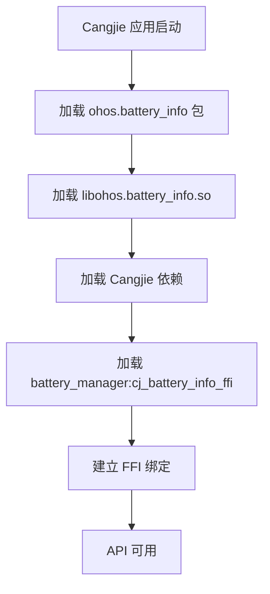

# 编译产物与安装

> **目的**: 了解 powermgr_cangjie_wrapper 的编译产物、安装路径和运行时加载关系
> **适用范围**: 部署调试、运行时问题定位
> **最后更新**: 2025-02-06

---

## 编译产物清单

### 主要产物

| 产物名称 | 类型 | 生成 Target | 说明 |
|---------|------|------------|------|
| `libohos.battery_info.so` | Cangjie 共享库 | `ohos.battery_info` | 主要的电池信息 API 库 |
| SDK 文件 | SDK 文件 | `copy_sdk_powermgr_cangjie_libs` | 供开发者使用的 SDK 包 |

**TODO(需确认)**: 具体的产物名称和完整路径需查看实际构建输出

---

## 预期输出路径

### 设备安装路径

| 产物类型 | 32位系统 | 64位系统 |
|---------|----------|----------|
| Cangjie 共享库 | `/system/lib/libohos.battery_info.so` | `/system/lib64/libohos.battery_info.so` |
| SDK 文件 | 开发机路径 | 开发机路径 |

**说明**:
- 标准设备通常使用 `/system/lib64/` (64位)
- 轻量级设备可能使用其他路径（本项目不支持轻量级设备）

**TODO(需确认)**: 实际安装路径需通过构建输出验证

### 开发机输出路径

**编译输出目录**:
```
out/<product>/<variant>/
├── libs/
│   ├── libohos.battery_info.so
│   └── ...
└── ...
```

**TODO(需确认)**: 完整的输出目录结构

---

## 运行时加载关系

### 加载流程



### 依赖加载顺序

1. **应用层**: Cangjie 应用
2. **封装层**: `libohos.battery_info.so`
3. **Cangjie 依赖**:
   - `cangjie_ark_interop` (BusinessException, APILevel)
4. **C 层依赖**:
   - `battery_manager:cj_battery_info_ffi`
5. **底层服务**:
   - Power Manager 服务
   - Battery Driver

**证据**: `bundle.json:24-26`, `ohos/battery_info/BUILD.gn:30-35`

---

## 库文件依赖分析

### libohos.battery_info.so 的依赖

**Cangjie 库依赖**:
- `libohos.business_exception.so` (来自 `cangjie_ark_interop`)
- `libohos.labels.so` (来自 `cangjie_ark_interop`)

**C 库依赖**:
- `libcj_battery_info_ffi.so` (来自 `battery_manager`)

**证据**: `ohos/battery_info/BUILD.gn:30-35`

### 运行时依赖检查

```bash
# 使用 ldd 查看 SO 依赖（在设备或模拟器上）
ldd /system/lib64/libohos.battery_info.so
```

**预期输出**:
```
libohos.battery_info.so:
  libc++.so => /system/lib64/libc++.so
  libhilog_ndk.z.so => /system/lib64/libhilog_ndk.z.so
  libohos.business_exception.so => /system/lib64/libohos.business_exception.so
  libcj_battery_info_ffi.so => /system/lib64/libcj_battery_info_ffi.so
  ...
```

**TODO(需确认)**: 实际运行时依赖列表

---

## Mock 产物

### 开发环境产物

**条件**: `is_mingw || is_mac`

**产物**: 基于 `mock/ohos.battery_info.cj` 编译

**特点**:
- 返回固定的默认值
- 不链接 C FFI 库
- 用于开发环境调试

**证据**: `ohos/battery_info/BUILD.gn:21-28`

### Mock vs 生产

| 维度 | 生产环境 | Mock 环境 |
|-----|---------|----------|
| **源文件** | `battery_info.cj` + `native.cj` | `mock/ohos.battery_info.cj` |
| **FFI 调用** | 有 | 无 |
| **C 依赖** | `battery_manager:cj_battery_info_ffi` | 无 |
| **返回值** | 实际硬件值 | 固定默认值 |
| **适用平台** | OpenHarmony 设备 | Windows/macOS |

---

## 安装与部署

### 组件安装

**安装方式**: 通过 OpenHarmony 构建系统集成安装

**安装时机**:
- 系统镜像构建时
- OTA 更新时（如果组件更新）

**安装位置**:
- 库文件: `/system/lib64/` 或 `/system/lib/`
- SDK 文件: 开发机 SDK 目录

**证据**: `bundle.json` 组件声明

### SDK 复制

**Target**: `copy_sdk_powermgr_cangjie_libs`

**功能**: 将编译产物复制到 SDK 目录，供开发者使用

**源文件**: `ohos.battery_info`

**证据**: `BUILD.gn:19-21`

---

## 运行时行为

### 首次加载

```
应用启动
  ↓
import ohos.battery_info
  ↓
加载 libohos.battery_info.so
  ↓
初始化 FFI 绑定
  ↓
连接 battery_manager 服务
  ↓
API 可用
```

### API 调用流程

```
应用调用 BatteryInfo.batterySoc
  ↓
libohos.battery_info.so 属性 getter
  ↓
unsafe FFI 调用
  ↓
跨库调用 libcj_battery_info_ffi.so
  ↓
访问 Power Manager 服务
  ↓
返回 Int32 值
  ↓
应用接收到结果
```

---

## 调试与验证

### 验证安装

```bash
# 在设备上检查库文件是否存在
ls -l /system/lib64/libohos.battery_info.so

# 检查文件权限和符号链接
file /system/lib64/libohos.battery_info.so
```

### 验证依赖

```bash
# 使用 ldd 检查依赖完整性
ldd /system/lib64/libohos.battery_info.so

# 检查缺失的库
ldd /system/lib64/libohos.battery_info.so | grep "not found"
```

### 验证 FFI 绑定

```cangjie
// 在应用中测试 FFI 绑定
try {
    let soc = BatteryInfo.batterySoc
    println("FFI 绑定正常，电量: ${soc}%")
} catch (e: Exception) {
    println("FFI 绑定失败: ${e}")
}
```

---

## 常见问题

### 库文件未找到

**症状**: 应用启动时崩溃或找不到库

**可能原因**:
1. 库文件未正确安装
2. 库路径错误
3. 权限问题

**解决方法**:
```bash
# 检查库文件是否存在
ls -l /system/lib64/libohos.battery_info.so

# 检查权限
chmod 644 /system/lib64/libohos.battery_info.so
```

### FFI 绑定失败

**症状**: 调用 API 时崩溃或抛出异常

**可能原因**:
1. `battery_manager:cj_battery_info_ffi` 未安装
2. FFI 符号不匹配
3. 版本不兼容

**解决方法**:
```bash
# 检查 C FFI 库是否存在
ls -l /system/lib64/libcj_battery_info_ffi.so

# 检查符号
nm -D /system/lib64/libcj_battery_info_ffi.so | grep FfiBatteryInfo
```

### Mock 环境返回默认值

**症状**: Windows/macOS 开发环境下 API 总是返回 0 或 Unknown

**说明**: 这是正常行为，Mock 实现返回固定默认值

**解决方法**: 在真实 OpenHarmony 设备上测试

---

## 相关跳转

- [项目概览](00_Overview.md) - 项目定位和核心能力
- [GN Targets](05_GN_Targets.md) - 构建目标和依赖
- [对外 API](03_Public_API.md) - API 详细说明
- [常见问题](08_FAQ.md) - 更多调试和问题定位指南
