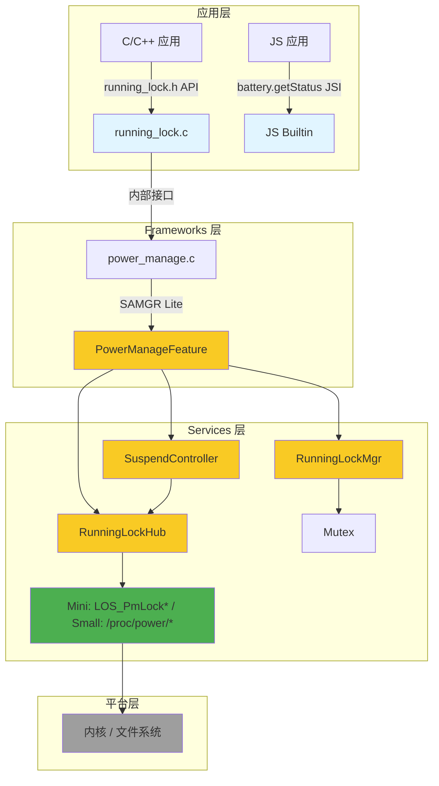
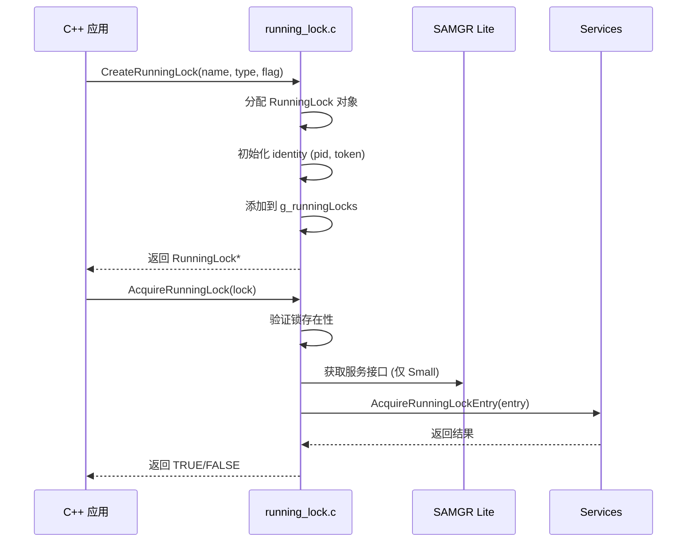
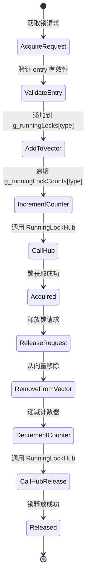
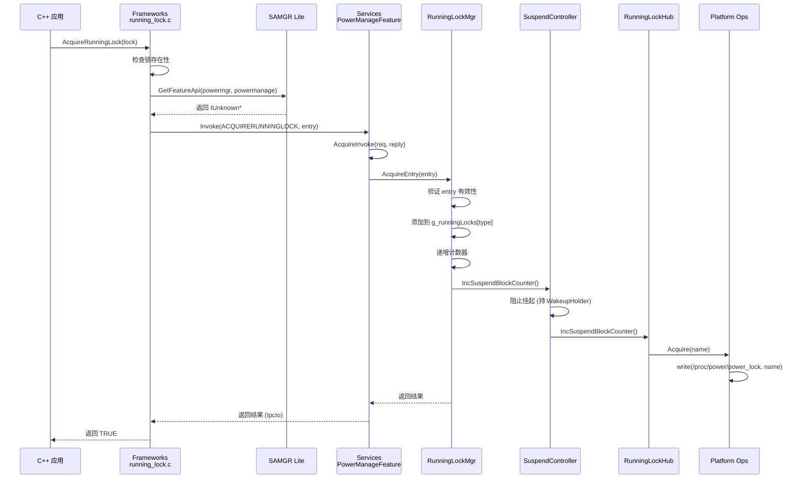
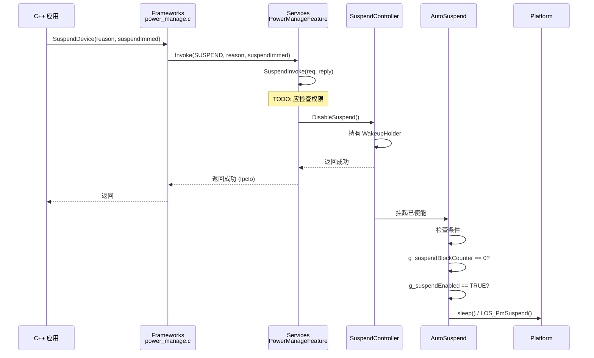
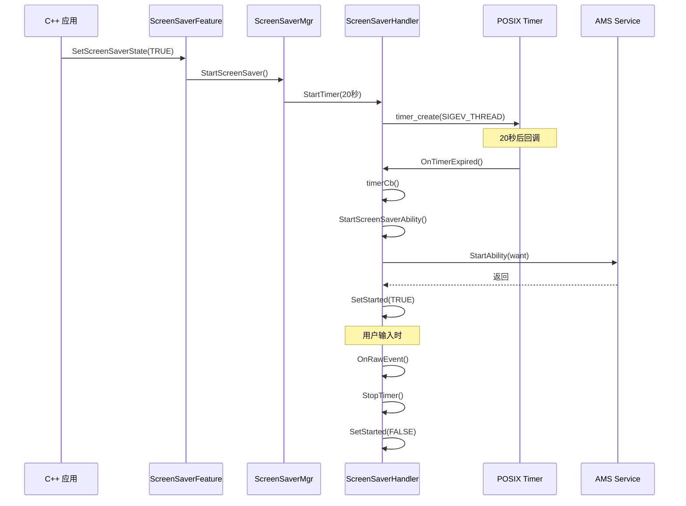
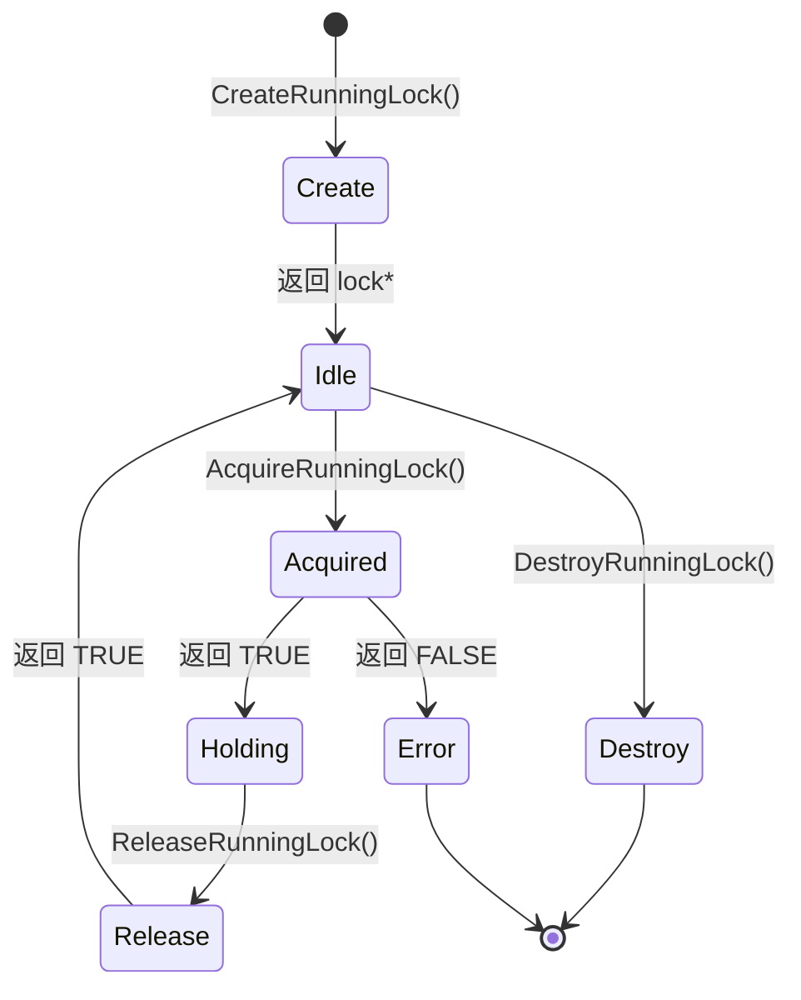
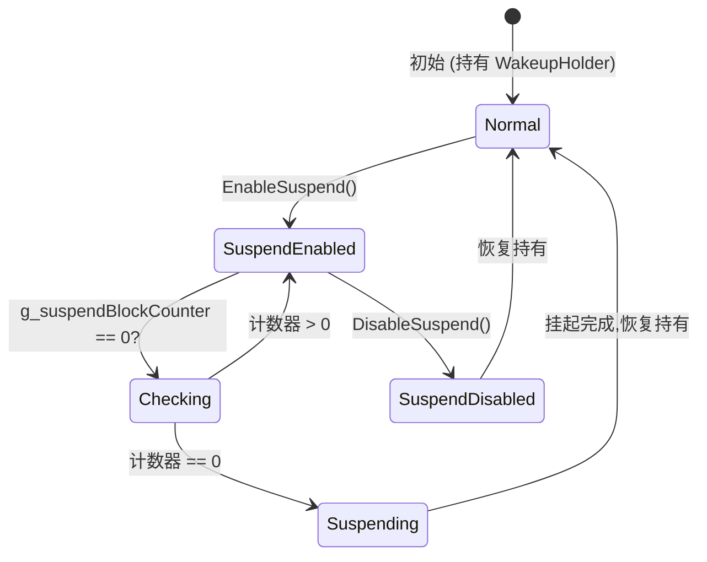

# 架构说明

> **目的**: 深入理解组件交互、数据流和线程模型
> **适用范围**: 架构师、模块开发者
> **阅读时间**: 45分钟

---

## 整体架构

### 分层架构图



---

## 组件详解

### 1. 应用层 (Application Layer)

#### C/C++ 应用
- **接口**: `interfaces/kits/running_lock.h`
- **调用流程**:
  ```
  CreateRunningLock()
      ↓
  AcquireRunningLock() - 阻塞调用,可能超时
      ↓
  [应用执行...]
      ↓
  ReleaseRunningLock() - 阻塞调用
      ↓
  DestroyRunningLock()
  ```

#### JS 应用
- **接口**: JSI 模块 `battery`
- **调用方式**:
  ```javascript
  battery.getStatus({
      success: function(data) {
          console.log("charging: " + data.charging);
          console.log("level: " + data.level);
      },
      complete: function() {}
  });
  ```
- **限制**: 仅电池状态查询,无电源控制接口

---

### 2. Frameworks 层 (Client Layer)

#### running_lock.c
**职责**: 运行锁客户端生命周期管理

**关键数据结构**:
```c
static RunningLock* g_runningLocks = NULL;  // 全局锁列表
static pthread_mutex_t g_mutex;               // 线程安全
```

**工作流程**:


#### power_manage.c (Small)
**职责**: IPC 代理,封装 SAMGR Lite 通信

**关键数据结构**:
```c
static PowerManageProxy* g_intf = NULL;  // 单例接口
static pthread_mutex_t g_mutex;           // 双重检查锁
```

**IPC 调用模式**:
```c
// 1. 获取接口
IUnknown *iUnknown = SAMGR_GetInstance()->GetFeatureApi(
    POWER_MANAGE_SERVICE,
    POWER_MANAGE_FEATURE
);

// 2. 查询接口
int ret = iUnknown->QueryInterface(iUnknown, DEFAULT_VERSION, (void **)&g_intf);

// 3. 异步调用
proxy->Invoke(
    (IClientProxy *)proxy,
    POWERMANAGE_FUNCID_ACQUIRERUNNINGLOCK,
    &request,
    &ret,
    AcquireReleaseCallback  // 回调
);
```

#### power_manage.c (Mini)
**职责**: 直接调用,无 IPC

**调用模式**:
```c
// 1. 获取服务接口 (直接指针)
IUnknown *iUnknown = SAMGR_GetInstance()->GetFeatureApi(
    POWER_MANAGE_SERVICE,
    POWER_MANAGE_FEATURE
);

// 2. 直接函数调用
ret = intf->AcquireRunningLockEntryFunc((IUnknown *)intf, entry, timeoutMs);
```

---

### 3. Services 层 (Service Layer)

#### PowerManageFeature
**职责**: 核心电源管理逻辑

**Feature 注册**:
```c
static PowerManageFeature g_feature = {
    .GetName = GetName,
    .OnInitialize = OnInitialize,
    .OnStop = OnStop,
    .OnMessage = OnMessage,
    SERVER_IPROXY_IMPL_BEGIN,
    .Invoke = FeatureInvoke,  // IPC 函数分发
    POWER_MANAGE_INTERFACE_IMPL,
    IPROXY_END,
    .identity = { -1, -1, NULL }
};
```

**函数分发 (FeatureInvoke)**:
```c
static int32_t (*g_invokeFuncs[])(IServerProxy*, IpcIo*, IpcIo*) = {
    AcquireInvoke,
    ReleaseInvoke,
    IsAnyHoldingInvoke,
    SuspendInvoke,
    WakeupInvoke
};

int32_t FeatureInvoke(IServerProxy *iProxy, int32_t funcId, ...) {
    if (funcId >= 0 && funcId < POWERMANAGE_FUNCID_BUTT) {
        return g_invokeFuncs[funcId](iProxy, origin, req, reply);
    }
    return EC_FAILURE;
}
```

#### RunningLockMgr
**职责**: 线程安全锁管理

**关键数据结构**:
```c
typedef enum {
    RUNNINGLOCK_SCREEN = 0,
    RUNNINGLOCK_BACKGROUND,
    RUNNINGLOCK_PROXIMITY_SCREEN_CONTROL,
    RUNNINGLOCK_BUTT
} RunningLockType;

static RunningLockEntry* g_runningLocks[RUNNINGLOCK_BUTT];  // 按类型分类
static uint32_t g_runningLockCounts[RUNNINGLOCK_BUTT];   // 计数器
static pthread_mutex_t g_mutex;
```

**锁管理流程**:


#### SuspendController
**职责**: 挂起状态控制

**关键机制**:
```c
#define WAKEUP_HOLDER "OHOSPowerMgr.WakeupHolder"

static pthread_mutex_t g_mutex;
static BOOL g_suspendEnabled = FALSE;
```

**WakeupHolder 操作**:
```
[初始化] → 获取 WakeupHolder (阻止挂起)
    ↓
[EnableSuspend] → 释放 WakeupHolder (允许挂起)
    ↓
[DisableSuspend] → 获取 WakeupHolder (阻止挂起)
```

#### RunningLockHub
**职责**: 桥接锁操作与挂起计数

**协调流程**:
```c
// 获取锁时
void RunningLockHubLock(const char* name) {
    g_runningLockOps->Acquire(name);      // 平台锁操作
    g_suspendOps->IncSuspendBlockCounter(); // 递增阻塞计数器
}

// 释放锁时
void RunningLockHubUnlock(const char* name) {
    g_runningLockOps->Release(name);      // 平台锁释放
    g_suspendOps->DecSuspendBlockCounter(); // 递减阻塞计数器
}
```

---

### 4. 平台层 (Platform Layer)

#### Mini 系统 (LiteOS-M)

**内核接口**:
```c
// services/src/power/mini/running_lock_handler.c
static int RunningLockRequest(const char *name, int32_t timeoutMs) {
    return LOS_PmLockRequest(name, timeoutMs);
}

static int RunningLockRelease(const char *name) {
    return LOS_PmLockRelease(name);
}

// services/src/power/mini/auto_suspend_loop.c
static BOOL AutoSuspendLoop(AutoSuspendWait waitFunc) {
    while (1) {
        if (waitFunc() == TRUE) {  // 等待挂起条件
            LOS_PmSuspend(0);  // 内核挂起
        }
    }
}
```

#### Small 系统 (Linux)

**Proc 文件接口**:
```c
// services/src/power/small/running_lock_handler.c
static int RunningLockRequest(const char *name, int32_t timeoutMs) {
    int fd = open("/proc/power/power_lock", O_RDWR);
    write(fd, name, strlen(name));
    close(fd);
    return 0;
}

static int RunningLockRelease(const char *name) {
    int fd = open("/proc/power/power_unlock", O_RDWR);
    write(fd, name, strlen(name));
    close(fd);
    return 0;
}

// services/src/power/small/auto_suspend_loop.c
static BOOL AutoSuspendLoop(AutoSuspendWait waitFunc) {
    while (1) {
        if (waitFunc() == TRUE) {
            sleep(1);  // 模拟挂起
        }
    }
}
```

---

## 线程模型

### 主服务线程
- **文件**: `services/src/power_manage_service.c`
- **配置**:
  ```c
  #define STACK_SIZE  0x800      // 2KB
  #define QUEUE_SIZE  20          // 消息队列
  TaskConfig config = { LEVEL_HIGH, PRI_NORMAL, STACK_SIZE, QUEUE_SIZE, SINGLE_TASK };
  ```
- **职责**: SAMGR Lite 消息处理
- **优先级**: HIGH
- **调度**: NORMAL

### Suspend 线程
- **文件**: `services/src/power/auto_suspend.c`
- **生命周期**:
  - 首次 `EnableSuspend()` 时创建
  - 分离线程 (detached)
- **循环**:
  ```c
  while (1) {
      usleep(SUSPEND_CHECK_INTERVAL_US);  // 500ms
      g_suspendLoop(WaitingSuspendCondition);
  }
  ```
- **同步**:
  ```c
  pthread_mutex_lock(&g_mutex);
  while (g_suspendBlockCounter > 0) {
      pthread_cond_wait(&g_cond, &g_mutex);
  }
  pthread_mutex_unlock(&g_mutex);
  ```

### 计时器线程 (屏保)
- **文件**: `services/src/screensaver/small/screen_saver_handler.cpp`
- **实现**: POSIX `timer_create()` 配合 `SIGEV_THREAD`
- **回调**: 每个计时器在独立线程执行
- **用途**: 20 秒延迟后激活屏保

### 客户端线程
- C/C++ 应用调用在**调用者线程**执行
- 无独立线程
- 通过 mutex 保证线程安全

---

## 数据流

### 场景 1: 获取运行锁 (Small 系统)



### 场景 2: 设备挂起 (Small 系统)



### 场景 3: 屏保激活 (Small 系统)



---

## 信任边界

```
┌─────────────────────────────────────────────────────────────┐
│                   用户空间 (User Space)                 │
│                                                         │
│  ┌────────────┐      ┌────────────┐            │
│  │ C++ 应用   │      │  JS 应用   │            │
│  └─────┬─────┘      └─────┬─────┘            │
│        │                    │                    │
│  ┌─────▼────────────────────▼────────────┐         │
│  │    Frameworks 层 (受信任)        │         │
│  │  - 验证输入                    │         │
│  │  - 序列化数据                  │         │
│  └─────┬────────────────────────────┘         │
│        │                                      │
│  ┌─────▼───────────────────────┐            │
│  │  SAMGR Lite (IPC 边界)     │            │
│  │  - 消息路由                  │            │
│  │  - ⚠️ 无权限验证              │            │
│  └─────┬───────────────────────┘            │
│        │                                      │
│  ┌─────▼───────────────────────┐            │
│  │   Services 层 (受信任)       │            │
│  │  - 信任 IPC 数据               │            │
│  │  - ⚠️ 缺少边界检查          │            │
│  └─────┬───────────────────────┘            │
│        │                                      │
│  ┌─────▼───────────────────────┐            │
│  │  Platform Ops (受信任)        │            │
│  │  - 直接内核调用               │            │
│  │  - 固定路径操作               │            │
│  └─────┬───────────────────────┘            │
│        │                                      │
└────────▼───────────────────────────────────────┘
         │
    ┌─────▼───────────────┐
    │   内核 (最信任)    │
    │  - 无输入验证      │
    │  - 完全权限       │
    └───────────────────┘
```

**信任边界问题**:
- ❌ Services 层信任 IPC 数据 (无验证)
- ❌ 无权限检查 (任何人可挂起/唤醒设备)
- ✅ Platform Ops 使用固定路径 (无路径遍历)

---

## 关键时序

### RunningLock 生命周期



### Suspend 状态机



---

## 性能考虑

### 内存占用
- **RunningLock 对象**: ~80 bytes
- **RunningLockEntry**: ~100 bytes
- **每类型锁向量**: 动态分配,初始大小 0

### CPU 开销
- **主服务线程**: 低 (SAMGR 消息处理)
- **Suspend 线程**: 中等 (每 500ms 检查一次)
- **互斥锁争用**: 低 (锁操作不频繁)

### 延迟
- **IPC 调用** (Small): ~1-5ms (Binder)
- **直接调用** (Mini): <100μs
- **锁获取**: <10ms (平台相关)

---

## 相关文档

- [00_Overview](00_Overview.md) - 核心能力与概念
- [02_Directory_Structure](02_Directory_Structure.md) - 代码结构
- [04_NAPI_JS_API](04_NAPI_JS_API.md) - API 参考
- [08_Security_Assessment.md](08_Security_Assessment.md) - 安全问题
