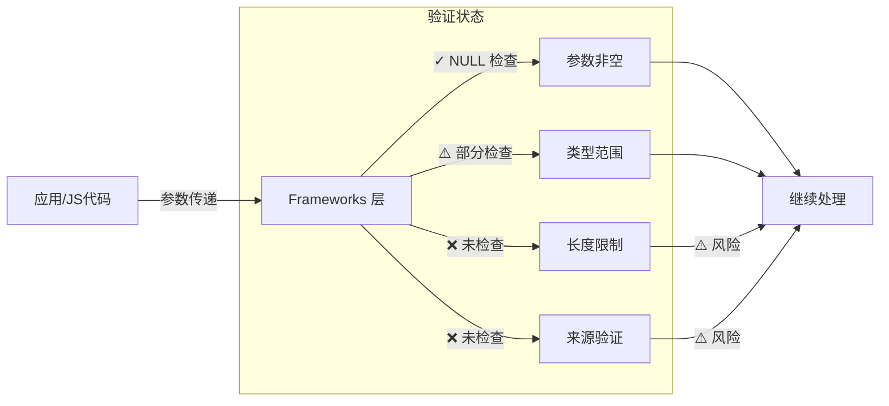
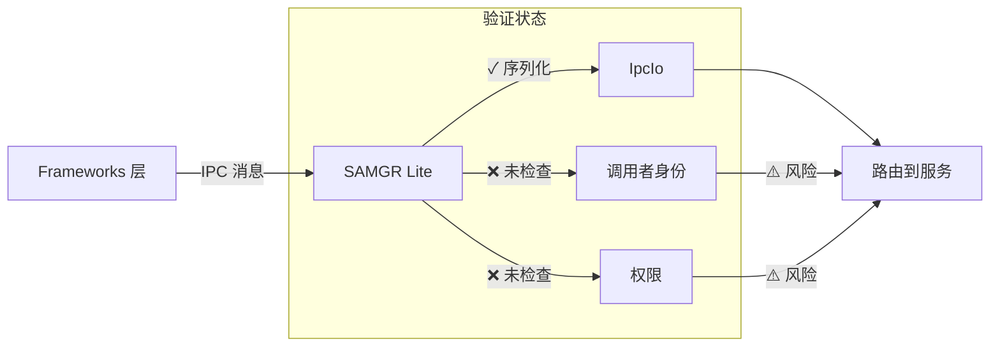
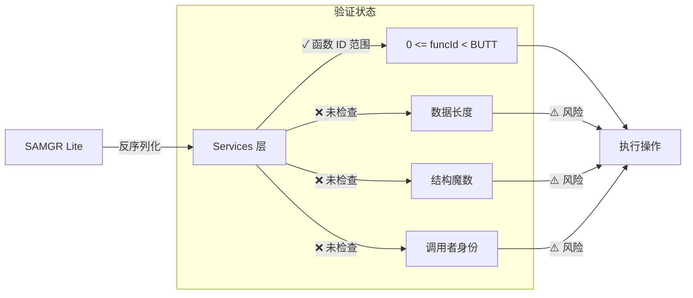

# 攻击面分析

> **目的**: 识别所有外部输入入口、敏感操作点和信任边界，帮助安全研究员快速定位潜在漏洞
> **适用范围**: 安全审计员、安全工程师、安全研究员
> **阅读时间**: 15 分钟

---

## 概述

### 攻击面定义

攻击面是指系统与外部世界交互的所有接口和路径。在 powermgr_lite 中，攻击面主要来自：

1. **应用层接口** - C API 和 JavaScript JSI 接口
2. **IPC 通信边界** - SAMGR Lite IPC 消息
3. **平台层接口** - 内核/proc 文件系统

### 威胁模型

```
┌─────────────────────────────────────────────────────────────┐
│                   外部世界 (不受信任)                     │
│          (应用、恶意进程、JS 代码、用户输入)              │
└────────────────────┬────────────────────────────────────────┘
                     │
         ┌───────────┼───────────┐
         │           │           │
    [C API]   [JS API]   [配置文件]
         │           │           │
         ▼           ▼           ▼
┌─────────────────────────────────────────────────────────────┐
│              Frameworks 层 (部分信任)                     │
│  - 参数验证: 部分存在                                    │
│  - 空指针检查: 大部分存在                                 │
│  - 权限检查: ❌ 不存在                                  │
└────────────────────┬────────────────────────────────────────┘
                     │
         ┌───────────┼───────────┐
         │           │           │
    [直接调用]  [IPC 消息]  [文件路径]
         │           │           │
         ▼           ▼           ▼
┌─────────────────────────────────────────────────────────────┐
│              SAMGR Lite 边界 (信任边界)                   │
│  - 序列化: IpcIo ✓                                    │
│  - 权限检查: ❌ 不存在                                  │
│  - 调用者验证: ❌ 不存在                                │
└────────────────────┬────────────────────────────────────────┘
                     │
                     ▼
┌─────────────────────────────────────────────────────────────┐
│              Services 层 (受信任)                          │
│  - 输入验证: 部分存在                                    │
│  - 长度检查: ❌ 不存在                                  │
│  - 结构魔数: ❌ 不存在                                  │
└────────────────────┬────────────────────────────────────────┘
                     │
                     ▼
┌─────────────────────────────────────────────────────────────┐
│              Platform 层 (最信任)                         │
│  - 固定路径: ✓                                          │
│  - 内核验证: 依赖平台                                    │
└─────────────────────────────────────────────────────────────┘
```

---

## 外部输入清单

### 1. C API 输入

#### RunningLock API (`interfaces/kits/running_lock.h`)

| 函数 | 参数 | 类型 | 验证状态 | 证据 |
|------|------|------|----------|------|
| `CreateRunningLock` | `name` | `const char*` | ⚠️ 仅 NULL 检查 | `frameworks/src/running_lock.c:107` |
| `CreateRunningLock` | `type` | `RunningLockType` | ✓ 范围检查 | `frameworks/src/running_lock.c:107` |
| `CreateRunningLock` | `flag` | `RunningLockFlag` | ⚠️ 未检查 | `frameworks/src/running_lock.c:107` |
| `AcquireRunningLock` | `lock` | `const RunningLock*` | ✓ 存在性检查 | `frameworks/src/running_lock.c:124` |
| `ReleaseRunningLock` | `lock` | `const RunningLock*` | ✓ 存在性检查 | `frameworks/src/running_lock.c:139` |
| `DestroyRunningLock` | `lock` | `const RunningLock*` | ✓ NULL 检查 | `frameworks/src/running_lock.c:154` |
| `IsRunningLockHolding` | `lock` | `const RunningLock*` | ✓ 存在性检查 | `frameworks/src/running_lock.c:166` |

**关键风险**:
- `name` 参数未检查长度，可能导致缓冲区溢出或 DoS
- `flag` 参数未验证，可能传递无效值

#### Power Management API (`interfaces/innerkits/power_manage.h`)

| 函数 | 参数 | 类型 | 验证状态 | 证据 |
|------|------|------|----------|------|
| `SuspendDevice` | `reason` | `SuspendDeviceType` | ⚠️ 未检查 | `frameworks/src/small/power_manage.c:266` |
| `SuspendDevice` | `suspendImmed` | `BOOL` | ⚠️ 未检查 | `frameworks/src/small/power_manage.c:266` |
| `WakeupDevice` | `reason` | `WakeupDeviceType` | ⚠️ 未检查 | `frameworks/src/small/power_manage.c:274` |
| `WakeupDevice` | `details` | `const char*` | ⚠️ 仅 NULL 检查 | `frameworks/src/small/power_manage.c:276` |

**关键风险**:
- ❌ **无权限检查**：任何进程都可以挂起或唤醒设备
- `reason` 参数未验证范围
- `details` 未检查长度，可能导致内核接口溢出

#### Screen Saver API (`interfaces/innerkits/power_screen_saver.h`)

| 函数 | 参数 | 类型 | 验证状态 | 证据 |
|------|------|------|----------|------|
| `SetScreenSaverState` | `state` | `BOOL` | ⚠️ 未检查 | TODO(需确认具体实现) |

---

### 2. JavaScript JSI API 输入

#### Battery Module (`interfaces/kits/battery/js/builtin/src/battery_module.cpp`)

| JS API | 参数 | 类型 | 验证状态 | 证据 |
|---------|------|------|----------|------|
| `battery.getStatus` | `args[0]` | `JSIValue` (callback object) | ✓ Undefined 检查 | `battery_module.cpp:45` |

**关键风险**:
- 参数数量检查，但回调函数本身的验证较弱
- 返回值 `charging` 和 `level` 的格式化依赖 JS 引擎

---

### 3. IPC 输入

#### Samgr Lite IPC Messages

| 函数 ID | 输入类型 | 验证状态 | 证据 |
|---------|----------|----------|------|
| `POWERMANAGE_FUNCID_ACQUIRERUNNINGLOCK` | `RunningLockEntry` (raw buffer) | ⚠️ 部分验证 | `services/src/power/small/power_manage_feature_impl.c:68-70` |
| `POWERMANAGE_FUNCID_RELEASERUNNINGLOCK` | `RunningLockEntry` (raw buffer) | ⚠️ 部分验证 | `services/src/power/small/power_manage_feature_impl.c:82-84` |
| `POWERMANAGE_FUNCID_ISANYRUNNINGLOCKHOLDING` | 无 | N/A | N/A |
| `POWERMANAGE_FUNCID_SUSPEND` | `reason` (int32), `suspendImmed` (bool) | ❌ 未验证 | `services/src/power/small/power_manage_feature_impl.c:100-107` |
| `POWERMANAGE_FUNCID_WAKEUP` | `reason` (int32), `details` (string) | ❌ 未验证 | `services/src/power/small/power_manage_feature_impl.c:110-115` |

**关键风险**:
- ❌ **无调用者身份验证**：任何进程都可以调用 IPC 接口
- `RunningLockEntry` 的 `len` 值未验证，可能导致堆溢出
- ❌ **无权限检查**：Suspend/Wakeup 操作无权限验证

---

### 4. 内核/平台输入

#### Proc 文件系统操作

| 操作 | 路径 | 输入 | 验证状态 | 证据 |
|------|------|------|----------|------|
| `write` | `/proc/power/power_lock` | `name` (string) | ❌ 未验证 | `services/src/power/small/running_lock_handler.c` |
| `write` | `/proc/power/power_unlock` | `name` (string) | ❌ 未验证 | `services/src/power/small/running_lock_handler.c` |

**关键风险**:
- 固定路径（✓ 防止路径遍历）
- `name` 未检查长度，可能触发内核接口问题

---

## 敏感操作清单

### 1. 设备挂起操作

| 操作 | API | 风险等级 | 权限检查 | 证据 |
|------|-----|----------|----------|------|
| 挂起设备 | `SuspendDevice()` | 🔴 严重 | ❌ 无 | `services/src/power_manage_feature.c:82-98` |
| 立即挂起 | `SuspendDevice(reason, TRUE)` | 🔴 严重 | ❌ 无 | 同上 |

**影响**:
- DoS 攻击：恶意应用强制挂起设备
- 数据丢失：挂起时未保存的数据丢失
- 用户隐私：在用户不知情时挂起

---

### 2. 设备唤醒操作

| 操作 | API | 风险等级 | 权限检查 | 证据 |
|------|-----|----------|----------|------|
| 唤醒设备 | `WakeupDevice()` | 🟡 中等 | ❌ 无 | `services/src/power_manage_feature.c:92-98` |

**影响**:
- 电池耗尽：频繁唤醒导致电池快速耗尽
- 用户隐私：在用户不知情时唤醒
- 侧信道：唤醒事件可能泄露用户行为

---

### 3. 运行锁操作

| 操作 | API | 风险等级 | 权限检查 | 证据 |
|------|-----|----------|----------|------|
| 获取运行锁 | `AcquireRunningLock()` | 🟡 中等 | ❌ 无 | `services/src/power/small/power_manage_feature_impl.c:68-115` |
| 释放运行锁 | `ReleaseRunningLock()` | 🟡 中等 | ❌ 无 | 同上 |

**影响**:
- 持锁攻击：恶意应用长期持有锁阻止设备挂起，耗尽电池
- 竞态条件：在锁状态变更时干扰正常操作

---

### 4. 屏幕控制操作

| 操作 | API | 风险等级 | 权限检查 | 证据 |
|------|-----|----------|----------|------|
| 保持屏幕常亮 | `RUNNINGLOCK_SCREEN` | 🟢 低 | ❌ 无 | `services/src/running_lock_mgr.c:109-121` |
| 传感器控制 | `RUNNINGLOCK_PROXIMITY_SCREEN_CONTROL` | 🟡 中等 | ❌ 无 | 同上 |

**影响**:
- 电池耗尽：长时间保持屏幕常亮
- 用户体验：不受控制的屏幕状态变化

---

### 5. 平台内核调用

| 操作 | 平台 | 风险等级 | 权限检查 | 证据 |
|------|------|----------|----------|------|
| 内核锁请求 | LiteOS-M: `LOS_PmLockRequest()` | 🟡 中等 | ❌ 无 | `services/src/power/mini/running_lock_handler.c` |
| Proc 写入 | LiteOS-A: `write("/proc/power/power_lock", ...)` | 🟡 中等 | ❌ 无 | `services/src/power/small/running_lock_handler.c` |

**影响**:
- 内核崩溃：恶意输入导致内核接口失败
- 提权：如果存在内核漏洞，可能提升权限

---

## 信任边界图

### 边界 1: 应用 → Framework



**攻击点**:
- 参数长度未限制 → DoS 或缓冲区溢出
- 参数类型部分验证 → 可能传递无效值
- 无来源验证 → 任何应用都可以调用

---

### 边界 2: Framework → IPC (SAMGR Lite)



**攻击点**:
- ❌ **无调用者身份验证**：无法区分正常应用和恶意应用
- ❌ **无权限检查**：任何进程都可以发送 IPC 消息
- IPC 消息大小未限制 → 堆溢出风险

---

### 边界 3: IPC → Service



**攻击点**:
- IPC 数据长度未验证 → 堆溢出（`services/src/power/small/power_manage_feature_impl.c:68-70`）
- 无结构魔数 → 伪造数据结构
- ❌ **无调用者身份验证**：无法追踪恶意来源

---

### 边界 4: Service → Platform

```mermaid
graph LR
    A[Services 层] -->|平台操作| B[Platform 层]

    subgraph "验证状态"
        B -->|✓ 固定路径| C1[/proc/power/*]
        B -->|✓ 内核接口封装| C2[LOS_PmLock*()]
        B -->|❌ 未检查| C3[名称长度]
        B -->|⚠️ 依赖平台| C4[内核验证]
    end

    C1 --> D[内核操作]
    C2 --> D
    C3 -->|⚠️ 风险| D
    C4 -->|⚠️ 风险| D
```

**攻击点**:
- ✓ 固定路径防止路径遍历
- ❌ 名称长度未验证 → 可能触发内核接口问题
- ⚠️ 依赖内核验证：如果内核实现不安全，仍有风险

---

## 数据流向与信任跨越

### 场景 1: 恶意应用获取运行锁

```
恶意应用 (不受信任)
    │
    │ CreateRunningLock("恶意名称" * 100000, type, flag)
    │
    ▼
Frameworks 层 (部分信任)
    │   ✓ 检查 name != NULL
    │   ⚠️ 未检查 name 长度
    │   ✓ 检查 type 范围
    │   ⚠️ 未检查 flag 值
    │
    │ AcquireRunningLock(lock)
    │
    ▼
SAMGR Lite IPC 边界 (信任边界) ⚠️
    │   ❌ 无调用者身份验证
    │   ❌ 无权限检查
    │   ✓ IpcIo 序列化
    │
    ▼
Services 层 (受信任)
    │   ⚠️ 信任 IPC 数据
    │   ❌ 未验证数据长度
    │   ✓ 添加到 g_runningLocks[type]
    │
    │ RunningLockHub::Lock(name)
    │
    ▼
Platform 层 (最信任)
    │   ✓ 固定路径 /proc/power/power_lock
    │   ❌ 未验证 name 长度
    │
    ▼
内核 (最信任)
    │   ⚠️ 依赖内核验证
    │
    ▼
风险:
  - DoS: 超长名称消耗 CPU
  - 内核崩溃: 名称过长导致内核接口失败
  - 持锁攻击: 恶意应用持有锁阻止设备挂起
```

---

### 场景 2: 恶意应用挂起设备

```
恶意应用 (不受信任)
    │
    │ SuspendDevice(reason, suspendImmed)
    │
    ▼
Frameworks 层 (部分信任)
    │   ⚠️ 未验证 reason 范围
    │   ⚠️ 未验证 suspendImmed 值
    │
    ▼
SAMGR Lite IPC 边界 (信任边界) ⚠️
    │   ❌ 无调用者身份验证
    │   ❌ 无权限检查 (严重漏洞!)
    │
    ▼
Services 层 (受信任)
    │   ❌ TODO: 应检查调用者权限
    │   ✗ 直接执行挂起操作
    │
    │ SuspendController::DisableSuspend()
    │   │   释放 WakeupHolder
    │   │   设置 g_suspendEnabled = TRUE
    │
    │ AutoSuspend 线程检查条件
    │   │   if (g_suspendBlockCounter == 0)
    │   │   → 触发挂起
    │
    ▼
Platform 层 (最信任)
    │   调用内核挂起接口
    │
    ▼
内核 (最信任)
    │   执行系统挂起
    │
    ▼
风险:
  - DoS: 恶意应用强制挂起设备
  - 数据丢失: 挂起时未保存的数据丢失
  - 用户隐私: 在用户不知情时挂起
```

---

## 风险汇总

### 按严重程度

| 严重程度 | 攻击面 | 数量 |
|----------|--------|------|
| 🔴 **严重** | 权限检查缺失 | 2 |
| 🟡 **中等** | IPC 输入验证不足 | 3 |
| 🟡 **中等** | 长度检查缺失 | 2 |
| 🟢 **低** | 类型验证部分缺失 | 1 |

### 按攻击面

| 攻击面 | 高危风险 | 中危风险 | 低危风险 |
|--------|----------|----------|----------|
| C API | ❌ 权限检查缺失 | ⚠️ 长度检查缺失 | ⚠️ 类型验证部分缺失 |
| JS API | - | - | ⚠️ 回调验证较弱 |
| IPC | ❌ 权限检查缺失 | ⚠️ 输入验证不足 | - |
| Platform | - | ⚠️ 内核调用未验证 | - |

---

## 相关文档

- [08_Security_Assessment](08_Security_Assessment.md) - 详细安全风险评估
- [03_Architecture](03_Architecture.md#信任边界) - 信任边界架构分析
- [04_NAPI_JS_API](04_NAPI_JS_API.md#攻击面) - API 攻击面详细说明
