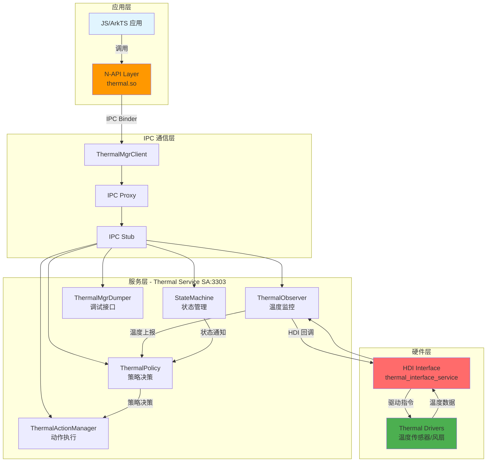
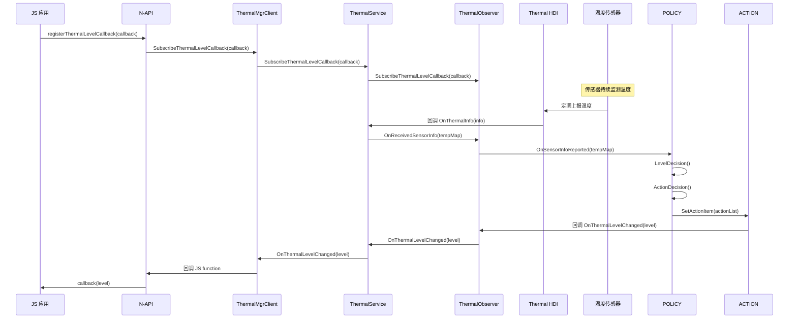
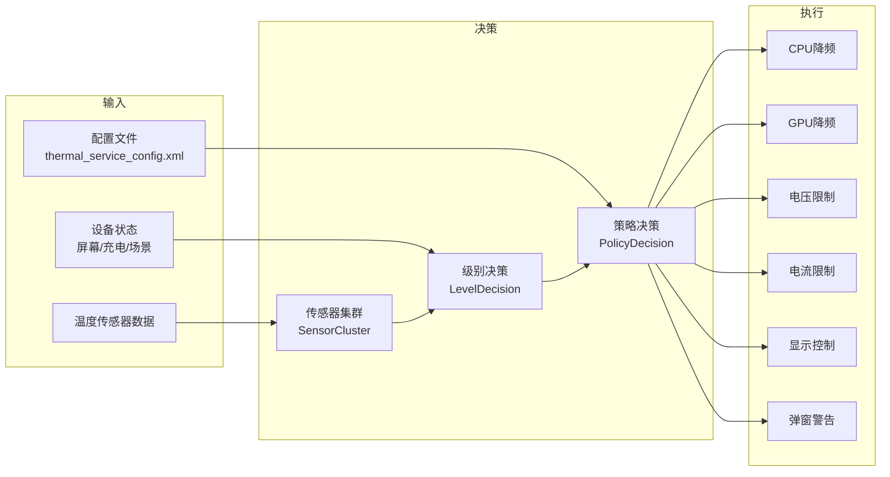
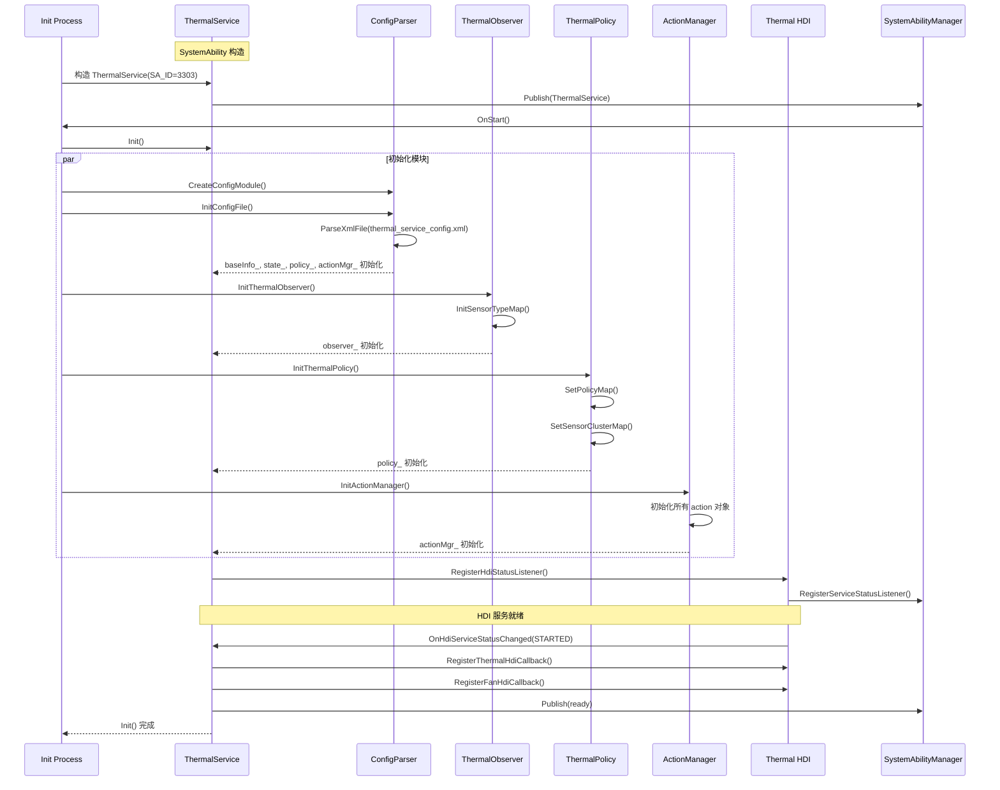
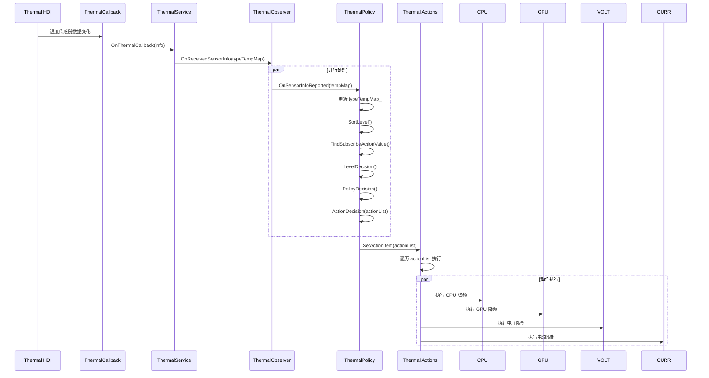
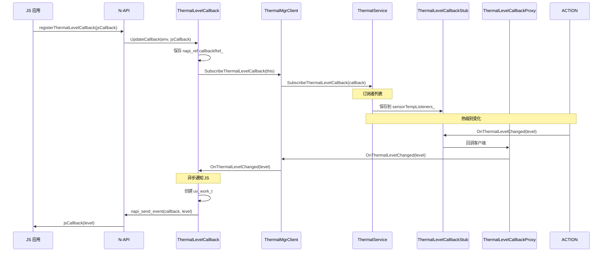

# 架构说明

## 目的

本文档详细说明 thermal_manager 的架构设计，包括组件图、数据流、线程模型和关键时序。

## 适用范围

- OpenHarmony thermal_manager 模块
- 标准系统类型

## 相关文档

- [00_Overview.md](00_Overview.md) - 项目概览
- [01_Module_Boundaries.md](01_Module_Boundaries.md) - 模块边界
- [02_Directory_Structure.md](02_Directory_Structure.md) - 目录结构

---

## 组件架构图



---

## 数据流

### 1. 温度监控流程



### 2. 策略执行流程



---

## 线程模型

### 主线程

| 组件 | 线程模型 | 说明 |
|---|---|---|
| Thermal Service | 主线程 | SA 回调在主线程执行 |
| Policy 执行 | 主线程同步 | ExecutePolicy() 同步执行 |
| IPC 回调 | 主线程 | IRemoteBroker 回调在主线程 |

### 工作队列

| 组件 | 队列类型 | 用途 |
|---|---|---|
| 全局队列 | FFRTQueue | thermal_service 工作队列 |
| 证据 | `FFRTQueue g_queue("thermal_service")` | services/native/src/thermal_service.cpp:58 |

### 异步回调

| 组件 | 异步方式 | 说明 |
|---|---|---|
| N-API 回调 | napi_send_event | JS 回调异步执行 |
| 证据 | `napi_send_event(env_, uvcallback, napi_eprio_low, __func__)` | frameworks/napi/thermal_manager_napi.cpp:77 |

---

## 关键时序

### 1. 服务启动时序



### 2. 温度变化处理时序



### 3. 回调通知时序



---

## 组件通信

### IPC 通信

| 通信方向 | 接口 | 协议 | 说明 |
|---|---|---|---|
| 应用 → Service | IThermalSrv | Binder | N-API 通过 ThermalMgrClient 调用 |
| Service → 应用 | IThermalLevelCallback | Binder | 回调通知应用 |
| 应用 → Service | IThermalTempCallback | Binder | 温度变化订阅 |
| 应用 → Service | IThermalActionCallback | Binder | 动作变化订阅 |

### HDI 通信

| 通信方向 | 接口 | 说明 |
|---|---|---|
| Service → Driver | IThermalInterface | HDF | 温度查询、指令下发 |
| Driver → Service | IThermalCallback | HDF | 温度数据上报 |

---

## 数据结构

### 1. 温度数据

```cpp
// services/native/include/thermal_srv_sensor_info.h
using TypeTempMap = std::map<std::string, int32_t>;

// services/native/include/ithermal_temp_callback.h
using TempCallbackMap = std::map<std::string, int32_t>;
```

### 2. 策略数据

```cpp
// services/native/include/thermal_policy/thermal_policy.h
struct PolicyAction {
    std::string actionName;
    std::string actionValue;
    std::map<std::string, std::string> actionPropMap;
    bool isProp;
};

struct PolicyConfig {
    uint32_t level;
    std::vector<PolicyAction> policyActionList;
};
```

### 3. 动作数据

```cpp
// services/native/include/thermal_action/thermal_action_manager.h
struct ActionItem {
    std::string name;
    std::string params;
    std::string uid;
    std::string protocol;
    bool strict;
    bool enableEvent;
};
```

---

## 错误处理

### 错误码

| 错误码 | 值 | 含义 |
|---|---|---|
| ERR_OK | 0 | 成功 |
| ERR_FAIL | -1 | 失败 |
| ERR_NO_INIT | -2 | 未初始化 |
| ERR_PERMISSION_DENIED | -3 | 权限拒绝 |

**证据**: services/native/src/thermal_service.cpp:60, 441, 448, 461, 466, 472, 475, 505, 519, 525, 533, 541, 554, 563, 576, 586, 634, 639, 668, 709, 711, 732, 738, 753, 756, 769, 774

---

## 总结

Thermal Manager 采用经典的分层架构，通过 IPC 和 HDI 实现跨进程和跨层通信。

**关键特点**:
- ✅ 清晰的分层：N-API → Service → HDI → Driver
- ✅ 观察者模式：Observer 监控温度，通知 Policy 和 Action
- ✅ 策略模式：基于配置和状态进行决策
- ✅ 回调机制：通过 Binder 回调通知订阅者
- ✅ 线程安全：使用互斥锁保护共享资源
- ✅ 异步通知：使用 napi_send_event 避免 JS 阻塞
