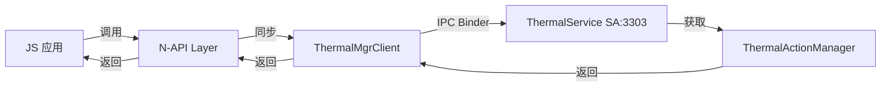
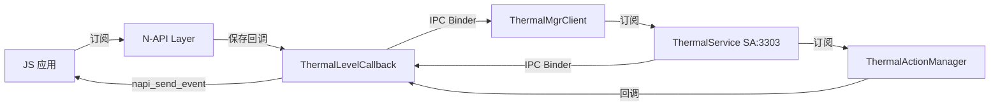

# 对外 N-API（JS API）文档

## 目的

本文档详细说明 thermal_manager 提供的所有对外 JavaScript API 接口，包括参数、返回值、错误码和调用链。

## 适用范围

- OpenHarmony thermal_manager 模块
- N-API (Node-API) 层
- JS/ArkTS/ArkTS 应用

## 相关文档

- [00_Overview.md](00_Overview.md) - 项目概览
- [01_Module_Boundaries.md](01_Module_Boundaries.md) - 模块边界
- [03_Architecture.md](03_Architecture.md) - 架构设计

---

## N-API 模块信息

### 模块注册

| 属性 | 值 | 证据 |
|---|---|---|
| **模块名** | `thermal` | thermal_manager_napi.cpp:286 |
| **文件名** | `thermal` | thermal_manager_napi.cpp:285 |
| **注册函数** | `ThermalInit` | thermal_manager_napi.cpp:267 |
| **入口函数** | `RegisterModule()` (constructor) | thermal_manager_napi.cpp:294 |

**注册代码**:
```cpp
// frameworks/napi/thermal_manager_napi.cpp:267-296
static napi_value ThermalInit(napi_env env, napi_value exports)
{
    napi_value ret = ThermalManagerNapi::Init(env, exports);
    return ret;
}

static napi_module g_module = {
    .nm_version = 1,
    .nm_flags = 0,
    .nm_filename = "thermal",
    .nm_register_func = ThermalInit,
    .nm_modname = "thermal",
    .nm_priv = ((void*)0),
    .reserved = {0}
};

extern "C" __attribute__((constructor)) void RegisterModule()
{
    napi_module_register(&g_module);
}
```

---

## API 清单

### 1. getThermalLevel / getLevel

查询当前设备热级别。

#### 接口定义

| 属性 | 值 |
|---|---|
| **方法名（旧）** | `getThermalLevel` |
| **方法名（新）** | `getLevel` |
| **同步/异步** | 同步 |
| **返回类型** | `number` |

#### JS 调用示例

```javascript
import thermal from '@ohos.thermal';

// 旧接口
const level = thermal.getThermalLevel();
console.log('Thermal level:', level);

// 新接口
const level = thermal.getLevel();
console.log('Thermal level:', level);
```

#### C/C++ 实现

**文件**: `frameworks/napi/thermal_manager_napi.cpp:193-202`

```cpp
napi_value ThermalManagerNapi::GetThermalLevel(napi_env env, napi_callback_info info)
{
    ThermalLevel level = g_thermalMgrClient.GetThermalLevel();
    int32_t levelValue = static_cast<int32_t>(level);
    napi_value napiValue;
    NAPI_CALL(env, napi_create_int32(env, levelValue, &napiValue));

    THERMAL_HILOGI(COMP_FWK, "level is %{public}d", levelValue);
    return napiValue;
}
```

#### 调用链



#### 返回值

| 返回值 | 含义 |
|---|---|
| 0 | COOL - 正常/冷却 |
| 1 | NORMAL - 正常 |
| 2 | WARM - 温暖 |
| 3 | HOT - 炎热 |
| 4 | OVERHEATED - 过热 |
| 5 | WARNING - 警告 |
| 6 | EMERGENCY - 紧急 |
| 7 | ESCAPE - 逃脱 |

#### 错误处理

- 无错误参数
- 无需权限检查
- 异常会被日志记录

---

### 2. subscribeThermalLevel / registerThermalLevelCallback

订阅热级别变化回调。

#### 接口定义

| 属性 | 值 |
|---|---|
| **方法名（旧）** | `subscribeThermalLevel` |
| **方法名（新）** | `registerThermalLevelCallback` |
| **同步/异步** | 同步（回调异步通知） |
| **参数** | `callback: Function` |

#### JS 调用示例

```javascript
import thermal from '@ohos.thermal';

// 旧接口
thermal.subscribeThermalLevel((level) => {
    console.log('Thermal level changed to:', level);
});

// 新接口
thermal.registerThermalLevelCallback((level) => {
    console.log('Thermal level changed to:', level);
});
```

#### C/C++ 实现

**文件**: `frameworks/napi/thermal_manager_napi.cpp:204-224`

```cpp
napi_value ThermalManagerNapi::SubscribeThermalLevel(napi_env env, napi_callback_info info)
{
    size_t argc = MAX_ARGC;
    napi_value argv[argc];
    NapiUtils::GetCallbackInfo(env, info, argc, argv);

    NapiErrors error;
    if (argc != MAX_ARGC || !NapiUtils::CheckValueType(env, argv[ARG_0], napi_function)) {
        return error.ThrowError(env, ThermalErrors::ERR_PARAM_INVALID);
    }

    napi_value result;
    napi_get_undefined(env, &result);

    THERMAL_RETURN_IF_WITH_RET(g_thermalLevelCallback == nullptr, result);
    g_thermalLevelCallback->ReleaseCallback();
    g_thermalLevelCallback->UpdateCallback(env, argv[ARG_0]);
    g_thermalMgrClient.SubscribeThermalLevelCallback(g_thermalLevelCallback);

    return result;
}
```

#### 参数校验

| 检查项 | 校验方式 | 证据 |
|---|---|---|
| 参数数量 | 必须 = 1 | thermal_manager_napi.cpp:211 |
| 参数类型 | 必须是 `napi_function` | thermal_manager_napi.cpp:211 |
| 回调是否为 null | NapiUtils::CheckValueType() | napi_utils.h:30 |

#### 回调机制

**文件**: `frameworks/napi/thermal_manager_napi.h:30-44`

```cpp
class ThermalLevelCallback : public ThermalLevelCallbackStub {
public:
    void UpdateCallback(napi_env env, napi_value jsCallback);
    void ReleaseCallback();
    bool OnThermalLevelChanged(ThermalLevel level) override;
    void OnThermalLevel();

private:
    ThermalLevel level_ {ThermalLevel::COOL};
    napi_ref callbackRef_ {nullptr};
    napi_env env_ {nullptr};
    std::mutex mutex_;  // 线程安全
};
```

**异步通知** (line 66-84):
```cpp
bool ThermalLevelCallback::OnThermalLevelChanged(ThermalLevel level)
{
    std::lock_guard lock(mutex_);
    level_ = level;
    THERMAL_RETURN_IF_WITH_RET(env_ == nullptr, false);
    uv_work_t* work = new (std::nothrow) uv_work_t;
    work->data = reinterpret_cast<void*>(this);
    auto uvcallback = [work]() mutable {
        ThermalLevelCallback* callback = reinterpret_cast<ThermalLevelCallback*>(work->data);
        if (callback != nullptr) {
            callback->OnThermalLevel();
        }
        delete work;
        work = nullptr;
    };
    if (napi_send_event(env_, uvcallback, napi_eprio_low, __func__) != napi_status::napi_ok) {
        delete work;
        work = nullptr;
        THERMAL_HILOGW(COMP_FWK, "uv_queue_work is failed");
        return false;
    }
    return true;
}
```

#### 调用链



#### 错误处理

| 错误类型 | 错误码 | 抛出方式 |
|---|---|---|
| 参数无效 | `ERR_PARAM_INVALID` | `napi_throw_error` |
| 内存分配失败 | - | 返回 `undefined` |

---

### 3. unsubscribeThermalLevel / unregisterThermalLevelCallback

取消订阅热级别变化回调。

#### 接口定义

| 属性 | 值 |
|---|---|
| **方法名（旧）** | `unsubscribeThermalLevel` |
| **方法名（新）** | `unregisterThermalLevelCallback` |
| **同步/异步** | 同步 |
| **参数** | `callback: Function`（可选） |

#### JS 调用示例

```javascript
import thermal from '@ohos.thermal';

// 旧接口
thermal.unsubscribeThermalLevel(callback);

// 新接口
thermal.unregisterThermalLevelCallback(callback);
```

#### C/C++ 实现

**文件**: `frameworks/napi/thermal_manager_napi.cpp:226-261`

#### 参数校验

| 场景 | 校验方式 |
|---|---|
| 无参数 | 直接释放所有回调 | line 232-234 |
| 有参数 | 必须是 `napi_function` | line 238-240 |

#### 调用链


---

## 导出常量

### ThermalLevel 枚举

| 常量名 | 值 | 说明 |
|---|---|---|
| `ThermalLevel.COOL` | 0 | 冷却/正常 |
| `ThermalLevel.NORMAL` | 1 | 正常 |
| `ThermalLevel.WARM` | 2 | 温暖 |
| `ThermalLevel.HOT` | 3 | 炎热 |
| `ThermalLevel.OVERHEATED` | 4 | 过热 |
| `ThermalLevel.WARNING` | 5 | 警告 |
| `ThermalLevel.EMERGENCY` | 6 | 紧急 |
| `ThermalLevel.ESCAPE` | 7 | 逃脱/关机 |

**证据**: `frameworks/napi/thermal_manager_napi.cpp:150-157`

---

## 权限要求

| API | 权限要求 |
|---|---|
| `getThermalLevel` / `getLevel` | 无 |
| `subscribeThermalLevel` / `registerThermalLevelCallback` | 无 |
| `unsubscribeThermalLevel` / `unregisterThermalLevelCallback` | 无 |

**注意**: 当前 N-API 层没有明确的权限检查，权限检查在 Thermal Service 层进行。

---

## 错误处理

### 错误码定义

**错误类**: `NapiErrors`
**错误类型**: `ThermalErrors` 枚举

**证据**: `frameworks/napi/napi_errors.h:27-44`

```cpp
class NapiErrors {
public:
    napi_value GetNapiError(napi_env& env) const;
    napi_value ThrowError(napi_env& env, ThermalErrors code = ThermalErrors::ERR_OK);

private:
    ThermalErrors code_ {ThermalErrors::ERR_OK};
};
```

### 错误抛出

所有错误通过 `napi_throw_error` 或 `napi_throw_type_error` 抛出到 JS 层。

---

## 线程安全

### 回调保护

| 组件 | 保护机制 | 证据 |
|---|---|---|
| `ThermalLevelCallback` | `std::mutex mutex_` | thermal_manager_napi.h:43 |
| 回调引用更新 | `std::lock_guard lock(mutex_)` | thermal_manager_napi.cpp:43 |
| 回调引用释放 | `std::lock_guard lock(mutex_)` | thermal_manager_napi.cpp:53 |

---

## 总结

Thermal Manager N-API 提供了简洁的 JS API：

1. **3 个导出方法**：温度查询、订阅回调、取消订阅
2. **热级别枚举**：8 个级别值（0-7）
3. **回调机制**：异步通知，线程安全
4. **无明确权限要求**：所有应用可调用
5. **同步返回**：查询操作直接返回结果

**调用链特点**:
- JS → N-API (同步)
- N-API → ThermalMgrClient (IPC Binder)
- ThermalMgrClient → ThermalService (SA 3303)
- ThermalService → ThermalLevelCallback (IPC Binder, 异步)
- ThermalLevelCallback → JS (napi_send_event, 异步)
