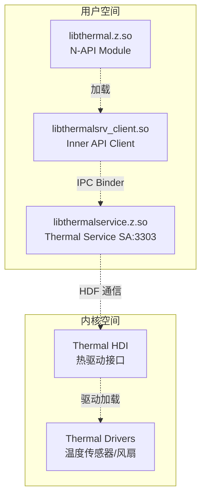

# GN Targets 与编译产物

## 目的

本文档详细说明 thermal_manager 的 GN 构建系统，包括所有关键 targets、依赖关系和编译产物。

## 适用范围

- OpenHarmony thermal_manager 模块
- GN 构建系统
- 编译产物说明

## 相关文档

- [00_Overview.md](00_Overview.md) - 项目概览
- [02_Directory_Structure.md](02_Directory_Structure.md) - 目录结构

---

## GN 配置文件

### 全局配置：thermalmgr.gni

**文件**: `thermalmgr.gni:1-70`

```gni
# Feature flags
declare_args() {
  thermal_manager_audio_framework_enable = false
}

# Defines
defines = []
if (!defined(global_parts_info) ||
    defined(global_parts_info.hiviewdfx_hisysevent)) {
  has_hiviewdfx_hisysevent_part = true
  defines += [ "HAS_HIVIEWDFX_HISYSEVENT_PART" ]
} else {
  has_hiviewdfx_hisysevent_part = false
}

# Part dependencies
if (!defined(global_parts_info) ||
    defined(global_parts_info.communication_netmanager_base)) {
  has_thermal_airplane_manager_part = true
} else {
  has_thermal_airplane_manager_part = false
}

if (!defined(global_parts_info) ||
    defined(global_parts_info.multimedia_audio_framework)) {
  has_thermal_audio_framework_part = true
} else {
  has_thermal_audio_framework_part = false
}

if (!defined(global_parts_info) ||
    defined(global_parts_info.powermgr_display_manager)) {
  has_thermal_display_manager_part = true
  defines += [ "HAS_THERMAL_DISPLAY_MANAGER_PART" ]
} else {
  has_thermal_display_manager_part = false
}

if (!defined(global_parts_info) ||
    defined(global_parts_info.customization_config_policy)) {
  has_thermal_config_policy_part = true
} else {
  has_thermal_config_policy_part = false
}

# Path definitions
ability_runtime_path = "//foundation/ability/ability_runtime"
ability_runtime_inner_api_path = "${ability_runtime_path}/interfaces/inner_api"
ability_runtime_services_path = "${ability_runtime_path}/services"
thermalmgr_native_part_name = "thermal_manager"
thermal_manager_path = "//base/powermgr/thermal_manager"
thermal_inner_api = "${thermal_manager_path}/interfaces/inner_api"
thermal_service_zidl = "${thermal_manager_path}/services/zidl"
thermal_frameworks = "${thermal_manager_path}/frameworks"
utils_path = "${thermal_manager_path}/utils"
taihe_generated_file_path = "${root_out_dir}/taihe/out/powermgr/thermal_manager"
```

---

## 关键 Targets

### 1. N-API Target

**路径**: `frameworks/napi/BUILD.gn`

#### ohos_shared_library("thermal")

| 属性 | 值 | 说明 |
|---|---|---|
| **Target 类型** | `ohos_shared_library` | 动态库 |
| **输出名** | `libthermal.z.so` | 证据: frameworks/napi/BUILD.gn:20 |
| **安装路径** | `module/` | 证据: frameworks/napi/BUILD.gn:51 |
| **部件名** | `thermal_manager` | 证据: frameworks/napi/BUILD.gn:52 |
| **子系统** | `powermgr` | 证据: frameworks/napi/BUILD.gn:53 |

**源文件** (3 个):
```python
sources = [
    "napi_errors.cpp",
    "napi_utils.cpp",
    "thermal_manager_napi.cpp",
]
```

**依赖**:
```python
deps = [
    "${thermal_inner_api}:thermalsrv_client",
    "${utils_path}:thermal_utils",
]

external_deps = [
    "bundle_framework:appexecfwk_base",
    "c_utils:utils",
    "hilog:libhilog",
    "ipc:ipc_core",
    "napi:ace_napi",
]
```

**配置**:
```python
sanitize = {
    cfi = true
    cfi_cross_dso = true
    debug = false
}
configs = [
    "${utils_path}:utils_config",
    "${utils_path}:coverage_flags",
    ":thermal_private_config",
]
```

**编译产物**: `libthermal.z.so`

---

### 2. Service Target

**路径**: `services/BUILD.gn`

#### ohos_shared_library("thermalservice")

| 属性 | 值 | 说明 |
|---|---|---|
| **Target 类型** | `ohos_shared_library` | 动态库 |
| **输出名** | `libthermalservice.z.so` | 证据: sa_profile/3303.json:6 |
| **部件名** | `thermal_manager` | 证据: services/BUILD.gn:78 |
| **子系统** | `powermgr` | 证据: services/BUILD.gn:77 |

**源文件** (85 个，主要源文件):
```python
sources = [
    "${thermal_service_zidl}/src/thermal_action_callback_proxy.cpp",
    "${thermal_service_zidl}/src/thermal_level_callback_proxy.cpp",
    "${thermal_service_zidl}/src/thermal_temp_callback_proxy.cpp",
    "native/src/fan_callback.cpp",
    # ... (80+ 个源文件)
    "native/src/thermal_service.cpp",
]
```

**依赖**:
```python
deps = [
    "${thermal_service_zidl}:thermalmgr_stub",
    "${utils_path}:thermal_utils",
    "${utils_path}/hookmgr:thermal_hookmgr",
]

external_deps = [
    "power_manager:power_permission",
    "ability_base:configuration",
    "ability_base:want",
    "ability_runtime:wantagent_innerkits",
    "bundle_framework:appexecfwk_core",
    "c_utils:utils",
    "common_event_service:cesfwk_innerkits",
    "drivers_interface_thermal:libthermal_proxy_1.1",
    "ffrt:libffrt",
    "hdf_core:libhdi",
    "hdf_core:libpub_utils",
    "hicollie:libhicollie",
    "hilog:libhilog",
    "image_framework:image_native",
    "init:libbegetutil",
    "ipc:ipc_core",
    "libxml2:libxml2",
    "power_manager:power_ffrt",
    "power_manager:power_sysparam",
    "power_manager:powermgr_client",
    "safwk:system_ability_fwk",
    "samgr:samgr_proxy",
    "time_service:time_client",
]
```

**条件依赖** (基于 feature flags):
```python
if (has_thermal_airplane_manager_part) {
    defines += [ "HAS_THERMAL_AIRPLANE_MANAGER_PART" ]
    external_deps += [ "netmanager_base:net_conn_manager_if" ]
}

if (has_thermal_audio_framework_part &&
    thermal_manager_audio_framework_enable) {
    defines += [ "HAS_THERMAL_AUDIO_FRAMEWORK_PART" ]
    external_deps += [ "audio_framework:audio_client" ]
}

if (has_thermal_config_policy_part) {
    defines += [ "HAS_THERMAL_CONFIG_POLICY_PART" ]
    external_deps += [ "config_policy:configpolicy_util" ]
}

if (has_thermal_display_manager_part) {
    external_deps += [ "display_manager:displaymgr" ]
}

if (defined(global_parts_info) &&
    defined(global_parts_info.resourceschedule_soc_perf)) {
    external_deps += [ "soc_perf:socperf_client" ]
    defines += [ "SOC_PERF_ENABLE" ]
}

if (defined(global_parts_info) &&
    defined(global_parts_info.powermgr_battery_manager)) {
    defines += [ "BATTERY_MANAGER_ENABLE" ]
    external_deps += [ "battery_manager:batterysrv_client" ]
}

if (build_variant == "user") {
    defines += [ "THERMAL_USER_VERSION" ]
}
```

**编译产物**: `libthermalservice.z.so`

---

### 3. Service Group Target

#### group("service")

| 属性 | 值 |
|---|---|
| **Target 类型** | `group` | 目标组 |
| **依赖** | `:thermalservice`, `:thermalmgr_sa_profile`, `:thermal_service_config` |

---

### 4. Inner API Targets

**路径**: `interfaces/inner_api/BUILD.gn`

#### ohos_shared_library("thermalsrv_client")

| 属性 | 值 | 说明 |
|---|---|---|
| **Target 类型** | `ohos_shared_library` | 动态库 |
| **部件名** | `thermal_manager` | 证据: bundle.json:84 |

**源文件**: (从代码推断)

**依赖**:
```python
external_deps = [
    "safwk:system_ability_fwk",
    "samgr:samgr_proxy",
    "hilog:libhilog",
    "ipc:ipc_core",
]
```

**编译产物**: `libthermalsrv_client.so`

---

### 5. Framework Targets

**路径**: `frameworks/BUILD.gn`

#### group("thermal_napi")

| 依赖 | 值 |
|---|---|
| `:napi:thermal` | N-API 库 |

#### group("client")

| 依赖 | 值 |
|---|---|
| `${thermal_inner_api}:thermalsrv_client` | 客户端库 |
| `${thermal_inner_api}:thermalmgr_listener` | 监听器库 |

---

### 6. Utility Targets

**路径**: `utils/BUILD.gn`

**编译产物**:
- `libthermal_utils.z.so`

---

## 编译产物清单

### 库文件

| 库文件 | 目标 | 安装路径 | 说明 |
|---|---|---|---|
| `libthermal.z.so` | N-API target | `/system/lib64/module/` | JS N-API 模块 |
| `libthermalservice.z.so` | Service target | `/system/lib64/` | Thermal Service SA |
| `libthermalsrv_client.so` | Inner API target | `/system/lib64/` | 内部客户端库 |
| `libthermal_utils.z.so` | Utils target | `/system/lib64/` | 工具库 |

### 其他产物

| 产物 | 说明 |
|---|---|
| `3303.json` | SA 3303 配置文件 |
| `thermal_service_config.xml` | 默认配置文件 |

---

## 特性开关（Feature Flags）

### 全局特性

| 特性 | 默认值 | 说明 |
|---|---|---|
| `thermal_manager_audio_framework_enable` | `false` | 音频框架支持 |
| `has_thermal_airplane_manager_part` | 条件编译 | 飞行模式支持 |
| `has_thermal_audio_framework_part` | 条件编译 | 音频框架部分 |
| `has_thermal_display_manager_part` | 条件编译 | 显示管理器部分 |
| `has_thermal_config_policy_part` | 条件编译 | 配置策略部分 |
| `SOC_PERF_ENABLE` | 条件编译 | SOC 性能支持 |
| `BATTERY_MANAGER_ENABLE` | 条件编译 | 电池管理器支持 |
| `THERMAL_USER_VERSION` | 条件编译 | 用户版本（vs. 用户） |

### 条件宏定义

| 宏 | 触发条件 | 证据 |
|---|---|---|
| `HAS_HIVIEWDFX_HISYSEVENT_PART` | hisysevent 部分存在 | thermalmgr.gni:23 |
| `HAS_THERMAL_AIRPLANE_MANAGER_PART` | netmanager_base 部分存在 | thermalmgr.gni:30-33 |
| `HAS_THERMAL_AUDIO_FRAMEWORK_PART` | audio_framework 部分存在 + enable | thermalmgr.gni:36-40 |
| `HAS_THERMAL_DISPLAY_MANAGER_PART` | display_manager 部分存在 | thermalmgr.gni:43-48 |
| `HAS_THERMAL_CONFIG_POLICY_PART` | config_policy 部分存在 | thermalmgr.gni:51-55 |
| `SOC_PERF_ENABLE` | resourceschedule_soc_perf 部分存在 | services/BUILD.gn:51-55 |
| `BATTERY_MANAGER_ENABLE` | powermgr_battery_manager 部分存在 | services/BUILD.gn:57-61 |
| `THERMAL_USER_VERSION` | build_variant == "user" | services/BUILD.gn:69-71 |

---

## 构建配置

### 安全配置

所有共享库启用了 CFI (Control Flow Integrity):

```python
sanitize = {
    cfi = true
    cfi_cross_dso = true
    debug = false
}
```

**证据**: frameworks/napi/BUILD.gn:22-25, services/BUILD.gn:31-34

### 分支保护

启用了返回地址保护：

```python
branch_protector_ret = "pac_ret"
```

**证据**: services/BUILD.gn:35

---

## 依赖系统组件

### 核心依赖（从 bundle.json 提取）

| 子系统 | 组件 | 用途 |
|---|---|---|
| **ability_runtime** | appexecfwk_core, wantagent_innerkits | Ability 框架支持 |
| **access_token** | - | 访问令牌支持 |
| **ipc** | ipc_core | IPC 通信 |
| **safwk** | system_ability_fwk, samgr_proxy | System Ability 框架 |
| **hilog** | libhilog | 日志输出 |
| **hdf_core** | libhdi, libpub_utils | HDF 驱动接口 |
| **libxml2** | libxml2 | XML 解析 |
| **ffrt** | libffrt | Foundation Function Runtime |
| **common_event_service** | cesfwk_innerkits | 公共事件服务 |
| **power_manager** | power_ffrt, power_sysparam, powermgr_client, power_permission | 电源管理支持 |
| **time_service** | time_client | 时间服务 |
| **image_framework** | image_native | 图像框架支持 |
| **display_manager** | displaymgr | 显示管理器支持 |
| **audio_framework** | audio_client | 音频框架支持 |
| **netmanager_base** | net_conn_manager_if | 网络管理器支持 |
| **soc_perf** | socperf_client | SOC 性能支持 |
| **battery_manager** | batterysrv_client | 电池管理器支持 |
| **bundle_framework** | appexecfwk_core | Bundle 框架支持 |
| **c_utils** | utils | C 工具库 |

---

## 运行时加载关系



---

## 总结

Thermal Manager 的 GN 构建系统包含以下关键组件：

1. **3 个主要编译产物**:
   - `libthermal.z.so` - N-API 模块
   - `libthermalservice.z.so` - Thermal Service
   - `libthermalsrv_client.so` - 内部客户端

2. **条件编译特性**:
   - 飞行模式支持
   - 音频/显示管理器支持
   - SOC 性能/电池管理器支持
   - 配置策略支持

3. **安全编译选项**:
   - CFI (Control Flow Integrity)
   - PACRET (返回地址保护)

4. **依赖关系**:
   - 依赖 30+ 个系统组件
   - 与电源管理、显示、电池、HDI 等子系统交互
