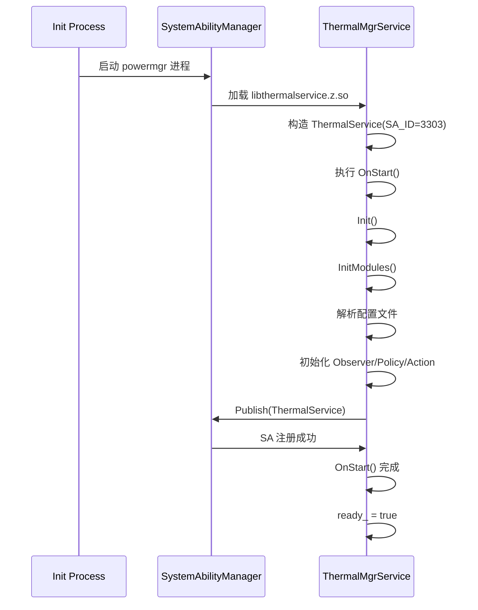
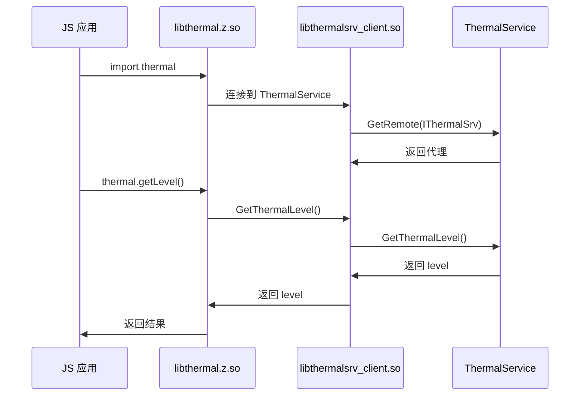

# 编译产物说明

## 目的

本文档说明 thermal_manager 的所有编译产物、安装路径和运行时加载关系。

## 适用范围

- OpenHarmony thermal_manager 模块
- 编译产物（.so 文件）
- 安装和运行时

## 相关文档

- [00_Overview.md](00_Overview.md) - 项目概览
- [06_GN_Targets.md](06_GN_Targets.md) - GN Targets 详解

---

## 编译产物清单

### 1. N-API 模块

| 属性 | 值 |
|---|---|
| **产物名** | `libthermal.z.so` |
| **目标名** | `thermal` |
| **类型** | `ohos_shared_library` |
| **来源** | `frameworks/napi/BUILD.gn:20` |
| **安装路径** | `/system/lib64/module/` |
| **SA 配置** | 无 |

**功能**: 提供 Node.js/ArkTS/ArkTS 应用调用的 JS API 接口

**导出接口**:
- `getThermalLevel` / `getLevel`
- `subscribeThermalLevel` / `registerThermalLevelCallback`
- `unsubscribeThermalLevel` / `unregisterThermalLevelCallback`

---

### 2. Thermal Service

| 属性 | 值 |
|---|---|
| **产物名** | `libthermalservice.z.so` |
| **SA ID** | 3303 |
| **类型** | `ohos_shared_library` |
| **来源** | `services/BUILD.gn:29` |
| **安装路径** | `/system/lib64/` |
| **SA 配置** | `sa_profile/3303.json` |

**SA 配置** (来源: `sa_profile/3303.json`):
```json
{
    "process": "powermgr",
    "systemability": [
        {
            "name": 3303,
            "libpath": "libthermalservice.z.so",
            "run-on-create": true,
            "distributed": false,
            "dump_level": 1,
            "min_hdi_proxy_version": [
                "libthermal_proxy_1.1.z.so",
                "libbattery_proxy_2.0.z.so"
            ]
        }
    ]
}
```

**功能**: 实现 Thermal System Ability，提供核心热管理服务

---

### 3. Inner API Client

| 属性 | 值 |
|---|---|
| **产物名** | `libthermalsrv_client.so` |
| **类型** | `ohos_shared_library` |
| **来源** | `interfaces/inner_api/BUILD.gn` |
| **安装路径** | `/system/lib64/` |

**功能**: 提供给内部 Native 模块使用的 ThermalMgrClient API

---

### 4. Utility Library

| 属性 | 值 |
|---|---|
| **产物名** | `libthermal_utils.z.so` |
| **类型** | `ohos_shared_library` |
| **来源** | `utils/BUILD.gn` |
| **安装路径** | `/system/lib64/` |

**功能**: 提供通用工具函数（文件操作、字符串处理等）

---

### 5. SA Profile 配置

| 属性 | 值 |
|---|---|
| **文件名** | `3303.json` |
| **类型** | JSON 配置 |
| **安装路径** | `/system/profile/` |

**功能**: 定义 System Ability 3303 的配置

---

### 6. 配置文件

| 文件 | 安装路径 | 说明 |
|---|---|---|
| `thermal_service_config.xml` | `/system/etc/thermal_config/` | 系统默认配置 |
| `thermal_service_config.xml` | `/vendor/etc/thermal_config/` | 厂商配置（优先） |
| `thermal_service_config.xml` | `/vendor/etc/thermal_config/` | 厂商配置（备份） |

**来源**: `services/native/src/thermal_service.cpp:54-56`

---

## 安装路径

### 系统库路径

| 文件类型 | 安装路径 | 证据 |
|---|---|---|
| N-API 模块 | `/system/lib64/module/` | frameworks/napi/BUILD.gn:51 |
| 系统库 | `/system/lib64/` | services/BUILD.gn:29 |

### 配置文件路径

| 文件类型 | 安装路径 | 证据 |
|---|---|---|
| SA Profile | `/system/profile/3303.json` | sa_profile/BUILD.gn |
| 默认配置 | `/system/etc/thermal_config/` | thermal_service.cpp:56 |
| 厂商配置 | `/vendor/etc/thermal_config/` | thermal_service.cpp:55 |

### 应用程序路径

| 组件 | 安装路径 |
|---|---|
| Thermal Protector | `/system/bin/thermal_protector` | (推测) |

---

## 运行时加载关系

### 进程启动

1. **Init 进程启动** (from `application/init/init.cfg`):
   - 加载 Thermal Protector

2. **System Ability 启动** (SA 3303):
   - 由 init 进程启动 `powermgr` 进程
   - 加载 `libthermalservice.z.so`
   - 执行 `ThermalService::OnStart()`

3. **应用启动**:
   - 加载 N-API 模块 `libthermal.z.so`
   - 导出 `thermal` 模块

### 库加载顺序

```
应用进程启动
    ↓
加载 libthermal.z.so (N-API)
    ↓
    (应用调用)
    ↓
加载 libthermalsrv_client.so (Inner API Client)
    ↓
    (IPC Binder 连接)
    ↓
libthermalservice.z.so (Thermal Service)
    ↓ (SA 启动)
    ↓
    (通过 SAMGR 注册)
    ↓
HDI 通信 (thermal_interface_service)
```

### 运行时架构

```
┌─────────────────────────────────────────────┐
│              用户空间                  │
│  ┌──────────────┐  ┌──────────────┐  │
│  │ JS 应用      │  │ Native 应用  │  │
│  └──────┬───────┘  └──────┬───────┘  │
│         │                    │            │
│         ▼                    ▼            │
│  ┌───────────────────────────────────────┐│
│  │      libthermal.z.so               ││
│  └───────────────────────────────────────┘│
│         ▲                    ▲            │
│         │ (N-API)            │            │
└─────────┴────────────────────────┴─────────────┘
         │
         ▼ (IPC Binder)
┌─────────────────────────────────────────────┐
│  ┌───────────────────────────────────────┐│
│  │  libthermalsrv_client.so           ││
│  └───────────────────────────────────────┘│
│         ▲                                    │
└─────────┴───────────────────────────────────────┘
         │ (IPC Binder)
         ▼
┌─────────────────────────────────────────────┐
│      powermgr 进程                     │
│  ┌───────────────────────────────────────┐│
│  │  libthermalservice.z.so (SA 3303)││
│  └───────────────────────────────────────┘│
│         ▲ (HDI 通信)                    │
└─────────┴───────────────────────────────────────┘
         │
         ▼
┌─────────────────────────────────────────────┐
│      内核空间                         │
│  ┌───────────────────────────────────────┐│
│  │  thermal_interface_service (HDF)    ││
│  └───────────────────────────────────────┘│
└─────────────────────────────────────────────┘
```

---

## HDI 依赖

### Thermal HDI

**接口版本**: `1.1`

**客户端库**:
- `libthermal_proxy_1.1.z.so`

**证据**: `sa_profile/3303.json:10-12`

### Battery HDI（可选）

**接口版本**: `2.0`

**客户端库**:
- `libbattery_proxy_2.0.z.so`

**条件**: `DRIVERS_INTERFACE_BATTERY_ENABLE` 宏定义

**证据**: `services/BUILD.gn:64-67`

---

## 启动参数

### SA 启动参数

| 参数 | 值 | 说明 |
|---|---|---|
| `run-on-create` | `true` | SA 创建后立即启动 |
| `distributed` | `false` | 不是分布式服务 |
| `dump_level` | `1` | 支持 dump 功能 |

**证据**: `sa_profile/3303.json:7-9`

---

## 内存占用

### 编译产物大小

| 产物 | 预估大小 | 证据 |
|---|---|---|
| `libthermal.z.so` | ~100-200KB | (估算，基于源文件数） |
| `libthermalservice.z.so` | ~300-500KB | (估算，基于 85 个源文件） |
| `libthermalsrv_client.so` | ~50-100KB | (估算） |
| `libthermal_utils.z.so` | ~50-100KB | (估算） |

**运行时 ROM**: 1024KB (来源: `bundle.json:26`)

**运行时 RAM**: 2048KB (来源: `bundle.json:27`)

---

## 加载时序

### 系统启动时序



### 应用调用时序



---

## 总结

Thermal Manager 的编译产物包括：

1. **3 个主要共享库**：
   - `libthermal.z.so` - N-API 模块
   - `libthermalservice.z.so` - Thermal Service (SA 3303)
   - `libthermalsrv_client.so` - 内部客户端

2. **安装路径**：
   - N-API: `/system/lib64/module/`
   - 系统库: `/system/lib64/`
   - SA 配置: `/system/profile/`
   - 配置文件: `/system/etc/thermal_config/` 或 `/vendor/etc/thermal_config/`

3. **运行时架构**：
   - 应用层通过 N-API 调用
   - N-API 通过 IPC 连接到 Thermal Service
   - Thermal Service 通过 HDI 与驱动通信

4. **HDI 依赖**：
   - Thermal HDI v1.1 (必需)
   - Battery HDI v2.0 (可选，条件编译）
