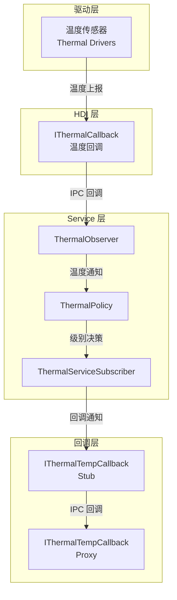
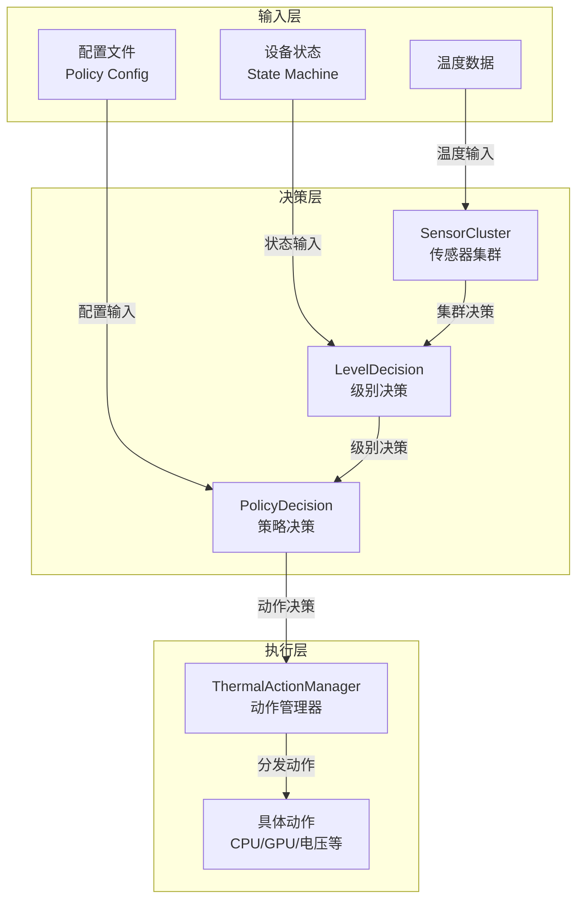
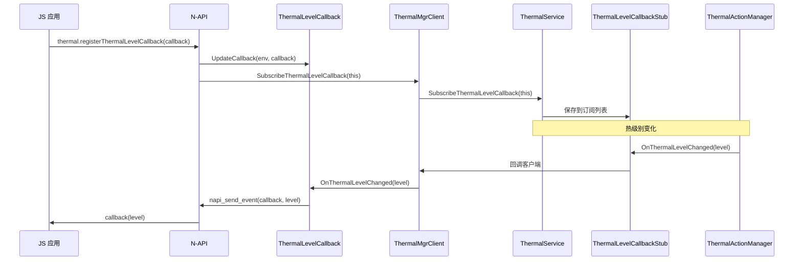
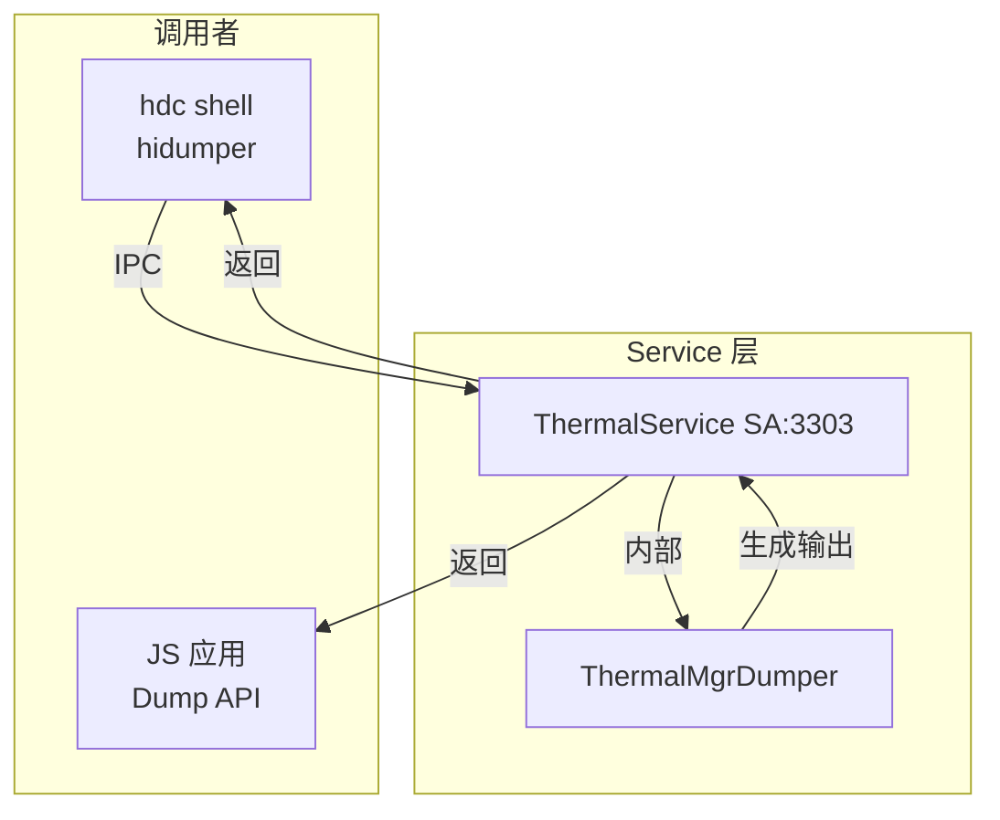

# 关键调用链

## 目的

本文档详细说明 thermal_manager 的关键调用链，帮助理解代码执行流程。

## 适用范围

- OpenHarmony thermal_manager 模块
- 主要功能流程

## 相关文档

- [03_Architecture.md](03_Architecture.md) - 架构总览
- [00_Overview.md](00_Overview.md) - 项目概览

---

## 1. 温度监控流程

### 调用链图



### 详细流程

#### 步骤 1: 温度上报

1. **驱动层** → **HDI 回调**
   - 驱动检测到温度变化
   - 调用 `IThermalCallback::OnThermalCallback()`

2. **HDI 回调** → **ThermalObserver**
   - `HandleThermalCallbackEvent()` (services/native/src/thermal_service.cpp:673-689)
   - 解析温度数据到 `TypeTempMap`

3. **ThermalObserver** → **ThermalPolicy**
   - `OnSensorInfoReported()` (services/native/include/thermal_observer/thermal_observer.h:47)
   - 更新 `typeTempMap_`

4. **ThermalPolicy** → **策略决策**
   - `OnSensorInfoReported()` (services/native/include/thermal_policy/thermal_policy.h:47)
   - 执行 `LevelDecision()` 和 `PolicyDecision()`

#### 步骤 2: 回调通知

1. **ThermalServiceSubscriber** → **温度回调 Stub**
   - `OnTemperatureChanged()` (从代码推断)
   - 通过 IPC Binder 通知订阅者

2. **Stub** → **Proxy**
   - `IThermalTempCallback` IPC 调用

3. **Proxy** → **应用回调**
   - 应用层的 `IThermalTempCallback` 实现

### 代码证据

**HDI 回调注册**: `services/native/src/thermal_service.cpp:642-656`
```cpp
void ThermalService::RegisterThermalHdiCallback()
{
    sptr<IThermalInterface> thermalInterface = GetThermalInterfaceInner();
    if (thermalInterface == nullptr) {
        THERMAL_HILOGE(COMP_SVC, "the thermalInterface is null");
        return;
    }

    sptr<IThermalCallback> callback = new ThermalCallback();
    ThermalCallback::ThermalEventCallback eventCb =
        [this](const HdfThermalCallbackInfo& event) -> int32_t { 
            return this->HandleThermalCallbackEvent(event); 
        };
    ThermalCallback::RegisterThermalEvent(eventCb);
    int32_t ret = thermalInterface->Register(callback);
    THERMAL_HILOGI(COMP_SVC, "register thermal hdi callback end, ret: %{public}d", ret);
}
```

**温度处理**: `services/native/src/thermal_service.cpp:673-689`
```cpp
int32_t ThermalService::HandleThermalCallbackEvent(const HdfThermalCallbackInfo& event)
{
#ifndef THERMAL_USER_VERSION
    if (!isTempReport_) {
        return ERR_OK;
    }
#endif
    TypeTempMap typeTempMap;
    if (!event.info.empty()) {
        for (auto iter = event.info.begin(); iter != event.info.end(); iter++) {
            typeTempMap.insert(std::make_pair(iter->type, iter->temp));
        }
    }
    std::lock_guard<std::mutex> lock(mutex_);
    serviceSubscriber_->OnTemperatureChanged(typeTempMap);
    return ERR_OK;
}
```

---

## 2. 策略执行流程

### 调用链图



### 详细流程

#### 步骤 1: 级别决策

1. **SensorCluster** 比较温度与阈值
   - 遍历所有传感器集群
   - 检查温度是否超过 `threshold` 或低于 `threshold_clr`

2. **LevelDecision** 确定当前级别
   - 任何传感器触发最高级别
   - 级别从低到高排序
   - 更新 `clusterLevelMap_`

3. **PolicyDecision** 策略匹配
   - 结合设备状态（屏幕、充电）
   - 查找匹配的策略配置
   - 确定执行的动作列表

#### 步骤 2: 动作执行

1. **ThermalActionManager** 设置动作列表
   - `SetActionItem(actionList)`
   - 遍历动作列表，找到对应的动作对象

2. **执行各动作**
   - CPU 动作：`Execute()` - 写入 sysfs 频率节点
   - 电压动作：`Execute()` - 写入 sysfs 电压节点
   - 电流动作：`Execute()` - 写入 sysfs 电流节点
   - 显示动作：`Execute()` - 调用显示管理器
   - 关机动作：`Execute()` - 调用关机 API
   - 弹窗动作：`Execute()` - 显示警告弹窗

### 代码证据

**级别决策**: `services/native/src/thermal_policy/thermal_policy.cpp:...`
```cpp
void ThermalPolicy::LevelDecision()
{
    // 遍历所有传感器集群
    for (const auto& [name, sensorCluster] : sensorClusterMap_) {
        uint32_t currentLevel = sensorCluster->GetLevel();
        if (currentLevel < maxLevel) {
            clusterLevelMap_[name] = currentLevel;
            maxLevel = currentLevel;
        }
    }
}
```

**动作分发**: `services/native/src/thermal_action/thermal_action_manager.cpp:...`
```cpp
void ThermalActionManager::SetActionItem(std::vector<ActionItem> vActionItem)
{
    vActionItem_ = vActionItem;
    for (auto& item : vActionItem) {
        auto actionIter = actionMap_.find(item.name);
        if (actionIter != actionMap_.end() && actionIter->second != nullptr) {
            actionIter->second->InitParams(item.params);
        }
    }
}
```

---

## 3. 回调订阅流程

### 调用链图



### 详细步骤

#### 步骤 1: 注册回调

1. **N-API 层**
   - 创建或更新 `napi_ref callbackRef_`
   - 设置 `env_`

2. **ThermalMgrClient**
   - 通过 IPC Binder 调用 `ThermalService::SubscribeThermalLevelCallback()`

3. **ThermalService**
   - 将回调保存到 `sensorTempListeners_` (实际是 level listeners)
   - 使用 `std::set` 存储订阅者

#### 步骤 2: 触发回调

1. **ThermalActionManager**
   - 检测到热级别变化
   - 调用 `OnThermalLevelChanged(level)`

2. **ThermalService**
   - 转发到 Stub

3. **Stub**
   - 通过 IPC Binder 调用客户端的回调

4. **ThermalMgrClient**
   - 接收回调，处理业务逻辑

5. **ThermalLevelCallback**
   - 通过 `napi_send_event` 异步通知 JS

### 代码证据

**订阅实现**: `services/native/src/thermal_service.cpp:481-488`
```cpp
int32_t ThermalService::SubscribeThermalLevelCallback(const sptr<IThermalLevelCallback>& callback)
{
    ThermalXCollie thermalXCollie("ThermalService::SubscribeThermalLevelCallback", false);
    auto uid = IPCSkeleton::GetCallingUid();
    THERMAL_HILOGI(COMP_SVC, "ScbLevelCb uid=%{public}d", uid);
    actionMgr_->SubscribeThermalLevelCallback(callback);
    return ERR_OK;
}
```

**回调分发**: `services/native/src/thermal_action/thermal_action_manager.cpp:...` (从代码推断)
```cpp
// ThermalActionManager 持有订阅者列表
// 当热级别变化时，遍历所有订阅者
void ThermalActionManager::NotifyLevelChange(uint32_t level) {
    for (auto& callback : levelListeners_) {
        if (callback != nullptr) {
            callback->OnThermalLevelChanged(static_cast<ThermalLevel>(level));
        }
    }
}
```

**异步通知**: `frameworks/napi/thermal_manager_napi.cpp:66-84`
```cpp
bool ThermalLevelCallback::OnThermalLevelChanged(ThermalLevel level)
{
    std::lock_guard lock(mutex_);
    level_ = level;
    THERMAL_RETURN_IF_WITH_RET(env_ == nullptr, false);
    uv_work_t* work = new (std::nothrow) uv_work_t;
    work->data = reinterpret_cast<void*>(this);
    auto uvcallback = [work]() mutable {
        ThermalLevelCallback* callback = reinterpret_cast<ThermalLevelCallback*>(work->data);
        if (callback != nullptr) {
            callback->OnThermalLevel();
        }
        delete work;
        work = nullptr;
    };
    if (napi_send_event(env_, uvcallback, napi_eprio_low, __func__) != napi_status::napi_ok) {
        delete work;
        work = nullptr;
        THERMAL_HILOGW(COMP_FWK, "uv_queue_work is failed");
        return false;
    }
    return true;
}
```

---

## 4. Dump 流程

### 调用链图



### 详细流程

1. **Shell/APP 调用 Dump 命令**
   - `hidumper -s ThermalService -a -a`
   - 通过 Binder IPC 调用 `ThermalService::Dump()`

2. **ThermalService 检查权限**
   - 检查 `Permission::IsSystem()`
   - 检查 `isBootCompleted_`

3. **ThermalService 委托给 ThermalMgrDumper**
   - `Dump(args, result)`
   - 生成格式化的 dump 信息

4. **返回 dump 结果**
   - 通过文件描述符或 Binder 返回

### 代码证据

**Dump 实现**: `services/native/src/thermal_mgr_dumper.cpp:...`
```cpp
bool ThermalMgrDumper::Dump(const std::vector<std::string>& args, std::string& result)
{
    // 解析参数，生成各模块的 dump 信息
    // 包括：Observer, Policy, Action, Config 等
    // 输出到 result 字符串
    return true;
}
```

**Service Dump 入口**: `services/native/src/thermal_service.cpp:751-775`
```cpp
int32_t ThermalService::Dump(int fd, const std::vector<std::u16string>& args)
{
    if (!isBootCompleted_) {
        return ERR_NO_INIT;
    }
    if (!Permission::IsSystem()) {
        return ERR_PERMISSION_DENIED;
    }
    std::vector<std::string> argsInStr;
    std::transform(args.begin(), args.end(), std::back_inserter(argsInStr), 
                 [](const std::u16string& arg) {
                     std::string ret = Str16ToStr8(arg);
                     return ret;
                 });
    std::lock_guard<std::mutex> lock(mutex_);
    std::string result;
    ThermalMgrDumper::Dump(argsInStr, result);
    if (!SaveStringToFd(fd, result)) {
        THERMAL_HILOGE(COMP_SVC, "ThermalService::Dump failed, save to fd failed.");
        return ERR_OK;
    }
    return ERR_OK;
}
```

---

## 总结

Thermal Manager 的关键调用链主要包括：

1. **温度监控流程**:
   - 驱动 → HDI → Observer → Policy → 决策 → Action 执行

2. **回调订阅流程**:
   - JS App → N-API → ThermalMgrClient → ThermalService → ActionManager → N-API (异步)

3. **策略执行流程**:
   - 温度/状态 → SensorCluster → LevelDecision → PolicyDecision → ActionManager → 各 Action

4. **Dump 流程**:
   - Shell/App → ThermalService → ThermalMgrDumper → 返回格式化信息

**关键特点**:
- ✅ 清晰的分层架构
- ✅ 观察者模式实现事件驱动
- ✅ 异步回调避免阻塞
- ✅ 使用 Binder 进行跨进程通信
