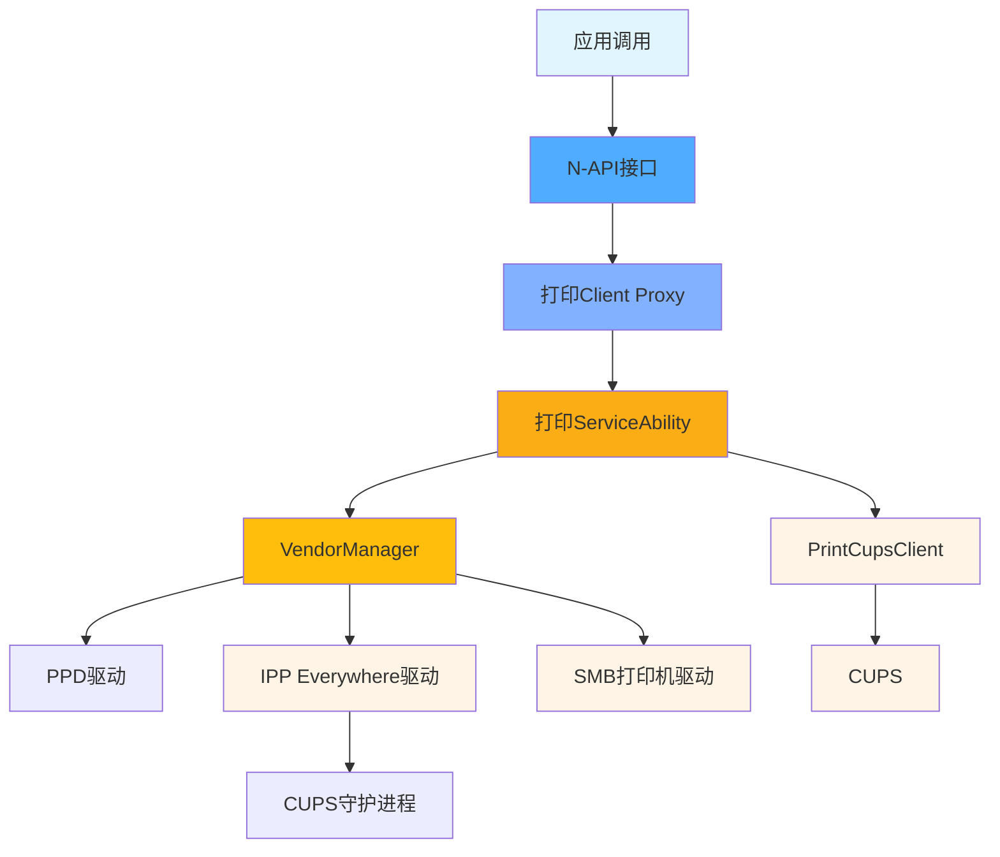
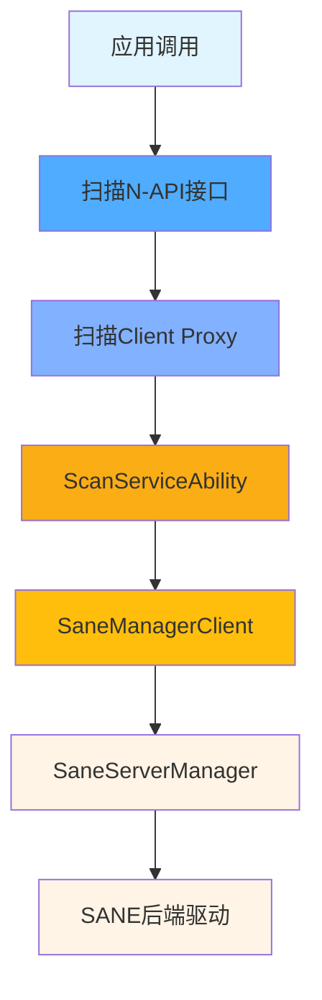

# OpenHarmony 打印扫描框架 - 目录结构与代码地图

**目的**: 提供完整的目录结构、模块职责说明、核心文件定位和代码导航。

**适用范围**: 新人学习者、应用开发者、安全研究员

**关键结论**:
- ✅ 项目采用分层目录结构：etc/、figures/、frameworks/、interfaces/、profile/、services/、utils/
- ✅ frameworks/包含8个子模块，分别处理不同职责
- ✅ interfaces/提供4种接口类型（napi/ani/ndk/jsnapi）
- ✅ services/包含3个系统服务，通过SystemAbility机制注册
- ✅ 测试目录包含单元测试和Fuzz测试

---

## 一、目录树结构

### 1.1 顶层目录

```
print_fwk/
├── etc/                     # 配置文件目录
├── figures/                 # 架构图和文档插图
├── frameworks/              # 核心框架实现
│   ├── ISaneBackends/      # SANE后端接口
│   ├── ani_util/           # ANI工具
│   ├── helper/             # 辅助工具
│   ├── innerkitsimpl/      # IPC内部实现
│   ├── kits/               # 扩展框架
│   ├── models/             # 数据模型
│   ├── ohprint/            # 打印C API
│   └── ohscan/             # 扫描C API
├── interfaces/              # 接口定义
│   └── kits/
│       ├── ani/            # ArkTS Native接口
│       ├── jsnapi/         # JS Native接口
│       ├── napi/            # Node-API接口
│       └── ndk/            # Native Development Kit
├── profile/                 # 系统能力配置
├── services/                # 系统服务实现
│   ├── print_service/      # 打印服务 (SA:3707)
│   ├── sane_service/       # SANE服务 (SA:3709)
│   └── scan_service/       # 扫描服务 (SA:3708)
├── test/                    # 测试代码（已排除）
│   ├── unittest/          # 单元测试
│   └── fuzztest/          # Fuzz测试
├── utils/                   # 公共工具
└── wiki/                    # 文档目录
```

---

## 二、核心目录职责

### 2.1 etc/ - 配置文件

**职责**: 系统初始化配置、服务启动参数、权限配置

| 子目录 | 说明 | 关键文件 |
|-------|------|--------|
| `init/` | 服务启动配置和服务初始化脚本 | printservice.cfg、cupsd.conf、scanservice.cfg等 |
| `param/` | 系统参数和参数权限配置 | print.para、print.para.dac |

**关键配置文件**:
- `etc/init/printservice.cfg` - 打印服务配置
- `etc/init/cupsd.conf` - CUPS守护进程配置
- `etc/init/scanservice.cfg` - 扫描服务配置
- `etc/param/print.para` - 打印框架参数
- `profile/3707.json` - 打印服务SA配置（ID:3707）
- `profile/3708.json` - 扫描服务SA配置（ID:3708）
- `profile/3709.json` - SANE服务SA配置（ID:3709）

### 2.2 frameworks/ - 框架层

**职责**: 核心业务逻辑、数据模型、辅助工具、IPC客户端实现

| 子模块 | 说明 | 核心职责 |
|-------|------|---------|
| `ohprint/` | 打印C API接口（面向C/C++应用） | C API定义和实现 |
| `ohscan/` | 扫描C API接口（面向C/C++应用） | C API定义和实现 |
| `helper/` | 辅助工具和数据转换 | 工具类、JSON处理、类型转换 |
| `models/` | 数据结构定义 | PrinterInfo、PrintJob、ScanDeviceInfo等 |
| `innerkitsimpl/` | IPC客户端实现 | Service的Proxy和Callback实现 |
| `kits/extension/` | 打印扩展框架 | PrintExtensionAbility支持 |
| `ani_util/` | ANI工具 | ArkTS Native工具 |
| `ISaneBackends/` | SANE后端接口 | 扫描后端统一接口 |

### 2.3 interfaces/ - 接口层

**职责**: 对外暴露的API接口

| 子目录 | 接口类型 | 说明 |
|-------|---------|------|
| `napi/` | Node-API (N-API) | JavaScript应用接口 |
| `ani/` | ArkTS Native Interface (ANI) | ArkTS应用接口 |
| `ndk/` | Native Development Kit (NDK) | C/C++应用接口 |
| `jsnapi/` | JS Native API | JavaScript Native扩展 |

### 2.4 services/ - 服务层

**职责**: 系统服务实现、SystemAbility注册、服务端IPC Stub

| 子目录 | 服务ID | 说明 |
|-------|--------|------|
| `print_service/` | 3707 | 打印服务，管理打印机、打印任务 |
| `scan_service/` | 3708 | 扫描服务，管理扫描仪、扫描任务 |
| `sane_service/` | 3709 | SANE后端服务，统一扫描仪驱动接口 |

### 2.5 utils/ - 公共工具

**职责**: 公共常量、工具函数、日志宏

| 内容 | 说明 |
|------|------|
| 常量定义 | 打印/扫描错误码、状态码、Feature flags |
| 工具函数 | JSON处理、字符串处理、路径验证 |
| 日志宏 | PRINT_HILOG、SCAN_HILOG等 |

---

## 三、核心文件定位

### 3.1 项目配置文件

| 文件 | 路径 | 说明 |
|------|--------|------|
| `bundle.json` | `/bundle.json:1` | 组件定义、依赖、构建组 |
| `print.gni` | `/print.gni:1` | GN全局变量、Feature flags |
| `hisysevent.yaml` | `/hisysevent.yaml:1` | 系统事件日志配置 |
| `cfi_blocklist.txt` | `/cfi_blocklist.txt:1` | CFI黑名单配置 |

### 3.2 N-API 入口文件

#### 打印模块

| 文件 | 路径 | 说明 |
|------|--------|------|
| `print_module.cpp` | `interfaces/kits/napi/print_napi/src/print_module.cpp:442` | 打印N-API模块注册点，导出46个方法+15个枚举 |
| `napi_inner_print.cpp` | `interfaces/kits/napi/print_napi/src/napi_inner_print.cpp:1` | 打印N-API实现 |
| `napi_print_ext.cpp` | `interfaces/kits/napi/print_napi/src/napi_print_ext.cpp:1` | 打印扩展N-API实现 |
| `napi_print_task.cpp` | `interfaces/kits/napi/print_napi/src/napi_print_task.cpp:1` | PrintTask类实现 |

#### 扫描模块

| 文件 | 路径 | 说明 |
|------|--------|------|
| `scan_module.cpp` | `interfaces/kits/napi/scan_napi/src/scan_module.cpp:154` | 扫描N-API模块注册点，导出17个方法+6个枚举 |
| `napi_inner_scan.cpp` | `interfaces/kits/napi/scan_napi/src/napi_inner_scan.cpp:1` | 扫描N-API实现 |

### 3.3 IPC 接口文件

| 文件 | 路径 | 说明 |
|------|--------|------|
| `print_service_ability.h` | `services/print_service/include/print_service_ability.h:1` | 打印服务主类，SA实现 |
| `scan_service_ability.h` | `services/scan_service/include/scan_service_ability.h:1` | 扫描服务主类，SA实现 |
| `sane_service_ability.h` | `services/sane_service/include/sane_service_ability.h:1` | SANE服务主类，SA实现 |
| `print_service_stub.h` | `services/print_service/include/print_service_stub.h:1` | 打印IPC Stub（服务端） |
| `scan_service_stub.h` | `services/scan_service/include/scan_service_stub.h:1` | 扫描IPC Stub（服务端） |
| `print_service_proxy.h` | `frameworks/innerkitsimpl/print_impl/include/print_service_proxy.h:1` | 打印IPC Proxy（客户端） |
| `scan_service_proxy.h` | `frameworks/innerkitsimpl/scan_impl/include/scan_service_proxy.h:1` | 扫描IPC Proxy（客户端） |

### 3.4 数据模型文件

| 文件 | 路径 | 说明 |
|------|--------|------|
| `printer_info.h` | `frameworks/models/print_models/include/printer_info.h:1` | 打印机信息结构 |
| `print_job.h` | `frameworks/models/print_models/include/print_job.h:1` | 打印任务结构 |
| `printer_capability.h` | `frameworks/models/print_models/include/printer_capability.h:1` | 打印机能力结构 |
| `scanner_info.h` | `frameworks/models/scan_models/include/scanner_info.h:1` | 扫描仪信息结构 |
| `scan_parameters.h` | `frameworks/models/scan_models/include/scan_parameters.h:1` | 扫描参数结构 |

### 3.5 服务实现关键文件

| 文件 | 路径 | 说明 |
|------|--------|------|
| `print_cups_client.h/.cpp` | `services/print_service/include/print_cups_client.h:1` | CUPS客户端封装，打印后端集成 |
| `print_service_helper.h/.cpp` | `services/print_service/include/print_service_helper.h:1` | 打印服务辅助工具 |
| `vendor_manager.h/.cpp` | `services/print_service/include/vendor_manager.h:1` | 打印机驱动管理器 |
| `sane_manager_client.h/.cpp` | `services/scan_service/include/sane_manager_client.h:1` | SANE后端客户端封装 |

---

## 四、代码导航图

### 4.1 打印功能定位



**证据**:
- N-API注册: `interfaces/kits/napi/print_napi/src/print_module.cpp:442`
- Service Ability: `services/print_service/src/print_service_ability.cpp:161`
- IPC Proxy: `frameworks/innerkitsimpl/print_impl/include/print_service_proxy.h:1`
- Vendor Manager: `services/print_service/include/vendor_manager.h:1`
- CUPS Client: `services/print_service/include/print_cups_client.h:1`

### 4.2 扫描功能定位



**证据**:
- N-API注册: `interfaces/kits/napi/scan_napi/src/scan_module.cpp:154`
- Service Ability: `services/scan_service/src/scan_service_ability.cpp:92`
- IPC Proxy: `frameworks/innerkitsimpl/scan_impl/include/scan_service_proxy.h:1`
- SANE Client: `services/scan_service/include/sane_manager_client.h:1`
- SANE Service: `services/sane_service/src/sane_service_ability.cpp:36`

---

## 五、模块依赖关系

### 5.1 打印模块依赖

```
print_napi (N-API)
    ↓ depends on
print_helper (工具类)
    ↓ uses
print_models (数据模型)
    ↓ uses
print_client (IPC客户端)
    ↓ calls via IPC
print_service (系统服务)
    ↓ depends on
cups (外部依赖)
```

**关键依赖文件**:
- `interfaces/kits/napi/print_napi/BUILD.gn:42` - N-API构建目标
- `frameworks/helper/print_helper/BUILD.gn` - Helper库目标
- `frameworks/models/print_models/BUILD.gn` - 数据模型目标
- `frameworks/innerkitsimpl/print_impl/BUILD.gn` - IPC客户端目标
- `services/print_service/BUILD.gn` - 服务目标

### 5.2 扫描模块依赖

```
scan_napi (N-API)
    ↓ depends on
scan_helper (工具类)
    ↓ uses
scan_models (数据模型)
    ↓ uses
scan_client (IPC客户端)
    ↓ calls via IPC
scan_service (系统服务)
    ↓ depends on
sane_backends (SANE接口)
```

**关键依赖文件**:
- `interfaces/kits/napi/scan_napi/BUILD.gn` - 扫描N-API构建目标
- `frameworks/helper/scan_helper/BUILD.gn` - 扫描Helper库目标
- `frameworks/models/scan_models/BUILD.gn` - 扫描数据模型目标
- `frameworks/innerkitsimpl/scan_impl/BUILD.gn` - 扫描IPC客户端目标
- `services/scan_service/BUILD.gn` - 扫描服务目标
- `frameworks/ISaneBackends/BUILD.gn` - SANE后端目标

---

## 六、开发入口点

### 6.1 入口函数

| 模块 | 入口函数 | 位置 | 说明 |
|------|----------|------|
| 打印N-API | `Init()` | `interfaces/kits/napi/print_napi/src/print_module.cpp:442` | 模块初始化，定义导出属性和方法 |
| 扫描N-API | `Init()` | `interfaces/kits/napi/scan_napi/src/scan_module.cpp:154` | 模块初始化，定义导出属性和方法 |
| 打印服务SA | `OnStart()` | `services/print_service/src/print_service_ability.cpp:180` | 服务启动，注册SystemAbility |
| 扫描服务SA | `OnStart()` | `services/scan_service/src/scan_service_ability.cpp:40` | 服务启动，注册SystemAbility |
| SANE服务SA | `OnStart()` | `services/sane_service/src/sane_service_ability.cpp:43` | 服务启动，注册SystemAbility |

### 6.2 重要头文件

| 头文件 | 路径 | 用途 |
|-------|--------|------|
| `print_constant.h` | `utils/include/print_constant.h:291` | 打印常量、错误码、枚举 |
| `scan_constant.h` | `utils/include/scan_constant.h:1` | 扫描常量、错误码、枚举 |
| `ohprint.h` | `frameworks/ohprint/include/ohprint.h:1` | 打印C API定义 |
| `ohscan.h` | `frameworks/ohscan/include/ohscan.h:1` | 扫描C API定义 |

---

## 七、相关链接

- [项目概览](01_Overview.md) - 项目定位和核心能力
- [架构与数据流](02_Architecture.md) - 详细架构说明和组件关系
- [N-API接口文档](04_Interface.md) - 完整API参考

---

**生成时间**: 2026-02-07
**相关证据**: 所有目录结构均基于实际代码库结构
