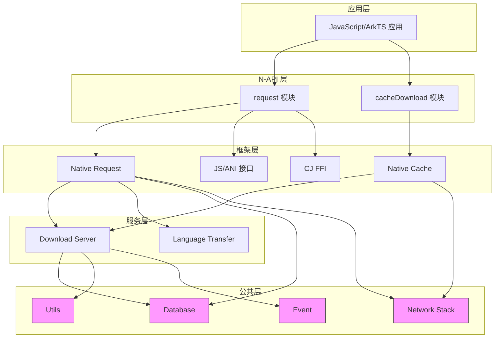

# 目录结构与模块职责

## 目的

本文档描述 Request 项目的目录结构和各模块的职责边界。

## 适用范围

- 顶层目录结构
- 各模块的功能职责
- 依赖方向（避免环）
- 代码组织原则

## 关键结论

1. **分层架构**：common → frameworks → interfaces → services
2. **多语言实现**：C++、Rust、JavaScript、ArkTS
3. **模块职责清晰**：下载/上传/缓存分离
4. **依赖方向**：上层依赖下层，无环依赖

## 目录树结构

```
/Volumes/lexar/code/d/work/oh/base/request/request
├── figures/                        # 架构图和文档图片
├── common/                         # 公共模块（底层）
│   ├── database/                  # 数据库相关
│   ├── netstack_rs/               # Rust 网络栈适配
│   ├── ffrt_rs/                   # Rust FFRT 适配
│   ├── utils/                     # 工具类
│   ├── sys_event/                 # 系统事件
│   ├── request_core/               # 请求核心逻辑
│   └── utf8_utils/                # UTF-8 工具
├── frameworks/                      # 框架实现（中间层）
│   ├── native/                    # C++ 原生实现
│   │   ├── request/              # 请求框架
│   │   ├── request_action/       # 请求动作
│   │   ├── cache_core/          # 缓存核心
│   │   ├── cache_download/      # 缓存下载
│   │   └── request_next/        # 新版请求框架
│   ├── js/                        # JavaScript 实现
│   │   ├── napi/               # N-API 绑定
│   │   │   ├── request/          # request 模块
│   │   │   ├── cache_download/   # cacheDownload 模块
│   │   │   └── preload_napi/     # 预下载 NAPI
│   │   └── ani/                # JS ANI 接口
│   ├── ets/                       # ArkTS 实现
│   │   └── ani/                # ETS ANI 接口
│   └── cj/                        # CJ (C-Java) FFI 实现
│       └── ffi/                # FFI 接口
├── interfaces/                      # 接口定义（公共 API）
│   └── inner_kits/                # 内部 API 接口
│       ├── running_count/          # 运行任务计数
│       ├── request_action/         # 请求动作接口
│       └── cache_download/        # 缓存下载接口
├── services/                       # 服务实现（系统服务）
│   ├── download_server/           # 下载服务
│   └── download_language_transfer/ # 语言传输服务
├── etc/                           # 配置文件
│   ├── init/                      # 进程初始化配置
│   ├── sa_profile/                # 系统服务配置
│   └── icon/                      # 图标资源
└── wiki/                          # Wiki 文档（本目录）
    ├── README.md
    ├── SUMMARY.md
    ├── _work/                      # 工作区
    └── appendix/                   # 附录
```

## 模块职责

### common/ - 公共模块

**职责**: 提供底层公共能力，被上层模块依赖。

| 子模块 | 职责 | 证据 |
|-------|------|------|
| database | 数据库操作、任务持久化 | `common/database/src/cxx/c_request_database.cpp` |
| netstack_rs | Rust 网络栈适配层 | `common/netstack_rs/src/cxx/` |
| ffrt_rs | Rust FFRT（Foundation Framework Runtime）适配 | `common/ffrt_rs/src/cxx/` |
| utils | 工具函数、字符串处理、路径处理 | `common/utils/src/cxx/` |
| sys_event | 系统事件上报 | `common/sys_event/src/cxx/` |
| request_core | 请求核心逻辑、配置管理 | `common/request_core/src/` |
| utf8_utils | UTF-8 编码工具 | `common/utf8_utils/src/` |

**依赖**: 无（最底层）

### frameworks/ - 框架实现

**职责**: 实现核心功能框架，提供 N-API 绑定和内部 API。

#### native/ - C++ 原生实现

| 子模块 | 职责 | 证据 |
|-------|------|------|
| request | 请求框架核心、IPC 客户端 | `frameworks/native/request/src/request_manager.cpp` |
| request_action | 请求动作抽象、执行器 | `frameworks/native/request_action/src/` |
| cache_core | 缓存核心逻辑、LRU 管理 | `frameworks/native/cache_core/src/` |
| cache_download | 缓存下载实现 | `frameworks/native/cache_download/src/` |
| request_next | 新版请求框架（API10+）| `frameworks/native/request_next/src/` |

**依赖**: common/，interfaces/

#### js/ - JavaScript 实现

| 子模块 | 职责 | 证据 |
|-------|------|------|
| napi/request | `@ohos.request` N-API 模块 | `frameworks/js/napi/request/src/request_module.cpp:276` |
| napi/cache_download | `@ohos.request.cacheDownload` N-API 模块 | `frameworks/js/napi/cache_download/src/preload_module.cpp:765` |
| napi/preload_napi | 预下载 N-API 工具 | `frameworks/js/napi/preload_napi/src/` |
| ani | JS ANI 接口定义 | `frameworks/js/ani/` |

**依赖**: frameworks/native/，common/

#### ets/ - ArkTS 实现

| 子模块 | 职责 | 证据 |
|-------|------|------|
| ani/request | Request ANI ETS 接口 | `frameworks/ets/ani/request/ets/` |
| ani/cache_download | CacheDownload ANI ETS 接口 | `frameworks/ets/ani/cache_download/ets/` |

**依赖**: frameworks/js/，frameworks/native/

#### cj/ - CJ FFI 实现

| 子模块 | 职责 | 证据 |
|-------|------|------|
| ffi | CJ FFI 接口 | `frameworks/cj/ffi/src/` |

**依赖**: frameworks/native/，common/

### interfaces/ - 接口定义

**职责**: 定义公共 API，作为内部模块间的契约。

| 子模块 | 职责 | 证据 |
|-------|------|------|
| inner_kits/running_count | 运行任务计数接口 | `interfaces/inner_kits/running_count/include/` |
| inner_kits/request_action | 请求动作接口 | `interfaces/inner_kits/request_action/include/` |
| inner_kits/cache_download | 缓存下载接口 | `interfaces/inner_kits/cache_download/` |

**依赖**: frameworks/native/（仅头文件）

### services/ - 服务实现

**职责**: 实现系统服务，处理后台任务和持久化。

| 子模块 | 职责 | 证据 |
|-------|------|------|
| download_server | 下载服务（SA）、任务调度 | `services/src/cxx/` |
| download_language_transfer | 语言传输服务 | `services/src/cxx/download_language_transfer.cpp` |

**依赖**: frameworks/native/，common/，interfaces/

### etc/ - 配置文件

**职责**: 系统配置、服务注册、资源文件。

| 子目录 | 职责 | 证据 |
|-------|------|------|
| init | init 进程配置 | `etc/init/downloadservice.cfg` |
| sa_profile | 系统服务配置 | `etc/sa_profile/` |
| icon | 图标资源 | `etc/icon/svg/` |

**依赖**: 无

## 依赖方向图



## 模块边界

### 稳定接口（公共 API）

以下接口被视为稳定，对外暴露：

- **N-API**:
  - `@ohos.request.download()` / `upload()`
  - `@ohos.request.cacheDownload.download()`
  - `request.agent` API (API10+)
- **Inner Kits**:
  - `interfaces/inner_kits/` 下的头文件

### 不稳定接口（内部实现）

以下接口仅供内部使用，不保证稳定性：

- `frameworks/native/*/src/` 的具体实现
- `services/*/src/` 的服务实现
- `common/*/src/` 的公共模块实现

## 代码组织原则

1. **分层清晰**: 应用层 → N-API 层 → 框架层 → 服务层 → 公共层
2. **职责单一**: 每个模块只负责一个核心功能
3. **依赖向下**: 上层依赖下层，下层不依赖上层
4. **语言分离**: 不同语言实现独立在各自目录

## 相关跳转

- [架构说明](02_Architecture.md) - 详细的架构图和数据流
- [内部 API 文档](04_Inner_API.md) - 内部接口详细说明
- [GN Targets](05_GN_Targets.md) - 构建目标
