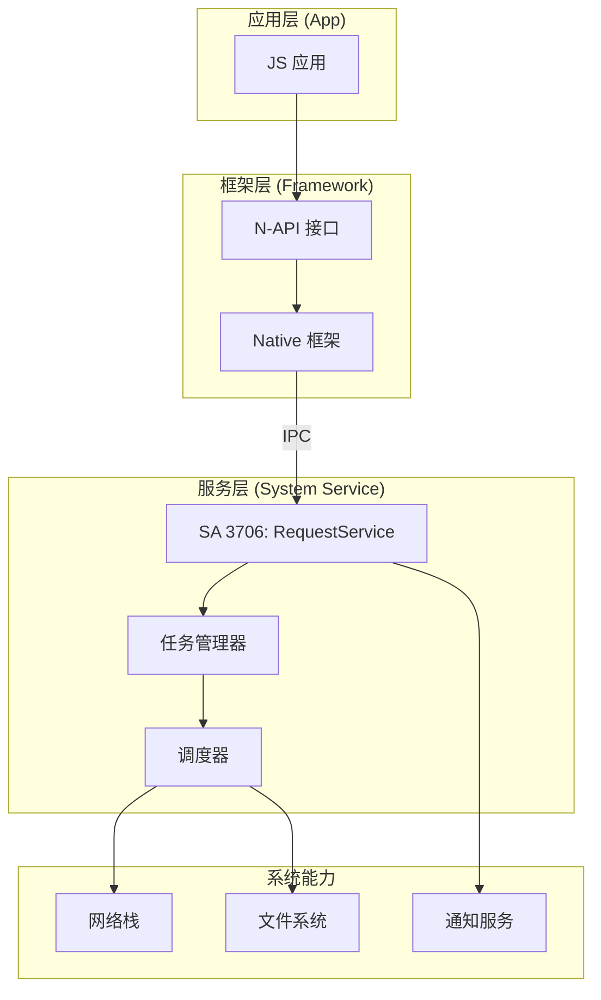

# 01 - 项目概览

**文档目的**: 帮助读者在 5 分钟内理解 @ohos/request 是什么、能做什么  
**目标受众**: 新人学习者  
**阅读时间**: 约 10 分钟

---

## 一句话定义

@ohos/request 是 OpenHarmony 的系统服务组件，为第三方应用提供**文件下载**和**文件上传**能力，支持后台任务管理、断点续传、进度通知等功能。

---

## 能力边界

### 能做什么 ✅

| 功能 | 说明 | 适用场景 |
|------|------|----------|
| **HTTP/HTTPS 下载** | 支持 GET/POST 等方法的文件下载 | App 更新包、资源文件下载 |
| **HTTP/HTTPS 上传** | 支持 multipart/form-data 文件上传 | 图片/视频上传到服务器 |
| **后台下载** | 应用切换后台仍可继续下载 | 大文件下载（游戏、视频） |
| **任务管理** | 创建、暂停、恢复、移除、查询任务 | 下载管理器类应用 |
| **进度通知** | 实时回调下载/上传进度 | 进度条展示 |
| **断点续传** | 网络中断后从中断处继续 | 不稳定网络环境 |
| **任务分组** | 支持批量任务管理 | 批量下载/上传 |

### 不能做什么 ❌

| 限制 | 说明 | 替代方案 |
|------|------|----------|
| **非 HTTP 协议** | 不支持 FTP、P2P 等协议 | 使用专门的协议库 |
| **WebSocket** | 不支持 WebSocket 通信 | 使用 NetStack 模块 |
| **流式数据处理** | 不提供实时流处理能力 | 应用层自行处理 |
| **完整 HTTP SDK** | 不是通用 HTTP 客户端 | 使用 NetStack 模块 |

---

## 运行环境

### 系统服务架构



### 关键信息

| 属性 | 值 | 证据 |
|------|-----|------|
| **SA ID** | 3706 | `etc/sa_profile/3706.json:5` |
| **进程名** | download_server | `etc/sa_profile/3706.json:2` |
| **运行模式** | On-demand（按需启动） | `etc/sa_profile/3706.json:7` |
| **技术栈** | Rust (核心) + C++ (N-API) | `services/BUILD.gn:130` |
| **Syscap** | SystemCapability.MiscServices.Download | `bundle.json:15` |

---

## 快速开始

### 1. 申请权限

在 module.json5 中声明所需权限：

```json
{
  "module": {
    "requestPermissions": [
      { "name": "ohos.permission.INTERNET" }
    ]
  }
}
```

### 2. 导入模块

```typescript
import request from '@ohos.request';
```

### 3. 创建下载任务

```typescript
// 定义下载配置
const config: request.DownloadConfig = {
  url: 'https://example.com/file.zip',
  filePath: '/data/storage/el2/base/haps/entry/files/file.zip',
  title: '文件下载',
  description: '正在下载...',
  enableMetered: false,  // 禁止按流量计费的网络
  enableRoaming: false   // 禁止漫游网络
};

// 创建下载任务
const downloadTask = await request.downloadFile(getContext(), config);

// 监听进度
downloadTask.on('progress', (receivedSize: number, totalSize: number) => {
  const progress = (receivedSize / totalSize) * 100;
  console.info(`下载进度: ${progress.toFixed(2)}%`);
});

// 监听完成
downloadTask.on('complete', () => {
  console.info('下载完成');
});

// 监听失败
downloadTask.on('fail', (error: number) => {
  console.error(`下载失败: ${error}`);
});
```

### 4. 创建上传任务

```typescript
const uploadConfig: request.UploadConfig = {
  url: 'https://example.com/upload',
  method: 'POST',
  files: [{
    filename: 'image.jpg',
    name: 'file',
    uri: 'internal://cache/image.jpg',
    type: 'image/jpeg'
  }],
  data: [{ name: 'key', value: 'value' }]
};

const uploadTask = await request.uploadFile(getContext(), uploadConfig);

uploadTask.on('progress', (uploadedSize: number, totalSize: number) => {
  console.info(`上传进度: ${(uploadedSize / totalSize * 100).toFixed(2)}%`);
});
```

---

## 核心概念

### Task（任务）

Task 是 Request 服务的核心抽象，代表一个下载或上传操作。

```typescript
interface Task {
  readonly tid: string;           // 任务 ID
  readonly action: Action;        // DOWNLOAD 或 UPLOAD
  readonly state: State;          // 当前状态
  
  pause(): Promise<void>;          // 暂停任务
  resume(): Promise<void>;         // 恢复任务
  remove(): Promise<void>;         // 移除任务
  query(): Promise<TaskInfo>;      // 查询任务信息
  
  on(event: string, callback: Function): void;   // 注册监听
  off(event: string, callback?: Function): void; // 取消监听
}
```

### Agent 模式（API 10+）

从 API 10 开始，Request 提供了更强大的 Agent 模式，支持高级功能：

```typescript
// 使用 Agent 创建任务
const task = await request.agent.create({
  action: request.agent.Action.DOWNLOAD,
  url: 'https://example.com/file.zip',
  saveas: './file.zip',
  mode: request.agent.Mode.BACKGROUND  // 后台模式
});

// 搜索任务
const tasks = await request.agent.search({
  action: request.agent.Action.DOWNLOAD,
  state: request.agent.State.RUNNING
});

// 任务分组
await request.agent.createGroup('my-group');
await request.agent.attachGroup(task.tid, 'my-group');
```

---

## 项目配置

### bundle.json 关键配置

```json
{
  "name": "@ohos/request",
  "version": "3.1",
  "component": {
    "name": "request",
    "subsystem": "request",
    "syscap": [
      "SystemCapability.MiscServices.Download",
      "SystemCapability.MiscServices.Upload",
      "SystemCapability.Request.FileTransferAgent"
    ]
  }
}
```

### 依赖组件

| 组件 | 用途 |
|------|------|
| access_token | 权限校验 |
| netstack | 网络通信 |
| samgr | 系统服务管理 |
| relational_store | 任务数据持久化 |
| curl | HTTP/HTTPS 实现 |
| openssl | TLS/SSL 加密 |

---

## 下一步

- **了解架构**: [02_Architecture.md](02_Architecture.md)
- **查找代码**: [03_CodeMap.md](03_CodeMap.md)
- **查看 API**: [04_Interface.md](04_Interface.md)
