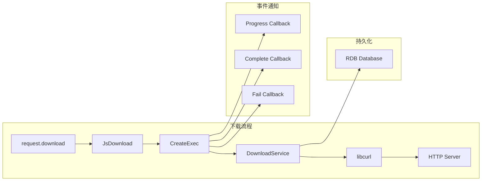
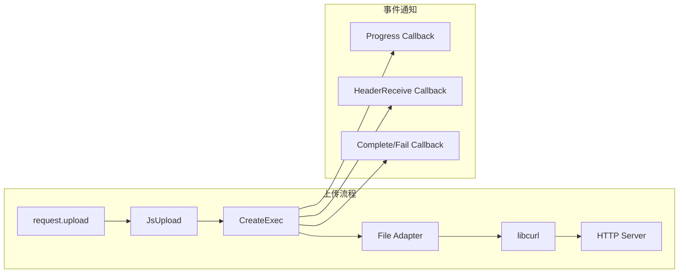
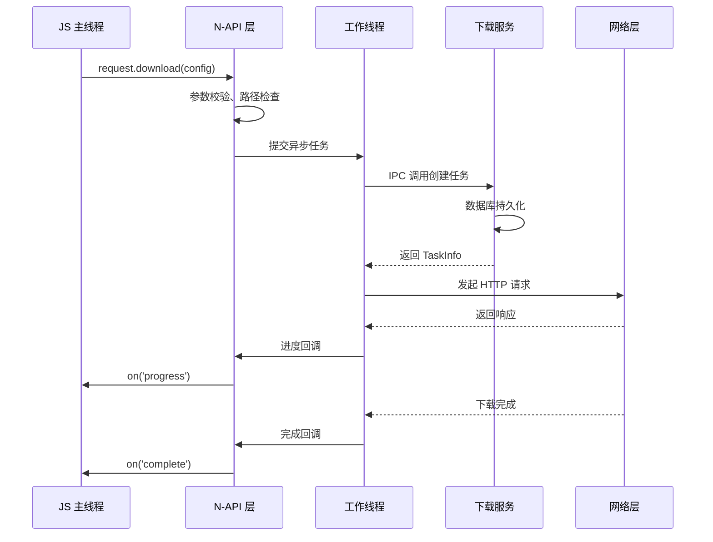
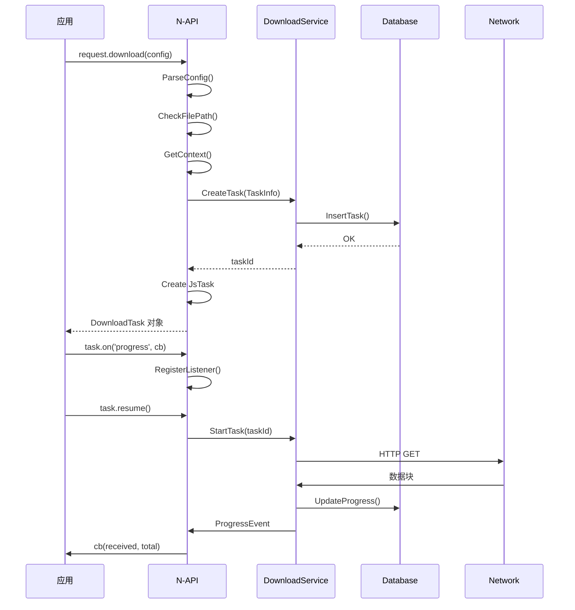
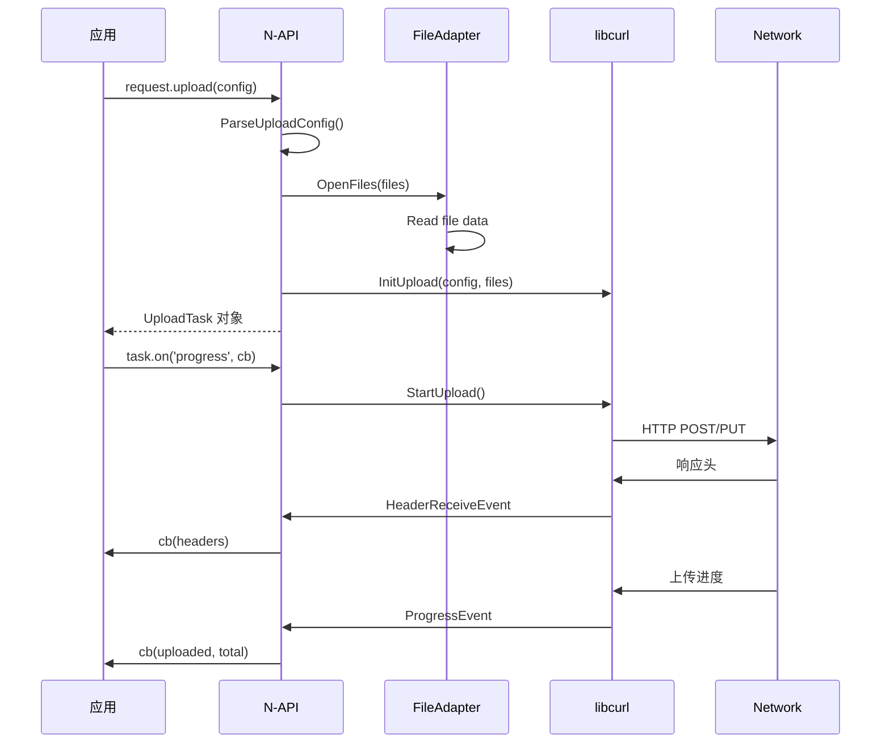
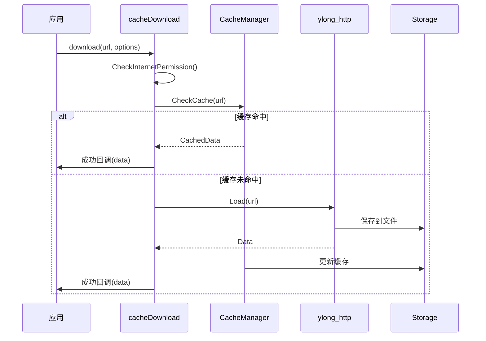
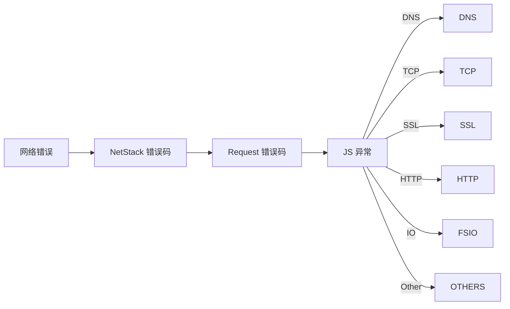

# 架构说明

## 目的

本文档描述 Request 服务的架构设计，包括组件图、数据流、线程模型和关键时序。

## 适用范围

- 下载/上传服务架构
- 组件交互关系
- 数据流转过程
- 线程模型和异步处理

## 关键结论

1. **分层架构**: 应用层 → N-API 层 → 框架层 → 服务层 → 网络层
2. **异步模型**: 回调/Promise 双模式，基于线程池的异步执行
3. **IPC 通信**: 下载服务作为 SystemAbility 提供 IPC 接口
4. **任务隔离**: 每个下载/上传任务独立管理

## 组件图

### 整体架构

```mermaid
graph TB
    subgraph "应用层"
        APP[第三方应用]
        APP_JS[JavaScript API 调用]
    end

    subgraph "N-API 层"
        NAPI1[@ohos.request 模块]
        NAPI2[@ohos.request.cacheDownload 模块]
    end

    subgraph "框架层"
        JS_TASK[JsTask]
        REQ_MGR[RequestManager]
        CACHE_MGR[CacheManager]
        EVENT_MGR[EventManager]
    end

    subgraph "服务层"
        DOWNLOAD_SA[Download Service<br/>SystemAbility]
        DB[Database]
    end

    subgraph "网络层"
        NETSTACK[NetStack]
        CURL[libcurl]
    end

    APP --> APP_JS
    APP_JS --> NAPI1
    APP_JS --> NAPI2
    NAPI1 --> JS_TASK
    NAPI2 --> CACHE_MGR
    JS_TASK --> REQ_MGR
    REQ_MGR --> EVENT_MGR
    REQ_MGR --> DOWNLOAD_SA
    DOWNLOAD_SA --> DB
    DOWNLOAD_SA --> NETSTACK
    NETSTACK --> CURL

    style DOWNLOAD_SA fill:#ff9,stroke:#333
    style DB fill:#9f9,stroke:#333
```

### 下载子系统架构



### 上传子系统架构



## 数据流

### 下载请求流程

```
应用层
  ↓ (DownloadConfig)
N-API 层 (request_module.cpp:264)
  ↓ (Config)
框架层 (js_initialize.cpp)
  ↓ 参数校验、路径处理
  ↓ (TaskInfo)
服务层 (Download Service SA)
  ↓ IPC 调用
  ↓ (DownloadTask)
网络层 (NetStack + libcurl)
  ↓ HTTP/HTTPS 请求
  ↓ (Response)
应用层
  ↓ 进度/完成回调
```

### 上传请求流程

```
应用层
  ↓ (UploadConfig)
N-API 层 (request_module.cpp:265)
  ↓ (Config)
框架层 (upload/upload_task.cpp)
  ↓ 文件读取、FormData 编码
  ↓ (UploadTask)
网络层 (libcurl via curl_adp.cpp)
  ↓ HTTP POST/PUT 请求
  ↓ (Response)
应用层
  ↓ 进度/头接收回调
```

### 预下载流程

```
应用层
  ↓ (URL + options)
N-API 层 (preload_module.cpp)
  ↓ 权限校验
  ↓ (PreloadCallback)
框架层 (cache_download)
  ↓ 缓存检查
  ↓ 缓存命中?
    ├─ 是 → 直接返回
    └─ 否 → 网络下载
网络层 (ylong_http)
  ↓ HTTP/HTTPS 请求
  ↓ (Data)
应用层
  ↓ 成功/失败回调
```

## 线程模型

### 主线程（JS 线程）

- **职责**: 处理 JS API 调用、参数解析、回调分发
- **操作**:
  - N-API 函数入口
  - 参数校验 (`js_initialize.cpp`)
  - 回调注册/注销 (`listener_list.cpp`)
  - 事件分发 (`request_event.cpp`)

### 工作线程（线程池）

- **职责**: 执行实际的下载/上传操作
- **实现**:
  - `AsyncCall` 机制 (`async_call.cpp`)
  - FFRT (Foundation Framework Runtime) 任务队列
- **操作**:
  - 网络请求执行
  - 文件 I/O 操作
  - 数据库读写

### 服务线程（Download Service）

- **职责**: 处理后台任务、数据库持久化
- **实现**: SystemAbility 主线程
- **操作**:
  - IPC 请求处理
  - 任务状态管理
  - 数据库读写



## 关键时序

### 下载任务创建时序



### 上传任务创建时序



### 预下载时序



## 事件机制

### 事件类型

| 事件类型 | 触发时机 | 参数 |
|---------|----------|------|
| progress | 下载/上传进度变化 | `(receivedSize, totalSize)` |
| complete | 任务完成 | 无参数 |
| fail | 任务失败 | `(errorCode)` |
| pause | 任务暂停 | 无参数 |
| remove | 任务删除 | 无参数 |
| headerReceive | 上传接收到响应头 | `(headers)` |

### 事件注册/注销

```cpp
// 注册事件 (listener_list.cpp)
void JsTask::On(const std::string &type, napi_value callback)
{
    // 创建 ListenerList
    listenerListMap_[type].Add(callback);
}

// 注销事件
void JsTask::Off(const std::string &type, napi_value callback)
{
    listenerListMap_[type].Remove(callback);
}

// 事件触发
void JsTask::NotifyEvent(const std::string &type, napi_value data)
{
    // 遍历所有监听器
    for (auto &cb : listenerListMap_[type]) {
        napi_call_function(env_, nullptr, cb, 1, &data);
    }
}
```

## 错误传播

### 错误码映射



### 错误处理流程

```
网络层 (ylong_http)
  ↓ (ErrorKind)
框架层 (cache_download)
  ↓ (ErrorCode)
N-API 层
  ↓ (napi_throw_error)
应用层
  ↓ (Error 对象)
开发者
```

## 相关跳转

- [目录结构](01_Directory_Structure.md) - 模块职责
- [对外 N-API](03_NAPI_JS_API.md) - API 详细文档
- [内部 API](04_Inner_API.md) - 模块接口
