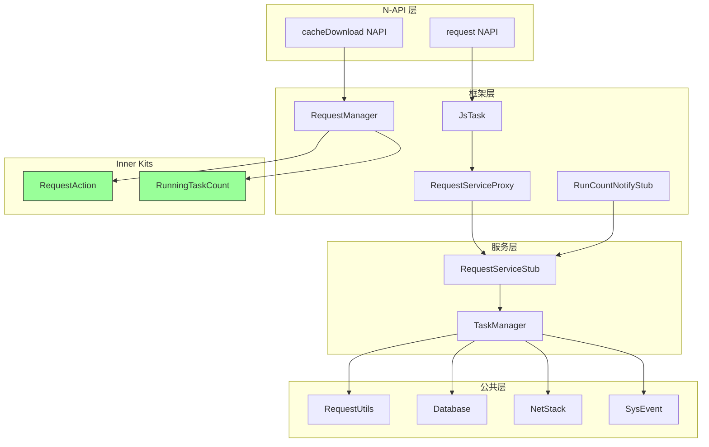

# 内部 API 文档

## 目的

本文档描述 Request 服务内部模块之间的 API 接口和依赖关系。

## 适用范围

- 内部模块间接口
- IPC 接口定义
- 公共 API（Inner Kits）
- 依赖方向和稳定性标注

## 关键结论

1. **三层架构**: N-API 层 → 框架层 → 服务层 → 公共层
2. **IPC 作为边界**: RequestServiceInterface 定义客户端和服务通信契约
3. **Inner Kits**: 定义稳定的公共 API
4. **无环依赖**: 依赖方向严格向下

## IPC 接口

### RequestServiceInterface

**定义文件**: `frameworks/native/request/include/request_service_interface.h`

**描述**: 下载服务 IPC 接口定义，由客户端代理和服务端实现。

**接口方法**:

| 方法 | IPC 命令码 | 描述 | 证据 |
|-------|----------|------|------|
| Create | 0 | 创建任务 | `download_server_ipc_interface_code.h` |
| Pause | 1 | 暂停任务 | 同上 |
| Query | 2 | 查询任务 | 同上 |
| QueryMimeType | 3 | 查询 MIME | 同上 |
| Remove | 4 | 删除任务 | 同上 |
| Resume | 5 | 恢复任务 | 同上 |
| Start | 6 | 启动任务 | 同上 |
| Stop | 7 | 停止任务 | 同上 |
| Show | 8 | 显示任务 | 同上 |
| Touch | 9 | 触摸任务 | 同上 |
| Search | 10 | 搜索任务 | 同上 |
| GetTask | 11 | 获取任务 | 同上 |
| OpenChannel | 13 | 打开通道 | 同上 |
| Subscribe | 14 | 订阅更新 | 同上 |
| Unsubscribe | 15 | 取消订阅 | 同上 |
| SubRunCount | 16 | 订阅运行计数 | 同上 |
| UnsubRunCount | 17 | 取消运行计数 | 同上 |
| CreateGroup | 18 | 创建通知组 | 同上 |
| AttachGroup | 19 | 附加到组 | 同上 |
| DeleteGroup | 20 | 删除组 | 同上 |
| SetMaxSpeed | 21 | 设置最大速度 | 同上 |
| SetMode | 100 | 设置模式 | 同上 |
| DisableTaskNotifications | 101 | 禁用通知 | 同上 |

**服务端实现**:
- `services/src/service/stub.rs` - RequestServiceStub
- `services/src/service/command/*.rs` - 命令处理器

**客户端实现**:
- `frameworks/native/request/include/request_service_proxy.h` - RequestServiceProxy
- `frameworks/native/request/src/request_service_proxy.cpp` - 代理实现

---

### NotifyInterface

**定义文件**: `frameworks/native/request/include/notify_interface.h`

**描述**: 运行计数变更通知接口。

**方法**:

| 方法 | 描述 |
|-------|------|
| OnRunCountChanged(count) | 运行任务数量变更 |
| OnRunCountLimit(count, maxCount) | 达到运行任务上限 |

**实现**:
- 服务端: `services/src/service/run_count/notify.rs`
- 客户端: `frameworks/native/request/src/runcount_notify_stub.cpp`

---

## Inner Kits (公共 API）

### request_action

**定义文件**: `interfaces/inner_kits/request_action/include/request_action.h`

**描述**: 请求操作高级接口，提供文件校验、路径控制等功能。

**类**: RequestAction

| 方法 | 描述 | 稳定性 |
|-------|------|--------|
| GetDownloadDir() | 获取下载目录 | 稳定 |
| GetUploadDir() | 获取上传目录 | 稳定 |
| CheckPath() | 检查路径有效性 | 稳定 |
| SetPathPermission() | 设置路径权限 | 稳定 |

**实现**: `frameworks/native/request_action/src/`

---

### running_count

**定义文件**: `interfaces/inner_kits/running_count/include/running_task_count.h`

**描述**: 运行任务计数查询接口。

**类**: RunningTaskCount

| 方法 | 描述 | 稳定性 |
|-------|------|--------|
| QueryRunningCount() | 查询运行中任务数 | 稳定 |

**实现**: `frameworks/native/request/src/request_running_task_count.cpp`

---

### cache_download (Preload)

**定义文件**: `interfaces/inner_kits/cache_download/`

**子接口**:

#### Preload Native

**文件**: `interfaces/inner_kits/cache_download/native/include/preload_napi.h`

| 方法 | 描述 | 稳定性 |
|-------|------|--------|
| Load() | 加载预下载任务 | 稳定 |
| Cancel() | 取消预下载 | 稳定 |

#### Preload NAPI

**文件**: `interfaces/inner_kits/cache_download/napi/include/preload_napi.h`

| 方法 | 描述 | 稳定性 |
|-------|------|--------|
| RegisterCallback() | 注册回调 | 稳定 |
| UnregisterCallback() | 取消注册 | 稳定 |

---

## 模块依赖关系

### 依赖图



### 依赖方向

| 层级 | 依赖方向 | 原因 |
|-------|----------|------|
| N-API 层 | ↓ 框架层 | 调用框架提供的功能 |
| 框架层 | ↓ Inner Kits | 使用公共 API 进行文件操作 |
| 框架层 | ↓ 服务层（通过 IPC）| 通过 IPC 调用服务 |
| 服务层 | ↓ 公共层 | 使用公共工具和数据库 |
| 公共层 | ×（不依赖上层）| 保持底层独立性 |

---

## 接口稳定性

### 稳定接口（公共 API）

以下接口标记为稳定，对外暴露给第三方应用：

1. **RequestServiceInterface** (`frameworks/native/request/include/request_service_interface.h`)
   - 理由: IPC 接口定义，客户端和服务必须遵循
   - 版本: 通过 IPC 命令码版本控制

2. **RequestAction** (`interfaces/inner_kits/request_action/include/request_action.h`)
   - 理由: Inner Kit，作为框架公共 API
   - 标注: `inner_api` 标签

3. **RunningTaskCount** (`interfaces/inner_kits/running_count/include/running_task_count.h`)
   - 理由: Inner Kit，公共计数接口
   - 标注: `platformsdk` 标签

4. **Preload 接口** (`interfaces/inner_kits/cache_download/`)
   - 理由: Inner Kit，预下载公共 API
   - 标注: `platformsdk` 标签

### 不稳定接口（内部实现）

以下接口仅供内部使用，不保证稳定性：

1. `frameworks/native/*/src/` 的具体实现类
2. `services/src/*/` 的服务实现类
3. `common/*/src/` 的公共模块实现
4. 所有未在 `interfaces/inner_kits/` 目录中的接口

---

## 接口使用示例

### 客户端使用 RequestServiceInterface

```cpp
// 创建代理
std::shared_ptr<RequestServiceProxy> proxy = 
    RequestServiceProxy::GetInstance();

// 调用创建任务
int32_t taskId = proxy->Create(taskInfo);

// 查询任务
auto taskInfo = proxy->Query(taskId);
```

### 服务端实现 IPC 命令

```rust
// 在 stub.rs 中处理 IPC 请求
fn on_remote_request(&self, code: i32, data: &Parcel, reply: &mut Parcel) -> i32 {
    match code {
        CMD_CONSTRUCT => self.handle_construct(data, reply),
        CMD_PAUSE => self.handle_pause(data, reply),
        CMD_QUERY => self.handle_query(data, reply),
        // ... 其他命令
        _ => Err(ErrorCode::InvalidCommand),
    }
}
```

---

## 数据结构

### TaskInfo

**证据**: `frameworks/native/request/include/request_common.h`

```cpp
struct TaskInfo {
    uint32_t tid;
    std::string url;
    std::string bundleName;
    uint32_t action;  // DOWNLOAD or UPLOAD
    uint32_t mode;    // FOREGROUND or BACKGROUND
    std::string saveas;
    // ... 其他字段
};
```

### Config

**证据**: `frameworks/native/request/include/request_common.h`

```cpp
struct Config {
    Action action;
    Mode mode;
    std::string url;
    std::string method;
    std::map<std::string, std::string> headers;
    std::vector<FileSpec> files;
    std::vector<FormItem> forms;
    // ... 其他字段
};
```

---

## 相关跳转

- [架构说明](02_Architecture.md) - 架构和数据流
- [GN Targets](05_GN_Targets.md) - 构建目标
- [对外 N-API](03_NAPI_JS_API.md) - JavaScript API
