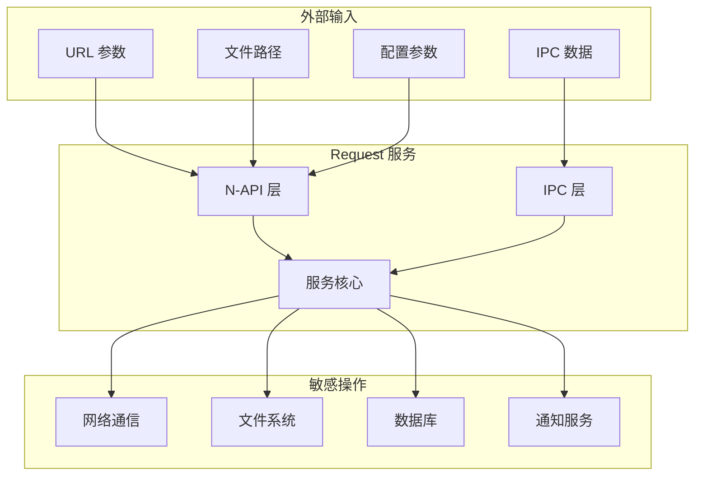
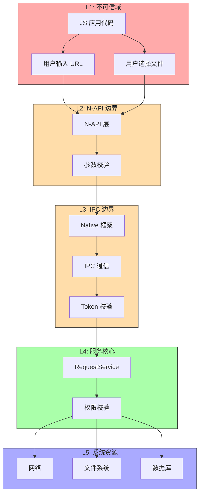

# 05 - 攻击面分析

**文档目的**: 识别所有外部输入入口、敏感操作和信任边界  
**目标受众**: 安全研究员  
**阅读时间**: 约 15 分钟

---

## 攻击面概览



---

## 外部输入清单

### 1. N-API 参数输入

#### 下载配置 (DownloadConfig)

| 字段 | 类型 | 最大长度 | 风险等级 | 验证位置 |
|------|------|----------|----------|----------|
| `url` | string | 8192 bytes | **高** | `task_builder.cpp:232` |
| `header` | object | - | 中 | `js_initialize.cpp` |
| `filePath` | string | PATH_MAX | **高** | `path_utils.cpp` |
| `title` | string | 256 bytes | 低 | `task_builder.cpp:326` |
| `description` | string | 1024 bytes | 低 | `cj_initialize.cpp:53` |
| `proxy` | string | 512 bytes | 中 | `task_builder.cpp:309` |
| `token` | string | 2048 bytes | 中 | `task_builder.cpp:340` |

#### 上传配置 (UploadConfig)

| 字段 | 类型 | 最大数量 | 风险等级 | 验证位置 |
|------|------|----------|----------|----------|
| `files` | array | 100 | **高** | `cj_initialize.cpp:54` |
| `files[].uri` | string | PATH_MAX | **高** | `obtain_file.cpp:97` |
| `data` | array | - | 低 | `js_initialize.cpp` |

### 2. IPC 数据输入

#### IPC 命令码

| 命令码 | 名称 | 风险等级 | 说明 |
|--------|------|----------|------|
| 0 | CONSTRUCT | **高** | 创建任务，携带完整配置 |
| 1 | PAUSE | 中 | 暂停任务，需验证 token |
| 2 | QUERY | 低 | 查询任务 |
| 4 | REMOVE | 中 | 移除任务 |
| 6 | START | 中 | 启动任务 |
| 9 | TOUCH | 低 | 更新任务时间戳 |
| 10 | SEARCH | 低 | 搜索任务 |
| 13 | OPEN_CHANNEL | 中 | 打开通知通道 |
| 14 | SUBSCRIBE | 中 | 订阅任务通知 |

**接口 Token**: `"OHOS.Download.RequestServiceInterface"`

### 3. 文件系统输入

#### 读取操作

| 操作 | 路径来源 | 风险等级 | 代码位置 |
|------|----------|----------|----------|
| 上传文件读取 | `files[].uri` | **高** | `obtain_file.cpp:97` |
| 配置文件读取 | 系统路径 | 中 | `services/src/cxx/bundle.cpp` |
| 证书读取 | 系统路径 | 中 | `request_cert_mgr_adapter.cpp` |

#### 写入操作

| 操作 | 路径来源 | 风险等级 | 代码位置 |
|------|----------|----------|----------|
| 下载文件写入 | `filePath` | **高** | `cj_initialize.cpp:719` |
| 数据库写入 | 固定路径 | 低 | `services/src/manage/database.rs` |
| 缓存写入 | 计算路径 | 中 | `services/src/task/files.rs` |

### 4. 网络输入

| 类型 | 来源 | 风险等级 | 说明 |
|------|------|----------|------|
| HTTP 响应头 | 服务器 | 中 | 解析 Content-Type/Length |
| HTTP 响应体 | 服务器 | 中 | 下载内容 |
| 证书数据 | 服务器 | **高** | TLS 握手 |
| 重定向 URL | 服务器 | **高** | 302/301 跳转 |

---

## 敏感操作清单

### 1. 网络通信

| 操作 | 风险等级 | 代码位置 | 说明 |
|------|----------|----------|------|
| HTTP 请求 | **高** | `services/src/task/download.rs` | 发送 HTTP 请求 |
| HTTPS 连接 | **高** | `services/src/task/download.rs` | TLS 加密通信 |
| 代理连接 | **高** | `services/src/cxx/get_proxy.cpp` | 通过代理服务器 |
| DNS 解析 | 中 | 依赖 netstack | 域名解析 |

### 2. 文件系统操作

| 操作 | 风险等级 | 代码位置 | 说明 |
|------|----------|----------|------|
| 文件创建 | **高** | `cj_initialize.cpp:719` | O_CREAT \| O_RDWR |
| 文件写入 | **高** | `services/src/task/files.rs` | fwrite/write |
| 文件读取 | **高** | `obtain_file.cpp:97` | 上传时读取 |
| 权限修改 | 中 | `cj_initialize.cpp:722` | chmod 设置权限 |
| 路径解析 | **高** | `obtain_file.cpp:97` | realpath 检查 |

### 3. 数据库操作

| 操作 | 风险等级 | 代码位置 | 说明 |
|------|----------|----------|------|
| SQL 执行 | **高** | `services/src/manage/database.rs` | SQLite 操作 |
| 任务插入 | 中 | `services/src/manage/database.rs` | 插入任务记录 |
| 任务查询 | 低 | `services/src/manage/database.rs` | 查询任务状态 |
| 任务删除 | 中 | `services/src/manage/database.rs` | 删除任务记录 |

### 4. 系统服务调用

| 服务 | 操作 | 风险等级 | 代码位置 |
|------|------|----------|----------|
| AccessToken | 权限校验 | **高** | `request_utils.cpp:92` |
| NetStack | 网络请求 | **高** | `services/src/task/download.rs` |
| Notification | 发送通知 | 中 | `services/src/service/notification_bar/` |
| BundleManager | 获取应用信息 | 中 | `services/src/cxx/bundle.cpp` |
| CertificateManager | 获取证书 | **高** | `request_cert_mgr_adapter.cpp` |

### 5. IPC 回调

| 操作 | 风险等级 | 代码位置 | 说明 |
|------|----------|----------|------|
| 进度通知 | 中 | `runcount_notify_stub.cpp:44` | IPC 回调客户端 |
| 状态通知 | 中 | `request_service_interface.h` | 任务状态变更 |

---

## 信任边界

### 边界划分图



### 边界安全机制

#### L1 → L2: JS 到 N-API

| 机制 | 位置 | 说明 |
|------|------|------|
| 参数类型检查 | `js_initialize.cpp` | N-API 类型验证 |
| 长度限制 | `task_builder.cpp:232` | URL 最大 8192 |
| 格式校验 | `task_builder.cpp:237` | URL 正则匹配 |

#### L2 → L3: Native 到 IPC

| 机制 | 位置 | 说明 |
|------|------|------|
| 参数再次校验 | `task_builder.cpp` | 二次校验 |
| 路径规范化 | `obtain_file.cpp:97` | realpath 检查 |

#### L3 → L4: IPC 到服务

| 机制 | 位置 | 说明 |
|------|------|------|
| Interface Token | `runcount_notify_stub.cpp:48` | IPC 接口校验 |
| Caller Token | `request_utils.cpp:92` | 调用者身份 |
| 权限校验 | `permission.rs:37` | 权限检查 |

---

## 数据流与风险点

### 下载任务数据流

```
用户输入 URL
    ↓ [风险: URL 格式/协议/长度]
N-API 参数解析
    ↓ [风险: 类型转换/越界]
URL 校验 (长度 8192, http/https)
    ↓
IPC 序列化
    ↓ [风险: 序列化/反序列化]
服务接收
    ↓
权限校验 (INTERNET)
    ↓ [风险: 权限绕过]
HTTP 请求发送
    ↓ [风险: SSRF/协议走私]
服务器响应
    ↓ [风险: 恶意响应]
文件写入磁盘
    ↓ [风险: 路径遍历]
完成通知
```

### 上传任务数据流

```
用户选择文件
    ↓ [风险: 文件路径/符号链接]
文件路径解析 (realpath)
    ↓ [风险: 路径遍历绕过]
文件权限检查
    ↓
IPC 传输
    ↓
服务读取文件
    ↓ [风险: 文件读取越权]
HTTP POST 发送
    ↓
服务器接收
```

---

## 攻击向量汇总

| 向量 | 入口 | 目标 | 风险等级 |
|------|------|------|----------|
| **URL 注入** | `download(url)` | SSRF、协议走私 | **高** |
| **路径遍历** | `filePath` | 任意文件读写 | **高** |
| **符号链接** | `files[].uri` | 越权文件访问 | **高** |
| **IPC 伪造** | IPC 命令 | 未授权操作 | 中 |
| **权限绕过** | 调用者 Token | 越权任务管理 | 中 |
| **DoS** | 大量任务创建 | 资源耗尽 | 中 |
| **信息泄露** | 错误消息 | 敏感信息暴露 | 低 |

---

## 相关文档

- **漏洞详情**: [06_SecurityReview.md](06_SecurityReview.md)
- **接口定义**: [04_Interface.md](04_Interface.md)
- **架构理解**: [02_Architecture.md](02_Architecture.md)
