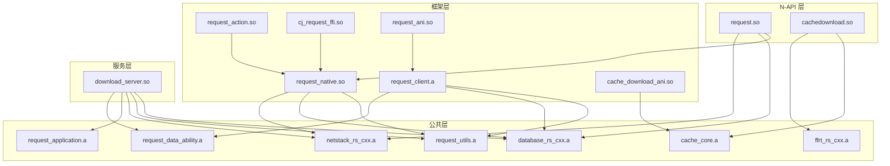

# GN Targets 与编译产物

## 目的

本文档描述 Request 项目的 GN 构建系统配置和编译产物。

## 适用范围

- GN 构建文件（BUILD.gn, .gni）
- 目标类型和依赖关系
- 编译产物和安装路径
- 构建分组

## 关键结论

1. **三组构建**: base_group（N-API），fwk_group（框架），service_group（服务）
2. **多语言混合**: C++、Rust、ArkTS、CJ (Cangjie)
3. **Rust 为主**: 服务层和大部分框架使用 Rust
4. **FFRT 集成**: 通过 ffrt_rs 实现异步任务调度

## 构建分组

### bundle.json 构建定义

**文件**: `bundle.json` (line 72-88)

| 分组 | 目标 | 描述 |
|-------|------|------|
| **base_group** | N-API 模块 | 对外暴露的 JavaScript API |
| **fwk_group** | Native 框架 | 内部框架库 |
| **service_group** | 系统服务 | Download Service 和相关组件 |

---

## 主要 Targets

### 服务层 Targets

**文件**: `services/BUILD.gn`

| Target | 类型 | 输出 | 关键依赖 | 用途 |
|-------|------|--------|------------|------|
| `download_server` | ohos_rust_shared_library | `libdownload_server.so` | `download_server_cxx`, `database_rs`, `request_utils` | 下载服务主实现 |
| `download_language_transfer` | ohos_shared_library | `libdownload_language_transfer.so` | `i18n:intl_util` | 语言传输服务 |

**服务配置**:
- SA ID: 3706 (`etc/sa_profile/3706.json`)
- 库路径: `libdownload_server.dylib.so`
- 启动策略: on-demand
- 回收策略: low-memory

---

### 框架层 Targets

#### Native Request

**文件**: `frameworks/native/request/BUILD.gn`

| Target | 类型 | 输出 | 关键依赖 | 用途 |
|-------|------|--------|------------|------|
| `request_native` | ohos_shared_library | `librequest_native.so` | `request_sysevent` | 请求框架主库 |

#### Native Request Action

**文件**: `frameworks/native/request_action/BUILD.gn`

| Target | 类型 | 输出 | 关键依赖 | 用途 |
|-------|------|--------|------------|------|
| `request_action` | ohos_shared_library | `librequest_action.so` | `request_native` | 请求操作库 |

#### Native Request Next

**文件**: `frameworks/native/request_next/BUILD.gn`

| Target | 类型 | 输出 | 关键依赖 | 用途 |
|-------|------|--------|------------|------|
| `request_client` | ohos_rust_static_library | `librequest_client.a` | `request_core`, `request_utils`, `request_data_ability` | 下一代请求客户端 |

---

### N-API 层 Targets

#### Main Request NAPI

**文件**: `frameworks/js/napi/request/BUILD.gn`

| Target | 类型 | 输出 | 关键依赖 | 安装路径 | 用途 |
|-------|------|--------|------------|----------|------|
| `request` | ohos_shared_library | `librequest.so` | `request_native`, `request_sysevent`, `request_utf8_utils` | `module/` | 主 N-API 模块 |

#### Cache Download NAPI

**文件**: `frameworks/js/napi/cache_download/BUILD.gn`

| Target | 类型 | 输出 | 关键依赖 | 安装路径 | 用途 |
|-------|------|--------|------------|----------|------|
| `cachedownload` | ohos_shared_library | `libcachedownload.so` | `preload_native`, `preload_napi` | `module/request/` | 预下载 N-API 模块 |

#### Preload NAPI

**文件**: `frameworks/js/napi/preload_napi/BUILD.gn`

| Target | 类型 | 输出 | 关键依赖 | 用途 |
|-------|------|--------|------------|------|
| `preload_napi` | ohos_shared_library | `libpreload_napi.so` | `preload_native` | 预下载 NAPI 工具 |

---

### ANI 层 Targets

**文件**: `frameworks/ets/ani/BUILD.gn`

| Target | 类型 | 输出 | 关键依赖 | 安装路径 | 用途 |
|-------|------|--------|------------|----------|------|
| `request_ani` | ohos_rust_shared_library | `librequest_ani.so` | - | `framework/` | Request ANI 模块 |
| `cache_download_ani` | ohos_rust_shared_library | `libcache_download_ani.so` | - | `framework/` | CacheDownload ANI 模块 |

**ABC 文件**:
- `request.abc` - 安装到 `/system/framework/`
- `cache_download.abc` - 安装到 `/system/framework/`

---

### CJ FFI 层 Targets

**文件**: `frameworks/cj/ffi/BUILD.gn`

| Target | 类型 | 输出 | 关键依赖 | 用途 |
|-------|------|--------|------------|------|
| `cj_request_ffi` | ohos_shared_library | `libcj_request_ffi.so` | `request_native`, `request_sysevent` | CJ (Cangjie) FFI 绑定 |

---

### 公共层 Targets

#### Utils

**文件**: `common/utils/BUILD.gn`

| Target | 类型 | 输出 | 用途 |
|-------|------|--------|------|
| `request_utils` | ohos_rust_static_library | `librequest_utils.a` | 请求工具库 |
| `request_application` | ohos_rust_static_library | `librequest_application.a` | 应用状态管理 |
| `request_data_ability` | ohos_rust_static_library | `librequest_data_ability.a` | DataAbility 助手 |

#### Database

**文件**: `common/database/BUILD.gn`

| Target | 类型 | 输出 | 关键依赖 | 用途 |
|-------|------|--------|------------|------|
| `database_rs` | ohos_rust_static_library | `librdb.a` | `database_rs_cxx`, `relational_store`, `rust_cxx` | 数据库封装 |

#### Network Stack

**文件**: `common/netstack_rs/BUILD.gn`

| Target | 类型 | 输出 | 关键依赖 | 用途 |
|-------|------|--------|------------|------|
| `netstack_rs` | ohos_rust_static_library | `libnetstack_rs.a` | `netstack_rs_cxx`, `netmanager_base`, `netstack`, `ffrt_rs`, `request_utils` | 网络栈封装 |

#### FFRT

**文件**: `common/ffrt_rs/BUILD.gn`

| Target | 类型 | 输出 | 关键依赖 | 用途 |
|-------|------|--------|------------|------|
| `ffrt_rs` | ohos_rust_static_library | `libffrt_rs.a` | `ffrt_rs_cxx`, `ffrt`, `rust_cxx` | FFRT 绑定 |

#### Cache Core

**文件**: `frameworks/native/cache_core/BUILD.gn`

| Target | 类型 | 输出 | 关键依赖 | 用途 |
|-------|------|--------|------------|------|
| `cache_core` | ohos_rust_static_library | `libcache_core.a` | `cache_core_cxx`, `ffrt_rs`, `request_utils` | 缓存核心 |

---

## 编译产物

### 主要库文件

| 产物 | 类型 | 位置 | 描述 |
|-------|------|------|------|
| `librequest.so` | N-API 共享库 | `/system/lib/module/` | 主 N-API 模块 |
| `libcachedownload.so` | N-API 共享库 | `/system/lib/module/request/` | 预下载模块 |
| `librequest_native.so` | 框架共享库 | `/system/lib/` | 原生请求框架 |
| `libdownload_server.so` | 服务共享库 | `/system/lib/` | 下载服务 |
| `librequest_ani.so` | ANI 共享库 | `/system/lib/` | Request ANI |
| `libcache_download_ani.so` | ANI 共享库 | `/system/lib/` | CacheDownload ANI |
| `libcj_request_ffi.so` | FFI 共享库 | `/system/lib/` | CJ FFI |

### 静态库文件

| 产物 | 类型 | 描述 |
|-------|------|------|
| `librequest_core.a` | Rust 静态库 | 请求核心类型 |
| `librequest_utils.a` | Rust 静态库 | 请求工具 |
| `libdatabase_rs_cxx.a` | C++ 静态库 | 数据库 CXX 绑定 |
| `libnetstack_rs_cxx.a` | C++ 静态库 | 网络栈 CXX 绑定 |
| `libffrt_rs_cxx.a` | C++ 静态库 | FFRT CXX 绑定 |

---

## 安装路径

### N-API 模块

```
/system/lib/module/
├── librequest.so              -> @ohos.request
└── request/
    └── libcachedownload.so   -> @ohos.request.cacheDownload
```

### 系统库

```
/system/lib/
├── librequest_native.so
├── libdownload_server.so
├── librequest_ani.so
├── libcache_download_ani.so
└── libcj_request_ffi.so
```

### ABC 文件

```
/system/framework/
├── request.abc
└── cache_download.abc
```

### 配置文件

```
/system/etc/init/
└── downloadservice.cfg

/system/profile/
└── 3706.json              (System Ability profile)
```

---

## 依赖关系图



---

## 构建特性

### Rust 特性

- 使用 `rust_cxx` 生成 C++ 绑定
- FFRT (Foundation Framework Runtime) 集成
- 异步任务调度
- 错误处理使用 `anyhow` 和 `thiserror`

### C++ 特性

- 使用 N-API 1.x 接口
- CXX Rust 互操作
- 异步回调机制
- 事件监听器管理

### ANI 特性

- ArkTS Native Interface
- 支持 API10+ 的同步方法
- ABC (Application Binary Interface) 文件

---

## 运行时加载关系

```
应用启动
  ↓
加载 librequest.so (@ohos.request)
  ↓
加载 librequest_native.so
  ↓
连接到 download_server (SA 3706)
  ↓
通过 IPC 通信
  ↓
加载公共库 (database, netstack, ffrt)
  ↓
执行下载/上传任务
```

---

## 相关跳转

- [目录结构](01_Directory_Structure.md) - 模块职责
- [内部 API](04_Inner_API.md) - 模块接口
- [编译产物](06_Build_Artifacts.md) - 产物详情
