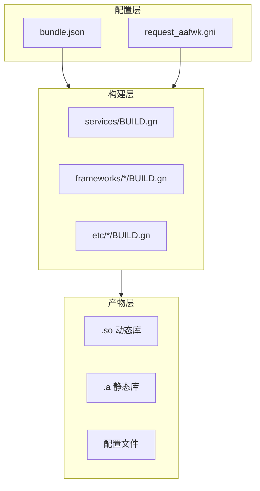
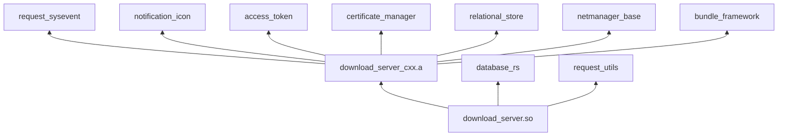
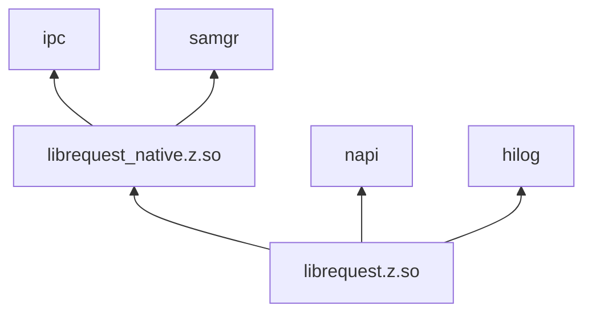

# 07 - 构建与产物

**文档目的**: 说明 GN 构建配置、编译产物和 Feature 开关  
**目标受众**: 工程开发者  
**阅读时间**: 约 10 分钟

---

## 构建系统概览



---

## GN 构建目标

### 服务层目标

| Target | 类型 | 产物 | 安装路径 | 代码位置 |
|--------|------|------|----------|----------|
| `download_server` | shared_library | libdownload_server.dylib.so | /system/lib/ | `services/BUILD.gn:130` |
| `download_server_cxx` | static_library | libdownload_server_cxx.a | - | `services/BUILD.gn:41` |
| `download_language_transfer` | shared_library | libdownload_language_transfer.so | /system/lib/ | `services/BUILD.gn:168` |

### 框架层目标

| Target | 类型 | 产物 | 安装路径 | 代码位置 |
|--------|------|------|----------|----------|
| `request` | shared_library | librequest.z.so | /system/lib/module/ | `frameworks/js/napi/request/BUILD.gn` |
| `request_static` | static_library | librequest_static.a | - | `frameworks/js/napi/request/BUILD.gn` |
| `request_native` | shared_library | librequest_native.z.so | /system/lib/ | `frameworks/native/request/BUILD.gn` |
| `request_action` | shared_library | librequest_action.z.so | /system/lib/ | `frameworks/native/request_action/BUILD.gn` |
| `preload_napi` | shared_library | libpreload_napi.z.so | /system/lib/module/ | `frameworks/js/napi/preload_napi/BUILD.gn` |
| `cj_request_ffi` | shared_library | libcj_request_ffi.so | /system/lib/ | `frameworks/cj/ffi/BUILD.gn` |

### 配置目标

| Target | 类型 | 产物 | 安装路径 | 代码位置 |
|--------|------|------|----------|----------|
| `downloadservice.cfg` | config | downloadservice.cfg | /system/etc/init/ | `etc/init/BUILD.gn` |
| `download_sa_profiles` | config | 3706.json | /system/profile/ | `etc/sa_profile/BUILD.gn` |

---

## 构建组（Build Groups）

### 从 bundle.json 提取

```json
{
  "build": {
    "group_type": {
      "base_group": [
        "//base/request/request/frameworks/js/napi/request:request",
        "//base/request/request/frameworks/cj/ffi:cj_request_ffi",
        "//base/request/request/frameworks/ets/ani:ani_package",
        "//base/request/request/frameworks/js/napi/cache_download:cachedownload"
      ],
      "fwk_group": [
        "//base/request/request/frameworks/native/request:request_native"
      ],
      "service_group": [
        "//base/request/request/etc/init:downloadservice.cfg",
        "//base/request/request/etc/sa_profile:download_sa_profiles",
        "//base/request/request/services:download_server",
        "//base/request/request/services:download_language_transfer"
      ]
    }
  }
}
```

### 构建组说明

| 构建组 | 用途 | 包含组件 |
|--------|------|----------|
| **base_group** | 基础 API 层 | N-API、Cangjie FFI、ArkTS ANI、Cache Download |
| **fwk_group** | 框架层 | Native 客户端库 |
| **service_group** | 服务层 | SA 配置、Init 配置、服务主程序 |

---

## Feature 开关

### request_aafwk.gni

```gn
# Feature flags for request component
declare_args() {
  # Enable telephony core service integration
  request_telephony_core_service = true
  
  # Enable telephony cellular data integration
  request_telephony_cellular_data = true
}
```

### 条件编译

| Feature | 默认 | 说明 | 代码位置 |
|---------|------|------|----------|
| `REQUEST_TELEPHONY_CORE_SERVICE` | true | 电话核心服务集成 | `services/BUILD.gn:118-124` |
| `REQUEST_ENABLE_SETNET` | platform | Watch/Glasses 平台启用 | `services/BUILD.gn:113-116` |
| `oh` | 启用 | Rust feature flag | `services/BUILD.gn:142` |

### Feature 使用示例

```gn
# services/BUILD.gn:113-124
if (target_platform == "watch" || target_platform == "glasses") {
  defines += [ "REQUEST_ENABLE_SETNET" ]
}

if (request_telephony_core_service && request_telephony_cellular_data) {
  external_deps += [
    "cellular_data:tel_cellular_data_api",
    "core_service:tel_core_service_api",
  ]
  defines += [ "REQUEST_TELEPHONY_CORE_SERVICE" ]
}
```

---

## 编译产物详情

### 1. libdownload_server.dylib.so

**类型**: Rust Shared Library  
**源码**: `services/src/lib.rs`  
**依赖**:
- `download_server_cxx` (static)
- `database_rs` (static)
- `request_utils` (static)
- External: `hilog`, `ipc_rust`, `samgr_rust`, `netstack`, `ylong_runtime`

**导出符号**: 控制文件 `libdownload_server.map`

### 2. librequest.z.so

**类型**: C++ Shared Library (N-API)  
**源码**: `frameworks/js/napi/request/src/*.cpp`  
**关键源文件**:
- `request_module.cpp` - 模块注册
- `js_task.cpp` - Task 实现
- `js_initialize.cpp` - 参数校验
- `upload/obtain_file.cpp` - 文件处理

**依赖**:
- `request_native` (shared)
- External: `napi`, `hilog`, `ipc`

### 3. librequest_native.z.so

**类型**: C++ Shared Library  
**源码**: `frameworks/native/request/src/*.cpp`  
**关键功能**:
- IPC Proxy 实现
- 任务管理
- 消息处理

**依赖**:
- External: `ipc`, `samgr`, `hilog`

---

## 依赖关系

### 服务层依赖



### 框架层依赖



---

## 安全配置

### Sanitize 配置

```gn
# services/BUILD.gn:41-49
sanitize = {
  integer_overflow = true    # 整数溢出检查
  ubsan = true              # 未定义行为检查
  boundary_sanitize = true  # 边界检查
  cfi = true                # 控制流完整性
  cfi_cross_dso = true      # 跨 DSO CFI
  debug = false
}
stack_protector_ret = true    # 栈保护
```

### 安全特性

| 特性 | 状态 | 说明 |
|------|------|------|
| Integer Overflow Sanitizer | ✅ 启用 | 检测整数溢出 |
| UBSan | ✅ 启用 | 检测未定义行为 |
| Boundary Sanitize | ✅ 启用 | 检测数组越界 |
| CFI | ✅ 启用 | 控制流完整性保护 |
| Stack Protector | ✅ 启用 | 栈溢出保护 |

---

## 安装路径

### 产物安装映射

| 产物 | 源路径 | 目标路径 |
|------|--------|----------|
| libdownload_server.dylib.so | `services/` | `/system/lib/` |
| libdownload_language_transfer.so | `services/` | `/system/lib/` |
| librequest.z.so | `frameworks/js/napi/request/` | `/system/lib/module/` |
| librequest_native.z.so | `frameworks/native/request/` | `/system/lib/` |
| librequest_action.z.so | `frameworks/native/request_action/` | `/system/lib/` |
| downloadservice.cfg | `etc/init/` | `/system/etc/init/` |
| 3706.json | `etc/sa_profile/` | `/system/profile/` |

---

## 构建命令示例

### 完整构建

```bash
# 构建所有目标
gn gen out --args='target_os="ohos" target_cpu="arm64"'
ninja -C out //base/request/request/services:download_server
ninja -C out //base/request/request/frameworks/js/napi/request:request
ninja -C out //base/request/request/frameworks/native/request:request_native
```

### 单独构建服务

```bash
ninja -C out //base/request/request/services:download_server
```

### 单独构建 N-API

```bash
ninja -C out //base/request/request/frameworks/js/napi/request:request
```

---

## 相关文档

- **代码地图**: [03_CodeMap.md](03_CodeMap.md)
- **内部实现**: [08_Internals.md](08_Internals.md)
