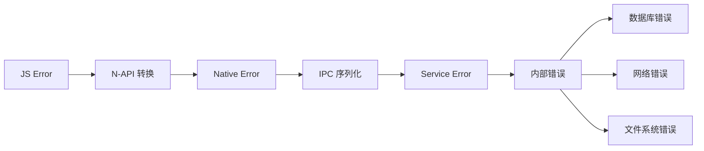

# 08 - 内部实现细节

**文档目的**: 深入核心类/结构体职责、内部 API 和资源生命周期  
**目标受众**: 工程开发者  
**阅读时间**: 约 15 分钟

---

## 核心类/结构体

### 服务层 (Rust)

#### RequestServiceStub

**文件**: `services/src/service/stub.rs`

```rust
pub struct RequestServiceStub {
    task_manager: Arc<RwLock<TaskManager>>,
    sa_handler: Arc<RwLock<SaHandler>>,
    client_manager: Arc<RwLock<ClientManager>>,
    run_count_manager: Arc<RwLock<RunCountManager>>,
    active_counter: ActiveCounter,
}
```

**职责**:
- IPC 请求入口 (`on_remote_request`)
- 命令分发到对应处理器
- 管理各子系统生命周期

**关键方法**:
- `on_remote_request()` - 处理所有 IPC 请求
- `construct_task()` - 创建任务
- `start_task()` - 启动任务
- `pause_task()` - 暂停任务

#### TaskManager

**文件**: `services/src/manage/task_manager.rs`

**职责**:
- 任务生命周期管理
- 任务状态机维护
- 任务持久化协调

**状态机**:
```
INITIALIZED → WAITING → RUNNING → COMPLETED
                  ↓        ↓
               PAUSED   FAILED/RETRYING
```

#### Scheduler

**文件**: `services/src/manage/scheduler/mod.rs`

**职责**:
- 任务调度策略
- 队列管理
- QoS 控制

**组件**:
- `QueueKeeper` - 队列管理
- `StateRecorder` - 状态记录
- `QosManager` - QoS 策略

### N-API 层 (C++)

#### JsTask

**文件**: `frameworks/js/napi/request/include/js_task.h`

```cpp
class JsTask {
public:
    static napi_value JsDownload(napi_env env, napi_callback_info info);
    static napi_value JsUpload(napi_env env, napi_callback_info info);
    static napi_value JsCreate(napi_env env, napi_callback_info info);
    static napi_value GetTask(napi_env env, napi_callback_info info);
    static napi_value Remove(napi_env env, napi_callback_info info);
    // ...
};
```

**职责**:
- JS API 实现
- 参数解析与校验
- Promise/Callback 处理

### Native 框架层 (C++)

#### RequestServiceProxy

**文件**: `frameworks/native/request/include/request_service_proxy.h`

```cpp
class RequestServiceProxy : public IRemoteProxy<RequestServiceInterface> {
public:
    int32_t Create(const Config &config, int32_t &taskId) override;
    int32_t Start(int32_t taskId) override;
    int32_t Pause(int32_t taskId, const std::string &token) override;
    // ...
};
```

**职责**:
- IPC 客户端代理
- 参数序列化
- 连接管理

---

## 内部 API 契约

### 稳定接口

| 接口 | 位置 | 稳定性 | 说明 |
|------|------|--------|------|
| `RequestServiceInterface` | `frameworks/native/request/include/request_service_interface.h` | 稳定 | IPC 接口定义 |
| `TaskManager::create_task()` | `services/src/manage/task_manager.rs` | 稳定 | 任务创建 |
| `CheckPermission()` | `services/src/cxx/request_utils.cpp:92` | 稳定 | 权限检查 |

### 内部实现细节

| 接口 | 位置 | 稳定性 | 说明 |
|------|------|--------|------|
| `TaskManager::scheduler_loop()` | `services/src/manage/scheduler/` | 不稳定 | 调度器实现细节 |
| `DownloadTask::download_chunk()` | `services/src/task/download.rs` | 不稳定 | 下载分片实现 |
| `Database::execute_sql()` | `services/src/manage/database.rs` | 不稳定 | SQL 执行细节 |

---

## 资源生命周期

### Task 生命周期

```mermaid
stateDiagram-v2
    [*] --> Created: JsTask::JsCreate
    
    state Created {
        [*] --> Validating: 参数校验
        Validating --> IPC_Creating: 校验通过
        Validating --> Error: 校验失败
    }
    
    Created --> IPC_Creating: IPC SendRequest
    
    state IPC_Creating {
        [*] --> Serializing: 序列化
        Serializing --> Sending: 发送
        Sending --> Waiting: 等待响应
    }
    
    IPC_Creating --> Service_Creating: 跨进程
    
    state Service_Creating {
        [*] --> Permission_Check: 权限校验
        Permission_Check --> Db_Insert: 通过
        Permission_Check --> Error: 失败
        Db_Insert --> Task_Init: 插入成功
        Db_Insert --> Error: 插入失败
        Task_Init --> [*]
    }
    
    Service_Creating --> Active: 返回 TaskID
    
    state Active {
        [*] --> Waiting: 加入队列
        Waiting --> Running: 调度器启动
        Running --> Paused: pause()
        Paused --> Running: resume()
        Running --> Retrying: 网络错误
        Retrying --> Running: 重试成功
    }
    
    Active --> Completed: 成功
    Active --> Failed: 失败/停止
    
    Completed --> Cleaned: remove()
    Failed --> Cleaned: remove()
    Error --> Cleaned: 清理
    
    Cleaned --> [*]: 资源释放
```

### 资源 Owner 关系

| 资源 | Owner | 创建时机 | 释放时机 |
|------|-------|----------|----------|
| Task 对象 | TaskManager | IPC CONSTRUCT | IPC REMOVE / 完成 |
| 数据库连接 | RequestDb | 服务启动 | 服务停止 |
| IPC Channel | ClientManager | IPC OPEN_CHANNEL | 断开/移除 |
| 文件句柄 | DownloadTask/UploadTask | 任务启动 | 任务完成/失败 |
| 网络连接 | NetworkAdapter | 任务运行 | 任务完成/失败 |

### 内存管理

#### Rust 侧

```rust
// Task 使用 Arc<RwLock<>> 共享所有权
pub struct TaskManager {
    tasks: HashMap<u32, Arc<RwLock<Task>>>,
}

// 自动释放：当最后一个 Arc 被 drop
impl Drop for Task {
    fn drop(&mut self) {
        // 清理资源
        self.cleanup();
    }
}
```

#### C++ 侧

```cpp
// JsTask 使用智能指针管理
class JsTask {
private:
    std::shared_ptr<RequestManager> requestManager_;
    std::unique_ptr<ListenerList> listenerList_;
};

// IPC 对象引用计数
sptr<RequestServiceInterface> proxy_;
```

---

## 并发模型

### 线程安全

| 组件 | 线程安全机制 | 说明 |
|------|-------------|------|
| TaskManager | `RwLock` | 读写锁保护任务集合 |
| Database | `Mutex` | 互斥锁保护连接 |
| ClientManager | `Mutex` | 互斥锁保护客户端集合 |
| Scheduler | `FFRT` | 任务队列 + 工作线程 |

### 锁粒度

```rust
// services/src/manage/task_manager.rs
impl TaskManager {
    pub fn get_task(&self, task_id: u32) -> Option<Arc<RwLock<Task>>> {
        // 读锁，允许多个并发读
        let tasks = self.tasks.read().unwrap();
        tasks.get(&task_id).cloned()
    }
    
    pub fn insert_task(&mut self, task: Task) {
        // 写锁，独占访问
        let mut tasks = self.tasks.write().unwrap();
        tasks.insert(task.id, Arc::new(RwLock::new(task)));
    }
}
```

### 死锁避免

1. **锁顺序**: 始终按固定顺序获取锁
   - TaskManager → Database → ClientManager

2. **锁超时**: 使用 try_lock 避免无限等待

3. **无锁结构**: 使用 `Arc` 共享只读数据

---

## 错误处理

### 错误传播



### 错误码映射

| 内部错误 | Service 错误 | N-API 错误 | JS 错误 |
|----------|-------------|------------|---------|
| PermissionDenied | -1 | -1 | EXCEPTION_PERMISSION |
| InvalidParam | -2 | -2 | EXCEPTION_PARAMCHECK |
| FileNotFound | -4 | -4 | EXCEPTION_FILEIO |
| NetworkError | -6 | -6 | EXCEPTION_SERVICE |
| DatabaseError | -7 | -7 | EXCEPTION_OTHERS |

---

## 性能考虑

### 热点路径

| 操作 | 优化策略 | 代码位置 |
|------|----------|----------|
| 任务创建 | 连接池、批量插入 | `database.rs` |
| 进度通知 | 批量聚合、节流 | `notifier.rs` |
| 文件写入 | 缓冲、异步 IO | `files.rs` |
| 网络读取 | 连接复用、Pipeline | `download.rs` |

### 资源池

```rust
// 数据库连接池
pub struct RequestDb {
    pool: r2d2::Pool<SqliteConnectionManager>,
}

// 网络连接池（由 netstack 管理）
pub struct NetworkManager {
    client: Arc<HttpClient>,
}
```

---

## 调试与诊断

### 日志标签

| 标签 | 用途 | 代码位置 |
|------|------|----------|
| `RequestService` | 服务主日志 | `services/src/lib.rs:61` |
| `RequestNAPI` | N-API 日志 | `frameworks/js/napi/request/src/` |
| `RequestNative` | Native 框架日志 | `frameworks/native/request/src/` |

### Trace 点

```rust
// services/src/trace.rs
#[trace]
pub fn task_create(task_id: u32) {
    // 记录任务创建事件
}

#[trace]
pub fn task_complete(task_id: u32, duration: Duration) {
    // 记录任务完成事件
}
```

### Dump 信息

```rust
// services/src/service/command/dump.rs
pub fn dump_info() -> String {
    format!(
        "Task Count: {}\nActive Tasks: {}\nQueue Length: {}",
        task_count, active_count, queue_len
    )
}
```

---

## 相关文档

- **代码地图**: [03_CodeMap.md](03_CodeMap.md)
- **架构说明**: [02_Architecture.md](02_Architecture.md)
- **构建配置**: [07_Build.md](07_Build.md)
