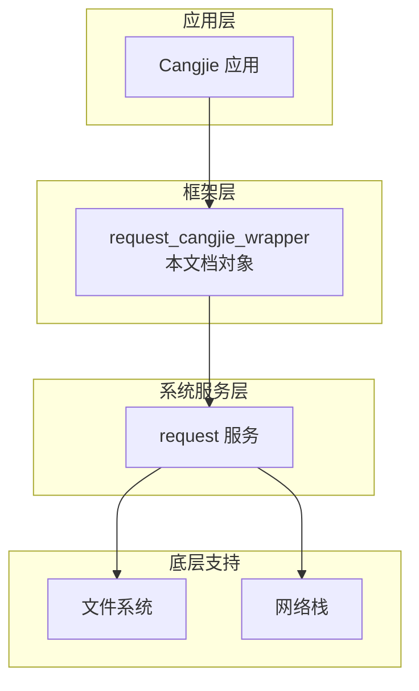
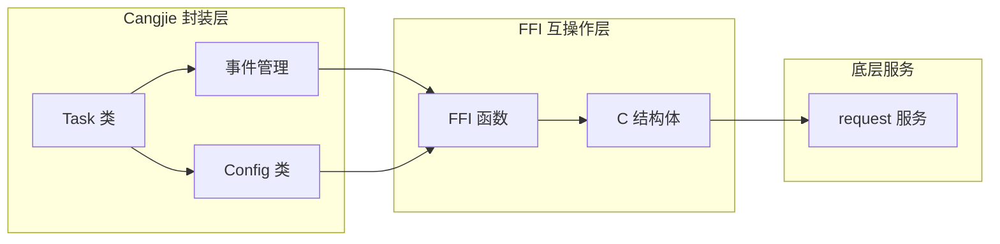
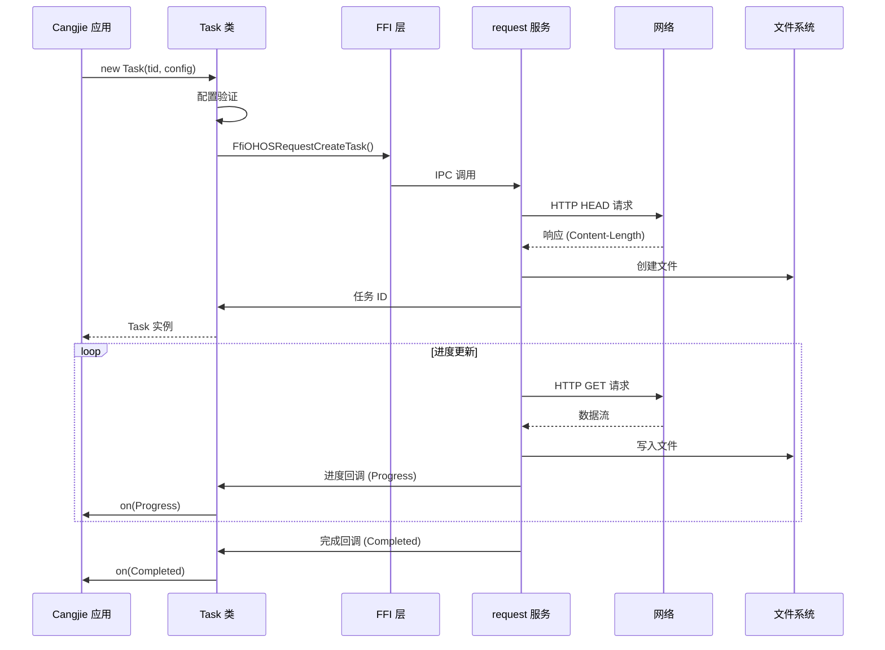
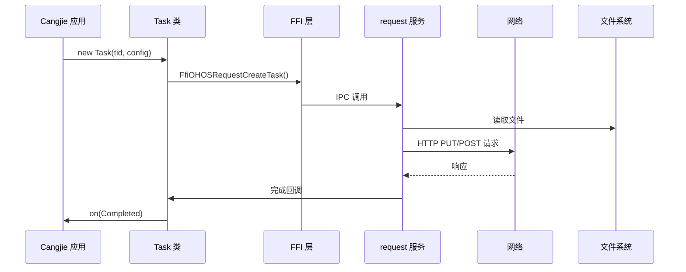
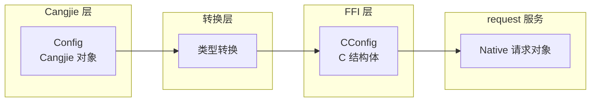
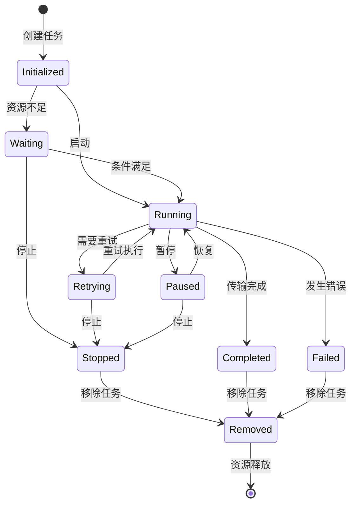
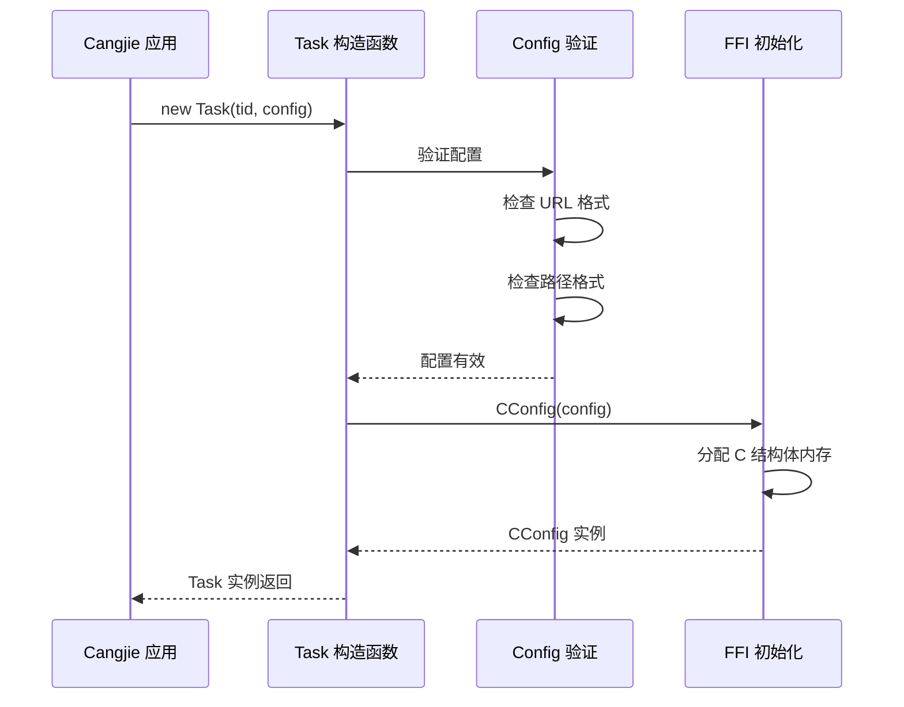
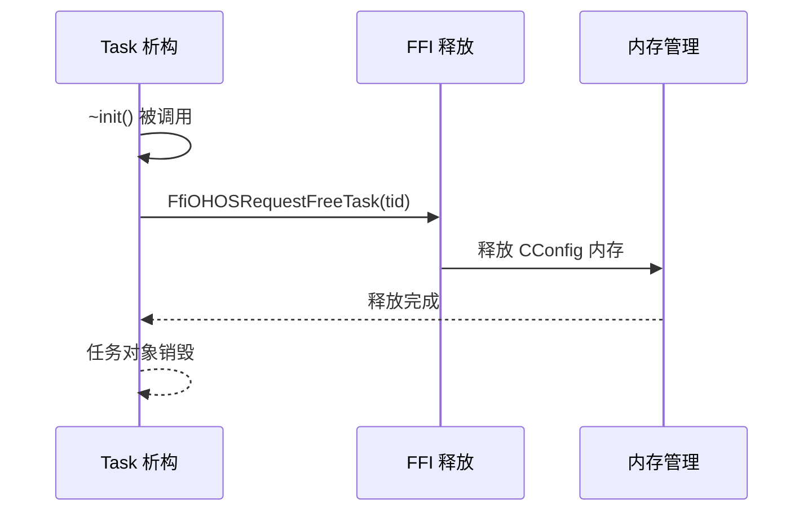

# 架构设计

本文档描述 `request_cangjie_wrapper` 的整体架构设计，包括组件划分、数据流、线程模型和关键时序。

---

## 2.1 组件图

### 系统架构概览



### 组件依赖关系



### 组件职责

| 组件 | 职责 | 证据来源 |
|------|------|----------|
| **Task** | 任务生命周期管理、事件订阅 | agent.cj:1661 |
| **Config** | 任务配置存储与验证 | agent.cj:578 |
| **EventManage** | 事件回调的注册与分发 | agent.cj:1622 |
| **FFI 层** | C ↔ Cangjie 类型转换与函数调用 | ffi.cj:1 |
| **request 服务** | 底层网络请求与文件操作 | README.md:28 |

---

## 2.2 数据流

### 下载任务数据流



### 上传任务数据流



### 数据结构转换



**证据来源**:
- agent.cj:907: `init(v: CConfig)` - C 到 Cangjie 转换
- ffi.cj:421: `init(config: Config)` - Cangjie 到 C 转换

---

## 2.3 线程模型

### 线程角色

| 线程类型 | 职责 | 证据来源 |
|----------|------|----------|
| **主线程** | Task 创建、配置、API 调用 | Task.init (agent.cj:1690) |
| **FFI 线程** | C ↔ Cangjie 数据转换 | ffi.cj:468 (asResource) |
| **回调线程** | 事件分发、回调执行 | agent.cj:1622 (Mutex) |
| **request 服务线程** | 网络请求、文件IO | 底层服务管理 |

### 线程安全机制

```cj
class EventManage {
    let eventMap: HashMap<EventCallbackType, RequestEvent>
    let mutex: Mutex  // 保护 eventMap

    func getOrCreate(eventName: EventCallbackType): RequestEvent {
        synchronized(mutex) {  // 线程安全的访问
            if (let Some(v) <- eventMap.get(eventName)) {
                return v
            }
            let event = RequestEvent()
            eventMap.add(eventName, event)
            event
        }
    }
}
```

**证据来源**:
- agent.cj:1632: `synchronized(mutex)` - 互斥锁保护

```cj
class RequestEvent {
    let callbackList: ArrayList<(CallbackObject, Int64)>
    let callBackMutex: Mutex  // 保护 callbackList

    func on(callback: CallbackObject, id: Int64): Unit {
        synchronized(callBackMutex) {  // 线程安全的注册
            callbackList.add((callback, id))
        }
    }
}
```

**证据来源**:
- agent.cj:1588: `synchronized(callBackMutex)` - 互斥锁保护

### 资源释放

```cj
~init() {
    unsafe {
        try (cTid = LibC.mallocCString(tid).asResource()) {
            FfiOHOSRequestFreeTask(cTid.value)  // 释放 native 资源
        }
    }
}
```

**证据来源**:
- agent.cj:1696-1702: 析构函数中释放任务资源

---

## 2.4 生命周期

### Task 生命周期状态机



### 状态定义

| 状态 | 值 | 说明 | 证据来源 |
|------|------|------|----------|
| Initialized | 0x00 | 已创建，等待启动 | agent.cj:950 |
| Waiting | 0x10 | 等待资源/条件 | agent.cj:958 |
| Running | 0x20 | 正在执行 | agent.cj:968 |
| Retrying | 0x21 | 重试中 | agent.cj:977 |
| Paused | 0x30 | 已暂停 | agent.cj:986 |
| Stopped | 0x31 | 已停止 | agent.cj:995 |
| Completed | 0x40 | 已完成 | agent.cj:1004 |
| Failed | 0x41 | 已失败 | agent.cj:1013 |
| Removed | 0x50 | 已移除 | agent.cj:1022 |

### 初始化流程



### 销毁流程



---

## 2.5 错误处理

### 错误码体系

| 错误码 | 常量名 | 含义 | 证据来源 |
|--------|--------|------|----------|
| 13400001 | EXCEPTION_FILEIO | 文件 IO 错误 | agent.cj:31 |
| 13400002 | EXCEPTION_FILEPATH | 路径错误 | agent.cj:32 |
| 13400003 | EXCEPTION_SERVICE | 服务错误 | agent.cj:33 |
| 13499999 | EXCEPTION_OTHERS | 其他错误 | agent.cj:34 |

### 失败原因

| 原因 | 值 | 含义 | 证据来源 |
|------|------|------|----------|
| Others | 0xFF | 其他 | agent.cj:1205 |
| Disconnected | 0x00 | 网络断开 | agent.cj:1214 |
| Timeout | 0x10 | 超时 | agent.cj:1223 |
| Protocol | 0x20 | 协议错误 | agent.cj:1232 |
| Fsio | 0x40 | 文件系统 IO | agent.cj:1244 |

---

## 2.6 架构约束

### 调用约束

1. **必须在主线程创建 Task**: Task 实例必须在调用者线程创建
2. **回调在服务线程执行**: 事件回调由 request 服务线程调用
3. **资源成对释放**: malloc/ free 需要配对

### 性能约束

| 指标 | 限制 | 说明 |
|------|------|------|
| URL 最大长度 | 8192 字符 | agent.cj:590 |
| 标题最大长度 | 256 字符 | agent.cj:599 |
| 描述最大长度 | 1024 字符 | agent.cj:609 |

---

## 2.7 扩展机制

### 扩展字段

```cj
public var extras: HashMap<String, String>  // Config 扩展
public var extras: HashMap<String, String>  // FileSpec 扩展
```

### 自定义事件

- 支持通过 `extras` 传递自定义数据
- 通过 `Config.token` 实现任务隔离
- 通过 `Progress.extras` 获取运行时信息
