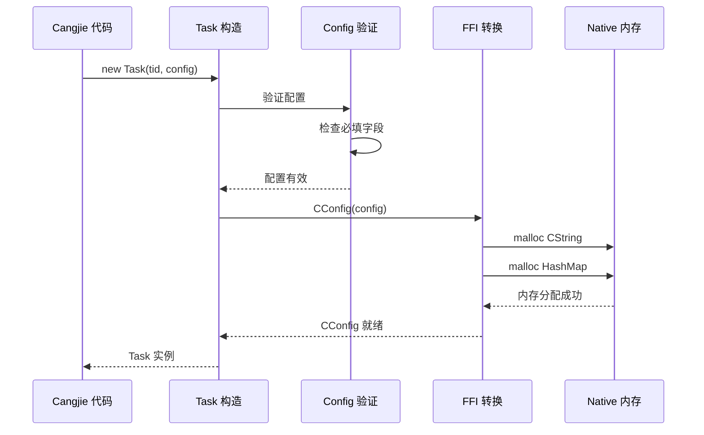
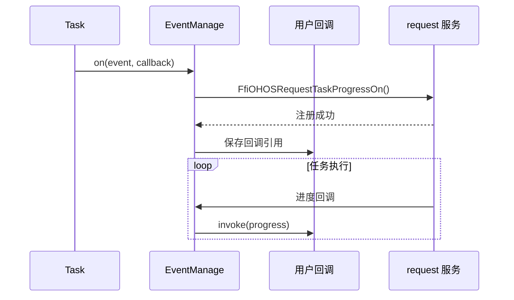
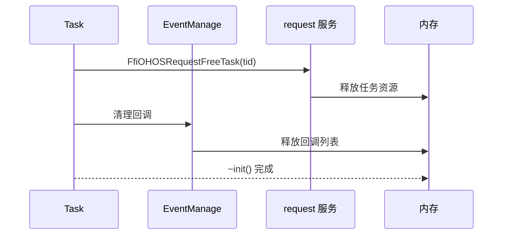

# 内部实现

本文档描述 `request_cangjie_wrapper` 的内部实现细节，包括核心类设计、资源生命周期和内部 API。

---

## 8.1 核心类设计

### Task 类内部结构

**文件**: `ohos/request/agent.cj:1661`

```cj
public class Task {
    // 公开属性
    public let tid: String
    public var config: Config

    // 私有属性
    private let eventMng_: EventManage

    // 析构函数
    ~init() {
        unsafe {
            try (cTid = LibC.mallocCString(tid).asResource()) {
                FfiOHOSRequestFreeTask(cTid.value)
            }
        }
    }
}
```

**设计特点**:
- `tid` 不可变，确保任务标识稳定
- `config` 可变，允许运行时修改
- `eventMng_` 私有，封装事件管理逻辑

---

### Config 类内部结构

**文件**: `ohos/request/agent.cj:578`

```cj
public class Config {
    // 核心配置
    public var action: Action
    public var url: String
    public var saveas: String

    // 可选配置
    public var title: ?String
    public var method: ?String
    public var headers: HashMap<String, String>
    public var data: ?ConfigData

    // 高级配置
    public var network: Network
    public var metered: Bool
    public var roaming: Bool
    public var retry: Bool
    public var redirect: Bool

    // 断点续传配置
    public var index: UInt32
    public var begins: Int64
    public var ends: Int64

    // 安全配置
    public var token: ?String
    public var priority: UInt32

    // 扩展
    public var extras: HashMap<String, String>
}
```

---

## 8.2 内部 API 契约

### 稳定接口

| 接口 | 稳定性 | 说明 |
|------|--------|------|
| Task 公共方法 | 稳定 | 对外 API |
| Config 公共字段 | 稳定 | 对外 API |
| 事件回调签名 | 稳定 | 对外 API |

### 内部实现 (不稳定)

| 接口 | 访问级别 | 说明 |
|------|----------|------|
| EventManage | internal | 可能变更 |
| RequestEvent | internal | 可能变更 |
| @Hide 类 | 隐藏 | 禁止使用 |

---

## 8.3 资源生命周期

### 创建阶段



### 使用阶段



### 销毁阶段



---

## 8.4 回调管理机制

### RequestEvent 类

**文件**: `ohos/request/agent.cj:1572`

```cj
class RequestEvent {
    let callbackList: ArrayList<(CallbackObject, Int64)>
    let callBackMutex: Mutex

    func off(target: CallbackObject): Unit {
        synchronized(callBackMutex) {
            callbackList.removeIf({callback => refEq(callback[0], target)})
        }
    }

    func on(callback: CallbackObject, id: Int64): Unit {
        synchronized(callBackMutex) {
            callbackList.add((callback, id))
        }
    }

    func clear(): Unit {
        synchronized(callBackMutex) {
            callbackList.clear()
        }
    }
}
```

### EventManage 类

**文件**: `ohos/request/agent.cj:1622`

```cj
class EventManage {
    let eventMap: HashMap<EventCallbackType, RequestEvent>
    let mutex: Mutex

    init() {
        eventMap = HashMap<EventCallbackType, RequestEvent>()
        mutex = Mutex()
    }

    func getOrCreate(eventName: EventCallbackType): RequestEvent {
        synchronized(mutex) {
            if (let Some(v) <- eventMap.get(eventName)) {
                return v
            }
            let event = RequestEvent()
            eventMap.add(eventName, event)
            event
        }
    }

    func remove(eventName: EventCallbackType) {
        synchronized(mutex) {
            eventMap.remove(eventName)
        }
    }
}
```

**设计特点**:
- 懒加载: 事件回调按需创建
- 线程安全: Mutex 保护并发访问
- 引用计数: 使用 callbackId 管理回调生命周期

---

## 8.5 FFI 互操作

### 类型转换机制

#### C → Cangjie

```cj
init(v: CConfig) {
    this.action = Action.parse(v.action)
    this.url = v.url.toString()
    this.title = v.title.toStringOption()
    this.mode = Mode.toMode(v.mode)
    this.headers = v.headers.toHashMap()
    // ...
}
```

**转换规则**:
| C 类型 | Cangjie 类型 | 转换函数 |
|--------|--------------|----------|
| CString | String | toString() |
| CString | ?String | toStringOption() |
| CHashStrArr | HashMap | toHashMap() |
| UInt32 | Enum | parse()/toMode() |

#### Cangjie → C

```cj
init(config: Config) {
    unsafe {
        this.url = LibC.mallocCString(config.url)
    }
    this.headers = CHashStrArr(config.headers)
    // ...
}

func free(): Unit {
    unsafe {
        LibC.free(url)
        headers.free()
    }
}
```

**转换规则**:
| Cangjie 类型 | C 类型 | 转换函数 |
|--------------|--------|----------|
| String | CString | LibC.mallocCString() |
| HashMap | CHashStrArr | CHashStrArr() |
| Enum | UInt32 | .value |

---

## 8.6 内存管理

### RAII 模式

```cj
func asResource(): CTypeResource<CConfig> {
    CTypeResource<CConfig>(this, free)
}

~init() {
    this.free()  // 自动释放
}
```

### 异常安全

```cj
init(config: Config) {
    try {
        unsafe {
            this.url = LibC.mallocCString(config.url)
            this.headers = CHashStrArr(config.headers)
        }
    } catch (e: Exception) {
        unsafe { LibC.free(url) }
        headers.free()
        throw e
    }
}
```

---

## 8.7 错误处理内部

### 错误传播

```cj
func getErrorMsg(err: RetError): String {
    if (err.errMsg.isNull()) {
        return getErrorMsg(err.errCode)
    }
    err.errMsg.toString()
}

func getErrorMsg(code: Int32): String {
    if (let Some(v) <- getUniversalErrorMsg(code)) {
        return v
    } else if (ERROR_CODE_MAP.contains(code)) {
        return ERROR_CODE_MAP[code]
    } else {
        return "Unknown error code ${code}"
    }
}
```

---

## 8.8 性能考量

### 回调频率

- 进度回调频率由 request 服务控制
- 本层仅做转发，不做节流
- 建议: 应用层自行做节流处理

### 内存占用

| 资源 | 占用 | 说明 |
|------|------|------|
| Config 实例 | ~1KB | 配置数据 |
| CConfig 临时 | ~2KB | FFI 转换 |
| 回调列表 | 可变 | 按注册数量 |

---

## 8.9 扩展机制

### 自定义扩展

```cj
public var extras: HashMap<String, String>
```

**用途**:
- 传递平台特定配置
- 传递调试信息
- 预留未来特性

### 使用示例

```cj
let config = Config(
    action: Action.Download,
    url: "https://example.com/file.zip"
)
config.extras["debug"] = "true"
config.extras["custom_key"] = "custom_value"
```

---

## 8.10 已知限制

| 限制 | 原因 | 解决方案 |
|------|------|----------|
| 跨平台差异 | Windows/Mac 使用 mock | 仅在 Linux 验证 |
| Token 不可查询 | 安全设计 | 创建时保存 |
| 回调不可追踪 | 异步设计 | 使用 CallbackObject |
| FFI 错误难调试 | 跨语言边界 | 依赖 request 日志 |
