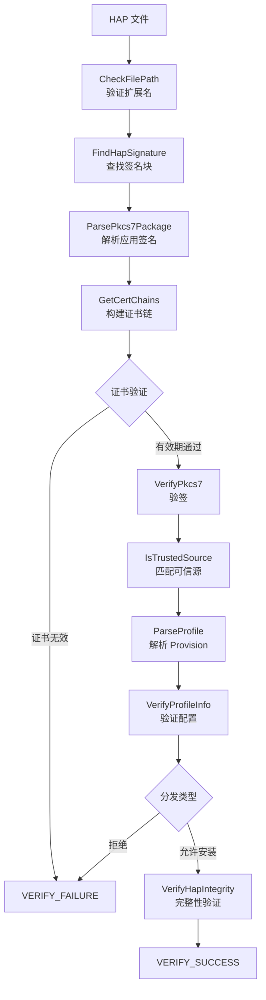

# 概览 (Overview)

## 目的

本文档提供 OpenHarmony 应用完整性校验 (appverify) 模块的高层概览，帮助读者快速理解项目的核心功能和架构。

## 适用范围

- 适用系统：OpenHarmony (Standard/Small/Mini)
- 目标读者：新人、开发者、架构师、安全审计人员
- 覆盖内容：核心功能、架构总览、关键概念

## 关键结论

1. **模块定位**：appverify 是 OpenHarmony 安全子系统的核心模块，提供 HAP 包签名验证能力
2. **对外接口**：纯 Native C++ InnerKit API，无 JS/N-API 层
3. **调用方**：主要由 Bundle Manager Service (BMS) 在应用安装时调用
4. **核心能力**：
   - 应用完整性校验（防止篡改）
   - 应用来源识别（匹配可信源）
   - Provision 配置解析与验证
   - 证书链验证（含 CRL 检查）

## 项目定位

**位置**：`/base/security/appverify`
**子系统**：security
**类型**：InnerKit Library（非 Service Ability）

### 与其他子系统的关系

```
┌─────────────────────────────────────────────────────────┐
│                    OpenHarmony 系统                    │
└─────────────────────────────────────────────────────────┘
                           ↓
┌─────────────────────────────────────────────────────────┐
│              Bundle Manager Service (BMS)               │
│              - 应用安装入口                             │
│              - 调用 HapVerify() 验证签名               │
└─────────────────────────────────────────────────────────┘
                           ↓
┌─────────────────────────────────────────────────────────┐
│              appverify (InnerKit)                      │
│              - libhapverify.so                         │
│              - 签名验证                                │
│              - 来源识别                                │
└─────────────────────────────────────────────────────────┘
                           ↓
        ┌──────────────────┴──────────────────┐
        ↓                                      ↓
┌───────────────┐                   ┌──────────────────┐
│  OpenSSL      │                   │  系统配置文件     │
│  (libcrypto) │                   │  /system/etc/    │
└───────────────┘                   │  security/       │
                                    └──────────────────┘
```

## 核心功能

### 1. 签名验证

对 HAP 包的签名块进行解析和验证：

- **PKCS7 解析**：提取签名证书链、签名算法、签名内容
- **证书链验证**：验证证书有效期、签名、吊销状态（CRL）
- **签名验签**：使用公钥验证签名完整性
- **支持算法**：RSA-PSS/PKCS1v1.5、ECDSA、DSA 配合 SHA256/384/512

### 2. 应用来源识别

通过匹配签名证书与可信源配置，识别应用来源：

**可信源类型** (从 `trusted_apps_sources.json`):
- APP_GALLERY：华为应用市场
- APP_SYSTEM：系统应用
- APP_THIRD_PARTY_PRELOAD：第三方预装应用

### 3. Provision 配置验证

解析和验证应用配置文件 (Provision)：

- **权限信息**：`permissions.restrictedPermissions`、`acls.allowedAcls`
- **分发类型**：`APP_GALLERY`、`ENTERPRISE`、`OS_INTEGRATION` 等
- **设备授权**：验证设备 ID 是否在允许列表中（开发场景）
- **调试模式**：验证开发证书与签名证书一致性

### 4. 企业应用验证

支持企业重签名应用验证：

- 检查企业证书 OID (1.3.6.1.4.1.2011.2.376.1.9)
- 验证设备为企业设备
- 比对本地证书链与 HAP 证书链

## 核心概念

### HAP (Harmony Ability Package)

OpenHarmony 应用安装包格式，本质是 ZIP 格式，包含：

- **内容部分**：应用代码、资源、配置（module.json、resources 等）
- **签名块**：HapSigningBlock，位于 ZIP Central Directory 之前

**结构**：
```
┌─────────────────────────────┐
│   ZIP Content (Code/Res)   │
├─────────────────────────────┤
│   HapSigningBlock          │
│   ├─ Entry Length         │
│   ├─ Entry Tag            │
│   └─ Signature Blocks      │
│      ├─ App-Signing-Block │ (应用签名)
│      ├─ Profile-Block     │ (Provision 签名)
│      └─ Optional Blocks    │
├─────────────────────────────┤
│   Central Directory        │
├─────────────────────────────┤
│   End of Central Directory│
└─────────────────────────────┘
```

### PKCS7 (Cryptographic Message Syntax)

签名数据封装格式，RFC 5652 标准定义。

appverify 使用的 PKCS7 SignedData 包含：
- **Certificates**：签名证书链（从叶子证书到 CA）
- **SignerInfo**：签名信息（算法、签名值、属性）
- **Content**：被签名的内容摘要

### Provision (Provisioning Profile)

应用配置文件，JSON 格式，经过 PKCS7 签名。

包含：
- **bundleInfo**：应用包名、应用标识
- **permissions**：权限和 ACL
- **type**：DEBUG/RELEASE
- **distributionType**：分发类型
- **validity**：有效期
- **debugInfo**：设备列表（开发场景）

### CRL (Certificate Revocation List)

证书吊销列表，用于检查证书是否已被吊销。

管理器：`HapCrlManager` (hap_crl_manager.cpp:24)

## 验证流程总览



## 依赖关系

### 外部依赖

| 依赖 | 说明 | 用途 |
|------|------|------|
| OpenSSL | libcrypto_shared | PKCS7 解析、证书验证、签名算法 |
| cJSON | cjson | JSON 配置文件解析 |
| c_utils | utils | 通用工具库 |
| bounds_checking_function | libsec_shared | 边界检查 |
| hilog | libhilog | 日志输出 |
| init | libbegetutil | 系统参数获取 |
| (非标准) ipc | ipc_core | IPC 基础库 |
| (非标准) os_account | libaccountkits | 账号服务客户端 |

### 配置文件

- `/system/etc/security/trusted_root_ca.json` - 根证书列表
- `/system/etc/security/trusted_apps_sources.json` - 可信源配置
- `/system/etc/security/trusted_tickets_sources.json` - Ticket 可信源（OpenTest）
- `/system/etc/security/trusted_root_ca_test.json` - 测试根证书
- `/system/etc/security/trusted_apps_sources_test.json` - 测试可信源

## 运行环境

### 系统适配

| 系统类型 | 支持 | 说明 |
|----------|------|------|
| Standard | ✅ | libhapverify.so (完整功能) |
| Small | ✅ | libverify.so (简化版) |
| Mini | ✅ | libverify.so (简化版) |

### 资源占用

- ROM：约 5000kb
- RAM：约 500kb
（来源：bundle.json:22-23）

### 特殊模式

- **调试模式**：`EnableDebugMode()` / `DisableDebugMode()`，允许使用测试证书
- **开发模式**：`SetDevMode(DEV/NON_DEV)`，控制开发设备行为
- **模拟器模式**：`X86_EMULATOR_MODE` 编译宏，支持 x86 模拟器

## 相关跳转

- [项目定位详情](01_Project_Position.md) - 深入了解项目边界与能力
- [目录结构](02_Directory_Structure.md) - 代码组织方式
- [架构详解](03_Architecture.md) - 完整验证流程与数据流
- [对外 API](04_Public_API.md) - API 使用指南
- [安全评审](08_Security_Review.md) - 安全机制与风险分析
