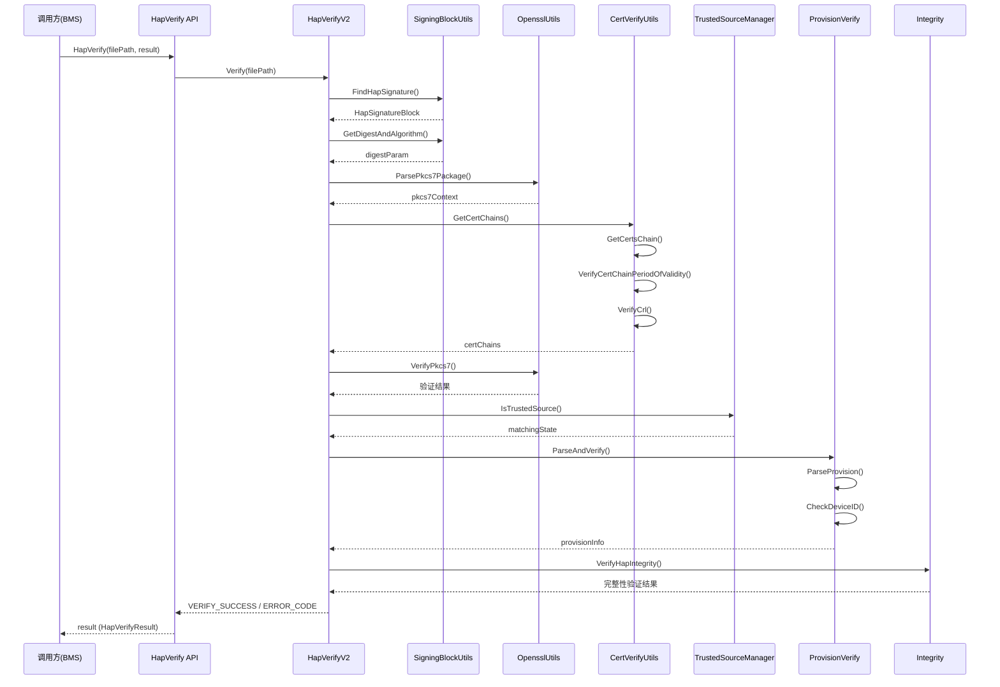
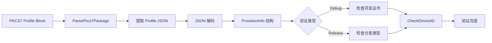
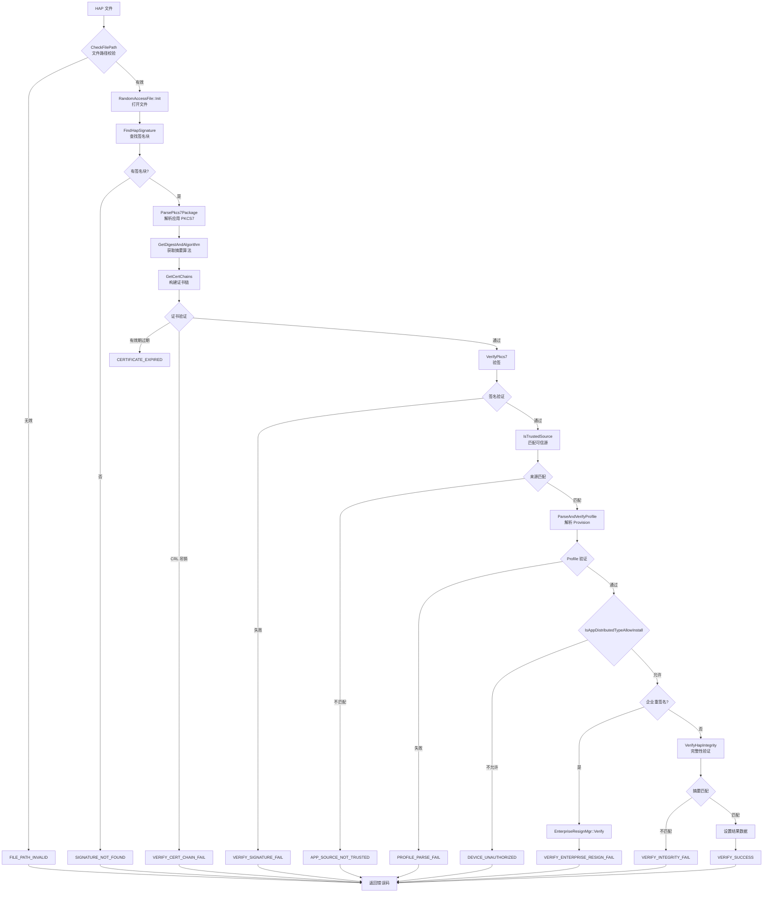
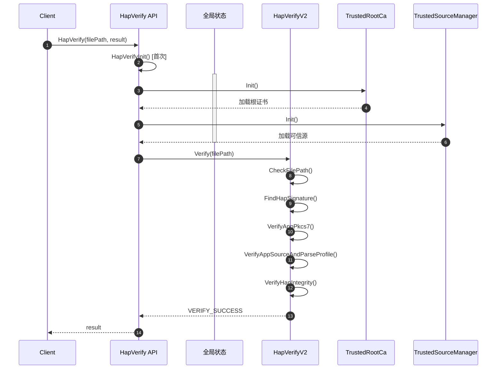
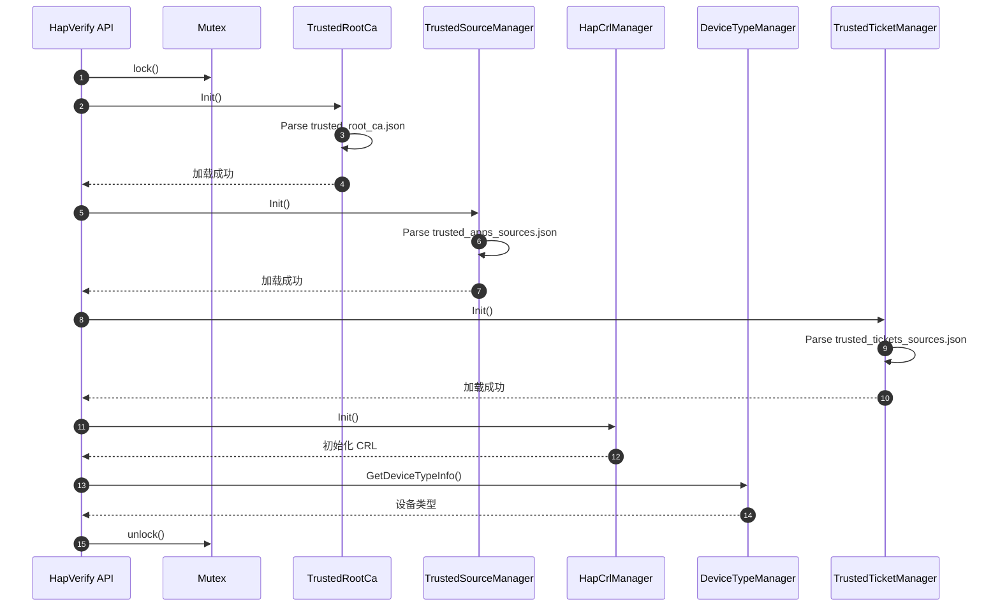
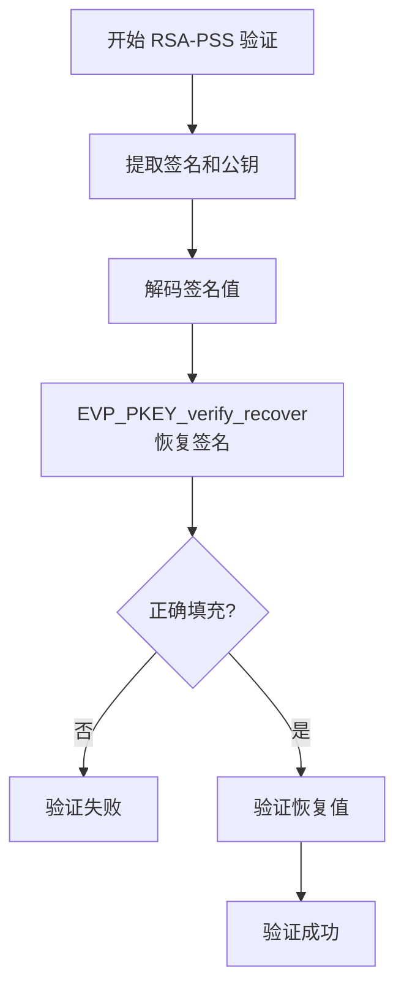

# 架构说明

## 目的

详细说明 appverify 模块的架构、数据流、验证流程和关键时序。

## 适用范围

- 目标读者：开发者、架构师、安全审计人员
- 涵盖内容：组件图、数据流、验证流程、时序图、线程模型

## 关键结论

1. **架构模式**：分层架构 + 策略模式，单向依赖
2. **验证流程**：签名验证 → 来源识别 → Provision 验证 → 完整性校验
3. **同步模型**：同步调用，无异步回调
4. **线程安全**：使用互斥锁保护全局状态

## 组件架构图

```mermaid
graph TB
    subgraph "调用层"
        BMS[Bundle Manager Service<br/>调用方]
    end

    subgraph "接口层"
        API[HapVerify API<br/>hap_verify.cpp]
        Result[HapVerifyResult<br/>结果结构]
    end

    subgraph "验证核心层"
        V2[HapVerifyV2<br/>核心编排]
    end

    subgraph "功能模块层"
        subgraph "签名验证"
            PKCS7[HapVerifyOpensslUtils<br/>PKCS7解析与验签]
            Cert[HapCertVerifyOpensslUtils<br/>证书验证]
            Sign[HapSigningBlockUtils<br/>签名块处理]
        end

        subgraph "来源与配置"
            Root[TrustedRootCa<br/>根证书管理]
            Source[TrustedSourceManager<br/>可信源匹配]
            Provision[ProvisionVerify<br/>Provision解析]
            Ticket[TicketVerify<br/>Ticket验证]
        end

        subgraph "企业验证"
            Enterprise[EnterpriseResignMgr<br/>企业重签名验证]
        end
    end

    subgraph "基础层"
        Init[Init模块<br/>单例管理器]
        Util[Util模块<br/>工具类]
        Common[Common模块<br/>基础类]
    end

    subgraph "外部依赖"
        OpenSSL[OpenSSL<br/>libcrypto]
        Config[配置文件<br/>/system/etc/security/]
        Log[Hilog<br/>日志]
        IPC[IPC<br/>(非标准系统)]
    end

    BMS --> API
    API --> V2
    V2 --> PKCS7
    V2 --> Sign
    V2 --> Source
    V2 --> Provision
    V2 --> Ticket
    V2 --> Enterprise

    PKCS7 --> Cert
    PKCS7 --> OpenSSL
    Cert --> Root
    Source --> Root
    Provision --> Root
    Ticket --> Root
    Enterprise --> Root

    Root --> Init
    Source --> Init
    Provision --> Util
    PKCS7 --> Util
    Cert --> Util
    Sign --> Util
    Common --> Log
    Init --> IPC

    Init --> Config
```

## 数据流

### HAP 验证数据流



### Provision 解析数据流



## 签名验证流程

### 完整验证流程



### 各阶段详解

#### 1. 文件路径检查

**函数**：`HapVerifyV2::CheckFilePath()` - hap_verify_v2.cpp:82

**检查内容**：
- 文件扩展名：.hap/.hsp/.hqf/.app/.p7b
- 文件路径格式
- 文件大小（不超过 2GB）

**错误码**：
- `FILE_PATH_INVALID` - 路径无效
- `FILE_SIZE_TOO_LARGE` - 文件过大

#### 2. 签名块查找

**函数**：`HapSigningBlockUtils::FindHapSignature()` - hap_signing_block_utils.cpp:289

**流程**：
```
1. FindEocdInHap() - 查找 ZIP End of Central Directory
   ├─ 从文件末尾向前扫描
   └─ 定位 EOCD 标记 (0x06054b50)

2. GetCentralDirectoryOffset() - 获取中央目录偏移
   └─ 从 EOCD 解析偏移量

3. FindHapSigningBlock() - 查找签名块
   ├─ 从 Central Directory 之前 64MB 范围扫描
   ├─ 查找 "HAPSigningBlock" 魔数 (0x71777777)
   └─ 解析签名块头部
```

**错误码**：
- `SIGNATURE_NOT_FOUND` - 找不到签名块

#### 3. PKCS7 解析与签名验证

**函数**：
- `ParsePkcs7Package()` - hap_verify_openssl_utils.cpp:49
- `VerifyPkcs7()` - hap_verify_openssl_utils.cpp:146

**PKCS7 解析**：
```cpp
// 解析 PKCS7 SignedData
d2i_PKCS7_bio(p7, p7bio)  // DER 解码

// 提取证书链
sk_X509_pop_free(certChains)
X509_get_subject_name()    // 提取主题
X509_get_issuer_name()    // 提取颁发者
```

**证书链验证**：
```cpp
// 构建证书链（从签名证书到根证书）
GetCertsChain(signCert) {
    FindCertOfIssuer(issuer)  // 查找颁发者证书
    CertVerify(signCert, issuer)  // 验证证书签名
    VerifyCertChainPeriodOfValidity()  // 验证有效期
    VerifyCrl()  // CRL 检查
    TrustedRootCa::FindMatchedRoot()  // 匹配根证书
}
```

**签名验证**：
- 标准验签：`PKCS7_signatureVerify(p7, p7bio)`
- RSA-PSS：`VerifyShaWithRsaPss()` - hap_verify_openssl_utils.cpp:251
- ECDSA：`ECDSA_verify()`
- DSA：`DSA_verify()`

**错误码**：
- `VERIFY_APP_PKCS7_FAIL` - PKCS7 解析失败
- `GET_PUBLICKEY_FAIL` - 提取公钥失败
- `GET_SIGNATURE_FAIL` - 提取签名失败
- `VERIFY_SIGNATURE_FAIL` - 签名验证失败
- `CERTIFICATE_EXPIRED` - 证书过期

#### 4. 可信源匹配

**函数**：`TrustedSourceManager::IsTrustedSource()` - trusted_source_manager.cpp

**匹配规则**：
```
签名块签名：
  if (subject + issuer 匹配可信源) {
      return MATCH_WITH_SIGN;
  }

Profile 签名：
  if (profileCert subject + issuer 匹配可信源) {
      return MATCH_WITH_PROFILE;
  }

Debug Profile 签名：
  if (debugCert subject + issuer 匹配测试源) {
      return MATCH_WITH_PROFILE_DEBUG;
  }

return DO_NOT_MATCH;
```

**错误码**：
- `APP_SOURCE_NOT_TRUSTED` - 不在可信源中

#### 5. Provision 解析与验证

**函数**：
- `ParseAndVerify()` - provision_verify.cpp
- `VerifyProfileInfo()` - hap_verify_v2.cpp:361

**解析流程**：
```
1. ParsePkcs7Package(profileBlock) - 解析 Profile PKCS7
2. GetContentInfo(p7, profileJson) - 提取 Profile JSON
3. cJSON_Parse(profileJson) - JSON 解码
4. 填充 ProvisionInfo 结构
```

**验证内容**：
- Debug 模式：
  - 开发证书主题 == 签名证书主题
  - 设备 ID 在 debugInfo.deviceIds 列表中
- Release 模式：
  - 分发类型允许安装
- 企业模式：
  - 企业重签名验证

**错误码**：
- `PROFILE_PARSE_FAIL` - Profile 解析失败
- `DEVICE_UNAUTHORIZED` - 设备未授权

#### 6. 完整性验证

**函数**：`HapSigningBlockUtils::VerifyHapIntegrity()` - hap_signing_block_utils.cpp:428

**流程**：
```
1. 计算文件内容摘要
   - 遍历 ZIP 内容（排除签名块）
   - 支持 4MB 分块并行计算
   - 使用签名中的摘要算法

2. 提取签名中的摘要
   - 从 PKCS7 AuthenticatedAttributes
   - 解码摘要值

3. 比对摘要
   - 计算摘要 == 签名摘要
```

**错误码**：
- `VERIFY_INTEGRITY_FAIL` - 完整性验证失败
- `GET_DIGEST_FAIL` - 获取摘要失败

## 关键时序

### HapVerify 调用时序



### 初始化时序



## 线程模型

### 同步调用

- 所有 API 调用均为同步阻塞
- 无异步回调机制
- 无线程池

### 线程安全

**全局状态保护**：
```cpp
static std::mutex g_mtx;           // hap_verify.cpp:34
static bool g_isInit = false;     // hap_verify.cpp:35
```

**保护范围**：
- 初始化状态 `g_isInit`
- TrustedRootCa 单例状态
- TrustedSourceManager 单例状态

**使用位置**：
- `HapVerifyInit()` - hap_verify.cpp:39
- `EnableDebugMode()` - hap_verify.cpp:59
- `DisableDebugMode()` - hap_verify.cpp:73
- `SetDevMode()` - hap_verify.cpp:83

**无锁操作**：
- HapVerifyV2 实例方法（无共享状态）
- OpenSSL 操作（OpenSSL 内部线程安全）

### 并行计算

**摘要计算并行** (hap_signing_block_utils.cpp:455)：

```cpp
// 支持大文件并行计算摘要
if (HapVerifyParallelizationSupported() && contentsZipSize > SMALL_FILE_SIZE) {
    // 多线程分块计算
    for (auto& chunk : chunks) {
        threads.push_back(std::thread([&chunk, &digestParam]() {
            DigestUpdate(digestParam, chunk.data, chunk.size);
        }));
    }
    for (auto& t : threads) {
        t.join();
    }
}
```

## 错误传播

### 错误码定义

**HapVerifyResultCode** (hap_verify_result.h:34)：

| 错误码 | 值 | 说明 |
|--------|-----|------|
| VERIFY_SUCCESS | 0 | 验证成功 |
| FILE_PATH_INVALID | -1 | 文件路径无效 |
| OPEN_FILE_ERROR | -2 | 打开文件失败 |
| SIGNATURE_NOT_FOUND | -3 | 未找到签名块 |
| VERIFY_APP_PKCS7_FAIL | -4 | PKCS7 解析或验证失败 |
| PROFILE_PARSE_FAIL | -5 | Profile 解析失败 |
| APP_SOURCE_NOT_TRUSTED | -6 | 应用不在可信源中 |
| GET_DIGEST_FAIL | -7 | 获取摘要失败 |
| VERIFY_INTEGRITY_FAIL | -8 | 完整性验证失败 |
| FILE_SIZE_TOO_LARGE | -9 | 文件过大 |
| GET_PUBLICKEY_FAIL | -10 | 提取公钥失败 |
| GET_SIGNATURE_FAIL | -11 | 提取签名失败 |
| NO_PROFILE_BLOCK_FAIL | -12 | 未找到 Profile 块 |
| VERIFY_SIGNATURE_FAIL | -13 | 签名验证失败 |
| VERIFY_SOURCE_INIT_FAIL | -14 | 初始化失败 |
| DEVICE_UNAUTHORIZED | -15 | 设备未授权 |
| CERTIFICATE_EXPIRED | -16 | 证书过期 |
| VERIFY_ENTERPRISE_RESIGN_FAIL | -17 | 企业重签名验证失败 |

### 错误传播链

```
HapVerify()
  ├─ HapVerifyInit() → VERIFY_SOURCE_INIT_FAIL
  ├─ CheckFilePath() → FILE_PATH_INVALID, FILE_SIZE_TOO_LARGE
  ├─ FindHapSignature() → SIGNATURE_NOT_FOUND
  ├─ VerifyAppPkcs7()
  │   ├─ ParsePkcs7Package() → VERIFY_APP_PKCS7_FAIL
  │   ├─ GetCertChains() → VERIFY_APP_PKCS7_FAIL, CERTIFICATE_EXPIRED
  │   └─ VerifyPkcs7() → VERIFY_SIGNATURE_FAIL
  ├─ VerifyAppSourceAndParseProfile()
  │   ├─ IsTrustedSource() → APP_SOURCE_NOT_TRUSTED
  │   └─ VerifyProfileInfo() → PROFILE_PARSE_FAIL, DEVICE_UNAUTHORIZED
  ├─ VerifyEnterprise() → VERIFY_ENTERPRISE_RESIGN_FAIL
  ├─ GetDigestAndAlgorithm() → GET_DIGEST_FAIL
  └─ VerifyHapIntegrity() → VERIFY_INTEGRITY_FAIL
```

## 支持的签名算法

### 算法清单

**定义位置**：hap_verify_openssl_utils.h:35-48

| 算法 ID | 摘要 | 公钥算法 | OID |
|----------|------|----------|-----|
| 0x00000101 | SHA256 | RSA-PSS | 1.2.840.113549.1.1.10 |
| 0x00000102 | SHA384 | RSA-PSS | 1.2.840.113549.1.1.10 |
| 0x00000103 | SHA512 | RSA-PSS | 1.2.840.113549.1.1.10 |
| 0x00000111 | SHA256 | RSA-PKCS1v1.5 | 1.2.840.113549.1.1.11 |
| 0x00000112 | SHA384 | RSA-PKCS1v1.5 | 1.2.840.113549.1.1.12 |
| 0x00000113 | SHA512 | RSA-PKCS1v1.5 | 1.2.840.113549.1.1.13 |
| 0x00000201 | SHA256 | ECDSA | 1.2.840.10045.4.3.2 |
| 0x00000202 | SHA384 | ECDSA | 1.2.840.10045.4.3.3 |
| 0x00000203 | SHA512 | ECDSA | 1.2.840.10045.4.3.4 |
| 0x00000301 | SHA256 | DSA | 2.16.840.1.101.3.4.3.2 |
| 0x00000302 | SHA384 | DSA | 2.16.840.1.101.3.4.3.3 |
| 0x00000303 | SHA512 | DSA | 2.16.840.1.101.3.4.3.4 |

### RSA-PSS 验证流程

**函数**：`VerifyShaWithRsaPss()` - hap_verify_openssl_utils.cpp:251



## 相关跳转

- [对外 API](04_Public_API.md) - API 使用方式
- [内部 API](05_Internal_API.md) - 模块接口详情
- [目录结构](02_Directory_Structure.md) - 模块职责
- [安全评审](08_Security_Review.md) - 安全机制
