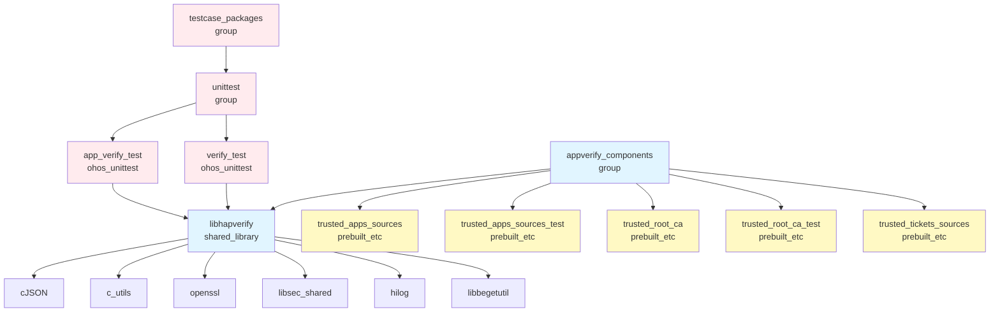

# GN Targets 与构建配置

## 目的

说明 appverify 模块的 GN 构建目标、依赖关系和编译配置。

## 适用范围

- 目标读者：构建系统开发者、模块开发者
- 涵盖内容：targets 列表、类型、依赖、产物、开关

## 关键结论

1. **核心库**：libhapverify.so (Standard) / libverify.so (Lite)
2. **构建目标**：7 个 BUILD.gn 文件，定义 12 个 target
3. **配置文件**：5 个 ohos_prebuilt_etc 目标
4. **安全特性**：CFI、边界检查、分支保护

## 根 BUILD.gn

**文件位置**：BUILD.gn

### Testcase Packages（测试包组）

**Target**：`testcase_packages`
**类型**：group
**说明**：聚合测试用例

**依赖**：
```gn
if (os_level == "standard") {
  deps = [
    "//base/security/appverify/interfaces/innerkits/appverify/test:unittest",
  ]
} else if (os_level == "small") {
  deps = [
    "//base/security/appverify/interfaces/innerkits/appverify_lite/unittest:unittest"
  ]
}
```

---

### Appverify Components（组件组）

**Target**：`appverify_components`
**类型**：group
**说明**：聚合所有组件

**依赖**：
```gn
if (os_level == "standard") {
  deps = [
    "//base/security/appverify/interfaces/innerkits/appverify:libhapverify",
    "//base/security/appverify/interfaces/innerkits/appverify/config:trusted_apps_sources",
    "//base/security/appverify/interfaces/innerkits/appverify/config:trusted_apps_sources_test",
    "//base/security/appverify/interfaces/innerkits/appverify/config:trusted_root_ca",
    "//base/security/appverify/interfaces/innerkits/appverify/config:trusted_root_ca_test",
    "//base/security/appverify/interfaces/innerkits/appverify/config:trusted_tickets_sources",
  ]
} else {
  if (ohos_kernel_type != "liteos_m") {
    deps = [
      "//base/security/appverify/interfaces/innerkits/appverify_lite:verify",
    ]
  }
}
```

---

## libhapverify（标准系统核心库）

**文件位置**：interfaces/innerkits/appverify/BUILD.gn:22

### Target 定义

```gn
ohos_shared_library("libhapverify") {
  sources = [22 个源文件]
  public_configs = [":libhapverify_config"]
  external_deps = [cJSON, c_utils, openssl, ...]
  part_name = "appverify"
  subsystem_name = "security"
}
```

### 源文件（22 个）

**common/ (4)**：
- hap_byte_buffer.cpp
- hap_byte_buffer_data_source.cpp
- hap_file_data_source.cpp
- random_access_file.cpp

**init/ (6)**：
- device_type_manager.cpp
- hap_crl_manager.cpp
- json_parser_utils.cpp
- trusted_root_ca.cpp
- trusted_source_manager.cpp
- trusted_ticket_manager.cpp

**interfaces/ (2)**：
- hap_verify.cpp
- hap_verify_result.cpp

**provision/ (2)**：
- provision_info.cpp
- provision_verify.cpp

**ticket/ (1)**：
- ticket_verify.cpp

**util/ (5)**：
- digest_parameter.cpp
- hap_cert_verify_openssl_utils.cpp
- hap_profile_verify_utils.cpp
- hap_signing_block_utils.cpp
- hap_verify_openssl_utils.cpp

**verify/ (2)**：
- enterprise_resign_mgr.cpp
- hap_verify_v2.cpp

### 外部依赖

**公共依赖**：
```gn
external_deps = [
  "cJSON:cjson",
  "c_utils:utils",
  "openssl:libcrypto_shared",
  "bounds_checking_function:libsec_shared",
]
```

**标准系统特定** (`is_standard_system`)：
```gn
external_deps += [
  "hilog:libhilog",
  "init:libbegetutil",
]
defines += [ "STANDARD_SYSTEM" ]
```

**非标准系统特定** (`!is_standard_system`)：
```gn
external_deps += [
  "ipc:ipc_core",
  "os_account:libaccountkits",
  "shared_library:libhilog",
]
if (!build_public_version) {
  defines += [ "SUPPORT_GET_DEVICE_TYPES" ]
}
```

### 编译选项

**C++ Flags**：
```gn
cflags_cc = [
  "-DHILOG_ENABLE",           # 启用 Hilog 日志
  "-fvisibility=hidden",      # 符号隐藏（仅 DLL_EXPORT 导出）
]
```

**Defines**：
```gn
defines = [
  "OPENSSL_SUPPRESS_DEPRECATED",  # 抑制 OpenSSL 警告
]
if (is_emulator) {
  defines += [ "X86_EMULATOR_MODE" ]
}
```

### 安全特性

```gn
sanitize = {
  boundary_sanitize = true    # 边界检查
  cfi = true               # 控制流完整性
  cfi_cross_dso = true     # 跨 DSO CFI
  integer_overflow = true    # 整数溢出检查
  ubsan = true             # 未定义行为检查
}
branch_protector_ret = "pac_ret"  # 返回地址保护
```

### 产物

**类型**：ohos_shared_library
**输出**：libhapverify.so
**安装**：动态链接库路径

---

## Config 配置文件（预构建目标）

**文件位置**：interfaces/innerkits/appverify/config/BUILD.gn

### 5 个预构建目标

| Target | 类型 | 源文件 | 安装路径 | 说明 |
|--------|------|--------|----------|------|
| trusted_apps_sources | ohos_prebuilt_etc | OpenHarmony/trusted_apps_sources.json | /system/etc/security/ | 公开版本可信源 |
| trusted_apps_sources_test | ohos_prebuilt_etc | trusted_apps_sources_test.json | /system/etc/security/ | 测试可信源 |
| trusted_root_ca | ohos_prebuilt_etc | OpenHarmony/trusted_root_ca.json | /system/etc/security/ | 公开版本根证书 |
| trusted_root_ca_test | ohos_prebuilt_etc | trusted_root_ca_test.json | /system/etc/security/ | 测试根证书 |
| trusted_tickets_sources | ohos_prebuilt_etc | trusted_tickets_sources.json | /system/etc/security/ | Ticket 可信源 |

### 条件编译

```gn
ohos_prebuilt_etc("trusted_apps_sources") {
  if (build_public_version) {
    source = "OpenHarmony/trusted_apps_sources.json"
  } else {
    source = "trusted_apps_sources.json"
  }
  part_name = "appverify"
  subsystem_name = "security"
  relative_install_dir = "security"
}
```

`build_public_version` 控制使用公开版本或内部版本配置。

---

## verify（Lite 系统核心库）

**文件位置**：interfaces/innerkits/appverify_lite/BUILD.gn

### Target 定义

```gn
shared_library("verify") {  # 或 group (os_level != small && os_level != mini)
  sources = [8 个源文件]
  public_deps = [verify_base]
  part_name = "appverify"
  subsystem_name = "security"
}
```

### 源文件（8 个）

- app_centraldirectory.c
- app_common.c
- app_file.c
- app_provision.c
- app_verify.c
- app_verify_hal.c
- app_verify_hap.c
- mbedtls_pkcs7.c

### Public Deps

```gn
public_deps = [
  "//base/security/appverify/interfaces/innerkits/appverify_lite/products/ipcamera:verify_base",
  "//build/lite/config/component/cJSON:cjson_shared",
  "//third_party/bounds_checking_function:libsec_shared",
  "//third_party/mbedtls:mbedtls_shared",
]
```

### 编译定义

```gn
defines = [
  "PARSE_PEM_FORMAT_SIGNED_DATA",
]
if (ohos_sign_haps_by_server) {
  defines += [ "OHOS_SIGN_HAPS_BY_SERVER" ]
}
```

### 产物

**类型**：shared_library
**输出**：libverify.so
**适用**：small/mini 系统

---

## verify_base（Lite 产品特定库）

**文件位置**：interfaces/innerkits/appverify_lite/products/ipcamera/BUILD.gn

### Target 定义

```gn
if (ohos_kernel_type == "liteos_m") {
  static_library("verify_base") {
    ...
  }
} else {
  shared_library("verify_base") {
    ...
  }
}
```

### 源文件

- ../default/app_verify_default.c
- app_verify_base.c

### Deps

```gn
if (ohos_kernel_type == "liteos_m") {
  deps = [
    "//base/hiviewdfx/hilog_lite/frameworks/featured:hilog_static",
  ]
} else {
  deps = [
    "//base/hiviewdfx/hilog_lite/frameworks/featured:hilog_shared",
  ]
}
deps += [
  "//base/startup/init/interfaces/innerkits:libbegetutil",
]
```

### 产物

- LiteOS-M：libverify_base.a（静态库）
- 其他：libverify_base.so（共享库）

---

## 测试 Target

### Standard 测试

**文件位置**：interfaces/innerkits/appverify/test/BUILD.gn

#### verify_test

**类型**：ohos_unittest
**输出**：appverify/appverify
**源文件**（15 个）：
- hap_byte_buffer_test.cpp
- hap_cert_verify_openssl_utils_test.cpp
- hap_crl_manager_test.cpp
- hap_profile_verify_utils_test.cpp
- hap_signing_block_utils_test.cpp
- hap_verify_openssl_utils_test.cpp
- hap_verify_result_test.cpp
- hap_verify_test.cpp
- hap_verify_v2_test.cpp
- provision_verify_test.cpp
- random_access_file_test.cpp
- ticket_verify_test.cpp
- trusted_root_ca_test.cpp
- trusted_source_manager_test.cpp
- trusted_ticket_test.cpp

**复用源码**：
- src/init/json_parser_utils.cpp
- src/provision/provision_verify.cpp
- src/ticket/ticket_verify.cpp

**依赖**：libhapverify, gtest, openssl, cjson, hilog, etc.

#### app_verify_test

**类型**：ohos_unittest
**源文件**：app_verify_test.cpp
**特殊链接**：`-Wl,--export-dynamic`
**依赖**：libhapverify, gmock, gtest, ipc, samgr, openssl, etc.

#### unittest（group）

**类型**：group
**聚合**：verify_test + app_verify_test
**testonly**：true

---

### Lite 测试

**文件位置**：interfaces/innerkits/appverify_lite/unittest/BUILD.gn

#### app_verify_test

**类型**：unittest
**输出扩展名**：.bin
**输出目录**：$root_out_dir/test/unittest/security

**源文件**（8 个）：
- packets/business_packet.cpp
- packets/modified_packet.cpp
- packets/success_test.cpp
- packets/udid_wrong_test.cpp
- packets/unsigned_packet.cpp
- packets/wrong_license.cpp
- src/hap_verify_test.cpp
- src/write_file.cpp

**依赖**：verify, cjson, mbedtls, libsec_shared

---

## 依赖关系图

### 完整依赖树



**图例**：
- 蓝色：核心组件
- 黄色：配置文件
- 红色：测试目标

---

## Target ↔ 产物映射

| Target | 类型 | 输出 | 安装路径 | 运行时 |
|--------|------|------|----------|--------|
| libhapverify | ohos_shared_library | libhapverify.so | /usr/lib/ | 动态链接 |
| verify | shared_library | libverify.so | /usr/lib/ | 动态链接 |
| verify_base | shared_library | libverify_base.so | /usr/lib/ | 动态链接 |
| verify_base | static_library | libverify_base.a | - | 静态链接 |
| trusted_apps_sources | ohos_prebuilt_etc | trusted_apps_sources.json | /system/etc/security/ | 配置读取 |
| trusted_root_ca | ohos_prebuilt_etc | trusted_root_ca.json | /system/etc/security/ | 配置读取 |
| trusted_tickets_sources | ohos_prebuilt_etc | trusted_tickets_sources.json | /system/etc/security/ | 配置读取 |
| verify_test | ohos_unittest | appverify | - | 单元测试 |
| app_verify_test | ohos_unittest | app_verify_test | - | 单元测试 |

---

## 编译选项与开关

### 系统级开关

| 宏 | 默认值 | 说明 | BUILD.gn 位置 |
|----|--------|------|---------------|
| os_level | - | standard/small/mini | 根 BUILD.gn |
| is_standard_system | false | 标准系统 | libhapverify:76 |
| build_public_version | false | 公开版本 | config:17 |
| is_emulator | false | 模拟器模式 | libhapverify:100 |
| ohos_kernel_type | - | linux/liteos_a/liteos_m | verify_base |
| ohos_sign_haps_by_server | false | 服务器签名 | verify: |

### 功能开关

| 宏 | 默认值 | 说明 | 影响 |
|----|--------|------|------|
| HILOG_ENABLE | true | Hilog 日志 | libhapverify |
| OPENSSL_SUPPRESS_DEPRECATED | true | 抑制过期警告 | libhapverify |
| X86_EMULATOR_MODE | false | x86 模拟器 | libhapverify |
| SUPPORT_GET_DEVICE_TYPES | false | 获取设备类型 | libhapverify |
| STANDARD_SYSTEM | 条件 | 标准系统 | libhapverify |
| PARSE_PEM_FORMAT_SIGNED_DATA | true | PEM 解析 | verify |
| OHOS_SIGN_HAPS_BY_SERVER | false | 服务器签名 | verify |

---

## 构建命令

### 完整构建

```bash
# 标准系统
hb build -f --build-target appverify_components

# 测试
hb build -f --build-target testcase_packages

# Lite 系统
hb build -f --build-target verify
```

### 仅编译核心库

```bash
hb build -f --build-target //base/security/appverify/interfaces/innerkits/appverify:libhapverify
```

### 单元测试

```bash
hb test -f appverify
```

---

## 相关跳转

- [编译产物](07_Build_Artifacts.md) - 产物安装与运行时
- [目录结构](02_Directory_Structure.md) - 源文件组织
- [对外 API](04_Public_API.md) - 接口使用
