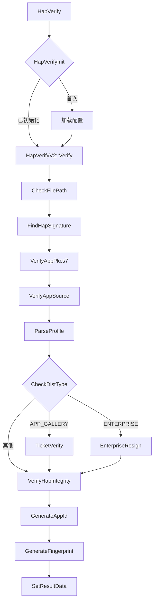
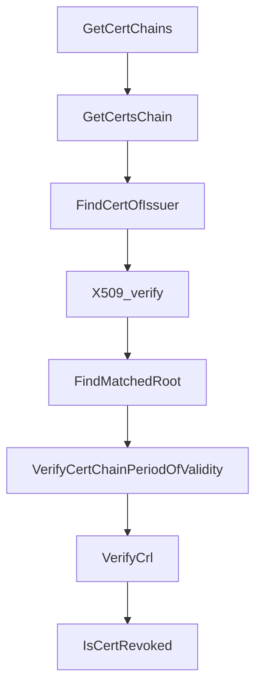

# 关键调用链

## 目的

提供 appverify 模块关键函数的详细调用链图解。

## 适用范围

- 目标读者：开发者、代码审查人员
- 涵盖内容：主要 API 调用链、内部函数调用图

## HapVerify 完整调用链

### 主调用链

```
HapVerify(filePath, result)
  └─ HapVerifyInit() [首次]
      ├─ g_mtx.lock()
      ├─ TrustedRootCa::GetInstance().Init()
      │   └─ ParseJson(trusted_root_ca.json)
      ├─ TrustedSourceManager::GetInstance().Init()
      │   └─ ParseJson(trusted_apps_sources.json)
      ├─ TrustedTicketManager::GetInstance().Init()
      │   └─ ParseJson(trusted_tickets_sources.json)
      ├─ HapCrlManager::GetInstance().Init()
      └─ DeviceTypeManager::GetInstance().GetDeviceTypeInfo()
      └─ g_mtx.unlock()
  └─ HapVerifyV2::Verify(filePath, result)
      ├─ CheckFilePath(filePath)
      │   └─ std::regex_match(filePath, HAP_APP_PATTERN)
      ├─ RandomAccessFile::Init(filePath)
      ├─ FindHapSignature(hapFile, hapSignatureBlock)
      │   ├─ FindEocdInHap(hapFile)
      │   │   └─ 扫描文件末尾查找 EOCD (0x06054b50)
      │   ├─ GetCentralDirectoryOffset(eocd)
      │   └─ FindHapSigningBlock(hapFile, cdOffset)
      │       └─ 扫描签名块魔数 (0x71777777)
      ├─ GetDigestAndAlgorithm(hapSignatureBlock, digestParam)
      ├─ VerifyAppPkcs7(pkcs7Context, hapSignatureBlock)
      │   ├─ HapVerifyOpensslUtils::ParsePkcs7Package()
      │   │   └─ d2i_PKCS7_bio() [OpenSSL]
      │   ├─ HapVerifyOpensslUtils::GetCertChains()
      │   │   ├─ HapCertVerifyOpensslUtils::GetCertsChain()
      │   │   │   ├─ FindCertOfIssuer()
      │   │   │   ├─ X509_verify()
      │   │   │   ├─ TrustedRootCa::FindMatchedRoot()
      │   │   │   ├─ HapCertVerifyOpensslUtils::VerifyCertChainPeriodOfValidity()
      │   │   │   └─ HapCertVerifyOpensslUtils::VerifyCrl()
      │   │   └─ HapCertVerifyOpensslUtils::VerifyCrl()
      │   │       └─ HapCrlManager::IsCertRevoked()
      │   └─ HapVerifyOpensslUtils::VerifyPkcs7()
      │       ├─ VerifyPkcs7SignedData()
      │       ├─ VerifySignInfo()
      │       │   ├─ IsEnablePss()
      │       │   ├─ PKCS7_signatureVerify()
      │       │   └─ VerifyShaWithRsaPss()
      │       │       ├─ EVP_PKEY_verify_recover()
      │       │       └─ memcmp(恢复值, 签名值)
      │       └─ VerifyPkcs7AuthAttributes()
      ├─ VerifyAppSourceAndParseProfile(pkcs7Context, profileBlock, result)
      │   ├─ HapVerifyOpensslUtils::GetPublickeys()
      │   ├─ HapVerifyOpensslUtils::GetSignatures()
      │   ├─ TrustedSourceManager::IsTrustedSource()
      │   │   └─ 匹配 subject + issuer
      │   ├─ ProvisionVerify::ParseAndVerify()
      │   │   ├─ ParsePkcs7Package(profileBlock)
      │   │   ├─ GetContentInfo(profileJson)
      │   │   ├─ cJSON_Parse(profileJson)
      │   │   ├─ ParseProvision(provisionInfo)
      │   │   ├─ CheckDeviceID(provisionInfo)
      │   │   └─ VerifyProfileSignature()
      │   └─ [APP_GALLERY] TicketVerify::Verify()
      │       ├─ ParseTicket()
      │       ├─ CheckPermissions()
      │       ├─ CheckDevice()
      │       └─ CompareTicketAndProfile()
      ├─ [ENTERPRISE] EnterpriseResignMgr::Verify()
      │   ├─ IsEnterpriseCert()
      │   ├─ IsEnterpriseDevice()
      │   ├─ VerifyLocalChainAndHapChain()
      │   └─ 检查企业 OID
      ├─ VerifyHapIntegrity(hapFile, hapSignatureBlock)
      │   ├─ HapSigningBlockUtils::HapVerifyParallelizationSupported()
      │   ├─ DigestInit(digestParam)
      │   ├─ DigestUpdate() [分块]
      │   └─ GetDigest(digestParam, calculatedDigest)
      ├─ SetResultData(result, pkcs7Context, provisionInfo)
      └─ GenerateAppId() + GenerateFingerprint()
```

---

## ParseHapProfile 调用链

```
ParseHapProfile(filePath, result)
  └─ HapVerifyV2::ParseHapProfile(filePath, result)
      ├─ CheckFilePath(filePath)
      ├─ RandomAccessFile::Init(filePath)
      ├─ FindHapSignature(hapFile, hapSignatureBlock)
      ├─ GetProfileBlock(hapSignatureBlock)
      ├─ ProvisionVerify::ParseAndVerify()
      │   ├─ ParsePkcs7Package(profileBlock)
      │   ├─ GetContentInfo(profileJson)
      │   ├─ cJSON_Parse(profileJson)
      │   └─ ParseProvision(provisionInfo)
      ├─ SetResultData(result, ...)
      └─ GenerateAppId() + GenerateFingerprint()
```

---

## VerifyProfile 调用链

```
VerifyProfile(filePath, provisionInfo)
  └─ HapVerifyV2::VerifyProfile(filePath, provisionInfo)
      ├─ CheckP7bPath(filePath)
      │   └─ std::regex_match(filePath, P7B_PATTERN)
      ├─ RandomAccessFile::Init(filePath)
      ├─ ReadFileData(hapFile, data)
      ├─ ProvisionVerify::ParseAndVerify()
      │   ├─ ParsePkcs7Package(data)
      │   ├─ GetContentInfo(profileJson)
      │   ├─ cJSON_Parse(profileJson)
      │   ├─ ParseProvision(provisionInfo)
      │   ├─ VerifyProfileSignature()
      │   └─ VerifyProfileInfo()
      ├─ GenerateAppId(provisionInfo)
      └─ GenerateFingerprint(provisionInfo)
```

---

## 证书验证调用链

```
HapVerifyOpensslUtils::GetCertChains(p7, pkcs7Context)
  └─ 循环构建证书链
      ├─ PKCS7_get_signer_info() [OpenSSL]
      ├─ PKCS7_SIGNER_INFO_get_cert()
      ├─ HapCertVerifyOpensslUtils::GetCertsChain(signCert)
      │   ├─ X509_get_subject_name()
      │   ├─ X509_get_issuer_name()
      │   ├─ FindCertOfIssuer(issuer)
      │   │   └─ 查找 issuer 证书
      │   ├─ X509_verify(signCert, issuer)
      │   │   └─ X509_verify_cert()
      │   ├─ TrustedRootCa::FindMatchedRoot(rootId)
      │   │   └─ 遍历根证书列表匹配
      │   ├─ HapCertVerifyOpensslUtils::VerifyCertChainPeriodOfValidity()
      │   │   ├─ X509_get0_notBefore()
      │   │   ├─ X509_get0_notAfter()
      │   │   └─ ASN1_TIME_compare() [OpenSSL]
      │   └─ HapCertVerifyOpensslUtils::VerifyCrl(certId)
      │       └─ HapCrlManager::IsCertRevoked(certId)
      │           └─ 查询 CRL 列表
      └─ 递归处理中间证书
```

---

## 可信源匹配调用链

```
TrustedSourceManager::IsTrustedSource(subject, issuer, profileSubject, profileIssuer)
  └─ 遍历 trusted_apps_sources.json
      ├─ 签名块签名匹配
      │   ├─ 查找 app-signing-certs
      │   ├─ 对比 subject
      │   ├─ 对比 issuer-ca
      │   └─ return MATCH_WITH_SIGN
      ├─ Profile 签名匹配
      │   ├─ 查找 profile-signing-certificates
      │   ├─ 对比 profileSubject
      │   ├─ 对比 issuer-ca
      │   └─ return MATCH_WITH_PROFILE
      ├─ Debug Profile 签名匹配
      │   ├─ 查找 profile-debug-signing-certificate
      │   ├─ 对比 profileSubject
      │   ├─ 对比 issuer-ca
      │   └─ return MATCH_WITH_PROFILE_DEBUG
      └─ return DO_NOT_MATCH
```

---

## 完整性验证调用链

```
HapSigningBlockUtils::VerifyHapIntegrity(hapFile, hapSignatureBlock)
  └─ GetDigestAndAlgorithm(hapSignatureBlock, digestParam)
      ├─ 解析 digestInfo
      ├─ HapVerifyOpensslUtils::DigestInit(digestParam)
      │   └─ EVP_DigestInit_ex() [OpenSSL]
      ├─ 分块计算摘要
      │   ├─ [并行] 多线程调用 DigestUpdate()
      │   └─ DigestUpdate(chunk)
      │       └─ EVP_DigestUpdate() [OpenSSL]
      ├─ HapVerifyOpensslUtils::GetDigest(digestParam, calculatedDigest)
      │   └─ EVP_DigestFinal_ex() [OpenSSL]
      └─ 比对摘要
          └─ memcmp(calculatedDigest, signedDigest, digestLen)
```

---

## RSA-PSS 验证调用链

```
HapVerifyOpensslUtils::VerifyShaWithRsaPss(signInfo, pkey)
  └─ 提取签名和算法参数
      ├─ PKCS7_SIGNER_INFO_get_enc_alg() [OpenSSL]
      ├─ PKCS7_SIGNER_INFO_get_digest() [OpenSSL]
      ├─ RSA_size() [OpenSSL]
      └─ EVP_PKEY_verify_recover()
          └─ 恢复签名值
              ├─ 检查 RSA-PSS 填充
              │   └─ memcmp(0x00, padding, prefixLen)
              └─ 比对恢复值
                  └─ memcmp(recoveredValue, expectedValue)
```

---

## 调用图示

### 验证流程概览



### 证书验证流程



---

## 相关跳转

- [对外 API](04_Public_API.md) - API 接口
- [内部 API](05_Internal_API.md) - 模块接口
- [架构详解](03_Architecture.md) - 验证流程
