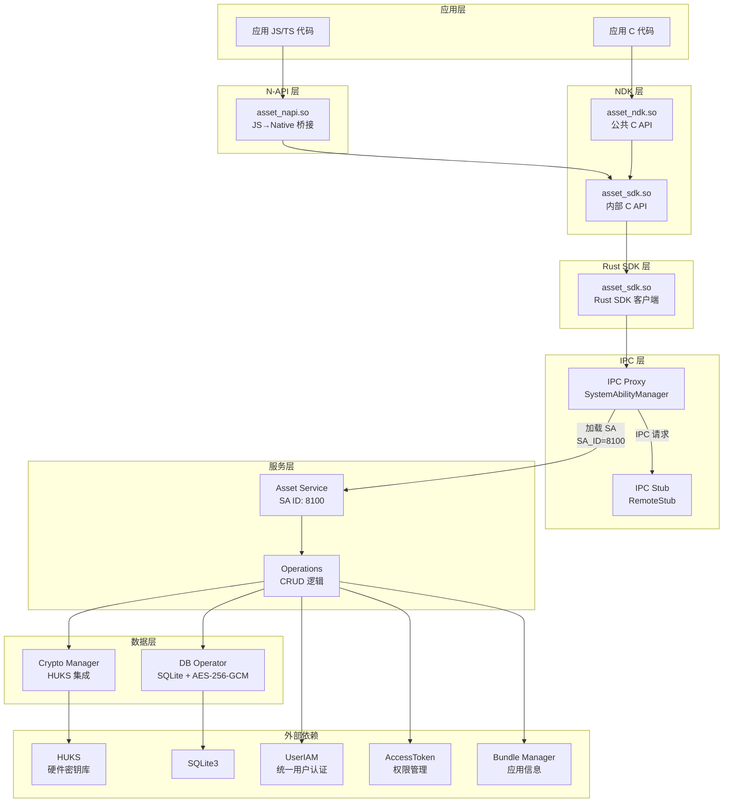
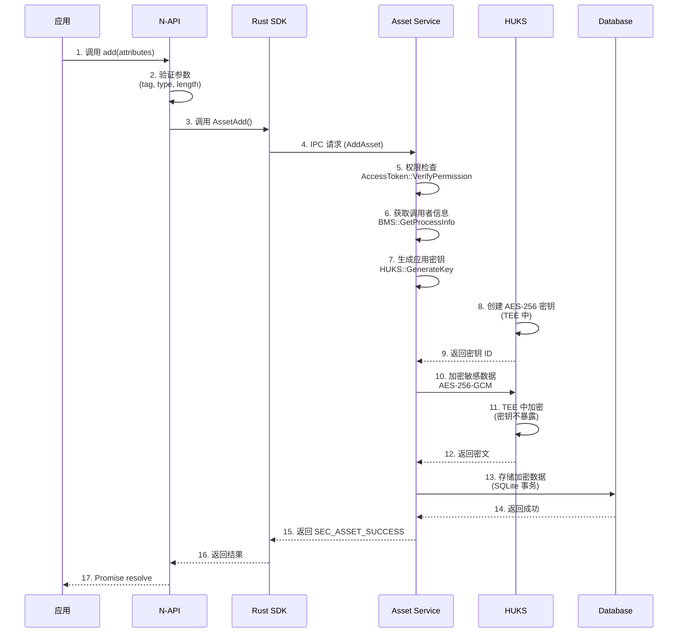
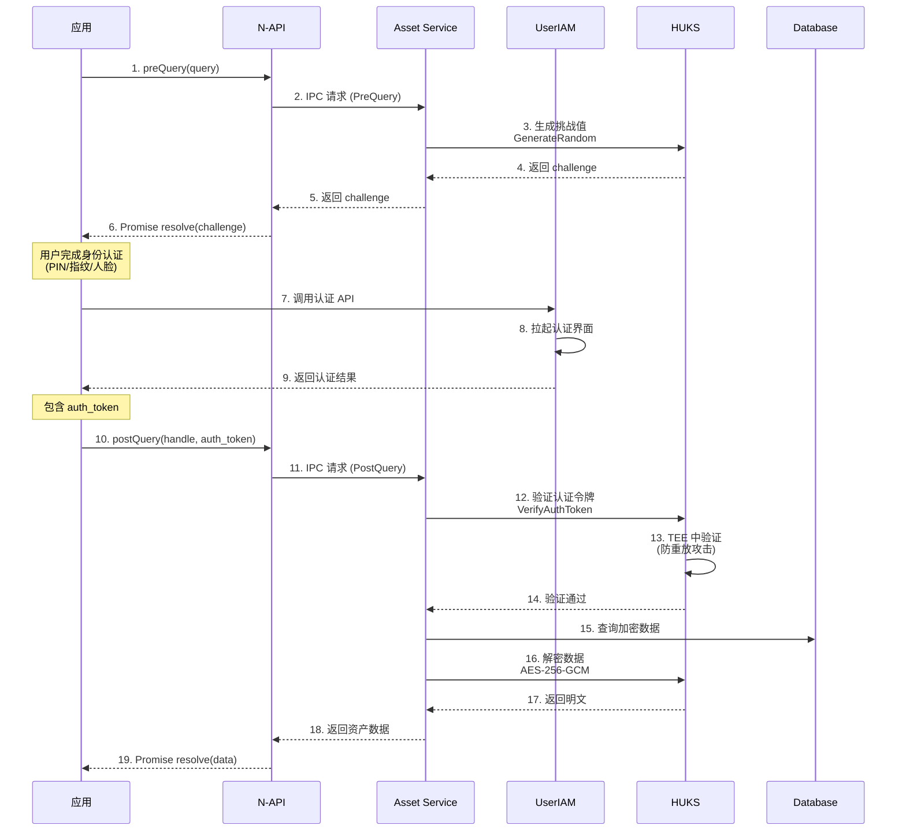
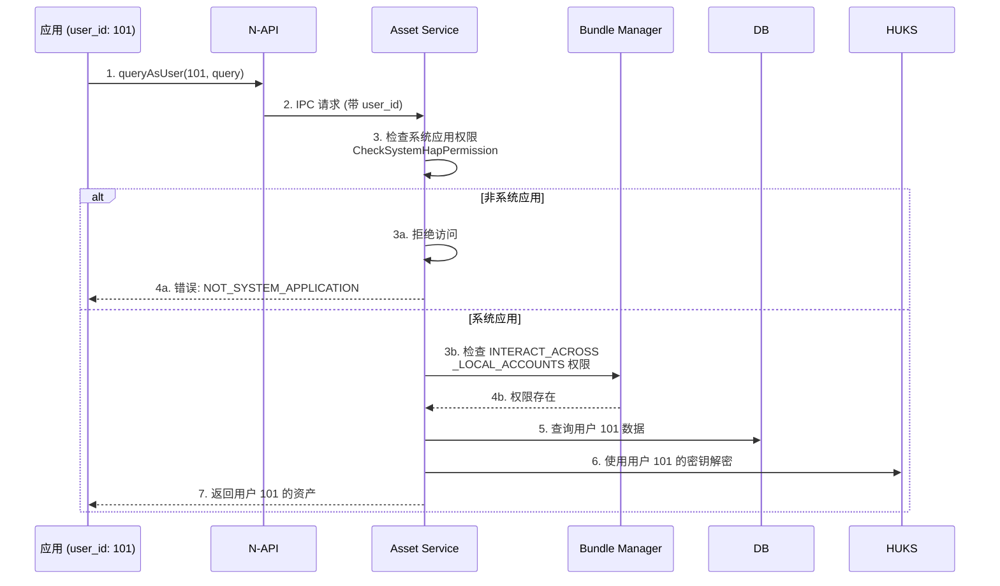
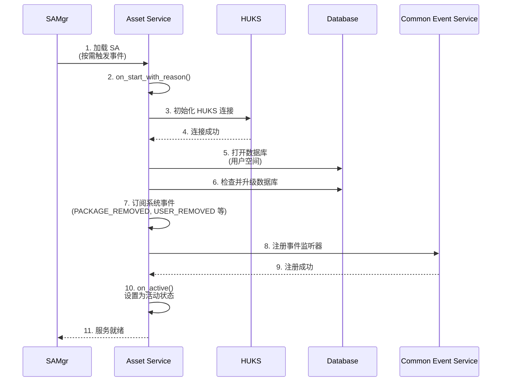
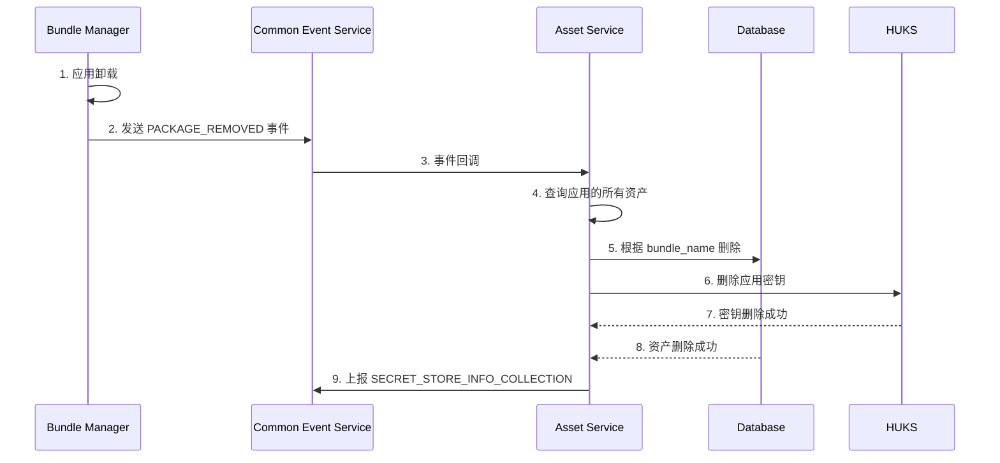
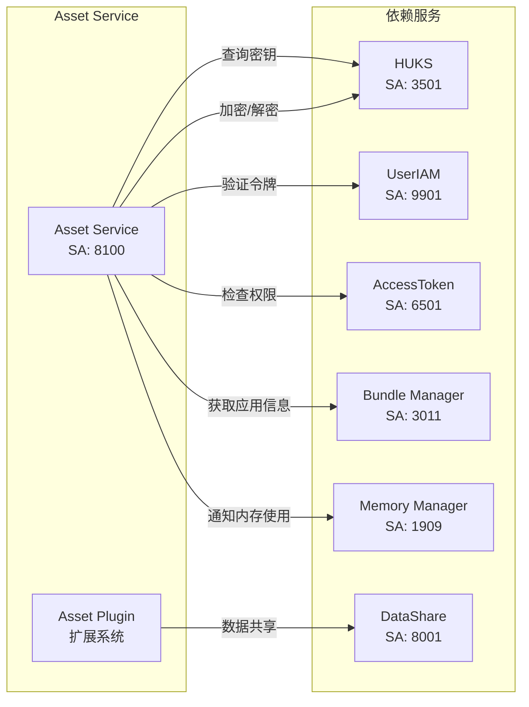
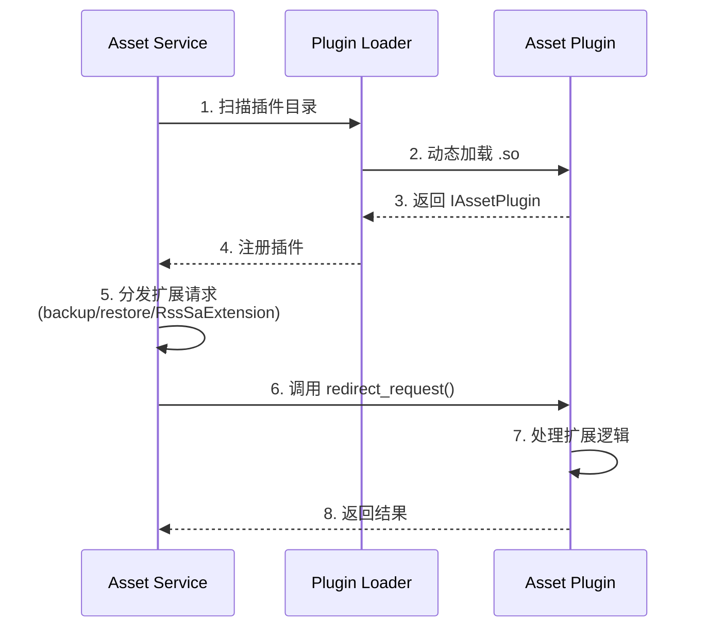

# 架构说明

## 目的

本文档描述 ASSET 服务的整体架构，包括组件图、数据流、线程模型和关键时序。

## 适用范围

- 涵盖内容：组件关系、数据流向、线程模型、关键时序
- 包含：Mermaid 图表

---

## 整体架构

### 分层架构



**证据**：
- N-API 层：`frameworks/js/napi/BUILD.gn:16`（asset_napi）
- NDK 层：`interfaces/kits/c/BUILD.gn:20-23`（asset_ndk）
- Rust SDK：`interfaces/inner_kits/rs/BUILD.gn:30-34`（asset_sdk_rust）
- IPC 层：`frameworks/ipc/src/lib.rs:25-87`（SA_ID=8100）
- 服务层：`services/core_service/src/lib.rs:16-100`（AssetAbility）
- Crypto 层：`services/crypto_manager/src/huks_wrapper.c:1-100`（HUKS）

### 层次说明

| 层次 | 组件 | 职责 |
|------|------|------|
| **应用层** | JS/TS 应用、C 应用 | 使用 ASSET API 存储敏感数据 |
| **N-API 层** | asset_napi.so | JS 到 Native 的桥接层 |
| **NDK 层** | asset_ndk.so, asset_sdk.so | 公共/内部 C API |
| **Rust SDK 层** | asset_sdk.so | Rust 客户端 SDK |
| **IPC 层** | IPC Proxy/Stub | 进程间通信 |
| **服务层** | Asset Service (SA:8100) | 核心业务逻辑 |
| **数据层** | Crypto Manager, DB Operator | 加密和持久化 |
| **外部依赖** | HUKS, UserIAM, AccessToken | 系统服务依赖 |

---

## 数据流

### 1. 添加资产流程



**证据**：
- 步骤 7：`services/db_operator/src/common/permission_check.rs:23-41`（check_system_permission）
- 步骤 8：`services/os_dependency/src/bms_wrapper.cpp:27-60`（GetHapProcessInfo）
- 步骤 9-11：`services/crypto_manager/src/huks_wrapper.c:5-45`（GenerateKey, EncryptData）

### 2. 查询资产流程（带认证）



**证据**：
- 步骤 3-4：`services/core_service/src/operations/operation_pre_query.rs`（生成 challenge）
- 步骤 12-14：`services/crypto_manager/src/huks_wrapper.c:77-100`（ExecCrypt 带认证）

### 3. 跨用户查询流程



**证据**：
- 步骤 3a：`services/db_operator/src/common/permission_check.rs:32-34`（系统应用检查）
- 步骤 3b：`services/os_dependency/src/access_token_wrapper.cpp:14-20`（CheckPermission）

---

## 线程模型

### 服务端线程模型

**Asset Service 使用 OpenHarmony 的 Rust SA 框架，线程模型如下**：

```rust
// services/core_service/src/lib.rs
impl Ability for AssetAbility {
    fn on_start_with_reason(&self, reason: OnDemandReason) {
        // 主线程：启动事件处理
        // 异步任务：通过 ylong_runtime 执行
    }

    fn on_idle(&self) -> i32 {
        // 返回延迟卸载时间
        // 服务空闲 20 秒后卸载
        return DELAYED_UNLOAD_TIME_IN_SEC * SEC_TO_MILLISEC;
    }
}
```

**关键点**：
1. **主线程**：处理 SA 生命周期（on_start, on_stop, on_idle）
2. **异步任务**：通过 `ylong_runtime::RuntimeBuilder` 执行异步操作
3. **延迟卸载**：空闲 20 秒后自动卸载（`services/core_service/src/lib.rs:88`）

**证据**：
- 异步任务：`services/common/src/task_manager.rs`（TaskManager）
- 延迟卸载：`services/core_service/src/lib.rs:88-89`（DELAYED_UNLOAD_TIME_IN_SEC）

### 客户端线程模型

**N-API 线程**：
- **JS 主线程**：N-API 回调在 JS 主线程执行
- **工作线程**：`CreateAsyncWork` 创建的工作线程执行实际操作

**证据**：`frameworks/js/napi/src/asset_napi_common.cpp:82-85`（CreateAsyncWork）

```cpp
napi_value CreateAsyncWork(const napi_env env, napi_callback_info info,
    std::unique_ptr<BaseContext> context,
    const char *resourceName)
{
    // 创建异步工作，在线程池执行
    napi_value resource = nullptr;
    napi_create_async_work(env, context.get(), executeCallback, completeCallback,
        &resource, &result);
}
```

---

## 关键时序图

### 1. 服务启动时序



**证据**：
- 事件订阅：`services/core_service/src/common_event/start_event.rs`（事件处理）
- 升级检查：`services/core_service/src/upgrade_ce.rs`（数据库升级）

### 2. 应用卸载清理时序



**证据**：
- 事件处理：`services/core_service/src/common_event/listener.rs`（事件监听）
- 密钥删除：`services/crypto_manager/src/huks_wrapper.c:46-54`（DeleteKey）

---

## 组件交互关系

### 服务间依赖



**证据**：
- SA ID 8100：`frameworks/ipc/src/lib.rs:25`
- SA ID 3501（HUKS）：OpenHarmony 标准
- SA ID 9901（UserIAM）：OpenHarmony 标准
- SA ID 6501（AccessToken）：OpenHarmony 标准
- SA ID 3011（BMS）：OpenHarmony 标准
- SA ID 1909（Memory Manager）：`services/core_service/src/lib.rs:94`

---

## 数据库架构

### SQLite 加密配置

```mermaid
graph TB
    subgraph "数据库层"
        DB[(SQLite Database)]
        Cipher[SQLCipher<br/>AES-256-GCM]
        KDF[Key Derivation<br/>KDF-SHA1<br/>10000 iterations]
    end

    subgraph "密钥管理"
        DBKey[DB Key<br/>derived from<br/>user encryption key]
    end

    DBKey -->|密钥派生| KDF
    KDF -->|派生密钥| Cipher
    Cipher -->|加密| DB

    DB -.加密数据.->|存储| DB
```

**加密参数**：
- 算法：`aes-256-gcm`
- HMAC 算法：`SHA1`
- KDF 函数：`KDF_SHA1`
- 迭代次数：`10000`
- 页面大小：`1024`

**证据**：`services/db_operator/src/sqlite3_wrapper.c:5-13`

### 表结构

```sql
CREATE TABLE assets (
    id INTEGER PRIMARY KEY AUTOINCREMENT,
    user_id INTEGER NOT NULL,              -- 多用户支持
    alias BLOB NOT NULL,                 -- 资产别名
    secret BLOB NOT NULL,                -- 加密的敏感数据
    data_label_critical_1 BLOB,           -- 不可变自定义字段
    data_label_critical_2 BLOB,
    data_label_critical_3 BLOB,
    data_label_critical_4 BLOB,
    data_label_normal_1 BLOB,            -- 可变自定义字段
    data_label_normal_2 BLOB,
    data_label_normal_3 BLOB,
    data_label_normal_4 BLOB,
    access_control INTEGER,                -- 访问控制位
    sync_type INTEGER,                    -- 同步类型
    require_attr_encrypted INTEGER,         -- 属性加密标志
    create_time INTEGER NOT NULL,           -- 创建时间
    update_time INTEGER NOT NULL,           -- 更新时间
    UNIQUE(user_id, alias)               -- 防重复
);
```

**证据**：`services/db_operator/src/table.rs`（表结构定义）

---

## 插件架构

### 插件接口

```rust
// interfaces/inner_kits/plugin_interface/src/plugin_interface.rs
pub trait IAssetPlugin {
    fn redirect_request(&self, request: &mut MsgParcel) -> Result<()>;
    fn on_sa_extension(&self, extension: &str) -> Result<()>;
}
```

### 插件加载



**证据**：
- 插件接口：`interfaces/inner_kits/plugin_interface/src/plugin_interface.rs`
- 加载器：`services/plugin/src/asset_plugin.rs`（AssetPlugin, 加载器）

---

## 安全边界

### TEE 边界

```mermaid
graph TB
    subgraph "Normal World"
        App[应用]
        NAPI[N-API]
        SDK[SDK]
        Service[Asset Service]
    end

    subgraph "TEE (Trusted Execution Environment)"
        HUKS[HUKS]
        Crypto[Crypto Operations<br/>AES-256-GCM]
        KeyStore[Key Storage<br/>密钥不暴露]
    end

    App --> NAPI --> SDK --> Service
    Service -.加密/解密请求.-> HUKS
    HUKS --> Crypto --> KeyStore

    Style KeyStore fill:#f9f,stroke:#f00,stroke-width:3px
    Note over KeyStore: 硬件保护<br/>密钥不离开 TEE
```

**关键点**：
- 密钥生成：在 HUKS 中进行
- 加密/解密：在 HUKS 中进行
- 密钥存储：在 TEE 中，不暴露给 Normal World
- 认证验证：在 HUKS 中验证，防重放攻击

**证据**：`services/crypto_manager/src/huks_wrapper.c:1-100`（所有 HUKS 操作）

---

## 相关跳转

- [项目概述](00_Overview.md) - 了解项目定位
- [对外 N-API](03_NAPI_API.md) - 详细的 API 清单
- [内部 API](04_Inner_API.md) - 系统间接口
- [安全风险评审](07_Security_Review.md) - 安全威胁分析
