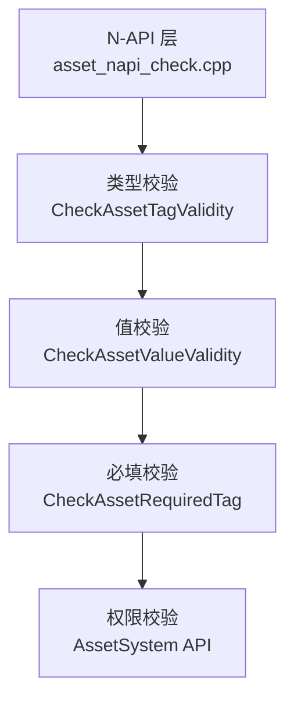

# 对外 N-API (JavaScript API)

## 目的

本文档详细描述 ASSET 服务对外提供的 JavaScript/TypeScript API，包括 API 清单、参数、返回值、同步/异步模式和错误码。

## 适用范围

- 涵盖内容：N-API 注册、导出方法、参数校验、调用链、错误码
- 目标读者：应用开发者、JS/TS 开发者

---

## 模块注册

### 注册点

**文件**：`frameworks/js/napi/src/asset_napi.cpp:228-243`

**注册模式**：使用 `napi_module_register` + constructor 属性

```cpp
// 模块定义
napi_module g_module = {
    .nm_version = 1,
    .nm_flags = 0,
    .nm_filename = nullptr,
    .nm_register_func = Register,
    .nm_modname = "security.asset",    // JS 模块名
    .nm_priv = static_cast<void *>(0),
    .reserved = { 0 },
};

// 模块注册（自动调用）
extern "C" __attribute__((constructor)) void RegisterModule(void)
{
    napi_module_register(&g_module);
}
```

### 模块导入

```typescript
// ES6 模块导入
import asset from '@ohos.security.asset';

// 或命名空间导入
import * as asset from '@ohos.security.asset';
```

---

## API 清单表

### 核心操作 API

| JS 方法名 | C++ 入口 | 源文件 | 异步 | AsUser 变体 | 描述 |
|-----------|-----------|---------|------|------------|------|
| `add` | `NapiAdd` | asset_napi_add.cpp:109-112 | ✓ | - | 添加资产（异步） |
| `addSync` | `NapiAddSync` | asset_napi_add.cpp:119-122 | ✗ | - | 添加资产（同步） |
| `addAsUser` | `NapiAddAsUser` | asset_napi_add.cpp:114-117 | ✓ | ✓ | 添加资产到指定用户（异步） |
| `remove` | `NapiRemove` | asset_napi_remove.cpp | ✓ | - | 删除资产（异步） |
| `removeSync` | `NapiRemoveSync` | asset_napi_remove.cpp | ✗ | - | 删除资产（同步） |
| `removeAsUser` | `NapiRemoveAsUser` | asset_napi_remove.cpp | ✓ | ✓ | 删除指定用户的资产（异步） |
| `update` | `NapiUpdate` | asset_napi_update.cpp | ✓ | - | 更新资产（异步） |
| `updateSync` | `NapiUpdateSync` | asset_napi_update.cpp | ✗ | - | 更新资产（同步） |
| `updateAsUser` | `NapiUpdateAsUser` | asset_napi_update.cpp | ✓ | ✓ | 更新指定用户的资产（异步） |
| `query` | `NapiQuery` | asset_napi_query.cpp | ✓ | - | 查询资产（异步） |
| `querySync` | `NapiQuerySync` | asset_napi_query.cpp | ✗ | - | 查询资产（同步） |
| `queryAsUser` | `NapiQueryAsUser` | asset_napi_query.cpp | ✓ | ✓ | 查询指定用户的资产（异步） |
| `preQuery` | `NapiPreQuery` | asset_napi_pre_query.cpp | ✓ | - | 预查询（带认证，异步） |
| `preQuerySync` | `NapiPreQuerySync` | asset_napi_pre_query.cpp | ✗ | - | 预查询（带认证，同步） |
| `preQueryAsUser` | `NapiPreQueryAsUser` | asset_napi_pre_query.cpp | ✓ | ✓ | 预查询指定用户（带认证，异步） |
| `postQuery` | `NapiPostQuery` | asset_napi_post_query.cpp | ✓ | - | 后查询（提交认证结果，异步） |
| `postQuerySync` | `NapiPostQuerySync` | asset_napi_post_query.cpp | ✗ | - | 后查询（提交认证结果，同步） |
| `postQueryAsUser` | `NapiPostQueryAsUser` | asset_napi_post_query.cpp | ✓ | ✓ | 后查询指定用户（提交认证结果，异步） |
| `querySyncResult` | `NapiQuerySyncResult` | asset_napi_query_sync_result.cpp | ✗ | - | 查询同步操作结果 |

**证据**：
- 注册点：`frameworks/js/napi/src/asset_napi.cpp:187-226`（`Register` 函数）
- 方法声明：`frameworks/js/napi/src/asset_napi.cpp:191-209`（`DECLARE_NAPI_FUNCTION`）

### 枚举常量

| JS 属性 | 声明函数 | 描述 | 证据 |
|---------|-----------|------|------|
| `asset.Tag` | `DeclareTag()` | 资产标签（SECRET, ALIAS, ACCESSIBILITY, AUTH_TYPE 等） | asset_napi.cpp:43-80 |
| `asset.TagType` | `DeclareTagType()` | 标签数据类型（BOOL, NUMBER, BYTES） | asset_napi.cpp:82-90 |
| `asset.ErrorCode` | `DeclareErrorCode()` | 错误码（PERMISSION_DENIED, NOT_FOUND 等） | asset_napi.cpp:92-118 |
| `asset.Accessibility` | `DeclareAccessibility()` | 可访问性级别 | asset_napi.cpp:120-128 |
| `asset.AuthType` | `DeclareAuthType()` | 认证类型 | asset_napi.cpp:130-137 |
| `asset.SyncType` | `DeclareSyncType()` | 同步类型 | asset_napi.cpp:139-148 |
| `asset.ConflictResolution` | `DeclareConflictResolution()` | 冲突解决策略 | asset_napi.cpp:159-166 |
| `asset.ReturnType` | `DeclareReturnType()` | 查询返回类型 | asset_napi.cpp:168-175 |
| `asset.OperationType` | `DeclareOperationType()` | 操作类型 | asset_napi.cpp:177-185 |
| `asset.WrapType` | `DeclareWrapType()` | 包装类型 | asset_napi.cpp:150-157 |

**证据**：`frameworks/js/napi/src/asset_napi.cpp:212-222`（属性注册）

---

## API 详细说明

### 1. add / addSync / addAsUser

#### 签名

```typescript
// 异步版本
function add(attributes: Map<string, Object>): Promise<void>

// 同步版本
function addSync(attributes: Map<string, Object>): void

// AsUser 变体（系统应用用）
function addAsUser(userId: number, attributes: Map<string, Object>): Promise<void>
```

#### 参数

| 参数名 | 类型 | 必填 | 说明 |
|-------|------|------|------|
| `attributes` | `Map<string, Object>` | 是 | 资产属性 Map，key 为 Tag 值，value 为对应值 |
| `userId` | `number` | AsUser 变体需要 | 目标用户 ID（范围 0-99） |

#### 必需 Tag

| Tag | 类型 | 说明 |
|-----|------|------|
| `Tag.SECRET` | `Uint8Array` | 敏感数据（密码、令牌） |
| `Tag.ALIAS` | `Uint8Array` | 资产别名（唯一标识符） |

#### 可选 Tag

| Tag | 类型 | 说明 |
|-----|------|------|
| `Tag.ACCESSIBILITY` | `number` | 锁屏状态要求（默认：DEVICE_POWERED_ON） |
| `Tag.AUTH_TYPE` | `number` | 认证类型（NONE, ANY, PIN, FINGERPRINT, FACE） |
| `Tag.AUTH_VALIDITY_PERIOD` | `number` | 认证有效期（秒） |
| `Tag.IS_PERSISTENT` | `boolean` | 是否持久化存储（需要 STORE_PERSISTENT_DATA 权限） |
| `Tag.SYNC_TYPE` | `number` | 同步类型（NEVER, THIS_DEVICE, TRUSTED_DEVICE, TRUSTED_ACCOUNT） |
| `Tag.RETURN_TYPE` | `number` | 查询返回类型（ALL, ATTRIBUTES） |
| `Tag.DATA_LABEL_*` | `Uint8Array` | 自定义字段（CRITICAL_1-4, NORMAL_1-4） |
| `Tag.REQUIRE_ATTR_ENCRYPTED` | `boolean` | 是否要求属性加密 |

#### 返回值

| 返回 | 说明 |
|------|------|
| `Promise<void>` | 异步版本：成功 resolve，失败 reject |
| `void` | 同步版本：成功无返回，失败抛异常 |

#### 错误码

| 错误码 | 值 | 说明 |
|---------|------|------|
| `PERMISSION_DENIED` | 201 | 缺少必需权限 |
| `NOT_SYSTEM_APPLICATION` | 202 | AsUser 操作需要系统应用身份 |
| `INVALID_ARGUMENT` | 401 | 参数错误（必填缺失、类型错误、验证失败） |
| `DUPLICATED` | 24000003 | 资产已存在 |
| `OUT_OF_MEMORY` | 24000006 | 内存不足 |
| `SERVICE_UNAVAILABLE` | 24000001 | 服务不可用 |
| `CRYPTO_ERROR` | 24000009 | 加密操作失败 |
| `ACCESS_DENIED` | 24000004 | 访问被拒绝（认证失败） |

**证据**：
- 参数验证：`frameworks/js/napi/src/asset_napi_add.cpp:43-56`（CheckAddArgs）
- 调用实现：`frameworks/js/napi/src/asset_napi_add.cpp:85-96`（AssetAdd 调用）

#### 调用链示例

```mermaid
graph LR
    A[add] -->|1. 参数验证<br/>CheckAddArgs| B[ParseJsMap]
    B -->|2. 检查必填/可选 Tag| C[CheckAssetRequiredTag]
    C -->|3. 检查 Tag 有效性| D[CheckAssetTagValidity]
    D -->|4. 检查值有效性| E[CheckAssetValueValidity]
    E -->|5. 创建异步任务| F[CreateAsyncWork]
    F -->|6. 执行 AssetAdd| G[AssetSystem API]
    G -->|7. IPC 请求| H[Asset Service]
    H -->|8. 返回结果| I[Promise resolve]
```



---

### 2. query / querySync / queryAsUser

#### 签名

```typescript
// 异步版本
function query(query: Map<string, Object>): Promise<Map<string, Object>[]>

// 同步版本
function querySync(query: Map<string, Object>): Map<string, Object>[]

// AsUser 变体
function queryAsUser(userId: number, query: Map<string, Object>): Promise<Map<string, Object>[]>
```

#### 参数

| 参数名 | 类型 | 必填 | 说明 |
|-------|------|------|------|
| `query` | `Map<string, Object>` | 是 | 查询条件 Map |
| `userId` | `number` | AsUser 变体需要 | 目标用户 ID |

#### 查询 Tag

| Tag | 类型 | 说明 |
|-----|------|------|
| `Tag.SECRET` | `Uint8Array` | 按敏感数据查询 |
| `Tag.ALIAS` | `Uint8Array` | 按别名查询（支持前缀匹配） |
| `Tag.RETURN_TYPE` | `number` | 返回类型（ALL: 完整数据，ATTRIBUTES: 仅属性） |
| `Tag.RETURN_LIMIT` | `number` | 返回数量限制 |
| `Tag.RETURN_OFFSET` | `number` | 返回偏移量（分页） |
| `Tag.RETURN_ORDERED_BY` | `number` | 排序字段（UPDATE_TIME） |
| `Tag.DATA_LABEL_*` | `Uint8Array` | 按自定义字段查询 |

#### 返回值

| 返回 | 说明 |
|------|------|
| `Promise<Map<string, Object>[]>` | 异步版本：资产数组 |
| `Map<string, Object>[]` | 同步版本：资产数组 |

#### 返回的数据结构

每个资产 Map 包含：
- 所有设置的 Tag
- 系统自动添加的：`Tag.UPDATE_TIME`（更新时间）

#### 错误码

| 错误码 | 说明 |
|---------|------|
| `NOT_FOUND` | 24000002 | 资产不存在 |
| `ACCESS_DENIED` | 24000004 | 访问被拒绝（锁屏状态不匹配） |

**证据**：
- 参数验证：`frameworks/js/napi/src/asset_napi_query.cpp:36-52`（查询参数验证）

---

### 3. remove / removeSync / removeAsUser

#### 签名

```typescript
function remove(query: Map<string, Object>): Promise<void>
function removeSync(query: Map<string, Object>): void
function removeAsUser(userId: number, query: Map<string, Object>): Promise<void>
```

#### 参数

| 参数名 | 类型 | 必填 | 说明 |
|-------|------|------|------|
| `query` | `Map<string, Object>` | 是 | 删除条件（至少一个 Tag） |

#### 查询 Tag（支持）

所有 Tag 都可作为删除条件，建议使用：
- `Tag.ALIAS`：删除指定别名
- `Tag.DATA_LABEL_*`：删除包含特定值的资产

#### 返回值

| 返回 | 说明 |
|------|------|
| `Promise<void>` | 异步版本：成功 resolve |
| `void` | 同步版本：成功无返回 |

---

### 4. update / updateSync / updateAsUser

#### 签名

```typescript
function update(query: Map<string, Object>, attributes: Map<string, Object>): Promise<void>
function updateSync(query: Map<string, Object>, attributes: Map<string, Object>): void
function updateAsUser(userId: number, query: Map<string, Object>, attributes: Map<string, Object>): Promise<void>
```

#### 参数

| 参数名 | 类型 | 必填 | 说明 |
|-------|------|------|------|
| `query` | `Map<string, Object>` | 是 | 匹配条件 |
| `attributes` | `Map<string, Object>` | 是 | 要更新的属性 |

#### 限制

- 不可修改的 Tag：`Tag.SECRET`、`Tag.ALIAS`、`Tag.DATA_LABEL_CRITICAL_*`
- 可修改的 Tag：`Tag.ACCESSIBILITY`、`Tag.AUTH_TYPE`、`Tag.SYNC_TYPE`、`Tag.DATA_LABEL_NORMAL_*`

---

### 5. preQuery / preQuerySync / preQueryAsUser（带认证查询）

#### 签名

```typescript
function preQuery(query: Map<string, Object>): Promise<Uint8Array>
function preQuerySync(query: Map<string, Object>): Uint8Array
function preQueryAsUser(userId: number, query: Map<string, Object>): Promise<Uint8Array>
```

#### 返回值

| 返回 | 说明 |
|------|------|
| `Promise<Uint8Array>` | Challenge 值（12 字节） |

#### 流程

1. 调用 `preQuery` 获取 challenge
2. 使用 UserIAM 进行身份认证（PIN/指纹/人脸）
3. 调用 `postQuery(challenge, auth_token)` 完成查询

**证据**：`services/core_service/src/operations/operation_pre_query.rs`（生成 challenge）

---

### 6. postQuery / postQuerySync / postQueryAsUser（提交认证）

#### 签名

```typescript
function postQuery(handle: Map<string, Object>, authToken: Uint8Array): Promise<Map<string, Object>[]>>
function postQuerySync(handle: Map<string, Object>, authToken: Uint8Array): Map<string, Object>[]
function postQueryAsUser(userId: number, handle: Map<string, Object>, authToken: Uint8Array): Promise<Map<string, Object>[]>>
```

#### 参数

| 参数名 | 类型 | 必填 | 说明 |
|-------|------|------|------|
| `handle` | `Map<string, Object>` | 是 | preQuery 返回的 handle（包含 challenge） |
| `authToken` | `Uint8Array` | 是 | UserIAM 认证后返回的令牌 |

#### 返回值

| 返回 | 说明 |
|------|------|
| `Promise<Map<string, Object>[]>` | 查询结果（解密后的资产） |

---

### 7. querySyncResult

#### 签名

```typescript
function querySyncResult(): Promise<Map<string, Object>>
```

#### 返回值

| 字段 | 类型 | 说明 |
|------|------|------|
| `OPERATION_TYPE` | `number` | 同步操作类型（NEED_SYNC, NEED_LOGOUT, NEED_DELETE_CLOUD_DATA） |

**用途**：查询是否有需要处理的同步操作。

---

## 参数校验机制

### 校验层级



### 必填 Tag 检查

**文件**：`frameworks/js/napi/src/asset_napi_add.cpp:43-56`

```cpp
const std::vector<uint32_t> REQUIRED_TAGS = {
    SEC_ASSET_TAG_SECRET,
    SEC_ASSET_TAG_ALIAS
};

napi_status CheckAddArgs(const napi_env env, const std::vector<AssetAttr> &attrs) {
    // 1. 检查必填 Tag 是否存在
    IF_ERROR_THROW_RETURN(env, CheckAssetRequiredTag(env, attrs, REQUIRED_TAGS));
    // 2. 检查 Tag 有效性
    IF_ERROR_THROW_RETURN(env, CheckAssetTagValidity(env, attrs, validTags));
    // 3. 检查值有效性
    IF_ERROR_THROW_RETURN(env, CheckAssetValueValidity(env, attrs));
    return napi_ok;
}
```

### Tag 有效性检查

**文件**：`frameworks/js/napi/src/asset_napi_check.cpp`

检查项：
- Tag 类型匹配：`tag.data_type() == value.data_type()`
- 数据长度限制：`SECRET` ≤ 1024 字节
- 别名长度限制
- 可访问性级别：`DEVICE_POWERED_ON`、`DEVICE_FIRST_UNLOCKED`、`DEVICE_UNLOCKED`
- 同步类型：`NEVER`、`THIS_DEVICE`、`TRUSTED_DEVICE`、`TRUSTED_ACCOUNT`
- 认证类型：`NONE`、`ANY`、`PIN`、`FINGERPRINT`、`FACE`

### 权限检查

**文件**：`services/db_operator/src/common/permission_check.rs:23-41`

```rust
pub fn check_system_permission(attrs: &AssetMap) -> Result<()> {
    if attrs.get(&Tag::UserId).is_some() {
        // 1. 检查是否为系统应用
        if unsafe { !CheckSystemHapPermission() } {
            return Err(NotSystemApplication);
        }

        // 2. 检查 INTERACT_ACROSS_LOCAL_ACCOUNTS 权限
        let permission = CString::new("ohos.permission.INTERACT_ACROSS_LOCAL_ACCOUNTS").unwrap();
        if unsafe { !CheckPermission(permission.as_ptr()) } {
            return Err(PermissionDenied);
        }
    }
    Ok(())
}
```

---

## 同步/异步模式

### 异步模式

**实现**：使用 `napi_create_async_work` + `Promise`

**证据**：`frameworks/js/napi/src/asset_napi_common.cpp:82-85`

```cpp
napi_value CreateAsyncWork(const napi_env env, napi_callback_info info,
    std::unique_ptr<BaseContext> context,
    const char *resourceName)
{
    // 在线程池中执行 execute
    // 在 JS 主线程中调用 resolve
    napi_create_async_work(env, context.get(), executeCallback, completeCallback,
        &resource, &result);
}
```

### 同步模式

**实现**：直接在 JS 主线程执行

**证据**：`frameworks/js/napi/src/asset_napi_common.cpp:86-107`

```cpp
napi_value CreateSyncWork(const napi_env env, napi_callback_info info, BaseContext *context) {
    // 直接调用 execute
    napi_value result = context->execute(env, context->data);
    return result;
}
```

---

## 错误码与异常

### 错误码映射

| JS 错误码 | 值 | C 错误码 | 描述 | 证据 |
|-----------|------|----------|------|------|
| `PERMISSION_DENIED` | 201 | SEC_ASSET_PERMISSION_DENIED | 调用者缺少权限 | asset_napi.cpp:96 |
| `NOT_SYSTEM_APPLICATION` | 202 | SEC_ASSET_NOT_SYSTEM_APPLICATION | 非系统应用 | asset_napi.cpp:97 |
| `INVALID_ARGUMENT` | 401 | SEC_ASSET_INVALID_ARGUMENT | 参数验证失败 | asset_napi.cpp:98 |
| `SERVICE_UNAVAILABLE` | 24000001 | SEC_ASSET_SERVICE_UNAVAILABLE | 服务不可用 | asset_napi.cpp:99 |
| `NOT_FOUND` | 24000002 | SEC_ASSET_NOT_FOUND | 资产不存在 | asset_napi.cpp:100 |
| `DUPLICATED` | 24000003 | SEC_ASSET_DUPLICATED | 资产已存在 | asset_napi.cpp:101 |
| `ACCESS_DENIED` | 24000004 | SEC_ASSET_ACCESS_DENIED | 访问被拒绝 | asset_napi.cpp:102 |
| `STATUS_MISMATCH` | 24000005 | SEC_ASSET_STATUS_MISMATCH | 锁屏状态不匹配 | asset_napi.cpp:103 |
| `OUT_OF_MEMORY` | 24000006 | SEC_ASSET_OUT_OF_MEMORY | 内存不足 | asset_napi.cpp:104 |
| `DATA_CORRUPTED` | 24000007 | SEC_ASSET_DATA_CORRUPTED | 数据损坏 | asset_napi.cpp:105 |
| `DATABASE_ERROR` | 24000008 | SEC_ASSET_DATABASE_ERROR | 数据库错误 | asset_napi.cpp:106 |
| `CRYPTO_ERROR` | 24000009 | SEC_ASSET_CRYPTO_ERROR | 加密操作失败 | asset_napi.cpp:107 |
| `IPC_ERROR` | 24000010 | SEC_ASSET_IPC_ERROR | IPC 通信失败 | asset_napi.cpp:108 |
| `BMS_ERROR` | 24000011 | SEC_ASSET_BMS_ERROR | Bundle Manager 错误 | asset_napi.cpp:109 |
| `ACCOUNT_ERROR` | 24000012 | SEC_ASSET_ACCOUNT_ERROR | 账户服务错误 | asset_napi.cpp:110 |
| `ACCESS_TOKEN_ERROR` | 24000013 | SEC_ASSET_ACCESS_TOKEN_ERROR | 访问令牌错误 | asset_napi.cpp:111 |
| `FILE_OPERATION_ERROR` | 24000014 | SEC_ASSET_FILE_OPERATION_ERROR | 文件操作错误 | asset_napi.cpp:112 |
| `GET_SYSTEM_TIME_ERROR` | 24000015 | SEC_ASSET_GET_SYSTEM_TIME_ERROR | 获取系统时间错误 | asset_napi.cpp:113 |
| `LIMIT_EXCEEDED` | 24000016 | SEC_ASSET_LIMIT_EXCEEDED | 限制超出 | asset_napi.cpp:114 |
| `UNSUPPORTED` | 24000017 | SEC_ASSET_UNSUPPORTED | 不支持的操作 | asset_napi.cpp:115 |
| `PARAM_VERIFICATION_FAILED` | 24000018 | SEC_ASSET_PARAM_VERIFICATION_FAILED | 参数验证失败 | asset_napi.cpp:116 |

### 错误对象结构

```javascript
{
    "code": 24000001,        // 错误码
    "message": "Service unavailable",  // 错误描述
    "name": "Error"             // 错误对象名称
}
```

**证据**：`frameworks/js/napi/src/asset_napi_common.cpp:64-67`（CreateJsError）

---

## 关键调用链

### JS → C++ → C → Rust → Service

```mermaid
graph LR
    A[JS 应用] -->|add()| B[N-API<br/>asset_napi.cpp]
    B -->|ParseJsMap| C[参数解析]
    C -->|CreateAsyncWork| D[异步任务]
    D -->|AssetAdd| E[C System API<br/>asset_system_api.c]
    E -->|AssetAdd| F[Rust SDK<br/>lib.rs]
    F -->|IPC| G[Asset Service<br/>lib.rs]
    G -->|AddAsset| H[Operations<br/>operation_add.rs]
    H -->|加密| I[HUKS<br/>huks_wrapper.c]
    H -->|存储| J[SQLite<br/>database.rs]
```

**证据**：
- N-API 层：`frameworks/js/napi/src/asset_napi_add.cpp:79-107`
- C System API：`frameworks/c/system_api/src/asset_system_api.c`
- Rust SDK：`interfaces/inner_kits/rs/src/lib.rs`
- 服务层：`services/core_service/src/lib.rs` 和 `operations/operation_add.rs`

---

## 使用示例

### 基本存储示例

```typescript
import asset from '@ohos.security.asset';

async function storePassword() {
    const password = new Uint8Array([/* password bytes */]);

    const attributes = new Map<string, Object>();
    attributes.set(asset.Tag.SECRET, password);
    attributes.set(asset.Tag.ALIAS, new Uint8Array(Buffer.from('my_password')));

    try {
        await asset.add(attributes);
        console.log('Password stored successfully');
    } catch (err) {
        console.error('Store failed:', err.code, err.message);
    }
}
```

### 带认证查询示例

```typescript
import asset from '@ohos.security.asset';

async function queryWithAuth() {
    const query = new Map<string, Object>();
    query.set(asset.Tag.ALIAS, new Uint8Array(Buffer.from('bank_card')));

    // 1. 预查询获取 challenge
    const challenge = await asset.preQuery(query);

    // 2. 调用 UserIAM 进行认证（示例）
    const authToken = await authenticateUser(challenge);

    // 3. 提交认证结果
    const handle = new Map<string, Object>();
    handle.set(asset.Tag.AUTH_CHALLENGE, challenge);
    handle.set(asset.Tag.AUTH_TOKEN, authToken);

    try {
        const result = await asset.postQuery(handle, authToken);
        console.log('Card number:', result[0].get(asset.Tag.SECRET));
    } catch (err) {
        console.error('Query failed:', err.code, err.message);
    }
}
```

---

## 相关跳转

- [项目概述](00_Overview.md) - 了解项目定位
- [架构说明](02_Architecture.md) - 了解服务端实现
- [内部 API](04_Inner_API.md) - 了解系统 API
