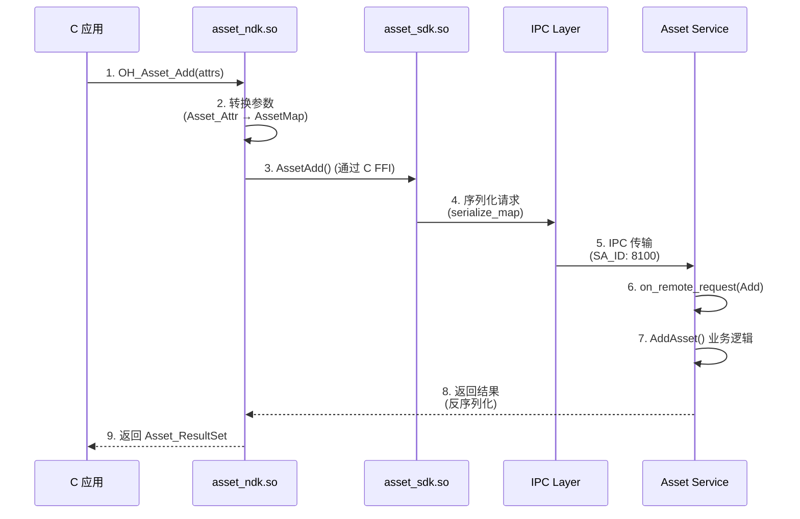

# 内部 API

## 目的

本文档描述 ASSET 服务的内部 API，包括模块接口、依赖方向、稳定性和可替换点。

## 适用范围

- 涵盖内容：系统服务间接口、模块 API、依赖关系
- 目标读者：系统开发者、框架开发者

---

## 模块接口概览

### 1. Framework 层接口

#### Frameworks/definition (类型定义)

**文件**：`frameworks/definition/src/lib.rs`

**主要类型**：
```rust
pub struct AssetMap {
    map: BTreeMap<Tag, Value>,
}

pub enum Tag {
    Secret, Alias, Accessibility, AuthType, ...
}

pub enum Value {
    Bool(bool),
    Number(u32),
    Bytes(Vec<u8>),
}

pub enum ErrCode {
    Success,
    InvalidArgument,
    PermissionDenied,
    ...
}
```

**证据**：`frameworks/definition/src/lib.rs`

#### Frameworks/ipc (IPC 通信)

**文件**：`frameworks/ipc/src/lib.rs:25-87`

**IpcCode 枚举**：
```rust
pub enum IpcCode {
    Add = ipc::FIRST_CALL_TRANSACTION,
    Remove,
    Update,
    PreQuery,
    Query,
    PostQuery,
    QuerySyncResult,
}
```

**序列化函数**：
- `serialize_map(map, parcel)` → `serialize_map(parcel, map)`
- `deserialize_map(parcel)` → `AssetMap`

**证据**：`frameworks/ipc/src/lib.rs:66-138`

---

## 2. Interfaces 层接口

### NDK 公共 API (interfaces/kits/c/)

**文件**：`interfaces/kits/c/inc/asset_api.h:76-257`

**函数清单**：
```c
int32_t OH_Asset_Add(const Asset_Attr *attributes, uint32_t attrCnt);
int32_t OH_Asset_Remove(const Asset_Attr *query, uint32_t queryCnt);
int32_t OH_Asset_Update(const Asset_Attr *query, uint32_t queryCnt,
                     const Asset_Attr *attributes, uint32_t updateCnt);
int32_t OH_Asset_PreQuery(const Asset_Attr *query, uint32_t queryCnt,
                         Asset_Blob *challenge);
int32_t OH_Asset_Query(const Asset_Attr *query, uint32_t queryCnt,
                        Asset_ResultSet *resultSet);
int32_t OH_Asset_PostQuery(const Asset_Attr *handle, uint32_t handleCnt,
                          Asset_Blob *authToken);
int32_t OH_Asset_QuerySyncResult(Asset_ResultSet *resultSet);
int32_t OH_Asset_ParseAttr(Asset_Attr *attributes, uint32_t attrCnt);
int32_t OH_Asset_FreeBlob(Asset_Blob *blob);
int32_t OH_Asset_FreeResultSet(Asset_ResultSet *resultSet);
```

**证据**：`interfaces/kits/c/inc/asset_api.h:76-145`

### 内部 C API (interfaces/inner_kits/c/)

**文件**：`interfaces/inner_kits/c/inc/asset_system_api.h:36-105`

**函数清单**：
```c
int32_t AssetAdd(const AssetAttr *attributes, uint32_t attrCnt);
int32_t AssetRemove(const AssetAttr *query, uint32_t queryCnt);
int32_t AssetUpdate(const AssetAttr *query, uint32_t queryCnt,
                   const AssetAttr *attributesToUpdate, uint32_t updateCnt);
int32_t AssetPreQuery(const AssetAttr *query, uint32_t queryCnt, AssetBlob *challenge);
int32_t AssetQuery(const AssetAttr *query, uint32_t queryCnt, AssetResultSet *resultSet);
int32_t AssetPostQuery(const AssetAttr *handle, uint32_t handleCnt, AssetBlob *authToken);
int32_t AssetQuerySyncResult(AssetResultSet *resultSet);
int32_t AssetParseAttr(AssetAttr *attributes, uint32_t attrCnt);
int32_t AssetFreeBlob(AssetBlob *blob);
int32_t AssetFreeResultSet(AssetResultSet *resultSet);
```

**证据**：`interfaces/inner_kits/c/inc/asset_system_api.h:44-93`

### Rust SDK (interfaces/inner_kits/rs/)

**文件**：`interfaces/inner_kits/rs/src/lib.rs`

**AssetManager trait**：
```rust
pub trait AssetManager {
    fn add(&self, attrs: &AssetMap) -> Result<()>;
    fn remove(&self, query: &AssetMap) -> Result<()>;
    fn update(&self, query: &AssetMap, attrs_to_update: &AssetMap) -> Result<()>;
    fn pre_query(&self, query: &AssetMap) -> Result<AssetBlob>;
    fn query(&self, query: &AssetMap) -> Result<AssetResultSet>;
    fn post_query(&self, handle: &AssetMap, auth_token: &AssetBlob) -> Result<AssetResultSet>;
    fn query_sync_result(&self) -> Result<AssetSyncResult>;
}
```

**证据**：`interfaces/inner_kits/rs/src/lib.rs:25-95`

---

## 3. Services 层接口

### Crypto Manager 接口

**文件**：`services/crypto_manager/src/huks_wrapper.c:1-61`

**函数清单**：
```c
int32_t GenerateKey(KeyId *keyId, HksBlob *keyAlias);
int32_t DeleteKey(KeyId *keyId);
int32_t IsKeyExist(KeyId *keyId, bool *isExist);
int32_t EncryptData(KeyId *keyId, HksBlob *plaintext, HksBlob *ciphertext);
int32_t DecryptData(KeyId *keyId, HksBlob *ciphertext, HksBlob *plaintext);
int32_t InitKey(KeyId *keyId, uint32_t authTimeout, const uint8_t *challenge);
int32_t ExecCrypt(KeyId *keyId, const uint8_t *authToken);
int32_t Drop(KeyId *keyId);
int32_t RenameKeyAlias(KeyId *keyId, HksBlob *newAlias);
```

**证据**：`services/crypto_manager/src/huks_wrapper.h`

### Database Operator 接口

**文件**：`services/db_operator/src/lib.rs`

**Database trait**：
```rust
pub trait Database {
    fn insert(&self, info: &DataInfo) -> Result<i64>;
    fn query(&self, query: &AssetMap, return_type: &ReturnType) -> Result<AssetResultSet>;
    fn update(&self, query: &AssetMap, update: &AssetMap) -> Result<u32>;
    fn delete(&self, query: &AssetMap) -> Result<u32>;
    fn begin_transaction(&self) -> Result<()>;
    fn commit(&self) -> Result<()>;
    fn rollback(&self) -> Result<()>;
}
```

**证据**：`services/db_operator/src/lib.rs:18-35`

---

## 依赖方向

### 接口层 → 框架层 → 服务层

```
interfaces/kits/c/asset_api.c
    ↓ (调用)
frameworks/c/system_api/asset_system_api.c
    ↓ (通过 Rust FFI)
interfaces/inner_kits/rs/src/lib.rs (AssetManager)
    ↓ (IPC)
frameworks/ipc/src/lib.rs (serialize/deserialize)
    ↓ (IPC 调用)
services/core_service/src/lib.rs (AssetAbility)
```

**证据**：
- C API 调用：`interfaces/kits/c/src/asset_api.c:30-70`（OH_Asset_Add → AssetAdd）
- Rust FFI：`interfaces/inner_kits/c/src/lib.rs`（C binding 到 Rust）
- IPC 调用：`services/core_service/src/stub.rs:20-100`（on_remote_request）

### 服务内部依赖

```
services/core_service/
    ├── frameworks/definition/ (类型定义)
    ├── frameworks/ipc/ (IPC 序列化)
    ├── frameworks/os_dependency/log/ (日志)
    ├── services/common/ (工具函数)
    ├── services/crypto_manager/ (加密)
    ├── services/db_operator/ (数据库)
    ├── services/os_dependency/ (OS 包装器)
    └── interfaces/inner_kits/rs/ (SDK 加载插件)
```

**证据**：`services/core_service/BUILD.gn:18-35`

---

## 稳定性标注

### 稳定接口

| 接口 | 稳定性 | 证据 |
|------|---------|------|
| `interfaces/kits/c/inc/asset_api.h` | **稳定**（公开 API） | bundle.json:68-97 |
| `interfaces/inner_kits/c/inc/asset_system_api.h` | **稳定**（内部 API） | bundle.json:83-93 |
| `frameworks/definition/src/lib.rs` | **稳定**（共享类型） | 所有模块依赖 |
| `frameworks/ipc/src/lib.rs` | **稳定**（IPC 协议） | 所有 IPC 调用 |
| `services/crypto_manager/src/huks_wrapper.h` | **稳定**（加密接口） | 核心加密 |

### 不稳定接口

| 接口 | 不稳定性 | 证据 |
|------|-----------|------|
| `interfaces/inner_kits/plugin_interface/` | **可替换**（插件系统） | 插件动态加载 |
| `services/plugin/src/asset_plugin.rs` | **可替换**（插件实现） | 服务启动时加载 |

---

## 可替换点

### 插件扩展点

**位置**：`services/plugin/src/asset_plugin.rs`

**IAssetPlugin trait**：
```rust
pub trait IAssetPlugin {
    fn redirect_request(&self, request: &mut MsgParcel) -> Result<()>;
    fn on_sa_extension(&self, extension: &str) -> Result<()>;
}
```

**用途**：允许第三方扩展 ASSET 服务能力（如备份/恢复、RSS 扩展）

**证据**：`interfaces/inner_kits/plugin_interface/src/plugin_interface.rs`

### OS 适配点

**位置**：`services/os_dependency/src/`（8 个包装器）

**可替换的服务包装器**：
- `access_token_wrapper.cpp` → 可替换不同的权限系统
- `bms_wrapper.cpp` → 可替换不同的包管理器
- `system_event_wrapper.cpp` → 可替换不同的事件系统

**证据**：`services/os_dependency/BUILD.gn:30-58`

---

## 关键调用链

### C NDK → Rust SDK → IPC → Service



**证据**：
- NDK 层：`interfaces/kits/c/src/asset_api.c:30-70`
- Rust SDK：`interfaces/inner_kits/rs/src/lib.rs:25-95`
- IPC 层：`frameworks/ipc/src/lib.rs:66-138`

---

## 相关跳转

- [项目概述](00_Overview.md) - 了解项目定位
- [对外 N-API](03_NAPI_API.md) - 了解 JS API
- [架构说明](02_Architecture.md) - 了解服务端实现
