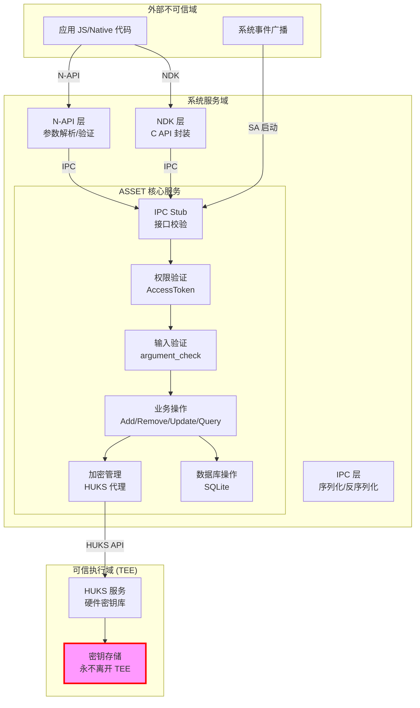
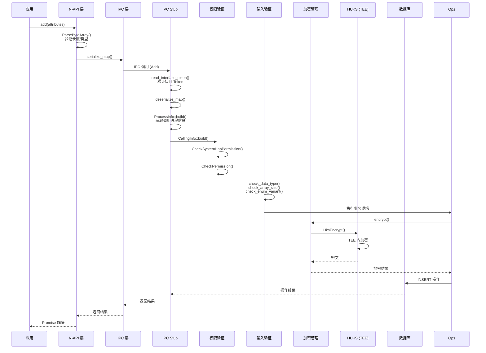

# 攻击面分析

## 目的

本文档系统识别 ASSET 服务的所有外部输入入口、敏感操作点和信任边界，为安全研究提供攻击面全景图。

## 适用范围

- 覆盖范围：所有外部可访问接口（N-API、NDK、IPC、系统事件）
- 不含：内部私有函数、测试代码

---

## 信任边界图



---

## 外部输入清单

### 1. N-API 层 (JavaScript/TypeScript 接口)

**位置**: `frameworks/js/napi/src/asset_napi*.cpp`

| 接口 | 函数名 | 输入类型 | 风险等级 |
|------|--------|----------|----------|
| Add | `NapiAdd()` | Asset 属性 Map | 高 |
| Remove | `NapiRemove()` | 查询条件 Map | 中 |
| Update | `NapiUpdate()` | 查询条件 + 更新属性 Map | 高 |
| PreQuery | `NapiPreQuery()` | 查询条件 Map | 中 |
| Query | `NapiQuery()` | 查询条件 Map | 高 |
| PostQuery | `NapiPostQuery()` | 句柄 Map | 中 |
| QuerySyncResult | `NapiQuerySyncResult()` | 查询条件 Map | 低 |

**输入验证点**:
- **位置**: `frameworks/js/napi/src/asset_napi_common.cpp:59-114`
- **验证逻辑**:
  ```cpp
  // 行 59-62: Blob 有效性检查
  bool IsBlobValid(const AssetBlob &blob) {
      return blob.size != 0 && blob.data != nullptr;
  }
  
  // 行 64-84: TypedArray 类型和长度检查
  napi_status ParseByteArray(const napi_env env, napi_value value, std::vector<uint8_t> &out) {
      // 验证 TypedArray、ArrayBuffer、DataView 类型
      // 验证长度 <= MAX_BUFFER_LEN (2048)
  }
  ```

**关键风险**:
- JS Map 可包含任意数量键值对
- 字节数组长度在 NAPI 层检查，但 Rust 层再次验证

---

### 2. NDK 层 (C 接口)

**位置**: `interfaces/kits/c/src/asset_api.c`

| 接口 | 函数名 | 输入类型 | 风险等级 |
|------|--------|----------|----------|
| Add | `OH_Asset_Add()` | Asset_Attr 数组 | 高 |
| Remove | `OH_Asset_Remove()` | Asset_Attr 数组 | 中 |
| Update | `OH_Asset_Update()` | Asset_Attr 数组 (×2) | 高 |
| PreQuery | `OH_Asset_PreQuery()` | Asset_Attr 数组 | 中 |
| Query | `OH_Asset_Query()` | Asset_Attr 数组 | 高 |
| PostQuery | `OH_Asset_PostQuery()` | Asset_Attr 数组 | 中 |
| QuerySyncResult | `OH_Asset_QuerySyncResult()` | Asset_Attr 数组 | 低 |

**输入数据结构**:
```c
// interfaces/kits/c/inc/asset_type.h
typedef struct {
    uint32_t size;      // 数据大小
    uint8_t *data;      // 数据指针
} Asset_Blob;

typedef union {
    bool boolean;
    uint32_t u32;
    Asset_Blob blob;
} Asset_Value;

typedef struct {
    uint32_t tag;       // 属性标签
    Asset_Value value;  // 属性值
} Asset_Attr;
```

**关键风险**:
- `size` 和 `data` 指针由调用方提供
- 需验证 `size` 与内存实际大小匹配
- 指针有效性依赖调用方

---

### 3. IPC 层

**位置**: `services/core_service/src/stub.rs:109-157`

| 操作码 | 名称 | 输入数据 | 风险等级 |
|--------|------|----------|----------|
| 1 | Add | AssetMap | 高 |
| 2 | Remove | AssetMap | 中 |
| 3 | Update | AssetMap × 2 | 高 |
| 4 | PreQuery | AssetMap | 中 |
| 5 | Query | AssetMap | 高 |
| 6 | PostQuery | AssetMap | 中 |
| 7 | QuerySyncResult | AssetMap | 低 |

**IPC 请求处理流程**:
```rust
// stub.rs:109-157
fn on_remote_request(stub: &AssetService, code: u32, data: &mut MsgParcel, reply: &mut MsgParcel) {
    // 1. 接口 Token 验证 (行 110-116)
    match data.read_interface_token() {
        Ok(interface_token) if interface_token == stub.descriptor() => {},
        _ => return Err(IpcStatusCode::Failed),
    }
    
    // 2. 反序列化 AssetMap (行 119)
    let map = deserialize_map(data)?;
    
    // 3. 构建进程信息 (行 120)
    let process_info = ProcessInfo::build(...)?;
    
    // 4. 构建调用信息 (行 121)
    let calling_info = CallingInfo::build(...);
    
    // 5. 分发操作
    match ipc_code {
        IpcCode::Add => stub.add(&calling_info, &map),
        // ...
    }
}
```

**反序列化验证**:
- **位置**: `frameworks/ipc/src/lib.rs:66-138`
- **容量限制**:
  - `MAX_MAP_CAPACITY`: 64 (最大属性数)
  - `MAX_VEC_CAPACITY`: 0x10000 (最大结果数)

**关键风险**:
- 反序列化前的数据来自 IPC，可能被篡改
- 依赖 `MsgParcel` 的完整性

---

### 4. 系统事件输入

**位置**: `sa_profile/8100.json:13-32`

| 事件类型 | 事件名称 | 触发场景 | 风险等级 |
|----------|----------|----------|----------|
| CommonEvent | PACKAGE_REMOVED | 应用卸载 | 中 |
| CommonEvent | SANDBOX_PACKAGE_REMOVED | 沙箱应用卸载 | 中 |
| CommonEvent | USER_REMOVED | 用户删除 | 高 |
| CommonEvent | CHARGING | 充电状态变化 | 低 |
| CommonEvent | USER_UNLOCKED | 用户解锁 | 中 |
| CommonEvent | RESTORE_START | 数据恢复开始 | 高 |
| CommonEvent | USER_PIN_CREATED_EVENT | PIN 创建 | 中 |
| CommonEvent | BOOT_COMPLETED | 启动完成 | 中 |
| TimedEvent | loopevent | 定时触发 (129600s) | 低 |

**事件处理**:
- **位置**: `services/core_service/src/common_event.rs`
- **风险**: 事件数据包含用户 ID、包名等，需验证来源

---

## 敏感操作清单

### 1. 权限验证操作

| 操作 | 位置 | 敏感权限 | 失败后果 |
|------|------|----------|----------|
| System HAP 检查 | `permission_check.rs:33` | 系统应用身份 | 拒绝跨用户操作 |
| 跨用户权限 | `permission_check.rs:38` | INTERACT_ACROSS_LOCAL_ACCOUNTS | 拒绝跨用户操作 |
| 持久化权限 | `operation_add_common.rs:61` | STORE_PERSISTENT_DATA | 拒绝持久化存储 |
| 同步权限 | `operation_add_common.rs:69` | 内部检查 | 拒绝特定同步类型 |

### 2. 加密操作

| 操作 | 位置 | 敏感操作 | 失败后果 |
|------|------|----------|----------|
| 密钥生成 | `huks_wrapper.c:130` | HUKS 生成 AES-256 密钥 | 无法加密新数据 |
| 数据加密 | `huks_wrapper.c:220` | AES-256-GCM 加密 | 数据泄露风险 |
| 数据解密 | `huks_wrapper.c:255` | AES-256-GCM 解密 | 无法读取数据 |
| 用户认证 | `huks_wrapper.c:297` | 挑战-应答认证 | 未授权访问 |
| 数据库密钥 | `db_key_operator.rs:121` | 生成 32 字节随机密钥 | 数据库加密失效 |

### 3. 文件系统操作

| 操作 | 位置 | 敏感路径 | 权限 |
|------|------|----------|------|
| CE 密钥读取 | `ce_operator.rs:38` | `/data/service/el2/{userId}/...` | 0o640 |
| CE 密钥写入 | `ce_operator.rs:55` | `/data/service/el2/{userId}/...` | 0o640 |
| DE 密钥读取 | `de_operator.rs:37` | `/data/misc_de/{userId}/...` | 0o700 |
| DE 密钥写入 | `de_operator.rs:53` | `/data/misc_de/{userId}/...` | 0o700 |
| 数据库操作 | `sqlite3_wrapper.c:27` | SQLite 数据库文件 | 0o640 |

### 4. 数据库操作

| 操作 | 位置 | SQL 类型 | 敏感数据 |
|------|------|----------|----------|
| 插入资产 | `table.rs` | INSERT | 加密数据、标签 |
| 查询资产 | `table.rs` | SELECT | 解密数据 |
| 更新资产 | `table.rs` | UPDATE | 加密数据、标签 |
| 删除资产 | `table.rs` | DELETE | 资产标识 |

---

## 数据流分析

### 典型操作数据流 (Add)



---

## 攻击面矩阵

| 攻击面 | 入口点 | 攻击向量 | 潜在影响 | 防护机制 |
|--------|--------|----------|----------|----------|
| **N-API 参数** | 19 个 JS API | 恶意 Map、超长数组 | DoS、内存耗尽 | 双层验证 (NAPI + Rust) |
| **NDK 参数** | 8 个 C API | 无效指针、错误 size | 内存损坏、崩溃 | Rust 层验证 |
| **IPC 数据** | 7 个操作码 | 篡改序列化数据 | 权限绕过 | Token 验证、反序列化检查 |
| **系统事件** | 10 个事件 | 伪造事件广播 | 未授权数据清理 | 事件来源验证 |
| **文件系统** | CE/DE 目录 | 路径遍历、权限绕过 | 密钥泄露 | 用户 ID 范围检查、权限设置 |
| **数据库** | SQLite | SQL 注入 | 数据泄露 | 参数化查询 |
| **加密操作** | HUKS API | 密钥别名碰撞 | 跨应用数据访问 | 密钥别名哈希 (SHA-256) |
| **权限验证** | AccessToken | Token 伪造 | 权限提升 | 系统服务验证 |

---

## 高风险入口点

### R1: N-API Add/Update 操作

**位置**: `frameworks/js/napi/src/asset_napi_add.cpp:43-56`

**风险**:
- SECRET 字段最大 1024 字节，但 JS 可发送大量数据
- NAPI 层验证后才截断，存在短暂的大内存分配窗口

**证据**:
```cpp
// asset_napi_add.cpp:43-56
napi_status CheckAddArgs(const napi_env env, const std::vector<AssetAttr> &attrs) {
    IF_ERROR_THROW_RETURN(env, CheckAssetRequiredTag(env, attrs, REQUIRED_TAGS));
    IF_ERROR_THROW_RETURN(env, CheckAssetTagValidity(env, attrs, validTags));
    IF_ERROR_THROW_RETURN(env, CheckAssetValueValidity(env, attrs));  // 长度检查
    return napi_ok;
}
```

### R2: IPC 反序列化

**位置**: `frameworks/ipc/src/lib.rs:66-138`

**风险**:
- 容量限制检查在循环之前
- 恶意数据可构造超大容量声明，导致内存预分配

**证据**:
```rust
// lib.rs:82-87
let len = parcel.read::<u32>()?;
if len > MAX_MAP_CAPACITY as u32 {  // 64
    return Err(AssetError::new(ErrCode::InvalidArgument, ...));
}
let mut map = AssetMap::with_capacity(len as usize);  // 内存分配
```

### R3: 用户 ID 范围检查

**位置**: `services/db_operator/src/common/permission_check.rs:44-50`

**风险**:
- 用户 ID 提取和范围检查非原子操作
- 竞态条件可能导致权限绕过

**证据**:
```rust
// permission_check.rs:44-50
let uid = Skeleton::calling_uid();
let user_id = get_user_id(uid)?;  // 提取
if user_id > ROOT_USER_UPPERBOUND {  // 检查
    return Err(AccessDenied);
}
```

---

## 相关文档

- [安全风险评估](07_Security_Review.md) - 详细风险分析和修复建议
- [对外 N-API](03_NAPI_API.md) - API 详细文档
- [架构说明](02_Architecture.md) - 系统架构图
- [代码证据库](_work/NOTES.md) - 完整代码引用

---

*文档版本: 1.0*
*更新时间: 2026-02-07*
