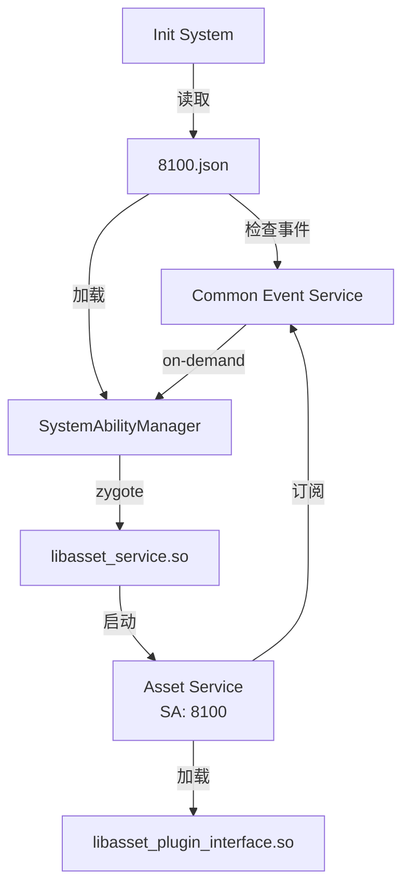
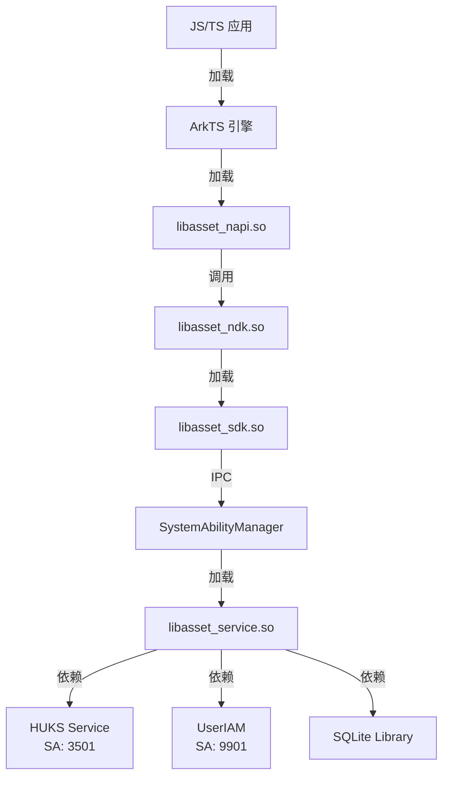

# 编译产物

## 目的

本文档详细说明 ASSET 服务的编译产物，包括 .so/.a/.hap/可执行文件、安装路径和运行时加载关系。

## 适用范围

- 涵盖内容：最终输出文件、安装位置、加载关系
- 目标读者：构建工程师、集成工程师

---

## 产物清单

### 共享库 (.so)

| 产物名称 | GN Target | 源目录 | 安装路径 | 加载方式 |
|-----------|-----------|---------|-----------|---------|
| `libasset_service.so` | services/core_service:asset_service | system/lib/ | SAMgr 加载（SA:8100） |
| `libasset_sdk.so` | interfaces/inner_kits/rs:asset_sdk_rust | system/lib/ | dlopen 动态加载 |
| `libasset_plugin_interface.so` | interfaces/inner_kits/plugin_interface:asset_plugin_interface_rust | system/lib/ | 插件系统加载 |
| `libasset_ndk.so` | interfaces/kits/c:asset_ndk | system/lib/ | 应用 NDK 链接 |
| `libasset_sdk.so` | frameworks/c/system_api:asset_sdk | system/lib/ | dlopen 动态加载 |
| `libasset_napi.so` | frameworks/js/napi:asset_napi | system/lib/module/security/ | ArkTS 引擎加载 |

### 静态库 (.a)

| 产物名称 | GN Target | 源目录 | 链接方式 |
|-----------|-----------|---------|---------|
| `libasset_common.a` | services/common:asset_common | services/core_service 静态链接 |
| `libasset_db_operator.a` | services/db_operator:asset_db_operator | services/core_service 静态链接 |
| `libasset_sqlite3_wrapper.a` | services/db_operator:asset_sqlite3_wrapper | services/db_operator 静态链接 |
| `libasset_crypto_manager.a` | services/crypto_manager:asset_crypto_manager | services/core_service 静态链接 |
| `libasset_huks_wrapper.a` | services/crypto_manager:asset_huks_wrapper | services/crypto_manager 静态链接 |
| `libasset_os_dependency.a` | services/os_dependency:asset_os_dependency | services/core_service 静态链接 |
| `libasset_plugin.a` | services/plugin:asset_plugin | services/core_service 静态链接 |
| `libasset_ipc.a` | frameworks/ipc:asset_ipc | interfaces/inner_kits/rs 静态链接 |
| `libasset_definition.a` | frameworks/definition:asset_definition | 所有模块静态链接 |
| `libasset_utils.a` | frameworks/utils:asset_utils | services/core_service 静态链接 |
| `libasset_file_operator.a` | frameworks/os_dependency/file:asset_file_operator | services/core_service 静态链接 |
| `libasset_log.a` | frameworks/os_dependency/log:asset_log | 所有模块静态链接 |
| `libasset_mem.a` | frameworks/os_dependency/memory:asset_mem | frameworks/js/napi 静态链接 |
| `libasset_openssl_wrapper.a` | frameworks/os_dependency/openssl:asset_openssl_wrapper | frameworks/utils 静态链接 |
| `libasset_timeout_feature.a` | interfaces/inner_kits/rs:asset_timeout_feature | interfaces/inner_kits/rs 静态链接 |

### 配置文件

| 产物名称 | GN Target | 安装路径 | 内容 |
|-----------|-----------|-----------|------|
| `8100.json` | sa_profile:asset_sa_profiles | system/profile/ | SA 配置 |
| `asset_service.cfg` | etc/init:asset_service.rc | system/etc/init/ | 服务启动配置 |

---

## 安装路径

### system/lib/

| 文件 | 用途 | 加载方 |
|------|------|--------|
| `libasset_service.so` | 主服务 | SAMgr（SystemAbilityManager） |
| `libasset_sdk.so` | Rust SDK | Rust 组件通过 dlopen |
| `libasset_plugin_interface.so` | 插件接口 | 插件系统通过 dlopen |
| `libasset_ndk.so` | NDK API | 应用通过 NDK 链接 |
| `libasset_sdk.so` | C 系统 API | Rust 组件通过 FFI |

### system/lib/module/security/

| 文件 | 用途 | 加载方 |
|------|------|--------|
| `libasset_napi.so` | JS API 绑定 | ArkTS 引擎 |

### system/profile/

| 文件 | 用途 | 加载方 |
|------|------|--------|
| `8100.json` | SA 配置 | SAMgr |
| `*.xml` | 其他 SA 配置 | SAMgr |

### system/etc/init/

| 文件 | 用途 | 加载方 |
|------|------|--------|
| `asset_service.cfg` | 服务启动配置 | Init 系统 |

---

## 运行时加载关系

### 服务启动流程

**证据**：`sa_profile/8100.json`（on-demand 启动触发器）

### 应用调用流程

**证据**：从依赖关系和 SA ID 推断

---

## 文件大小参考

### Bundle.json 资源

| 资源 | 大小 | 说明 |
|------|------|------|
| **ROM** | 5120KB | 静态存储占用 |
| **RAM** | 4828KB | 运行时内存占用 |

**证据**：`bundle.json:34-35`

### 各产物预估大小

| 产物 | 预估大小 | 主要内容 |
|------|-----------|---------|
| `libasset_service.so` | ~1.5MB | Rust 核心服务 + 静态依赖 |
| `libasset_napi.so` | ~150KB | JS 绑定 |
| `libasset_ndk.so` | ~100KB | C NDK 包装器 |
| `libasset_sdk.so` | ~800KB | Rust SDK + 静态依赖 |

**注**：实际大小以构建输出为准

---

## 依赖外部库

### 系统库

| 库名 | SA ID | 用途 |
|------|--------|------|
| HUKS | 3501 | 硬件密钥库（加密/解密） |
| UserIAM | 9901 | 统一用户认证（身份验证） |
| AccessToken | 6501 | 访问令牌服务（权限管理） |
| BundleManager | 3011 | 包管理器（应用信息） |
| Common Event Service | 6502 | 常用事件服务（事件订阅） |
| Memory Manager | 1909 | 内存管理器（内存使用监控） |

**证据**：`bundle.json:37-59`

### 第三方库

| 库名 | 用途 |
|------|------|
| `openssl` | SHA-256 哈希、随机数生成 |
| `sqlite3` | SQLite 数据库（通过 sqlcipher 加密） |
| `serde` | Rust 序列化框架 |
| `ylong_json` | JSON 解析 |
| `ylong_runtime` | 异步运行时 |

**证据**：`Cargo.toml`、`bundle.json`

---

## 构建验证

### Lint 检查

**Rust 代码**：
- `cargo clippy`（如果启用）
- `cargo fmt`（通过 rustfmt.toml）

**C/C++ 代码**：
- `-Wall`（所有警告）
- `-Werror`（警告即错误）

**证据**：`services/core_service/BUILD.gn:51-55`

### 符号检查

**安全符号**：
- PAC-RET（返回地址保护）
- CFI（控制流完整性）
- Sanitizers（未定义行为、边界检查）

**证据**：`interfaces/kits/c/BUILD.gn:43-50`

---

## 相关跳转

- [GN Targets](05_GN_Targets.md) - 了解构建配置
- [对外 N-API](03_NAPI_API.md) - 了解 JS API
- [架构说明](02_Architecture.md) - 了解运行时结构
