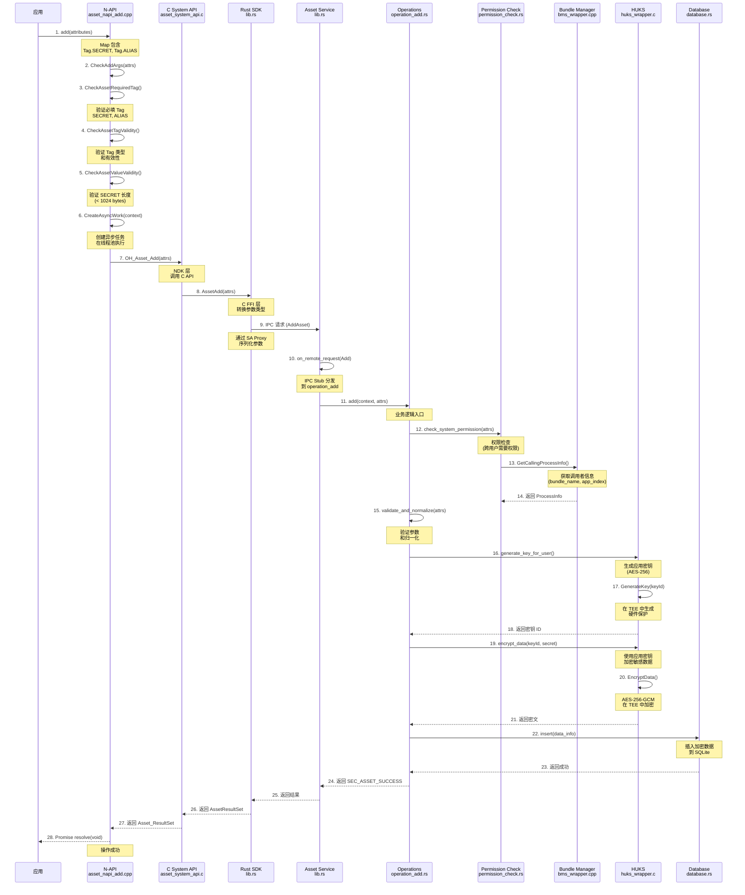
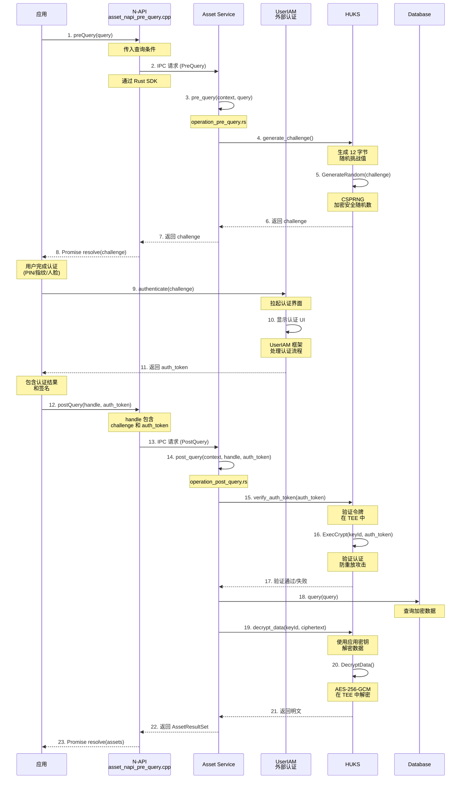
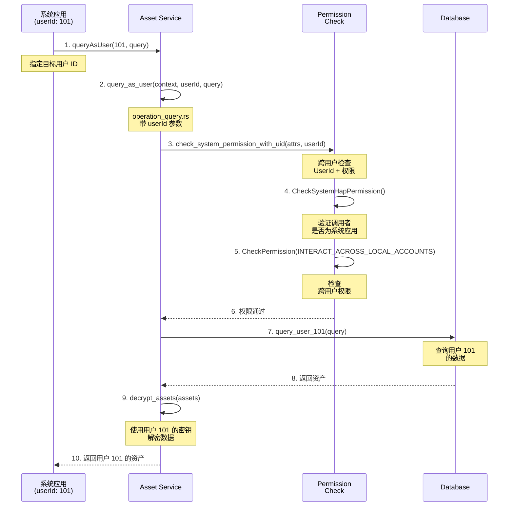

# 调用链示例

## 目的

本文档提供 ASSET 服务关键 API 的调用链示例，帮助理解从入口到核心逻辑的完整数据流。

## 适用范围

- 涵盖内容：关键调用链（入口→核心逻辑）
- 格式：文字说明 + Mermaid 图表

---

## 1. 添加资产调用链

### 完整调用链示意图



### 关键节点说明

| 节点 | 文件 | 函数 | 职责 |
|------|------|------|------|
| **参数验证** | asset_napi_add.cpp | CheckAddArgs | 必填/可选/类型检查 |
| **权限检查** | permission_check.rs | check_system_permission | INTERACT_ACROSS_LOCAL_ACCOUNTS 权限 |
| **应用信息** | bms_wrapper.cpp | GetCallingProcessInfo | Bundle Name, App Index |
| **密钥生成** | huks_wrapper.c | GenerateKey | 应用唯一 AES-256 密钥 |
| **加密** | huks_wrapper.c | EncryptData | AES-256-GCM 加密 |
| **存储** | database.rs | insert | SQLite 事务插入 |

---

## 2. 查询资产调用链（带认证）

### 完整调用链示意图



### 关键节点说明

| 节点 | 文件 | 函数 | 职责 |
|------|------|------|------|
| **挑战生成** | huks_wrapper.c | GenerateRandom | CSPRNG 12 字节挑战值 |
| **认证验证** | huks_wrapper.c | ExecCrypt | 在 TEE 中验证令牌 |
| **数据查询** | database.rs | query | 根据 alias 查询 |
| **数据解密** | huks_wrapper.c | DecryptData | AES-256-GCM 解密 |

---

## 3. 删除资产调用链（应用卸载）

### 完整调用链示意图

```mermaid
sequenceDiagram
    participant BMS as Bundle Manager
    participant EventSys as Common Event<br/>service
    participant Service as Asset Service
    participant DB as Database
    participant HUKS as HUKS
    participant Log as HiSysEvent

    BMS->>BMS: 1. 应用卸载
    Note over BMS: 应用从系统卸载

    BMS->>EventSys: 2. 发送 PACKAGE_REMOVED
    Note over EventSys: 广播卸载事件

    EventSys->>Service: 3. 事件回调
    Note over EventSys: 通知订阅者

    Service->>Service: 4. on_package_removed()
    Note over Service: common_event/start_event.rs

    Service->>DB: 5. query_all_by_bundle(bundle_name)
    Note over DB: 根据包名<br/>查询所有资产

    DB-->>Service: 6. 返回资产列表

    Service->>DB: 7. delete_batch(asset_ids)
    Note over DB: 删除所有<br/>相关资产

    DB-->>Service: 8. 返回删除计数

    loop loop for each asset in Service->>DB: 9. delete_key(keyId)
    Note over HUKS: 删除<br/>每个资产的密钥

    HUKS->>HUKS: 10. DeleteKey(keyId)
    Note over HUKS: 从 TEE<br/>删除密钥

    HUKS-->>Service: 11. 返回成功/失败

    Service->>Log: 12. upload_system_event()
    Note over Log: 上报统计<br/>或故障

    Log-->>Service: 13. 返回成功
```

### 关键节点说明

| 节点 | 文件 | 函数 | 职责 |
|------|------|------|------|
| **事件监听** | core_service | on_package_removed | 处理应用卸载事件 |
| **批量查询** | database.rs | query_all_by_bundle | 查询应用所有资产 |
| **批量删除** | database.rs | delete_batch | 事务删除多个记录 |
| **密钥清理** | huks_wrapper.c | DeleteKey | 从 HUKS 删除密钥 |
| **事件上报** | sys_event.rs | upload_system_event | 上报 Hisysevent |

---

## 4. 跨用户查询调用链（系统应用）

### 完整调用链示意图



### 关键节点说明

| 节点 | 文件 | 函数 | 职责 |
|------|------|------|------|
| **系统应用检查** | access_token_wrapper.cpp | CheckSystemHapPermission | 验证调用者身份 |
| **跨用户权限** | access_token_wrapper.cpp | CheckPermission | 验证 INTERACT_ACROSS_LOCAL_ACCOUNTS |
| **用户查询** | database.rs | query_user_* | 指定用户 ID 查询 |

---

## 调用链总结

### 关键数据流模式

1. **应用 → N-API → C System API → Rust SDK → Asset Service**
   - N-API 层：参数验证、异步任务管理
   - C API 层：参数转换、NDK 接口
   - Rust SDK 层：IPC 代理、序列化
   - Service 层：权限检查、业务逻辑、加密、存储

2. **Asset Service 内部流程**
   - 权限验证 → 业务逻辑 → 加密/解密 → 数据库操作

3. **依赖外部服务**
   - HUKS：密钥生成、加密/解密、认证验证
   - UserIAM：用户身份认证（preQuery/postQuery）
   - BMS：应用信息获取
   - AccessToken：权限验证
   - SQLite：数据持久化

### 线程模型

| 层次 | 线程模型 |
|------|---------|
| **应用层** | JS 主线程（N-API 回调） |
| **N-API 层** | JS 主线程 + 工作线程池（异步任务） |
| **服务层** | 主线程（SA 生命周期）+ 异步运行时 |
| **HUKS 层** | TEE 线程（硬件隔离） |
| **数据库层** | SQLite 事务线程 |

---

## 相关跳转

- [项目概述](00_Overview.md) - 了解项目定位
- [对外 N-API](03_NAPI_API.md) - 了解 JS API 详情
- [架构说明](02_Architecture.md) - 了解整体架构
- [内部 API](04_Inner_API.md) - 了解系统 API
