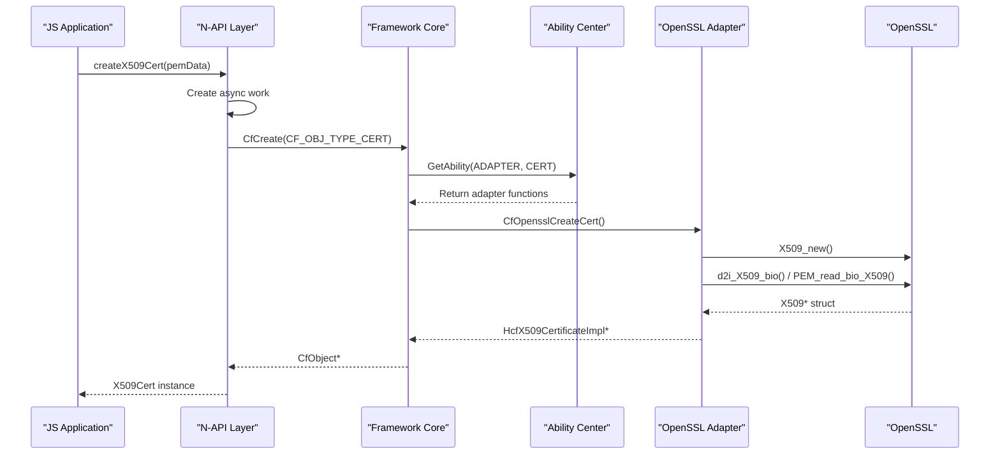

# 关键调用链

## 1. 证书创建调用链

### 1.1 JS API → OpenSSL 解析

```
┌─────────────────────────────────────────────────────────────────────────┐
│ JavaScript/TypeScript 调用入口                                            │
└─────────────────────────────────────────────────────────────────────────┘
                              │
                              ▼
┌─────────────────────────────────────────────────────────────────────────┐
│ certificate.createX509Cert(pemData)                                      │
│ 文件: frameworks/js/napi/certificate/src/napi_certificate_init.cpp:1964  │
│ 方法: NapiCreateX509Cert                                                │
└─────────────────────────────────────────────────────────────────────────┘
                              │
                              ▼
┌─────────────────────────────────────────────────────────────────────────┐
│ NapiCreateX509Cert → CreateX509CertExecute                              │
│ 文件: frameworks/js/napi/certificate/src/napi_x509_certificate.cpp       │
│ 功能: 解析编码数据，创建证书对象                                          │
└─────────────────────────────────────────────────────────────────────────┘
                              │
                              ▼
┌─────────────────────────────────────────────────────────────────────────┐
│ HcfX509CertificateCreate(const CfEncodingBlob *inStream, ...)          │
│ 文件: interfaces/inner_api/certificate/x509_certificate.h:137            │
└─────────────────────────────────────────────────────────────────────────┘
                              │
                              ▼
┌─────────────────────────────────────────────────────────────────────────┐
│ CfCreate(CF_OBJ_TYPE_CERT, encodingBlob, &certObject)                   │
│ 文件: frameworks/core/life/cf_api.c                                     │
└─────────────────────────────────────────────────────────────────────────┘
                              │
                              ▼
┌─────────────────────────────────────────────────────────────────────────┐
│ GetAbility(CF_ABILITY_TYPE_ADAPTER, CF_OBJ_TYPE_CERT)                  │
│ 文件: frameworks/ability/src/cf_ability.c                               │
└─────────────────────────────────────────────────────────────────────────┘
                              │
                              ▼
┌─────────────────────────────────────────────────────────────────────────┐
│ CfOpensslCreateCert(inStream, &certImpl)                                │
│ 文件: frameworks/adapter/v2.0/src/cf_adapter_cert_openssl.c            │
└─────────────────────────────────────────────────────────────────────────┘
                              │
                              ▼
┌─────────────────────────────────────────────────────────────────────────┐
│ OpensslX509CertSpiCreate(inStream, &spi)                               │
│ 功能: 调用 OpenSSL API 进行实际解析                                      │
│ X509_new() → d2i_X509_bio() / PEM_read_bio_X509()                     │
└─────────────────────────────────────────────────────────────────────────┘
```

### 1.2 调用链时序图



## 2. 证书链校验调用链

### 2.1 完整校验流程

```
┌─────────────────────────────────────────────────────────────────────────┐
│ JS: certChain.validate(trustAnchors, revocationCheckOption)            │
│ 文件: frameworks/js/napi/certificate/src/napi_x509_cert_chain.cpp      │
└─────────────────────────────────────────────────────────────────────────┘
                              │
                              ▼
┌─────────────────────────────────────────────────────────────────────────┐
│ NapiValidate → ValidateAsyncExecute                                     │
└─────────────────────────────────────────────────────────────────────────┘
                              │
                              ▼
┌─────────────────────────────────────────────────────────────────────────┐
│ HcfCertChain.validate(certChain, params, &result)                       │
│ 文件: interfaces/inner_api/certificate/x509_cert_chain.h:37-38         │
└─────────────────────────────────────────────────────────────────────────┘
                              │
                              ▼
┌─────────────────────────────────────────────────────────────────────────┐
│ CertChainValidatorCreate(algorithm, &validator)                         │
│ 功能: 根据算法创建验证器                                                 │
└─────────────────────────────────────────────────────────────────────────┘
                              │
                              ▼
┌─────────────────────────────────────────────────────────────────────────┐
│ validator->validate(certChain, params, result)                          │
│                                                                         │
│ 验证步骤:                                                               │
│ 1. 时间有效性检查 ──► isValidAt(date)                                   │
│ 2. 签名验证 ──► verifySignature(pubKey)                                │
│ 3. 吊销状态检查 ──► checkRevocation()                                  │
│ 4. 信任锚匹配 ──► matchTrustAnchor()                                    │
└─────────────────────────────────────────────────────────────────────────┘
                              │
            ┌───────────────┼───────────────┐
            ▼               ▼               ▼
    ┌─────────────┐ ┌─────────────┐ ┌─────────────────┐
    │ 签名验证    │ │ 吊销检查   │ │ 信任锚验证     │
    │ (OpenSSL)   │ │ (OCSP/CRL) │ │ (根证书匹配)   │
    └─────────────┘ └─────────────┘ └─────────────────┘
```

### 2.2 验证步骤详细说明

```c
// 证书链验证主流程 (伪代码)
CfResult ValidateCertChain(HcfCertChain *chain, 
                          HcfX509CertChainValidateParams *params,
                          HcfX509CertChainValidateResult *result)
{
    // 1. 时间检查
    for (each cert in chain) {
        if (!cert->isValidAt(params->date)) {
            result->error = "CERT_NOT_YET_VALID or EXPIRED";
            return CF_ERROR;
        }
    }
    
    // 2. 签名验证
    for (i = 0; i < chain.length - 1; i++) {
        CfResult ret = VerifySignature(chain[i], chain[i+1]);
        if (ret != CF_SUCCESS) {
            result->error = "SIGNATURE_FAILURE";
            return ret;
        }
    }
    
    // 3. 吊销状态检查 (如果启用)
    if (params->revocationCheck) {
        CfResult ret = CheckRevocation(chain, params->revocationOptions);
        if (ret != CF_SUCCESS) {
            result->error = "REVOCATION_CHECK_FAILED";
            return ret;
        }
    }
    
    // 4. 信任锚验证
    if (!MatchTrustAnchor(chain.last(), params->trustAnchors)) {
        result->error = "NO_TRUST_ANCHOR";
        return CF_ERROR;
    }
    
    result->isValid = true;
    return CF_SUCCESS;
}
```

## 3. CMS 签名生成调用链

```
┌─────────────────────────────────────────────────────────────────────────┐
│ JS: cmsGenerator.addSigner(cert, privateKey, digestAlg)                 │
└─────────────────────────────────────────────────────────────────────────┘
                              │
                              ▼
┌─────────────────────────────────────────────────────────────────────────┐
│ NapiAddSigner → AddSignerExecute                                        │
└─────────────────────────────────────────────────────────────────────────┘
                              │
                              ▼
┌─────────────────────────────────────────────────────────────────────────┐
│ HcfCmsGeneratorAddSigner(...)                                           │
│ 文件: frameworks/core/v1.0/certificate/cert_cms_generator.c             │
└─────────────────────────────────────────────────────────────────────────┘
                              │
                              ▼
┌─────────────────────────────────────────────────────────────────────────┐
│ CMS Signer 信息构建                                                     │
│ 1. 验证证书和私钥匹配                                                   │
│ 2. 构建 SignerInfo 结构                                                 │
└─────────────────────────────────────────────────────────────────────────┘
                              │
                              ▼
┌─────────────────────────────────────────────────────────────────────────┐
│ JS: cmsGenerator.doFinal()                                             │
└─────────────────────────────────────────────────────────────────────────┘
                              │
                              ▼
┌─────────────────────────────────────────────────────────────────────────┐
│ NapiDoFinal → DoFinalExecute                                            │
└─────────────────────────────────────────────────────────────────────────┘
                              │
                              ▼
┌─────────────────────────────────────────────────────────────────────────┐
│ HcfCmsGeneratorDoFinal(...)                                             │
│                                                                         │
│ 执行步骤:                                                               │
│ 1. 构建 SignedData 消息                                                 │
│ 2. 计算摘要                                                            │
│ 3. 使用私钥签名                                                        │
│ 4. 编码为 DER/PEM                                                      │
└─────────────────────────────────────────────────────────────────────────┘
                              │
                              ▼
┌─────────────────────────────────────────────────────────────────────────┐
│ OpenSSL CMS_* APIs                                                     │
│ CMS_sign(), CMS_add1_signer(), CMS_final()                            │
└─────────────────────────────────────────────────────────────────────────┘
```

## 4. PKCS#12 解析调用链

```
┌─────────────────────────────────────────────────────────────────────────┐
│ JS: parsePkcs12(keyStoreData, password)                                │
└─────────────────────────────────────────────────────────────────────────┘
                              │
                              ▼
┌─────────────────────────────────────────────────────────────────────────┐
│ NapiParsePKCS12 → ParsePKCS12Execute                                   │
└─────────────────────────────────────────────────────────────────────────┘
                              │
                              ▼
┌─────────────────────────────────────────────────────────────────────────┐
│ HcfParsePKCS12(keyStore, conf, &p12Collection)                        │
│ 文件: interfaces/inner_api/certificate/x509_cert_chain.h:77             │
└─────────────────────────────────────────────────────────────────────────┘
                              │
                              ▼
┌─────────────────────────────────────────────────────────────────────────┐
│ OpensslPKCS12Parse(keyStore, password, &pkey, &cert, &ca)              │
│                                                                         │
│ OpenSSL API:                                                           │
│ PKCS12_parse(p12, password, &pkey, &cert, &ca)                         │
└─────────────────────────────────────────────────────────────────────────┘
                              │
                              ▼
┌─────────────────────────────────────────────────────────────────────────┐
│ 提取结果封装                                                            │
│ - HcfX509P12Collection                                                 │
│   - privateKey (CfBlob)                                                │
│   - cert (HcfX509Certificate*)                                         │
│   - caCerts (HcfX509CertificateArray)                                  │
└─────────────────────────────────────────────────────────────────────────┘
```

## 5. 公共工具调用

### 5.1 参数处理调用链

```
CfInitParamSet() ──► CfAddParams() ──► CfBuildParamSet() ──► CfFreeParamSet()
     │                  │                  │
     ▼                  ▼                  ▼
参数集初始化        添加参数           构建内部结构      释放资源
```

### 5.2 错误码转换

```
OpenSSL Error Queue
        │
        ▼
ERR_get_error() ──► ERR_reason_error_string()
        │
        ▼
框架错误码映射 ──► CertResult 枚举
```

## 6. 关键入口点索引

| 功能 | JS 入口 | N-API 入口 | 核心入口 | 适配器入口 |
|------|---------|-----------|---------|-----------|
| 证书创建 | `createX509Cert` | `napi_certificate_init.cpp:1964` | `CfCreate` | `CfOpensslCreateCert` |
| 证书验证 | `cert.verify()` | `napi_x509_certificate.cpp` | `CfObject.get()` | `OpensslVerifyCert` |
| 证书链校验 | `chain.validate()` | `napi_x509_cert_chain.cpp` | `HcfCertChain.validate` | `OpensslCertChainValidate` |
| CRL 解析 | `createX509Crl` | `napi_x509_crl.cpp:1582` | `CfCreate` | `OpensslCreateCrl` |
| CMS 签名 | `cms.doFinal()` | `napi_cert_cms_generator.cpp` | `HcfCmsGeneratorDoFinal` | `OpensslCMSFinal` |
| PKCS12 解析 | `parsePkcs12` | `napi_x509_cert_chain.cpp` | `HcfParsePKCS12` | `PKCS12_parse` |
