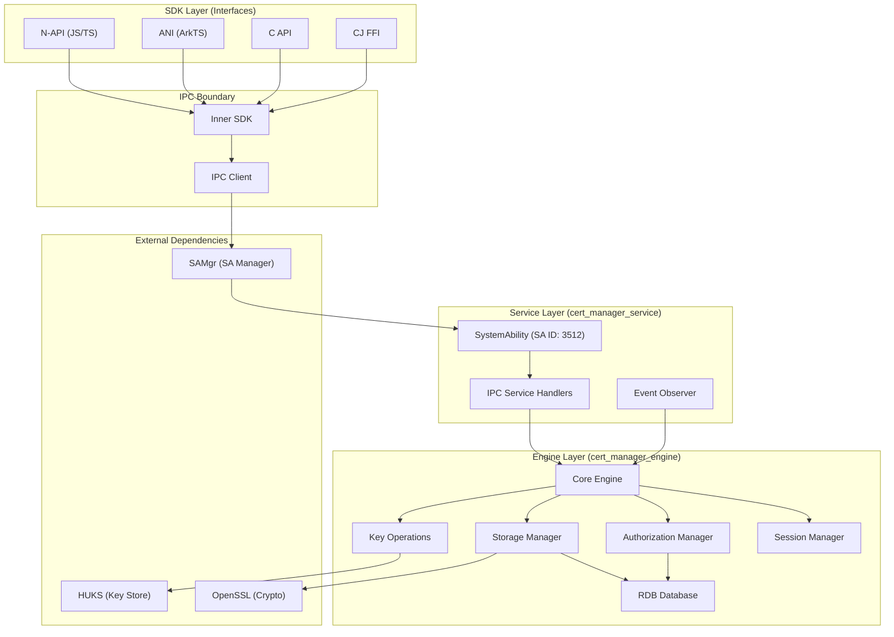
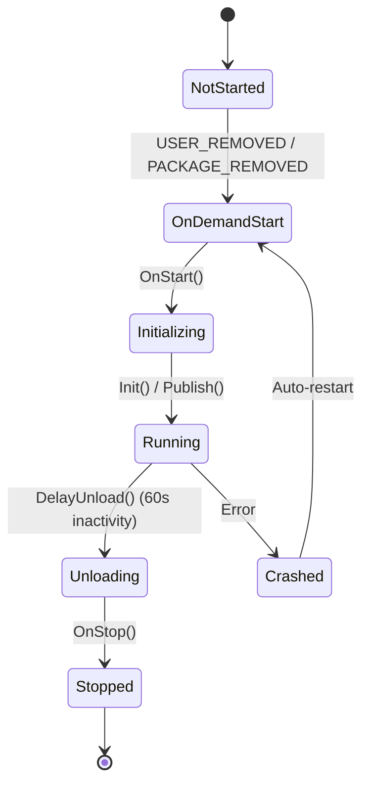
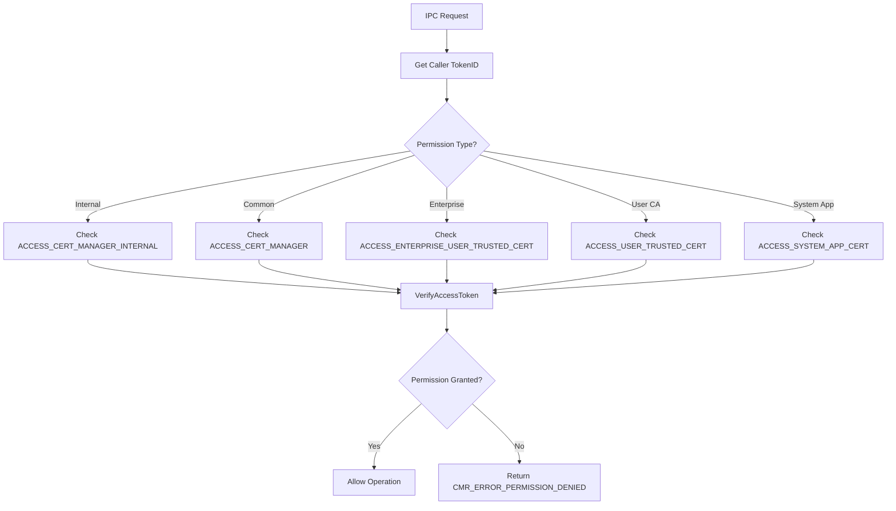
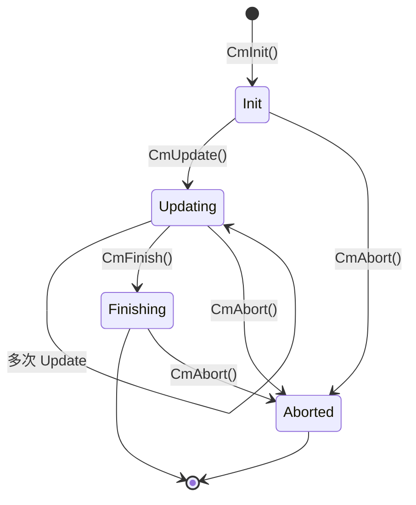
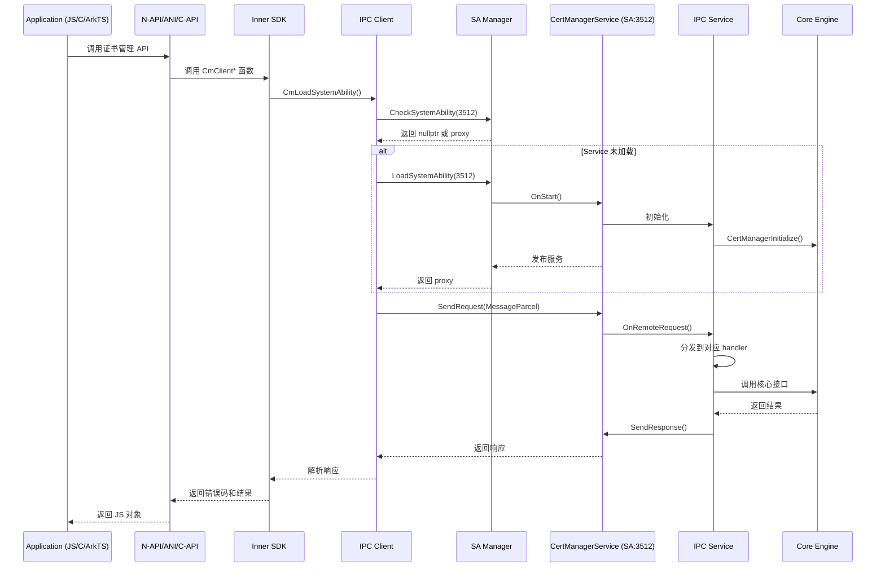
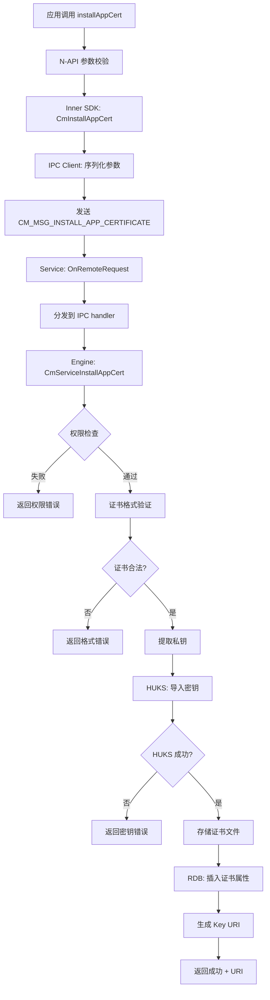
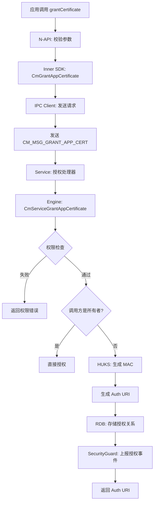
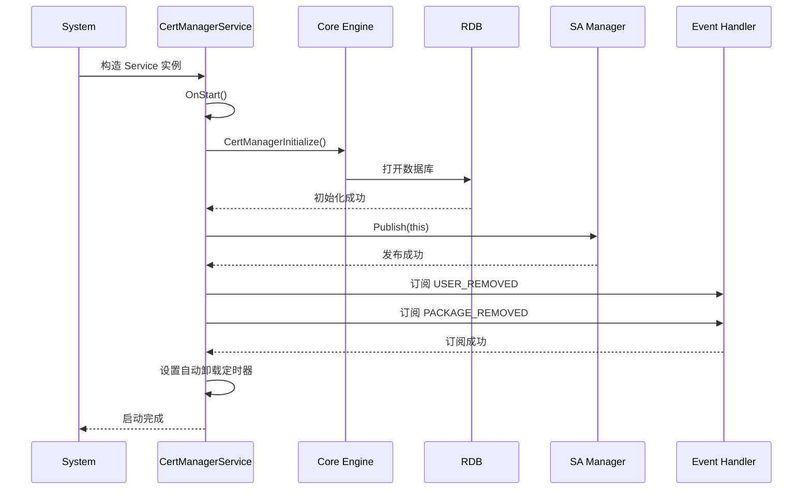
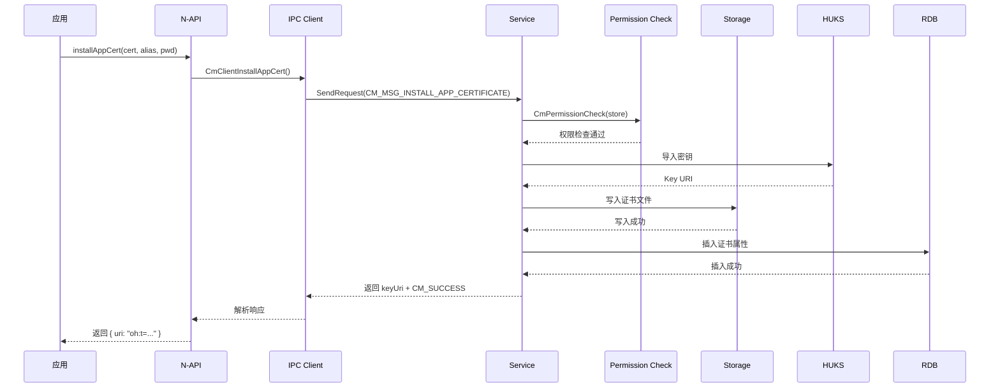
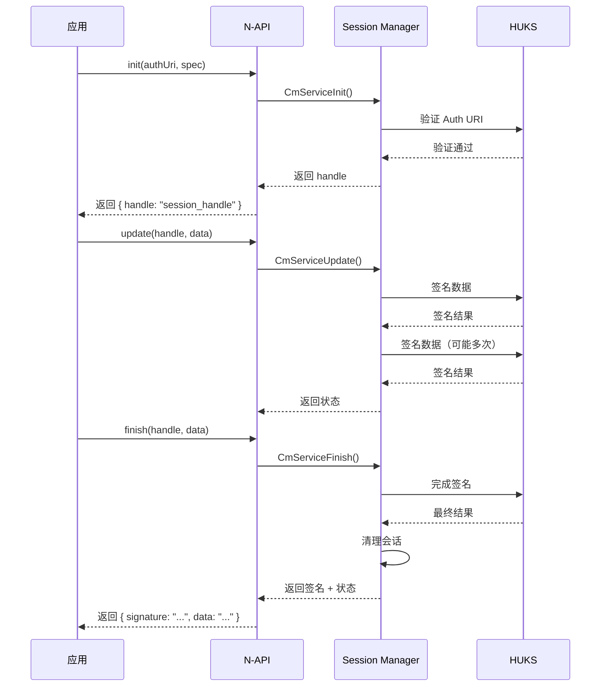

# 架构说明

> 证书管理模块的系统架构、组件图、数据流、线程模型和关键时序

## 文档目的

帮助开发者理解证书管理模块的系统架构、各组件交互方式、数据流向和线程模型。

## 适用范围

- 证书管理模块三层架构
- IPC 通信机制
- 组件交互时序
- 数据流转路径

## 三层架构概览

证书管理模块采用经典的三层架构设计，确保职责分离和模块化。



## 层次详解

### 1. SDK 层（Interfaces）

**职责**：提供多语言绑定，供不同类型的应用调用证书管理能力。

**子模块**：

| 模块 | 位置 | 目标语言 | 输出产物 |
|--------|------|-----------|----------|
| N-API | `interfaces/kits/napi/` | JavaScript/TypeScript | libcertmanager.z.so |
| ANI | `interfaces/kits/ani/` | ArkTS | libcertmanager_ani.z.so |
| C API | `interfaces/kits/c/` | C/C++ (NDK) | libohcert_manager.z.so |
| CJ FFI | `interfaces/kits/cj/` | Cangjie | libcj_cert_manager_ffi.z.so |
| Inner SDK | `interfaces/innerkits/` | 内部 C API | libcert_manager_sdk.z.so |

**关键特性**：
- 统一的 Inner SDK 提供内部接口
- 多语言绑定复用 Inner SDK
- 参数校验和错误处理在 SDK 层完成

**证据来源**：
- interfaces/kits/napi/BUILD.gn:17-76
- interfaces/innerkits/cert_manager_standard/main/BUILD.gn

### 2. Service 层（cert_manager_service）

**职责**：实现 SystemAbility，提供 IPC 服务接口，管理证书全生命周期。

**核心组件**：

#### SystemAbility (SA)

**类定义**：
```cpp
class CertManagerService : public SystemAbility,
                         public IRemoteStub<ICertManagerService>
```

**SA ID**：3512
**进程名**：cert_manager_service
**库文件**：libcert_manager_service.z.so

**生命周期**：



**关键方法**：

| 方法 | 职责 | 证据 |
|------|--------|------|
| `OnStart()` | 初始化服务、发布到 SAMgr、订阅系统事件 | cm_sa.h:54 |
| `OnStop()` | 清理资源、停止服务 | cm_sa.h:55 |
| `OnRemoteRequest()` | 主 IPC 入口，分发请求到对应处理器 | cm_sa.h:56 |
| `DelayUnload()` | 60 秒无活动后自动卸载 | cm_sa.h:58 |
| `OnAddSystemAbility()` | 监听其他 SA 启动事件 | cm_sa.h:62 |
| `OnRemoveSystemAbility()` | 监听其他 SA 停止事件 | cm_sa.h:63 |

**证据来源**：
- services/cert_manager_standard/cert_manager_service/main/os_dependency/sa/cm_sa.h:46-71
- services/cert_manager_standard/cert_manager_service/main/os_dependency/sa/sa_profile/cert_manager_service.json:3-6

#### IPC 服务端（IDL）

**职责**：处理 IPC 请求，调用 Engine 层接口。

**消息分发表**：
- `g_cmIpcHandler[]` - 标准 IPC 处理器
- `g_cmParcelIpcHandler[]` - Parcel 类型处理器（UKey 操作）

**证据来源**：
- services/cert_manager_standard/cert_manager_service/main/os_dependency/idl/cm_ipc/cm_ipc_service.h
- services/cert_manager_standard/cert_manager_service/main/os_dependency/idl/cm_ipc/cm_ipc_service.c

#### 事件观察者

**职责**：监听系统事件，触发服务启动或数据清理。

**订阅事件**：
- `usual.event.USER_REMOVED` - 用户删除
- `usual.event.PACKAGE_REMOVED` - 应用卸载

**证据来源**：
- services/cert_manager_standard/cert_manager_service/main/os_dependency/sa/cm_event_observer.h
- services/cert_manager_standard/cert_manager_service/main/os_dependency/sa/sa_profile/cert_manager_service.json:11-19

#### HiSysEvent 封装

**职责**：上报证书管理相关事件到 HiSysEvent 系统。

**事件类型**：
- 证书安装成功/失败
- 证书卸载成功/失败
- 授权操作

**证据来源**：
- services/cert_manager_standard/cert_manager_service/main/hisysevent_wrapper/

#### SecurityGuard 上报

**职责**：上报安全事件到 SecurityGuard 系统。

**证据来源**：
- services/cert_manager_standard/cert_manager_service/main/security_guard_report/

### 3. Engine 层（cert_manager_engine）

**职责**：实现证书管理的核心业务逻辑，包括存储、授权、密钥操作、会话管理。

**核心模块**：

#### 权限检查（cert_manager_permission_check）

**职责**：验证调用方权限，执行访问控制。

**权限类型**：
- `ACCESS_CERT_MANAGER_INTERNAL` - 内部特权
- `ACCESS_CERT_MANAGER` - 基础操作
- `ACCESS_ENTERPRISE_USER_TRUSTED_CERT` - 企业 CA
- `ACCESS_USER_TRUSTED_CERT` - 用户 CA
- `ACCESS_SYSTEM_APP_CERT` - 系统应用

**检查流程**：



**证据来源**：
- services/cert_manager_standard/cert_manager_engine/main/core/include/cert_manager_permission_check.h:25-41
- services/cert_manager_standard/cert_manager_engine/main/core/src/cert_manager_permission_check.cpp

#### 存储管理（cert_manager_storage）

**职责**：管理证书文件的存储和访问。

**存储结构**：
```
/data/service/el1/public/cert_manager_service/certificates/
├── {userId}/
│   └── {uid}/
│       ├── certificates/          # 证书文件
│       ├── authlist/            # 授权列表
│       └── config/              # 配置文件
```

**安全特性**：
- UserID + UID 双重隔离
- 目录权限：`0700`（仅所有者）
- 路径遍历保护

**证据来源**：
- services/cert_manager_standard/cert_manager_engine/main/core/include/cert_manager_storage.h

#### 授权管理（cert_manager_auth_mgr）

**职责**：管理应用间证书授权。

**授权 URI 格式**：
```
oh:t=ak;o={object};u={userId};a={uid};ca={clientUid};m={mac}
```

**MAC 保护**：
- MAC 密钥存储在 HUKS
- 每个证书最多授权 256 个应用
- 授权时验证 MAC

**证据来源**：
- services/cert_manager_standard/cert_manager_engine/main/core/include/cert_manager_auth_mgr.h

#### 密钥操作（cert_manager_key_operation）

**职责**：委托 HUKS 进行密钥操作。

**操作类型**：
- 密钥导入（从证书/P12）
- 密钥删除
- 密钥属性查询
- 密钥验证

**证据来源**：
- services/cert_manager_standard/cert_manager_engine/main/core/include/cert_manager_key_operation.h

#### 会话管理（cert_manager_session_mgr）

**职责**：管理多步签名操作（init/update/finish）。

**会话生命周期**：


**证据来源**：
- services/cert_manager_standard/cert_manager_engine/main/core/include/cert_manager_session_mgr.h

#### 数据库层（RDB）

**职责**：存储证书元数据和属性，提供快速查询。

**表结构**：
- 证书属性表
- 授权关系表
- 状态标志表

**数据库路径**：`/data/service/el1/public/cert_manager_service/rdb/`

**证据来源**：
- services/cert_manager_standard/cert_manager_engine/main/rdb/include/cm_rdb_data_manager.h
- services/cert_manager_standard/cert_manager_engine/main/rdb/include/cm_cert_property_rdb.h

### 4. Framework 层（公共组件）

**职责**：提供可复用的基础组件，被 SDK 层和 Service 层共享。

**关键组件**：

#### IPC 客户端（cm_ipc_client）

**职责**：封装 IPC 客户端逻辑，提供服务发现和请求发送。

**证据来源**：
- frameworks/cert_manager_standard/main/os_dependency/cm_ipc/include/cm_ipc_client.h
- frameworks/cert_manager_standard/main/os_dependency/cm_ipc/src/cm_ipc_client.c

#### 数据序列化（cm_data_parcel_processor）

**职责**：处理 IPC 数据的编解码。

**证据来源**：
- frameworks/cert_manager_standard/main/common/include/cm_data_parcel_processor.h

#### 证书工具（X509、PFX）

**职责**：
- X509 证书解析
- PFX/PKCS#12 文件处理
- PEM/DER 格式转换

**证据来源**：
- frameworks/cert_manager_standard/main/common/include/cm_x509.h
- frameworks/cert_manager_standard/main/common/include/cm_pfx.h

## IPC 通信机制

### IPC 架构图



### IPC 消息码

**定义位置**：`cert_manager_service_ipc_interface_code.h:24-57`

| 消息码 | 操作 | 证据 |
|--------|------|------|
| CM_MSG_GET_CERTIFICATE_LIST | 获取证书列表 | ipc_interface_code.h:27 |
| CM_MSG_GET_CERTIFICATE_INFO | 获取证书信息 | ipc_interface_code.h:28 |
| CM_MSG_SET_CERTIFICATE_STATUS | 设置证书状态 | ipc_interface_code.h:29 |
| CM_MSG_INSTALL_APP_CERTIFICATE | 安装应用证书 | ipc_interface_code.h:30 |
| CM_MSG_UNINSTALL_APP_CERTIFICATE | 卸载应用证书 | ipc_interface_code.h:31 |
| CM_MSG_UNINSTALL_ALL_APP_CERTIFICATE | 卸载所有应用证书 | ipc_interface_code.h:32 |
| CM_MSG_GET_APP_CERTIFICATE_LIST | 获取应用证书列表 | ipc_interface_code.h:33 |
| CM_MSG_GET_CALLING_APP_CERTIFICATE_LIST | 获取调用方证书列表 | ipc_interface_code.h:34 |
| CM_MSG_GET_APP_CERTIFICATE | 获取应用证书 | ipc_interface_code.h:35 |
| CM_MSG_GRANT_APP_CERT | 授权应用证书 | ipc_interface_code.h:36 |
| CM_MSG_GET_AUTHED_LIST | 获取授权列表 | ipc_interface_code.h:37 |
| CM_MSG_CHECK_IS_AUTHED_APP | 检查是否已授权 | ipc_interface_code.h:38 |
| CM_MSG_REMOVE_GRANT_APP | 移除授权 | ipc_interface_code.h:39 |
| CM_MSG_INIT | 初始化签名操作 | ipc_interface_code.h:40 |
| CM_MSG_UPDATE | 更新签名操作 | ipc_interface_code.h:41 |
| CM_MSG_FINISH | 完成签名操作 | ipc_interface_code.h:42 |
| CM_MSG_ABORT | 中止签名操作 | ipc_interface_code.h:43 |
| CM_MSG_GET_USER_CERTIFICATE_LIST | 获取用户证书列表 | ipc_interface_code.h:44 |
| CM_MSG_GET_USER_CERTIFICATE_INFO | 获取用户证书信息 | ipc_interface_code.h:45 |
| CM_MSG_SET_USER_CERTIFICATE_STATUS | 设置用户证书状态 | ipc_interface_code.h:46 |
| CM_MSG_INSTALL_USER_CERTIFICATE | 安装用户证书 | ipc_interface_code.h:47 |
| CM_MSG_UNINSTALL_USER_CERTIFICATE | 卸载用户证书 | ipc_interface_code.h:48 |
| CM_MSG_UNINSTALL_ALL_USER_CERTIFICATE | 卸载所有用户证书 | ipc_interface_code.h:49 |
| CM_MSG_GET_APP_CERTIFICATE_LIST_BY_UID | 按 UID 获取证书列表 | ipc_interface_code.h:50 |
| CM_MSG_GET_UKEY_CERTIFICATE_LIST | 获取 UKey 证书列表 | ipc_interface_code.h:51 |
| CM_MSG_GET_UKEY_CERTIFICATE | 获取 UKey 证书 | ipc_interface_code.h:52 |
| CM_MSG_CHECK_APP_PERMISSION | 检查应用权限 | ipc_interface_code.h:53 |

### IPC 线程配置

```cpp
constexpr int CM_IPC_THREAD_NUM = 32;
IPCSkeleton::SetMaxWorkThreadNum(CM_IPC_THREAD_NUM);
```

**证据来源**：cm_request.cpp 中的定义

## 数据流

### 证书安装流程



### 证书查询流程

```mermaid
flowchart LR
    A[应用调用 getCertList] --> B[N-API: 构造参数]
    B --> C[Inner SDK: CmGetCertList]
    C --> D[IPC Client: 发送请求]
    D --> E[发送 CM_MSG_GET_CERTIFICATE_LIST]
    E --> F[Service: OnRemoteRequest]
    F --> G[Engine: CmServiceGetCertList]
    G --> H{权限检查}
    H -->|失败| I[返回权限错误]
    H -->|通过| J[构造查询路径]
    J --> K{证书存储类型?}
    K -->|系统 CA| L[/etc/security/certificates]
    K -->|应用凭证| M[/data/service/.../credential]
    K -->|用户 CA| N[/data/service/.../user_open]
    L --> O[扫描目录]
    M --> O
    N --> O
    O --> P[RDB: 查询属性]
    P --> Q[构造证书列表]
    Q --> R[返回证书 URI 列表]
    R --> S[IPC: 发送响应]
    S --> T[N-API: 解析并返回]
```

### 授权流程



## 线程模型

### Service 层线程

1. **主线程**：SystemAbility 主线程
   - 处理 `OnStart()`、`OnStop()`
   - 处理事件监听

2. **IPC 线程池**：32 个工作线程
   - 处理 `OnRemoteRequest()`
   - 每个请求独立处理

3. **事件处理线程**：EventHandler
   - 处理系统事件
   - 处理自动卸载定时器

### Engine 层线程

1. **存储线程**：文件操作
   - 读写证书文件
   - 避免阻塞主线程

2. **RDB 线程**：数据库操作
   - 查询、插入、更新
   - 事务管理

3. **HUKS 回调**：异步密钥操作
   - HUKS 异步接口回调

## 关键时序

### 服务初始化时序



### 典型安装证书时序



### 签名操作时序



## 安全边界

### 信任边界

1. **进程边界**：应用与证书管理服务之间
   - 通过 IPC 隔离
   - 权限检查在服务端

2. **用户边界**：不同用户的数据隔离
   - UserID 隔离
   - 路径包含 userId

3. **应用边界**：不同应用的证书隔离
   - UID 隔离
   - 路径包含 uid

4. **密钥边界**：HUKS 硬件保护
   - 密钥不离开 HUKS
   - 操作通过 HUKS API

## 相关跳转

- [项目概述](00_Overview.md)
- [目录结构与模块职责](01_Directory_Structure.md)
- [N-API 接口文档](03_N-API.md)
- [内部 API 文档](04_Inner_API.md)

---

*更新时间：2026-02-06*
