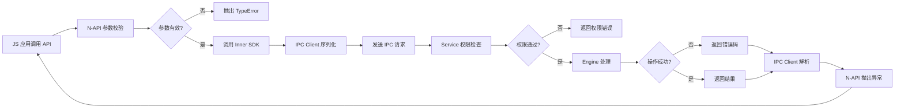

# N-API 接口文档

> 证书管理模块的 JavaScript Native API 完整参考

## 文档目的

提供 N-API（JavaScript Native API）的完整参考，包括模块注册、API 清单、参数、返回值、错误码和调用链。

## 适用范围

- security.certmanager 模块（主 N-API 模块）
- security.certManagerDialog 模块（对话框 N-API，条件编译）
- JavaScript/TypeScript 应用

## N-API 模块注册

### 主模块：security.certmanager

**模块名称**：`security.certmanager`
**注册函数**：`CMNapiRegister`
**入口文件**：`interfaces/kits/napi/src/cm_napi.cpp`
**构造函数**：`CertManagerRegister`

**代码证据**：
```cpp
// cm_napi.cpp:255-268
static napi_module g_module = {
    .nm_version = 1,
    .nm_flags = 0,
    .nm_filename = nullptr,
    .nm_register_func = CMNapiRegister,
    .nm_modname = "security.certmanager",
    .nm_priv =  nullptr,
    .reserved = { nullptr },
};

__attribute__((constructor)) void CertManagerRegister(void)
{
    napi_module_register(&g_module);
}
```

### 对话框模块：security.certManagerDialog

**条件**：`certificate_manager_feature_dialog_enabled` 为 true（依赖 ace_engine）
**注册函数**：`CMDialogNapiRegister`
**入口文件**：`interfaces/kits/napi/src/dialog/cm_napi_dialog.cpp`

**代码证据**：
```cpp
// cm_napi_dialog.cpp
static napi_module g_dialogModule = {
    .nm_version = 1,
    .nm_flags = 0,
    .nm_filename = nullptr,
    .nm_register_func = CMDialogNapiRegister,
    .nm_modname = "security.certManagerDialog",
    .nm_priv = nullptr,
    .reserved = { nullptr },
};
```

## 导出常量

### CMErrorCode - 错误码

**导出位置**：cm_napi.cpp:45-61

| JS 常量名 | 值 | 错误描述 | C++ 错误码 |
|-----------|-----|----------|-----------|
| CM_ERROR_NO_PERMISSION | -23 | 无权限 | HAS_NO_PERMISSION |
| CM_ERROR_NOT_SYSTEM_APP | -26 | 非系统应用 | NOT_SYSTEM_APP |
| CM_ERROR_INVALID_PARAMS | -7 | 参数无效 | PARAM_ERROR |
| CM_ERROR_GENERIC | -1 | 通用错误 | INNER_FAILURE |
| CM_ERROR_NO_FOUND | -5 | 未找到 | NOT_FOUND |
| CM_ERROR_INCORRECT_FORMAT | -20 | 格式错误 | INVALID_CERT_FORMAT |
| CM_ERROR_MAX_CERT_COUNT_REACHED | -27 | 达到最大证书数 | MAX_CERT_COUNT_REACHED |
| CM_ERROR_NO_AUTHORIZATION | -24 | 无授权 | NO_AUTHORIZATION |
| CM_ERROR_ALIAS_LENGTH_REACHED_LIMIT | -28 | 别名长度超限 | ALIAS_LENGTH_REACHED_LIMIT |
| CM_ERROR_DEVICE_ENTER_ADVSECMODE | -30 | 设备进入高级安全模式 | DEVICE_ENTER_ADVSECMODE |
| CM_ERROR_PASSWORD_IS_ERR | -36 | 密码错误 | PASSWORD_IS_ERROR |
| CM_ERROR_STORE_PATH_NOT_SUPPORTED | -10014 | 存储路径不支持 | STORE_PATH_NOT_SUPPORTED |
| CM_ERROR_ACCESS_UKEY_SERVICE_FAILED | -51 | UKey 服务访问失败 | ACCESS_UKEY_SERVICE_FAILED |
| CM_ERROR_PARAMETER_VALIDATION_FAILED | -44 | 参数校验失败 | PARAMETER_VALIDATION_FAILED |

**完整错误码**：参见 `cm_type.h:134-237`

### CmKeyPurpose - 密钥用途

**导出位置**：cm_napi.cpp:73-82

| JS 常量名 | 值 | 说明 |
|-----------|-----|------|
| CM_KEY_PURPOSE_SIGN | 4 | 签名 |
| CM_KEY_PURPOSE_VERIFY | 8 | 验签 |

### CmKeyDigest - 摘要算法

**导出位置**：cm_napi.cpp:84-98

| JS 常量名 | 值 | 说明 |
|-----------|-----|------|
| CM_DIGEST_NONE | 0 | 无摘要 |
| CM_DIGEST_MD5 | 1 | MD5 |
| CM_DIGEST_SM3 | 2 | SM3（国密） |
| CM_DIGEST_SHA1 | 10 | SHA1 |
| CM_DIGEST_SHA224 | 11 | SHA224 |
| CM_DIGEST_SHA256 | 12 | SHA256 |
| CM_DIGEST_SHA384 | 13 | SHA384 |
| CM_DIGEST_SHA512 | 14 | SHA512 |

### CmKeyPadding - 填充方式

**导出位置**：cm_napi.cpp:100-109

| JS 常量名 | 值 | 说明 |
|-----------|-----|------|
| CM_PADDING_NONE | 0 | 无填充 |
| CM_PADDING_PSS | 2 | PSS 填充 |
| CM_PADDING_PKCS1_V1_5 | 3 | PKCS#1 v1.5 |

### CertType - 证书类型

**导出位置**：cm_napi.cpp:111-119

| JS 常量名 | 值 | 说明 |
|-----------|-----|------|
| CA_CERT_SYSTEM | 0 | 系统 CA 证书 |
| CA_CERT_USER | 1 | 用户 CA 证书 |

### CertScope - 证书范围

**导出位置**：cm_napi.cpp:121-129

| JS 常量名 | 值 | 说明 |
|-----------|-----|------|
| CURRENT_USER | 1 | 当前用户 |
| GLOBAL_USER | 2 | 全局用户 |

### CertFileFormat - 文件格式

**导出位置**：cm_napi.cpp:131-139

| JS 常量名 | 值 | 说明 |
|-----------|-----|------|
| PEM_DER | 0 | PEM 或 DER 格式 |
| P7B | 1 | P7B 格式（PKCS#7） |

### AuthStorageLevel - 存储级别

**导出位置**：cm_napi.cpp:141-150

| JS 常量名 | 值 | 说明 |
|-----------|-----|------|
| EL1 | 1 | 基础安全级别 |
| EL2 | 2 | 中等安全级别 |
| EL4 | 4 | 最高安全级别 |

### CertAlgorithm - 算法类型

**导出位置**：cm_napi.cpp:152-160

| JS 常量名 | 值 | 说明 |
|-----------|-----|------|
| INTERNATIONAL | 0 | 国际标准算法 |
| SM | 1 | SM 国密算法 |

### CertificatePurpose - 证书用途

**导出位置**：cm_napi.cpp:162-173

| JS 常量名 | 值 | 说明 |
|-----------|-----|------|
| PURPOSE_DEFAULT | 0 | 默认用途 |
| PURPOSE_ALL | 1 | 所有用途 |
| PURPOSE_SIGN | 2 | 签名 |
| PURPOSE_ENCRYPT | 3 | 加密 |

## API 清单

### 1. 系统证书管理 API

#### getSystemTrustedCertificateList

获取系统可信根证书列表。

**函数签名**：
```typescript
function getSystemTrustedCertificateList(): Promise<CertInfo[]>
```

**N-API 入口**：`CMNapiGetSystemCertList`
**IPC 消息码**：`CM_MSG_GET_CERTIFICATE_LIST`
**存储类型**：`CM_SYSTEM_TRUSTED_STORE`

**参数**：无

**返回值**：
```typescript
Promise<CertInfo[]>
```

**CertInfo 结构**：
```typescript
interface CertInfo {
    uri: string;              // 证书 URI
    certAlias: string;         // 证书别名
    status: boolean;            // 证书状态（true=启用，false=禁用）
    subjectName: string;       // 主题名称
    issuerName: string;        // 颁发者名称
    serial: string;            // 序列号
    notBefore: string;         // 生效时间
    notAfter: string;          // 失效时间
    fingerprintSha256: string;   // SHA256 指纹
}
```

**权限要求**：`ohos.permission.ACCESS_CERT_MANAGER` + `ohos.permission.ACCESS_CERT_MANAGER_INTERNAL`

**调用链**：
```
JS App → CMNapiGetSystemCertList
→ CmGetCertList(store=CM_SYSTEM_TRUSTED_STORE)
→ CmClientGetCertList()
→ IPC: CM_MSG_GET_CERTIFICATE_LIST
→ Service: CmServiceGetCertList()
→ Engine: 扫描 /etc/security/certificates/
→ 返回证书列表
```

**错误码**：
- `CM_ERROR_NO_PERMISSION` - 无权限
- `CM_ERROR_NOT_SYSTEM_APP` - 非系统应用
- `CM_ERROR_GENERIC` - 通用错误

#### getSystemTrustedCertificate

获取系统可信根证书详细信息。

**函数签名**：
```typescript
function getSystemTrustedCertificate(uri: string): Promise<CertInfo>
```

**N-API 入口**：`CMNapiGetSystemCertInfo`
**IPC 消息码**：`CM_MSG_GET_CERTIFICATE_INFO`

**参数**：
- `uri: string` - 证书 URI（来自 `getSystemTrustedCertificateList()`）

**返回值**：`Promise<CertInfo>`

**权限要求**：`ohos.permission.ACCESS_CERT_MANAGER` + `ohos.permission.ACCESS_CERT_MANAGER_INTERNAL`

#### setCertificateStatus

设置系统证书的启用/禁用状态。

**函数签名**：
```typescript
function setCertificateStatus(uri: string, status: boolean): Promise<void>
```

**N-API 入口**：`CMNapiSetCertStatus`
**IPC 消息码**：`CM_MSG_SET_CERTIFICATE_STATUS`

**参数**：
- `uri: string` - 证书 URI
- `status: boolean` - 证书状态（true=启用，false=禁用）

**返回值**：`Promise<void>`

**权限要求**：`ohos.permission.ACCESS_CERT_MANAGER` + `ohos.permission.ACCESS_CERT_MANAGER_INTERNAL`

### 2. 应用公钥凭证管理 API

#### installPublicCertificate

安装应用公钥证书（不含私钥）。

**函数签名**：
```typescript
function installPublicCertificate(
    certData: Uint8Array,
    alias: string,
    storeType: CertType = CertType.CA_CERT_USER
): Promise<string>
```

**N-API 入口**：`CMNapiInstallPublicCert`
**IPC 消息码**：`CM_MSG_INSTALL_APP_CERTIFICATE`

**参数**：
- `certData: Uint8Array` - 证书数据（PEM/DER 格式）
- `alias: string` - 证书别名（最大 128 字节）
- `storeType: CertType` - 存储类型（默认：CA_CERT_USER）

**返回值**：`Promise<string>` - 证书 URI

**权限要求**：`ohos.permission.ACCESS_CERT_MANAGER`

**调用链**：
```
JS App → CMNapiInstallPublicCert
→ CmInstallAppCert(certData, alias, store)
→ CmClientInstallAppCert()
→ IPC: CM_MSG_INSTALL_APP_CERTIFICATE
→ Service: CmServiceInstallAppCert()
→ Engine: 权限检查 → 证书解析 → 存储文件 → RDB 插入
→ HUKS: 公钥导入（如果有）
→ 返回 keyUri
```

**错误码**：
- `CM_ERROR_INVALID_PARAMS` - 参数无效
- `CM_ERROR_INCORRECT_FORMAT` - 证书格式错误
- `CM_ERROR_MAX_CERT_COUNT_REACHED` - 达到最大数量（512）
- `CM_ERROR_ALIAS_LENGTH_REACHED_LIMIT` - 别名过长
- `CM_ERROR_NO_PERMISSION` - 无权限

#### uninstallAllAppCertificate

卸载所有应用证书。

**函数签名**：
```typescript
function uninstallAllAppCertificate(
    storeType: CertType
): Promise<void>
```

**N-API 入口**：`CMNapiUninstallAllAppCert`
**IPC 消息码**：`CM_MSG_UNINSTALL_ALL_APP_CERTIFICATE`

**参数**：
- `storeType: CertType` - 存储类型

**返回值**：`Promise<void>`

**权限要求**：`ohos.permission.ACCESS_CERT_MANAGER` + `ohos.permission.ACCESS_CERT_MANAGER_INTERNAL`

#### uninstallPublicCertificate

卸载指定的应用证书。

**函数签名**：
```typescript
function uninstallPublicCertificate(
    keyUri: string
): Promise<void>
```

**N-API 入口**：`CMNapiUninstallPublicCert`
**IPC 消息码**：`CM_MSG_UNINSTALL_APP_CERTIFICATE`

**参数**：
- `keyUri: string` - 证书的 Key URI

**返回值**：`Promise<void>`

**权限要求**：`ohos.permission.ACCESS_CERT_MANAGER`

#### getAllPublicCertificates

获取所有应用公钥证书列表。

**函数签名**：
```typescript
function getAllPublicCertificates(
    storeType: CertType
): Promise<CertInfo[]>
```

**N-API 入口**：`CMNapiGetAllPublicCertList`
**IPC 消息码**：`CM_MSG_GET_APP_CERTIFICATE_LIST`

**返回值**：`Promise<CertInfo[]>`

#### getPublicCertificate

获取指定的应用公钥证书。

**函数签名**：
```typescript
function getPublicCertificate(
    keyUri: string
): Promise<CertInfo>
```

**N-API 入口**：`CMNapiGetPublicCertInfo`
**IPC 消息码**：`CM_MSG_GET_APP_CERTIFICATE`

**参数**：
- `keyUri: string` - 证书的 Key URI

**返回值**：`Promise<CertInfo>`

### 3. 用户 CA 证书管理 API

#### installUserTrustedCertificate

安装用户 CA 证书（异步）。

**函数签名**：
```typescript
function installUserTrustedCertificate(
    certData: Uint8Array,
    alias: string,
    status: boolean = true
): Promise<string>
```

**N-API 入口**：`CMNapiInstallUserTrustedCert`
**IPC 消息码**：`CM_MSG_INSTALL_USER_CERTIFICATE`

**参数**：
- `certData: Uint8Array` - 证书数据
- `alias: string` - 证书别名
- `status: boolean` - 初始状态（默认：true）

**返回值**：`Promise<string>` - 证书 URI

**权限要求**：`ohos.permission.ACCESS_USER_TRUSTED_CERT` 或 `ohos.permission.ACCESS_ENTERPRISE_USER_TRUSTED_CERT`

#### installUserTrustedCertificateSync

安装用户 CA 证书（同步）。

**函数签名**：
```typescript
function installUserTrustedCertificateSync(
    certData: Uint8Array,
    alias: string,
    status: boolean = true
): { uri: string }
```

**N-API 入口**：`CMNapiInstallUserTrustedCertSync`

**调用模式**：同步（直接返回，无 Promise）

#### uninstallAllUserTrustedCertificate

卸载所有用户 CA 证书。

**函数签名**：
```typescript
function uninstallAllUserTrustedCertificate(): Promise<void>
```

**N-API 入口**：`CMNapiUninstallAllUserTrustedCert`
**IPC 消息码**：`CM_MSG_UNINSTALL_ALL_USER_CERTIFICATE`

**权限要求**：`ohos.permission.ACCESS_USER_TRUSTED_CERT` 或 `ohos.permission.ACCESS_ENTERPRISE_USER_TRUSTED_CERT`

#### uninstallUserTrustedCertificate

卸载指定的用户 CA 证书（异步）。

**函数签名**：
```typescript
function uninstallUserTrustedCertificate(
    certUri: string
): Promise<void>
```

**N-API 入口**：`CMNapiUninstallUserTrustedCert`
**IPC 消息码**：`CM_MSG_UNINSTALL_USER_CERTIFICATE`

#### uninstallUserTrustedCertificateSync

卸载指定的用户 CA 证书（同步）。

**函数签名**：
```typescript
function uninstallUserTrustedCertificateSync(
    certUri: string
): void
```

**N-API 入口**：`CMNapiUninstallUserCertSync`

#### getAllUserTrustedCertificates

获取所有用户 CA 证书列表。

**函数签名**：
```typescript
function getAllUserTrustedCertificates(): Promise<CertInfo[]>
```

**N-API 入口**：`CMNapiGetAllUserTrustedCertList`
**IPC 消息码**：`CM_MSG_GET_USER_CERTIFICATE_LIST`

**返回值**：`Promise<CertInfo[]>`

#### getUserTrustedCertificate

获取指定的用户 CA 证书。

**函数签名**：
```typescript
function getUserTrustedCertificate(
    certUri: string
): Promise<CertInfo>
```

**N-API 入口**：`CMNapiGetUserTrustedCertInfo`
**IPC 消息码**：`CM_MSG_GET_USER_CERTIFICATE_INFO`

### 4. 私钥凭证管理 API

#### installPrivateCertificate

安装应用私钥凭证（含私钥）。

**函数签名**：
```typescript
function installPrivateCertificate(
    certData: Uint8Array,
    password: string,
    alias: string,
    storageLevel: AuthStorageLevel = AuthStorageLevel.EL1
): Promise<string>
```

**N-API 入口**：`CMNapiInstallPrivateAppCert`
**IPC 消息码**：`CM_MSG_INSTALL_APP_CERTIFICATE`

**参数**：
- `certData: Uint8Array` - 证书数据（PKCS#12 或 PEM）
- `password: string` - 证书密码（如果有）
- `alias: string` - 证书别名
- `storageLevel: AuthStorageLevel` - 存储级别（默认：EL1）

**返回值**：`Promise<string>` - Key URI

**权限要求**：`ohos.permission.ACCESS_CERT_MANAGER`

**调用链**：
```
JS App → CMNapiInstallPrivateAppCert
→ CmInstallAppCertEx()
→ CmClientInstallAppCert()
→ IPC: CM_MSG_INSTALL_APP_CERTIFICATE
→ Service: CmServiceInstallAppCert()
→ Engine: 权限检查 → 证书解析 → 提取私钥
→ HUKS: 导入私钥到密钥库
→ Engine: 存储证书文件 → RDB 插入属性
→ 返回 keyUri
```

**错误码**：
- `CM_ERROR_PASSWORD_IS_ERR` - 密码错误
- `CM_ERROR_INCORRECT_FORMAT` - 格式错误
- `CM_ERROR_MAX_CERT_COUNT_REACHED` - 达到最大数量
- `CM_ERROR_ALIAS_LENGTH_REACHED_LIMIT` - 别名过长

#### uninstallPrivateCertificate

卸载指定的私钥凭证。

**函数签名**：
```typescript
function uninstallPrivateCertificate(
    keyUri: string
): Promise<void>
```

**N-API 入口**：`CMNapiUninstallPrivateAppCert`
**IPC 消息码**：`CM_MSG_UNINSTALL_APP_CERTIFICATE`

**权限要求**：`ohos.permission.ACCESS_CERT_MANAGER`

#### getAllAppPrivateCertificates

获取当前应用的所有私钥凭证。

**函数签名**：
```typescript
function getAllAppPrivateCertificates(
    storeType: CertType
): Promise<Credential[]>
```

**N-API 入口**：`CMNapiGetPrivateAppCertList`
**IPC 消息码**：`CM_MSG_GET_CALLING_APP_CERTIFICATE_LIST`

**返回值**：`Promise<Credential[]>`

**Credential 结构**：
```typescript
interface Credential {
    type: string;              // 凭证类型
    alias: string;            // 别名
    keyUri: string;           // Key URI
    certNum: number;           // 证书数量
    keyNum: number;            // 密钥数量
    certPurpose: CertificatePurpose; // 证书用途
}
```

#### getAllAppPrivateCertificatesByUid

按 UID 获取应用的私钥凭证。

**函数签名**：
```typescript
function getAllAppPrivateCertificatesByUid(
    uid: number,
    storeType: CertType
): Promise<Credential[]>
```

**N-API 入口**：`CMNapiGetPrivateAppCertListByUid`
**IPC 消息码**：`CM_MSG_GET_APP_CERTIFICATE_LIST_BY_UID`

**参数**：
- `uid: number` - 目标应用的 UID
- `storeType: CertType` - 存储类型

**返回值**：`Promise<Credential[]>`

**权限要求**：`ohos.permission.ACCESS_CERT_MANAGER` + `ohos.permission.ACCESS_CERT_MANAGER_INTERNAL`

#### getPrivateCertificate

获取指定的私钥凭证。

**函数签名**：
```typescript
function getPrivateCertificate(
    keyUri: string
): Promise<Credential>
```

**N-API 入口**：`CMNapiGetPrivateAppCertInfo`
**IPC 消息码**：`CM_MSG_GET_APP_CERTIFICATE`

#### getPrivateCertificates

获取当前应用的私钥凭证（简写）。

**函数签名**：
```typescript
function getPrivateCertificates(
    storeType: CertType
): Promise<Credential[]>
```

**N-API 入口**：`CMNapiGetCallingPrivateAppCertList`

### 5. 系统应用证书 API

#### installSystemAppCertificate

安装系统应用证书。

**函数签名**：
```typescript
function installSystemAppCertificate(
    certData: Uint8Array,
    alias: string,
    storageLevel: AuthStorageLevel
): Promise<string>
```

**N-API 入口**：`CMNapiInstallSystemAppCert`
**IPC 消息码**：`CM_MSG_INSTALL_APP_CERTIFICATE`

**权限要求**：系统应用 + `ohos.permission.ACCESS_CERT_MANAGER`

#### uninstallSystemAppCertificate

卸载系统应用证书。

**函数签名**：
```typescript
function uninstallSystemAppCertificate(
    keyUri: string
): Promise<void>
```

**N-API 入口**：`CMNapiUninstallSystemAppCert`
**IPC 消息码**：`CM_MSG_UNINSTALL_APP_CERTIFICATE`

**权限要求**：系统应用 + `ohos.permission.ACCESS_CERT_MANAGER`

#### getAllSystemAppCertificates

获取所有系统应用证书。

**函数签名**：
```typescript
function getAllSystemAppCertificates(): Promise<Credential[]>
```

**N-API 入口**：`CMNapiGetSystemAppCertList`
**IPC 消息码**：`CM_MSG_GET_APP_CERTIFICATE_LIST`

#### getSystemAppCertificate

获取指定的系统应用证书。

**函数签名**：
```typescript
function getSystemAppCertificate(
    keyUri: string
): Promise<Credential>
```

**N-API 入口**：`CMNapiGetSystemAppCertInfo`
**IPC 消息码**：`CM_MSG_GET_APP_CERTIFICATE`

### 6. 授权与签名 API

#### grantPublicCertificate

授权其他应用访问公钥证书。

**函数签名**：
```typescript
function grantPublicCertificate(
    keyUri: string,
    appUid: number
): Promise<string>
```

**N-API 入口**：`CMNapiGrantPublicCertificate`
**IPC 消息码**：`CM_MSG_GRANT_APP_CERT`

**参数**：
- `keyUri: string` - 证书的 Key URI
- `appUid: number` - 目标应用的 UID

**返回值**：`Promise<string>` - Auth URI

**权限要求**：`ohos.permission.ACCESS_CERT_MANAGER` + `ohos.permission.ACCESS_CERT_MANAGER_INTERNAL`

**Auth URI 格式**：
```
oh:t=ak;o={object};u={userId};a={uid};ca={clientUid};m={mac}
```

#### isAuthorizedApp

检查应用是否有授权。

**函数签名**：
```typescript
function isAuthorizedApp(
    authUri: string
): Promise<boolean>
```

**N-API 入口**：`CMNapiIsAuthorizedApp`
**IPC 消息码**：`CM_MSG_CHECK_IS_AUTHED_APP`

**参数**：
- `authUri: string` - 授权 URI（来自 `grantPublicCertificate()`）

**返回值**：`Promise<boolean>`

#### getAuthorizedAppList

获取已授权的应用列表。

**函数签名**：
```typescript
function getAuthorizedAppList(
    keyUri: string
): Promise<number[]>
```

**N-API 入口**：`CMNapiGetAuthorizedAppList`
**IPC 消息码**：`CM_MSG_GET_AUTHED_LIST`

**返回值**：`Promise<number[]>` - 应用 UID 列表

#### removeGrantedPublicCertificate

移除授权。

**函数签名**：
```typescript
function removeGrantedPublicCertificate(
    keyUri: string,
    appUid: number
): Promise<void>
```

**N-API 入口**：`CMNapiRemoveGrantedPublic`
**IPC 消息码**：`CM_MSG_REMOVE_GRANT_APP`

**权限要求**：`ohos.permission.ACCESS_CERT_MANAGER` + `ohos.permission.ACCESS_CERT_MANAGER_INTERNAL`

### 7. 签名 API

#### init

初始化签名操作。

**函数签名**：
```typescript
function init(
    authUri: string,
    spec: SignatureSpec
): Promise<string>
```

**N-API 入口**：`CMNapiInit`
**IPC 消息码**：`CM_MSG_INIT`

**参数**：
- `authUri: string` - 授权 URI（必需）
- `spec: SignatureSpec` - 签名规范
  ```typescript
  interface SignatureSpec {
      purpose: CmKeyPurpose;      // 密钥用途
      padding: CmKeyPadding;       // 填充方式
      digest: CmKeyDigest;         // 摘要算法
  }
  ```

**返回值**：`Promise<string>` - 会话句柄（handle）

**调用链**：
```
JS App → CMNapiInit
→ CmInit(authUri, spec)
→ CmClientInit()
→ IPC: CM_MSG_INIT
→ Service: CmServiceInit()
→ Engine: 验证 Auth URI → HUKS: 创建会话
→ 返回 handle
```

#### update

更新签名数据。

**函数签名**：
```typescript
function update(
    handle: string,
    data: Uint8Array
): Promise<void>
```

**N-API 入口**：`CMNapiUpdate`
**IPC 消息码**：`CM_MSG_UPDATE`

**参数**：
- `handle: string` - 会话句柄（来自 `init()`）
- `data: Uint8Array` - 要签名的数据

**返回值**：`Promise<void>`

#### finish

完成签名操作。

**函数签名**：
```typescript
function finish(
    handle: string,
    data?: Uint8Array
): Promise<Uint8Array>
```

**N-API 入口**：`CMNapiFinish`
**IPC 消息码**：`CM_MSG_FINISH`

**参数**：
- `handle: string` - 会话句柄
- `data: Uint8Array` - 最终数据（可选）

**返回值**：`Promise<Uint8Array>` - 签名结果

#### abort

中止签名操作。

**函数签名**：
```typescript
function abort(
    handle: string
): Promise<void>
```

**N-API 入口**：`CMNapiAbort`
**IPC 消息码**：`CM_MSG_ABORT`

**参数**：
- `handle: string` - 会话句柄

**返回值**：`Promise<void>`

### 8. UKey 证书 API

#### getUkeyCertificateList

获取 UKey 证书列表。

**函数签名**：
```typescript
function getUkeyCertificateList(
    ukeyProvider: string,
    certPurpose: CertificatePurpose
): Promise<CredentialDetail[]>
```

**N-API 入口**：`CMNapiGetUkeyCertList`
**IPC 消息码**：`CM_MSG_GET_UKEY_CERTIFICATE_LIST`

**参数**：
- `ukeyProvider: string` - UKey 提供者
- `certPurpose: CertificatePurpose` - 证书用途

**返回值**：`Promise<CredentialDetail[]>`

#### getUkeyCertificate

获取 UKey 证书详情。

**函数签名**：
```typescript
function getUkeyCertificate(
    keyUri: string,
    certPurpose: CertificatePurpose
): Promise<CredentialDetail>
```

**N-API 入口**：`CMNapiGetUkeyCert`
**IPC 消息码**：`CM_MSG_GET_UKEY_CERTIFICATE`

### 9. 其他 API

#### getCertificateStorePath

获取证书存储路径。

**函数签名**：
```typescript
function getCertificateStorePath(
    certType: CertType
): Promise<string>
```

**N-API 入口**：`CMNapiGetCertStorePath`
**IPC 消息码**：`CM_MSG_CHECK_APP_PERMISSION`（内部实现）

**参数**：
- `certType: CertType` - 证书类型

**返回值**：`Promise<string>` - 存储路径

**路径说明**：
- 系统 CA：`/etc/security/certificates`
- 系统 CA（国密）：`/etc/security/certificates_gm`
- 用户 CA：`/data/service/el1/public/cert_manager_service/certificates/user_open/`
- 应用凭证：`/data/service/el1/public/cert_manager_service/certificates/credential/`

## 参数校验与错误处理

### 参数类型检查

所有 N-API 函数都进行参数类型和范围校验：

1. **Blob 检查**：
   ```cpp
   static int32_t CmCheckBlob(const struct CmBlob *blob)
   {
       if ((blob == NULL) || (blob->data == NULL) || (blob->size == 0)) {
           return CMR_ERROR_INVALID_ARGUMENT;
       }
       return CM_SUCCESS;
   }
   ```
   **证据**：cm_type.h:561-567

2. **证书安装信息检查**：
   ```cpp
   static int32_t CmCheckInstallCertInfo(const struct CmInstallCertInfo *installCertInfo)
   {
       if (installCertInfo == NULL || CmCheckBlob(installCertInfo->certAlias) != CM_SUCCESS ||
           CmCheckBlob(installCertInfo->userCert) != CM_SUCCESS) {
           return CMR_ERROR_INVALID_ARGUMENT;
       }
       return CM_SUCCESS;
   }
   ```
   **证据**：cm_type.h:569-576

3. **溢出检查**：
   ```cpp
   static inline bool CmIsAdditionOverflow(uint32_t a, uint32_t b)
   {
       return (UINT32_MAX - a) < b;
   }
   ```
   **证据**：cm_type.h:556-559

### 错误传播机制



## 同步/异步模式

### 异步模式（Promise）

大部分 API 使用异步 Promise 模式：
- `get*` 系列函数
- `install*` 系列函数
- `uninstall*` 系列函数
- `grant*` 系列函数

**Promise 机制**：
```cpp
napi_value promise;
napi_create_promise(env, &deferred, &promise);

// 执行异步操作
AsyncWork(env, deferred, []() {
    // 调用 Inner SDK
    // IPC 通信
    // 返回结果
});

return promise;
```

### 同步模式

少数 API 使用同步模式：
- `installUserTrustedCertificateSync()`
- `uninstallUserTrustedCertificateSync()`

**同步机制**：
```cpp
// 直接调用，无 Promise
napi_value result = 直接返回结果;
return result;
```

## 权限要求汇总

| API 组 | 所需权限 |
|--------|----------|
| 系统证书 | `ACCESS_CERT_MANAGER` + `ACCESS_CERT_MANAGER_INTERNAL` |
| 应用公钥凭证 | `ACCESS_CERT_MANAGER` |
| 用户 CA 证书 | `ACCESS_USER_TRUSTED_CERT` 或 `ACCESS_ENTERPRISE_USER_TRUSTED_CERT` |
| 私钥凭证 | `ACCESS_CERT_MANAGER` |
| 系统应用证书 | `ACCESS_CERT_MANAGER` + 系统应用 |
| 授权操作 | `ACCESS_CERT_MANAGER` + `ACCESS_CERT_MANAGER_INTERNAL` |
| 签名操作 | `ACCESS_CERT_MANAGER` |

## 相关跳转

- [项目概述](00_Overview.md)
- [架构说明](02_Architecture.md)
- [内部 API 文档](04_Inner_API.md)
- [目录结构与模块职责](01_Directory_Structure.md)

---

*更新时间：2026-02-06*
