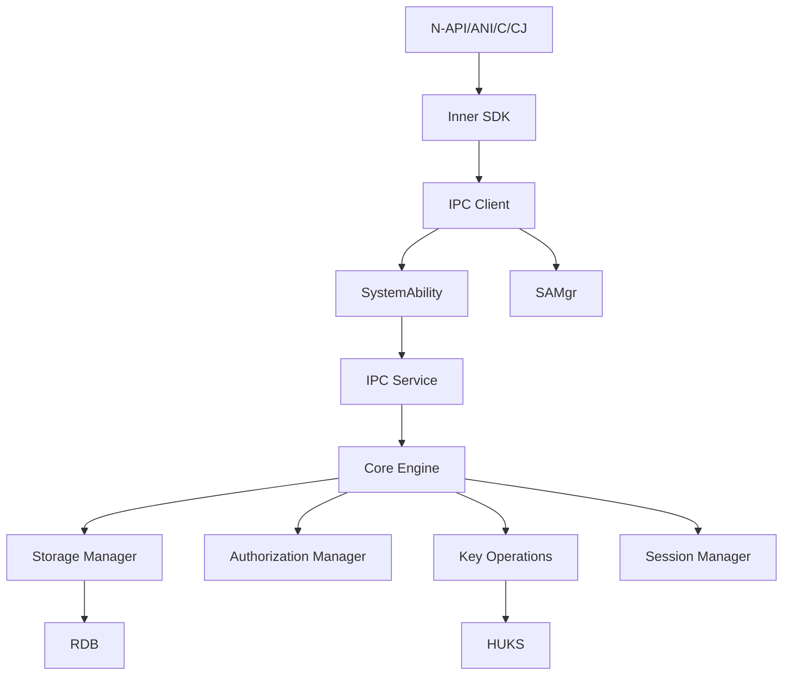

# 内部 API 文档

> 证书管理模块的内部 C API 和模块接口说明

## 文档目的

帮助开发者理解证书管理模块的内部 C API、模块接口、依赖方向和稳定性说明。

## 适用范围

- Inner SDK（内部 C API）
- Framework 层公共组件
- Service 层接口
- Engine 层接口
- 模块依赖关系

## Inner SDK 接口

**头文件**：`interfaces/innerkits/cert_manager_standard/main/include/cert_manager_api.h`
**输出库**：`libcert_manager_sdk.z.so`
**导出宏**：`CM_API_EXPORT __attribute__((visibility("default")))`

### API 清单

#### 证书查询 API

**CmGetCertList**

```c
int32_t CmGetCertList(uint32_t store, struct CertList *certificateList);
```

**参数**：
- `store` - 存储类型（CM_SYSTEM_TRUSTED_STORE、CM_USER_TRUSTED_STORE 等）
- `certificateList` - 输出证书列表（必须预分配内存）

**返回值**：
- `CM_SUCCESS (0)` - 成功
- 错误码 - 失败（参见 cm_type.h:134-237）

**证据**：cert_manager_api.h:25

**调用链**：
```
Inner SDK → CmClientGetCertList()
→ IPC: CM_MSG_GET_CERTIFICATE_LIST
→ Service: CmServiceGetCertList()
→ Engine: 扫描证书目录
→ 返回证书列表
```

**CmGetCertInfo**

```c
int32_t CmGetCertInfo(const struct CmBlob *certUri, uint32_t store,
    struct CertInfo *certificateInfo);
```

**参数**：
- `certUri` - 证书 URI（CmBlob）
- `store` - 存储类型
- `certificateInfo` - 输出证书信息（必须预分配）

**返回值**：同 `CmGetCertList()`

**证据**：cert_manager_api.h:27

#### 证书安装 API

**CmInstallAppCert**

```c
int32_t CmInstallAppCert(const struct CmBlob *appCert, const struct CmBlob *appCertPwd,
    const struct CmBlob *certAlias, const uint32_t store, struct CmBlob *keyUri);
```

**参数**：
- `appCert` - 证书数据（CmBlob）
- `appCertPwd` - 证书密码（可选，CmBlob）
- `certAlias` - 证书别名（CmBlob）
- `store` - 存储类型
- `keyUri` - 输出 Key URI（CmBlob）

**返回值**：
- `CM_SUCCESS` - 成功，`keyUri` 包含生成的 URI
- 错误码 - 失败

**证据**：cert_manager_api.h:33

**调用链**：
```
Inner SDK → CmClientInstallAppCert()
→ IPC: CM_MSG_INSTALL_APP_CERTIFICATE
→ Service: CmServiceInstallAppCert()
→ Engine: 证书解析 → HUKS 密钥导入 → 存储文件 → RDB 插入
→ 返回 Key URI
```

**CmInstallAppCertEx**

```c
int32_t CmInstallAppCertEx(const struct CmAppCertParam *certParam, struct CmBlob *keyUri);
```

**扩展参数**：`CmAppCertParam` 支持更多选项（存储级别、凭据格式等）

**证据**：cert_manager_api.h:36

#### 证书卸载 API

**CmUninstallAppCert**

```c
int32_t CmUninstallAppCert(const struct CmBlob *keyUri, const uint32_t store);
```

**参数**：
- `keyUri` - 证书的 Key URI（CmBlob）
- `store` - 存储类型

**返回值**：`CM_SUCCESS` 或错误码

**证据**：cert_manager_api.h:38

**调用链**：
```
Inner SDK → CmClientUninstallAppCert()
→ IPC: CM_MSG_UNINSTALL_APP_CERTIFICATE
→ Service: CmRemoveAppCert()
→ Engine: 删除文件 → 删除 RDB 记录 → 删除 HUKS 密钥
→ 返回成功
```

**CmUninstallAllAppCert**

```c
int32_t CmUninstallAllAppCert(void);
```

**参数**：无

**返回值**：`CM_SUCCESS` 或错误码

**证据**：cert_manager_api.h:40

#### 应用证书查询 API

**CmGetAppCertList**

```c
int32_t CmGetAppCertList(const uint32_t store, struct CredentialList *certificateList);
```

**参数**：
- `store` - 存储类型
- `certificateList` - 输出凭证列表

**返回值**：`CM_SUCCESS` 或错误码

**证据**：cert_manager_api.h:42

**CmGetAppCertListByUid**

```c
int32_t CmGetAppCertListByUid(const uint32_t store, uint32_t appUid,
    struct CredentialList *certificateList);
```

**参数**：
- `store` - 存储类型
- `appUid` - 目标应用的 UID
- `certificateList` - 输出凭证列表

**返回值**：`CM_SUCCESS` 或错误码

**证据**：cert_manager_api.h:44

**CmCallingGetAppCertList**

```c
int32_t CmCallingGetAppCertList(const uint32_t store, struct CredentialList *certificateList);
```

**用途**：获取调用方应用的证书列表（不指定 UID）

**证据**：cert_manager_api.h:47

**CmGetAppCert**

```c
int32_t CmGetAppCert(const struct CmBlob *keyUri, const uint32_t store, struct Credential *certificate);
```

**参数**：
- `keyUri` - 证书的 Key URI
- `store` - 存储类型
- `certificate` - 输出凭证详细信息

**返回值**：`CM_SUCCESS` 或错误码

**证据**：cert_manager_api.h:49

#### 授权管理 API

**CmGrantAppCertificate**

```c
int32_t CmGrantAppCertificate(const struct CmBlob *keyUri, uint32_t appUid, struct CmBlob *authUri);
```

**参数**：
- `keyUri` - 证书的 Key URI
- `appUid` - 目标应用的 UID
- `authUri` - 输出授权 URI（CmBlob）

**返回值**：
- `CM_SUCCESS` - 成功，`authUri` 包含生成的授权 URI
- 错误码 - 失败

**证据**：cert_manager_api.h:51

**调用链**：
```
Inner SDK → CmClientGrantAppCertificate()
→ IPC: CM_MSG_GRANT_APP_CERT
→ Service: CmServiceGrantAppCertificate()
→ Engine: CmAuthGrantAppCertificate()
→ Engine: HUKS 生成 MAC → RDB 存储授权关系
→ 返回 Auth URI
```

**CmGetAuthorizedAppList**

```c
int32_t CmGetAuthorizedAppList(const struct CmBlob *keyUri, struct CmAppUidList *appUidList);
```

**参数**：
- `keyUri` - 证书的 Key URI
- `appUidList` - 输出应用 UID 列表（CmAppUidList）

**返回值**：`CM_SUCCESS` 或错误码

**证据**：cert_manager_api.h:53

**CmIsAuthorizedApp**

```c
int32_t CmIsAuthorizedApp(const struct CmBlob *authUri);
```

**参数**：
- `authUri` - 授权 URI（CmBlob）

**返回值**：
- `CM_SUCCESS` - 已授权
- `CMR_ERROR_NOT_PERMITTED` - 未授权
- 其他错误码

**证据**：cert_manager_api.h:55

**CmRemoveGrantedApp**

```c
int32_t CmRemoveGrantedApp(const struct CmBlob *keyUri, uint32_t appUid);
```

**参数**：
- `keyUri` - 证书的 Key URI
- `appUid` - 目标应用的 UID

**返回值**：`CM_SUCCESS` 或错误码

**证据**：cert_manager_api.h:57

#### 签名操作 API

**CmInit**

```c
int32_t CmInit(const struct CmBlob *authUri, const struct CmSignatureSpec *spec, struct CmBlob *handle);
```

**参数**：
- `authUri` - 授权 URI（CmBlob）
- `spec` - 签名规范（CmSignatureSpec）
  ```c
  struct CmSignatureSpec {
      uint32_t purpose;    // 密钥用途
      uint32_t padding;     // 填充方式
      uint32_t digest;       // 摘要算法
  };
  ```
- `handle` - 输出会话句柄（CmBlob）

**返回值**：
- `CM_SUCCESS` - 成功，`handle` 包含会话句柄
- 错误码 - 失败

**证据**：cert_manager_api.h:59

**CmUpdate**

```c
int32_t CmUpdate(const struct CmBlob *handle, const struct CmBlob *inData);
```

**参数**：
- `handle` - 会话句柄（CmBlob）
- `inData` - 要签名的数据（CmBlob）

**返回值**：`CM_SUCCESS` 或错误码

**证据**：cert_manager_api.h:61

**CmFinish**

```c
int32_t CmFinish(const struct CmBlob *handle, const struct CmBlob *inData, struct CmBlob *outData);
```

**参数**：
- `handle` - 会话句柄（CmBlob）
- `inData` - 最终数据（CmBlob，可选）
- `outData` - 输出签名结果（CmBlob）

**返回值**：`CM_SUCCESS` 或错误码

**证据**：cert_manager_api.h:63

**CmAbort**

```c
int32_t CmAbort(const struct CmBlob *handle);
```

**参数**：
- `handle` - 会话句柄（CmBlob）

**返回值**：`CM_SUCCESS` 或错误码

**证据**：cert_manager_api.h:65

#### 用户证书 API

**CmGetUserCertList**

```c
int32_t CmGetUserCertList(uint32_t store, struct CertList *certificateList);
```

**参数**：
- `store` - 存储类型
- `certificateList` - 输出证书列表

**返回值**：`CM_SUCCESS` 或错误码

**证据**：cert_manager_api.h:67

**CmGetUserCertInfo**

```c
int32_t CmGetUserCertInfo(const struct CmBlob *certUri, uint32_t store,
    struct CertInfo *certificateInfo);
```

**证据**：cert_manager_api.h:69

**CmSetUserCertStatus**

```c
int32_t CmSetUserCertStatus(const struct CmBlob *certUri, uint32_t store,
    const uint32_t status);
```

**参数**：
- `certUri` - 证书 URI
- `store` - 存储类型
- `status` - 证书状态（0=启用，1=禁用）

**返回值**：`CM_SUCCESS` 或错误码

**证据**：cert_manager_api.h:72

**CmInstallUserTrustedCert**

```c
int32_t CmInstallUserTrustedCert(const struct CmBlob *userCert,
    const struct CmBlob *certAlias, struct CmBlob *certUri);
```

**参数**：
- `userCert` - 用户证书数据（CmBlob）
- `certAlias` - 证书别名（CmBlob）
- `certUri` - 输出证书 URI（CmBlob）

**返回值**：`CM_SUCCESS` 或错误码

**证据**：cert_manager_api.h:75

**CmUninstallUserTrustedCert**

```c
int32_t CmUninstallUserTrustedCert(const struct CmBlob *certUri);
```

**参数**：
- `certUri` - 证书 URI（CmBlob）

**返回值**：`CM_SUCCESS` 或错误码

**证据**：cert_manager_api.h:78

**CmUninstallAllUserTrustedCert**

```c
int32_t CmUninstallAllUserTrustedCert(void);
```

**返回值**：`CM_SUCCESS` 或错误码

**证据**：cert_manager_api.h:80

#### 系统应用证书 API

**CmInstallSystemAppCert**

```c
int32_t CmInstallSystemAppCert(const struct CmAppCertParam *certParam, struct CmBlob *keyUri);
```

**参数**：同 `CmInstallAppCertEx()`

**返回值**：`CM_SUCCESS` 或错误码

**证据**：cert_manager_api.h:82

#### 其他 API

**CmGetCertStorePath**

```c
int32_t CmGetCertStorePath(const enum CmCertType type, const uint32_t userId,
    char *path, uint32_t pathLen);
```

**参数**：
- `type` - 证书类型（CM_CA_CERT_SYSTEM 或 CM_CA_CERT_USER）
- `userId` - 用户 ID
- `path` - 输出路径缓冲区
- `pathLen` - 路径缓冲区长度

**返回值**：`CM_SUCCESS` 或错误码

**路径说明**：
- 系统 CA：`/etc/security/certificates`
- 用户 CA：`/data/service/el1/public/cert_manager_service/certificates/user_open/`

**证据**：cert_manager_api.h:89

**CmInstallUserCACert**

```c
int32_t CmInstallUserCACert(const struct CmBlob *userCert,
    const struct CmBlob *certAlias, const uint32_t userId, const bool status,
    struct CmBlob *certUri);
```

**参数**：
- `userCert` - 用户证书数据（CmBlob）
- `certAlias` - 证书别名（CmBlob）
- `userId` - 用户 ID
- `status` - 证书状态（true=启用，false=禁用）
- `certUri` - 输出证书 URI（CmBlob）

**返回值**：`CM_SUCCESS` 或错误码

**证据**：cert_manager_api.h:84

**CmGetUserCACertList**

```c
int32_t CmGetUserCACertList(const struct UserCAProperty *property, struct CertList *certificateList);
```

**参数**：
- `property` - 用户 CA 属性（UserCAProperty）
  ```c
  struct UserCAProperty {
      uint32_t userId;   // 用户 ID
      enum CmCertScope scope;  // 证书范围（CURRENT_USER/GLOBAL_USER）
  };
  ```
- `certificateList` - 输出证书列表

**返回值**：`CM_SUCCESS` 或错误码

**证据**：cert_manager_api.h:87

**CmCheckAppPermission**

```c
int32_t CmCheckAppPermission(const struct CmBlob *keyUri, uint32_t appUid,
    enum CmPermissionState *hasPermission, struct CmBlob *huksAlias);
```

**参数**：
- `keyUri` - 证书的 Key URI
- `appUid` - 应用 UID
- `hasPermission` - 输出权限状态（CmPermissionState）
- `huksAlias` - 输出 HUKS 别名（CmBlob）

**返回值**：`CM_SUCCESS` 或错误码

**权限状态**：
```c
enum CmPermissionState {
    CM_PERMISSION_DENIED = 0,      // 无权限
    CM_PERMISSION_GRANTED = 1,      // 已授权
};
```

**证据**：cert_manager_api.h:101

**CmGetUkeyCertList**

```c
int32_t CmGetUkeyCertList(const struct CmBlob *ukeyProvider, const struct UkeyInfo *ukeyInfo,
    struct CredentialDetailList *credentialDetailList);
```

**参数**：
- `ukeyProvider` - UKey 提供者（CmBlob）
- `ukeyInfo` - UKey 信息（UkeyInfo）
- `credentialDetailList` - 输出凭证详情列表（CredentialDetailList）

**返回值**：`CM_SUCCESS` 或错误码

**证据**：cert_manager_api.h:95

**CmGetUkeyCert**

```c
int32_t CmGetUkeyCert(const struct CmBlob *keyUri, const struct UkeyInfo *ukeyInfo,
    struct CredentialDetailList *credentialDetailList);
```

**参数**：
- `keyUri` - 证书的 Key URI
- `ukeyInfo` - UKey 信息
- `credentialDetailList` - 输出凭证详情（CredentialDetailList）

**返回值**：`CM_SUCCESS` 或错误码

**证据**：cert_manager_api.h:98

#### 内存释放 API

**CmFreeUkeyCertificate**

```c
void CmFreeUkeyCertificate(struct CredentialDetailList *certificateList);
```

**用途**：释放 UKey 证书列表内存

**证据**：cert_manager_api.h:104

**CmFreeCredential**

```c
void CmFreeCredential(struct Credential *certificate);
```

**用途**：释放凭证内存

**证据**：cert_manager_api.h:106

## Framework 层接口

### IPC 客户端接口

**头文件**：`frameworks/cert_manager_standard/main/os_dependency/cm_ipc/include/cm_ipc_client.h`

#### 主要函数

| 函数 | 说明 | 证据 |
|------|------|------|
| `CmClientGetCertList()` | 获取证书列表 | cm_ipc_client.h:27 |
| `CmClientGetCertInfo()` | 获取证书信息 | cm_ipc_client.h:29 |
| `CmClientSetCertStatus()` | 设置证书状态 | cm_ipc_client.h:32 |
| `CmClientInstallAppCert()` | 安装应用证书 | cm_ipc_client.h:35 |
| `CmClientUninstallAppCert()` | 卸载应用证书 | cm_ipc_client.h:37 |
| `CmClientUninstallAllAppCert()` | 卸载所有应用证书 | cm_ipc_client.h:39 |
| `CmClientGetAppCertList()` | 获取应用证书列表 | cm_ipc_client.h:41 |
| `CmClientGetAppCertListByUid()` | 按 UID 获取证书列表 | cm_ipc_client.h:43 |
| `CmClientGetUkeyCertList()` | 获取 UKey 证书列表 | cm_ipc_client.h:45 |
| `CmClientGetUkeyCert()` | 获取 UKey 证书 | cm_ipc_client.h:47 |
| `CmClientGetCallingAppCertList()` | 获取调用方证书列表 | cm_ipc_client.h:51 |
| `CmClientGetAppCert()` | 获取应用证书 | cm_ipc_client.h:53 |
| `CmClientGrantAppCertificate()` | 授权应用证书 | cm_ipc_client.h:55 |
| `CmClientGetAuthorizedAppList()` | 获取授权列表 | cm_ipc_client.h:57 |
| `CmClientIsAuthorizedApp()` | 检查是否已授权 | cm_ipc_client.h:59 |
| `CmClientRemoveGrantedApp()` | 移除授权 | cm_ipc_client.h:61 |
| `CmClientInit()` | 初始化签名操作 | cm_ipc_client.h:63 |
| `CmClientUpdate()` | 更新签名操作 | cm_ipc_client.h:65 |
| `CmClientFinish()` | 完成签名操作 | cm_ipc_client.h:67 |
| `CmClientAbort()` | 中止签名操作 | cm_ipc_client.h:69 |
| `CmClientGetUserCertList()` | 获取用户证书列表 | cm_ipc_client.h:71 |
| `CmClientGetUserCertInfo()` | 获取用户证书信息 | cm_ipc_client.h:73 |
| `CmClientSetUserCertStatus()` | 设置用户证书状态 | cm_ipc_client.h:75 |
| `CmClientInstallUserTrustedCert()` | 安装用户 CA 证书 | cm_ipc_client.h:77 |
| `CmClientUninstallUserTrustedCert()` | 卸载用户 CA 证书 | cm_ipc_client.h:79 |
| `CmClientUninstallAllUserTrustedCert()` | 卸载所有用户 CA 证书 | cm_ipc_client.h:81 |
| `CmClientInstallSystemAppCert()` | 安装系统应用证书 | cm_ipc_client.h:83 |
| `CmClientCheckAppPermission()` | 检查应用权限 | cm_ipc_client.h:89 |

**SA 加载机制**：
```c
static sptr<IRemoteObject> CmLoadSystemAbility(void)
{
    auto saManager = SystemAbilityManagerClient::GetInstance().GetSystemAbilityManager();
    auto object = saManager->CheckSystemAbility(SA_ID_KEYSTORE_SERVICE);
    if (object != nullptr) return object;
    return saManager->LoadSystemAbility(SA_ID_KEYSTORE_SERVICE, LOAD_ABILITY_TIME_OUT_SECONDS);
}
```

**证据**：cm_request.cpp

## Service 层接口

### Engine 层接口

**头文件**：`services/cert_manager_standard/cert_manager_engine/main/core/include/cert_manager.h`

#### 主要函数

| 函数 | 说明 | 证据 |
|------|------|------|
| `CertManagerInitialize()` | 初始化引擎 | cert_manager.h:36 |
| `CmRemoveAppCert()` | 删除应用证书 | cert_manager.h:41 |
| `CmRemoveAllAppCert()` | 删除所有应用证书 | cert_manager.h:44 |
| `CmServiceGetAppCertList()` | 获取应用证书列表 | cert_manager.h:46 |
| `CmServiceGetAppCertListByUid()` | 按 UID 获取证书列表 | cert_manager.h:48 |
| `CmServiceGetUkeyCertList()` | 获取 UKey 证书列表 | cert_manager.h:52 |
| `CmServiceGetUkeyCert()` | 获取 UKey 证书 | cert_manager.h:54 |
| `CmServiceGetCallingAppCertList()` | 获取调用方证书列表 | cert_manager.h:58 |
| `CmFreeFileNames()` | 释放文件名列表内存 | cert_manager.h:61 |
| `CmGetUri()` | 获取 URI | cert_manager.h:63 |
| `CmCheckCertCount()` | 检查证书数量 | cert_manager.h:65 |
| `CmWriteUserCert()` | 写入用户证书 | cert_manager.h:67 |
| `CmStoreUserCert()` | 存储用户证书 | cert_manager.h:70 |
| `CmRemoveUserCert()` | 删除用户证书 | cert_manager.h:74 |
| `CmRmUserCert()` | 删除用户证书配置 | cert_manager.h:76 |
| `CmRmSaConf()` | 删除 SA 配置 | cert_manager.h:78 |
| `CmRemoveAllUserCert()` | 删除所有用户证书 | cert_manager.h:80 |
| `CmRemoveBackupUserCert()` | 删除用户证书备份 | cert_manager.h:95 |
| `CmGetDisplayNameByURI()` | 获取显示名称 | cert_manager.h:98 |
| `RdbInsertCertProperty()` | 插入证书属性到 RDB | cert_manager.h:100 |
| `GetObjNameFromCertData()` | 从证书数据获取对象名 | cert_manager.h:102 |
| `GetCertOrCredCount()` | 获取证书或凭证数量 | cert_manager.h:105 |

**头文件**：`services/cert_manager_standard/cert_manager_engine/main/core/include/cert_manager_service.h`

#### 主要函数

| 函数 | 说明 | 证据 |
|------|------|------|
| `CmServicInstallAppCert()` | 安装应用证书 | cert_manager_service.h:50 |
| `CmServiceGetAppCert()` | 获取应用证书 | cert_manager_service.h:53 |
| `CmServiceGrantAppCertificate()` | 授权应用证书 | cert_manager_service.h:56 |
| `CmServiceGetAuthorizedAppList()` | 获取授权列表 | cert_manager_service.h:59 |
| `CmServiceIsAuthorizedApp()` | 检查是否已授权 | cert_manager_service.h:62 |
| `CmServiceRemoveGrantedApp()` | 移除授权 | cert_manager_service.h:64 |
| `CmServiceInit()` | 初始化签名操作 | cert_manager_service.h:66 |
| `CmServiceUpdate()` | 更新签名操作 | cert_manager_service.h:69 |
| `CmServiceFinish()` | 完成签名操作 | cert_manager_service.h:72 |
| `CmServiceAbort()` | 中止签名操作 | cert_manager_service.h:75 |
| `CmServiceGetCertList()` | 获取证书列表 | cert_manager_service.h:77 |
| `CmServiceGetCertInfo()` | 获取证书信息 | cert_manager_service.h:80 |
| `CmX509ToPEM()` | X509 转 PEM | cert_manager_service.h:83 |
| `CmInstallUserCert()` | 安装用户证书 | cert_manager_service.h:85 |
| `CmInstallMultiUserCert()` | 安装多个用户证书 | cert_manager_service.h:88 |
| `CmUninstallUserCert()` | 卸载用户证书 | cert_manager_service.h:91 |
| `CmUninstallAllUserCert()` | 卸载所有用户证书 | cert_manager_service.h:93 |
| `CmSetStatusBackupCert()` | 设置备份证书状态 | cert_manager_service.h:95 |
| `CmServiceCheckAppPermission()` | 检查应用权限 | cert_manager_service.h:98 |

## 模块依赖方向

### 依赖关系图



### 依赖规则

**原则**：
1. **单向依赖**：上层依赖下层，避免循环依赖
2. **接口稳定**：Inner SDK 接口对外稳定，内部接口可变
3. **职责分离**：每个模块职责单一

**依赖链**：
```
N-API (应用层)
  ↓
Inner SDK (内部接口层)
  ↓
IPC Client (通信层)
  ↓
SystemAbility (服务层)
  ↓
IPC Service (服务端)
  ↓
Core Engine (引擎层)
  ├→ Storage Manager (存储)
  ├→ Authorization Manager (授权)
  ├→ Key Operations (密钥)
  └→ Session Manager (会话)
      ↓
HUKS (外部依赖)
```

## 接口稳定性分析

### 稳定接口（版本兼容）

**Inner SDK 公共接口**（`interfaces/innerkits/cert_manager_standard/main/include/cert_manager_api.h`）
- ✅ 向后兼容
- ✅ 版本化
- ✅ 供系统内部其他模块使用

**理由**：
- 作为内部 SDK，被多个系统服务复用
- 签名稳定，避免破坏性变更

### 内部接口（可变）

**Framework 层公共组件**
- ⚠️ 可根据需要修改
- ⚠️ 不保证向后兼容

**Service 层接口**
- ⚠️ 可随业务逻辑调整
- ⚠️ 不对外暴露

**Engine 层接口**
- ⚠️ 可随优化调整

### 可替换点

**可替换模块**：

| 模块 | 可替换性 | 说明 |
|--------|-----------|------|
| 存储管理 | 部分 | 文件系统可替换，但路径结构需保持 |
| RDB | 可替换 | 可更换关系型数据库，需适配接口 |
| IPC 客户端 | 不可替换 | 标准 OpenHarmony IPC 机制 |
| SystemAbility | 不可替换 | 标准系统能力框架 |
| HUKS | 不可替换 | 硬件密钥服务 |

**不可替换点**：

| 模块 | 原因 |
|--------|------|
| 权限检查 | 系统权限机制 |
| 证书格式解析 | 依赖 OpenSSL/X509 标准 |
| MAC 生成 | HUKS 安全机制 |
| URI 格式 | OpenHarmony 资源标识标准 |

## 相关跳转

- [项目概述](00_Overview.md)
- [架构说明](02_Architecture.md)
- [N-API 接口文档](03_N-API.md)
- [目录结构与模块职责](01_Directory_Structure.md)

---

*更新时间：2026-02-06*
