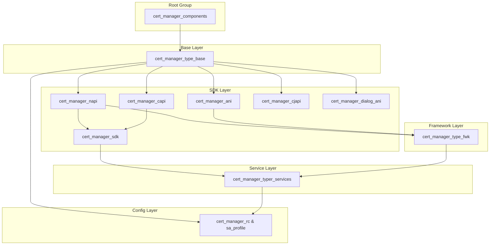
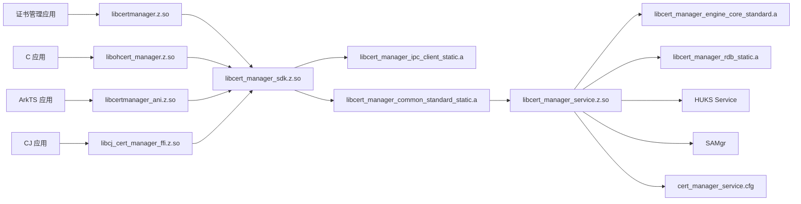

# GN 构建目标

> 证书管理模块的 GN 构建系统、Targets、配置和依赖关系

## 文档目的

帮助开发者理解证书管理模块的 GN 构建系统、主要 Targets、编译配置和依赖关系。

## 适用范围

- 根构建文件：BUILD.gn
- 全局配置：cert_manager.gni
- 所有子模块的 BUILD.gn
- 编译产物与 Targets 的映射

## 根构建入口

**文件**：`BUILD.gn`

### 主要 Group Targets

| Target | 类型 | 目的 | 依赖 Targets |
|--------|------|------|-----------|
| `cert_manager_components` | group | 主聚合 target | `cert_manager_type_base`, `cert_manager_typer_services` |
| `cert_manager_type_base` | group | Base 层组件 | N-API、ANI、C-API、CJAPI、系统证书 |
| `cert_manager_type_fwk` | group | Framework 层组件 | `cert_manager_sdk` |
| `cert_manager_typer_services` | group | Service 层组件 | `cert_manager_service`, `cert_manager_sa_profile` |
| `cert_manager_napi` | group | N-API 组件 | `certmanager`、`certmanagerdialog` (条件) |
| `cert_manager_ani` | group | ANI 组件 | `certmanager_ani_group` |
| `cert_manager_dialog_ani` | group | ANI 对话框组件 | `certmanager_dialog_ani_group` (条件) |
| `cert_manager_capi` | group | C API 组件 | `ohcert_manager` |
| `cert_manager_cjapi` | group | CJ API 组件 | `cj_cert_manager_ffi` |
| `cert_manager_sdk_test` | group | 测试组件 | `unittest`, `module_test`, `multi_thread_test`, `permission_test` |

**证据**：BUILD.gn:16-245

### 编译条件

| 变量 | 默认值 | 条件 |
|--------|---------|------|
| `support_jsapi` | (系统定义) | 用于 N-API/ANI 构建 |
| `os_level == "standard"` | - | 完整功能可用 |
| `certificate_manager_feature_dialog_enabled` | false (全局) | ace_engine 存在时自动为 true |

**证据**：BUILD.gn:18-57

## SDK 层 Targets

### N-API 主库：certmanager

**文件**：`interfaces/kits/napi/BUILD.gn`
**目标**：`ohos_shared_library("certmanager")`

**输出**：`libcertmanager.z.so`
**安装路径**：`/system/lib/module/security/`

**源文件**（23 个）：
```gn
sources = [
    "src/cm_napi.cpp",                    # 模块注册
    "src/cm_napi_common.cpp",             # 公共实现
    "src/cm_napi_get_app_cert_info.cpp",
    "src/cm_napi_get_app_cert_info_common.cpp",
    "src/cm_napi_get_app_cert_list.cpp",
    "src/cm_napi_get_app_cert_list_common.cpp",
    "src/cm_napi_get_cert_store_path.cpp",
    "src/cm_napi_get_system_cert_info.cpp",
    "src/cm_napi_get_system_cert_list.cpp",
    "src/cm_napi_get_ukey_cert_list.cpp",
    "src/cm_napi_get_ukey_cert.cpp",
    "src/cm_napi_grant.cpp",
    "src/cm_napi_install_app_cert.cpp",
    "src/cm_napi_install_app_cert_common.cpp",
    "src/cm_napi_set_cert_status.cpp",
    "src/cm_napi_sign_verify.cpp",
    "src/cm_napi_uninstall_all_app_cert.cpp",
    "src/cm_napi_uninstall_app_cert.cpp",
    "src/cm_napi_uninstall_app_cert_common.cpp",
    "src/cm_napi_user_trusted_cert.cpp",
    "src/cm_napi_get_app_cert_list_by_uid.cpp",
    "src/cm_napi_get_app_cert_list_by_uid_common.cpp",
]
```

**依赖**：
```gn
deps = [
    "${cert_manager_root_dir}/frameworks/cert_manager_standard/main/common:libcert_manager_common_standard_static",
    "${cert_manager_root_dir}/interfaces/innerkits/cert_manager_standard/main:cert_manager_sdk",
]

external_deps = [
    "bundle_framework:appexecfwk_base",
    "bundle_framework:appexecfwk_core",
    "c_utils:utils",
    "ipc:ipc_core",
    "napi:ace_napi",
    "os_account:os_account_innerkits",
    "samgr:samgr_proxy",
]
```

**安全加固**：
```gn
sanitize = {
  cfi = true
  cfi_cross_dso = true
  boundary_sanitize = true
  debug = false
  integer_overflow = true
  ubsan = true
}
branch_protector_ret = "pac_ret"
```

**证据**：interfaces/kits/napi/BUILD.gn:17-76

### N-API 对话框库：certmanagerdialog

**文件**：`interfaces/kits/napi/BUILD.gn`
**目标**：`ohos_shared_library("certmanagerdialog")`
**条件**：`certificate_manager_feature_dialog_enabled`

**输出**：`libcertmanagerdialog.z.so`
**安装路径**：`/system/lib/module/security/`

**源文件**（12 个）：
```gn
sources = [
    "src/dialog/cm_napi_dialog.cpp",
    "src/dialog/cm_napi_dialog_common.cpp",
    "src/dialog/cm_napi_open_detail_dialog.cpp",
    "src/dialog/cm_napi_open_dialog.cpp",
    "src/dialog/cm_napi_open_install_dialog.cpp",
    "src/dialog/cm_napi_open_uninstall_dialog.cpp",
    "src/dialog/cm_napi_open_authorize_dialog.cpp",
    "src/dialog/cm_napi_open_ukey_auth_dialog.cpp",
    "src/dialog/dialog_callback/cm_napi_dialog_callback.cpp",
    "src/dialog/dialog_callback/cm_napi_dialog_callback_void.cpp",
    "src/dialog/dialog_callback/cm_napi_dialog_callback_string.cpp",
    "src/dialog/dialog_callback/cm_napi_dialog_callback_int_bool.cpp",
    "src/dialog/dialog_callback/cm_napi_dialog_callback_cert_reference.cpp",
]
```

**依赖**：
```gn
external_deps = [
    "ability_base:base",
    "ability_base:want",
    "ability_runtime:ability_context_native",
    "ability_runtime:ability_manager",
    "ability_runtime:abilitykit_native",
    "ability_runtime:app_context",
    "ability_runtime:napi_base_context",
    "ability_runtime:napi_common",
    "access_token:libaccesstoken_sdk",
    "ace_engine:ace_uicontent",
    "c_utils:utils",
    "ipc:ipc_core",
    "ipc:ipc_single",
    "napi:ace_napi",
    "samgr:samgr_proxy",
]
```

**证据**：interfaces/kits/napi/BUILD.gn:78-139

### C API 库：ohcert_manager

**文件**：`interfaces/kits/c/BUILD.gn`
**目标**：`ohos_shared_library("ohcert_manager")`

**输出**：`libohcert_manager.z.so`
**安装路径**：`/system/lib/`

**依赖**：
```gn
deps = [
    "${cert_manager_root_dir}/interfaces/innerkits/cert_manager_standard/main:cert_manager_sdk",
]
```

### CJ FFI 库：cj_cert_manager_ffi

**文件**：`interfaces/kits/cj/BUILD.gn`
**目标**：`ohos_shared_library("cj_cert_manager_ffi")`

**输出**：`libcj_cert_manager_ffi.z.so`
**安装路径**：`/system/lib/`

### ANI 库：certmanager_ani

**文件**：`interfaces/kits/ani/BUILD.gn`
**目标**：`group("certmanager_ani_group")`

**子目标**：
- `certmanager_ani` - `libcertmanager_ani.z.so`
- `certmanager_abc` - `certmanager_abc.abc`

**证据**：interfaces/kits/ani/BUILD.gn

### ANI 对话框库：certmanager_dialog_ani

**文件**：`interfaces/kits/ani/BUILD.gn`
**目标**：`group("certmanager_dialog_ani_group")`
**条件**：`certificate_manager_feature_dialog_enabled`

**子目标**：
- `certmanager_dialog_ani` - `libcertmanager_dialog_ani.z.so`
- `certmanager_dialog_abc` - `certmanager_dialog_abc.abc`

### Inner SDK：cert_manager_sdk

**文件**：`interfaces/innerkits/cert_manager_standard/main/BUILD.gn`
**目标**：`ohos_shared_library("cert_manager_sdk")`

**输出**：`libcert_manager_sdk.z.so`
**安装路径**：`/system/lib/`

**头文件导出**：
```gn
public_configs = [ ":cert_manager_public_config" ]
config("cert_manager_public_config") {
  include_dirs = [ "include" ]
}
```

**依赖**：
```gn
deps = [
    "${cert_manager_root_dir}/frameworks/cert_manager_standard/main/common:libcert_manager_common_standard_static",
    "${cert_manager_root_dir}/frameworks/cert_manager_standard/main/os_dependency:libcert_manager_ipc_client_static",
]
```

**证据**：interfaces/innerkits/cert_manager_standard/main/BUILD.gn

## Service 层 Targets

### 主服务库：cert_manager_service

**文件**：`services/cert_manager_standard/BUILD.gn`
**目标**：`ohos_shared_library("cert_manager_service")`

**输出**：`libcert_manager_service.z.so`
**安装路径**：`/system/lib/`
**进程名**：`cert_manager_service`

**依赖**：
```gn
deps = [
    ":libcert_manager_service_os_dependency_standard_static",
    ":libcm_service_idl_standard_static",
    "${cert_manager_root_dir}/services/cert_manager_standard/cert_manager_engine/main/core:cert_manager_engine_core_standard",
    "${cert_manager_root_dir}/services/cert_manager_standard/cert_manager_engine/main/rdb:libcert_manager_rdb_static",
    ":libcert_manager_hisysevent_wrapper_static",
    ":libcert_manager_sg_report_static",
]
```

**证据**：services/cert_manager_standard/BUILD.gn

### 引擎核心库：cert_manager_engine_core_standard

**文件**：`services/cert_manager_standard/cert_manager_engine/main/core/BUILD.gn`
**目标**：`ohos_static_library("cert_manager_engine_core_standard")`

**输出**：`libcert_manager_engine_core_standard.a`

**源文件**：
```gn
sources = [
    "src/cert_manager.cpp",
    "src/cert_manager_service.cpp",
    "src/cert_manager_permission_check.cpp",
    "src/cert_manager_storage.cpp",
    "src/cert_manager_key_operation.cpp",
    "src/cert_manager_auth_mgr.c",
    "src/cert_manager_auth_list_mgr.c",
    "src/cert_manager_query.cpp",
    "src/cert_manager_uri.c",
    "src/cert_manager_session_mgr.c",
    "src/cert_manager_file_operator.cpp",
    "src/cert_manager_app_cert_process.cpp",
    "src/cert_manager_check.c",
    "src/cert_manager_double_list.c",
    "src/cert_manager_crypto_operation.cpp",
    "src/cert_manager_auth_list_mgr.c",
    "src/cert_manager_updateflag.c",
    "src/cert_manager_file.c",
]
```

**证据**：services/cert_manager_standard/cert_manager_engine/main/core/BUILD.gn

### RDB 库：libcert_manager_rdb_static

**文件**：`services/cert_manager_standard/cert_manager_engine/main/rdb/BUILD.gn`
**目标**：`ohos_static_library("libcert_manager_rdb_static")`

**输出**：`libcert_manager_rdb_static.a`

**依赖**：
```gn
external_deps = [
    "relational_store:native_rdb",
]
```

**证据**：services/cert_manager_standard/cert_manager_engine/main/rdb/BUILD.gn

### IPC 服务库：libcm_service_idl_standard_static

**文件**：`services/cert_manager_standard/cert_manager_service/main/os_dependency/idl/BUILD.gn`
**目标**：`ohos_static_library("libcm_service_idl_standard_static")`

**依赖**：
```gn
deps = [
    "${cert_manager_root_dir}/frameworks/cert_manager_standard/main/common:libcert_manager_common_standard_static",
    "${cert_manager_root_dir}/services/cert_manager_standard/cert_manager_engine/main/core:cert_manager_engine_core_standard",
]
```

**证据**：services/cert_manager_standard/cert_manager_service/main/os_dependency/idl/BUILD.gn

### OS 依赖库：libcert_manager_service_os_dependency_standard_static

**文件**：`services/cert_manager_standard/cert_manager_service/main/os_dependency/BUILD.gn`
**目标**：`ohos_static_library("libcert_manager_service_os_dependency_standard_static")`

**依赖**：
```gn
deps = [
    "${cert_manager_root_dir}/frameworks/cert_manager_standard/main/common:libcert_manager_common_standard_static",
    ":libcert_manager_hisysevent_wrapper_static",
    ":libcm_service_idl_standard_static",
    "${cert_manager_root_dir}/services/cert_manager_standard/cert_manager_engine/main/core:cert_manager_engine_core_standard",
]
```

**证据**：services/cert_manager_standard/cert_manager_service/main/os_dependency/BUILD.gn

### HiSysEvent 封装库：libcert_manager_hisysevent_wrapper_static

**文件**：`services/cert_manager_standard/cert_manager_service/main/hisysevent_wrapper/BUILD.gn`
**目标**：`ohos_static_library("libcert_manager_hisysevent_wrapper_static")`

**依赖**：
```gn
external_deps = [
    "hisysevent:libhisysevent",
]
```

**证据**：services/cert_manager_standard/cert_manager_service/main/hisysevent_wrapper/BUILD.gn

### SecurityGuard 上报库：libcert_manager_sg_report_static

**文件**：`services/cert_manager_standard/cert_manager_service/main/security_guard_report/BUILD.gn`
**目标**：`ohos_static_library("libcert_manager_sg_report_static")`

**依赖**：
```gn
external_deps = [
    "security_guard:libsg_collect_utils",
]
```

**证据**：services/cert_manager_standard/cert_manager_service/main/security_guard_report/BUILD.gn

### SA Profile：cert_manager_sa_profile

**文件**：`services/cert_manager_standard/cert_manager_service/main/os_dependency/sa/sa_profile/BUILD.gn`
**目标**：`ohos_sa_profile("cert_manager_sa_profile")`

**输出**：`cert_manager_service.json`
**安装路径**：SA profile 目录

**证据**：services/cert_manager_standard/cert_manager_service/main/os_dependency/sa/sa_profile/BUILD.gn

## Framework 层 Targets

### 公共库：libcert_manager_common_standard_static

**文件**：`frameworks/cert_manager_standard/main/common/BUILD.gn`
**目标**：`ohos_static_library("libcert_manager_common_standard_static")`

**输出**：`libcert_manager_common_standard_static.a`

**源文件**：
```gn
sources = [
    "src/cm_data_parcel_processor.cpp",
    "src/cm_ipc_response_type.cpp",
    "src/cm_ukey_data_parcel_strategy.cpp",
]
```

**依赖**：
```gn
external_deps = [
    "openssl:libcrypto",
    "openssl:libssl",
]
```

**证据**：frameworks/cert_manager_standard/main/common/BUILD.gn

### IPC 客户端库：libcert_manager_ipc_client_static

**文件**：`frameworks/cert_manager_standard/main/os_dependency/BUILD.gn`
**目标**：`ohos_static_library("libcert_manager_ipc_client_static")`

**输出**：`libcert_manager_ipc_client_static.a`

**依赖**：
```gn
external_deps = [
    "ipc:ipc_core",
    "safwk:native_samgr",
]
```

**证据**：frameworks/cert_manager_standard/main/os_dependency/BUILD.gn

### 日志/内存库：libcert_manager_log_mem_static

**文件**：`frameworks/cert_manager_standard/main/os_dependency/BUILD.gn`
**目标**：`ohos_static_library("libcert_manager_log_mem_static")`

**输出**：`libcert_manager_log_mem_static.a`

## 配置 Targets

### 系统根证书：trusted_system_certificate*

**文件**：`config/BUILD.gn`
**目标类型**：`ohos_prebuilt_etc`

**Targets 数量**：119 个（trusted_system_certificate0 到 trusted_system_certificate118）

**安装路径**：`/system/etc/security/certificates/`

**文件格式**：`.0` 扩展名（证书文件）

**源路径**：`config/systemCertificates/`

**证据**：config/BUILD.gn:6-119

### CA 证书集成：build_integrate_cacert

**文件**：`config/integrate_cacert/BUILD.gn`
**目标**：`group("build_integrate_cacert")`

**说明**：CA 证书集成脚本组

**证据**：config/integrate_cacert/BUILD.gn

## 全局配置

**文件**：`cert_manager.gni`

### 配置变量

| 变量 | 默认值 | 说明 |
|--------|---------|------|
| `use_crypto_lib` | `"openssl"` | 加密库后端 |
| `non_rwlock_support` | `false` | 读写锁支持 |
| `cert_manager_root_dir` | `"//base/security/certificate_manager"` | 项目根目录 |

### 特性开关（declare_args）

| 变量 | 默认值 | 条件 | 说明 |
|--------|---------|------|------|
| `certificate_manager_deps_huks_enabled` | `"software"` | - | HUKS 依赖模式 |
| `certificate_manager_feature_ca_enabled` | `true` | - | CA 证书功能 |
| `certificate_manager_feature_credential_enabled` | `true` | - | 凭证功能 |
| `certificate_manager_feature_dialog_enabled` | `false` | ace_engine 存在 | 对话框功能 |

### 自动检测变量

| 变量 | 默认值 | 检测条件 |
|--------|---------|---------|
| `has_os_account_part` | `false` | os_account 组件存在 |
| `support_security_guard` | `false` | security_guard 组件存在 |

**证据**：cert_manager.gni:14-43

## Target ↔ 产物映射

### 完整映射表

| GN Target | 输出文件 | 安装路径 | Target 类型 |
|-----------|----------|----------|-----------|
| `certmanager` | libcertmanager.z.so | /system/lib/module/security/ | ohos_shared_library |
| `certmanagerdialog` | libcertmanagerdialog.z.so | /system/lib/module/security/ | ohos_shared_library (条件) |
| `ohcert_manager` | libohcert_manager.z.so | /system/lib/ | ohos_shared_library |
| `cj_cert_manager_ffi` | libcj_cert_manager_ffi.z.so | /system/lib/ | ohos_shared_library |
| `certmanager_ani` | libcertmanager_ani.z.so | /system/lib/ | ohos_shared_library |
| `certmanager_abc` | certmanager_abc.abc | /system/framework/ | generate_static_abc |
| `certmanager_dialog_ani` | libcertmanager_dialog_ani.z.so | /system/lib/ | ohos_shared_library (条件) |
| `certmanager_dialog_abc` | certmanager_dialog_abc.abc | /system/framework/ | generate_static_abc (条件) |
| `cert_manager_sdk` | libcert_manager_sdk.z.so | /system/lib/ | ohos_shared_library |
| `cert_manager_service` | libcert_manager_service.z.so | /system/lib/ | ohos_shared_library |
| `cert_manager_sa_profile` | cert_manager_service.json | SA profile 目录 | ohos_sa_profile |
| `trusted_system_certificate*` | *.0 | /system/etc/security/certificates/ | ohos_prebuilt_etc |
| `cert_manager_service.rc` | cert_manager_service.cfg | /system/etc/init/ | ohos_prebuilt_etc |

## 编译命令

### 完整构建

```bash
# 进入源码目录
cd base/security/certificate_manager

# 生成 Ninja 构建
./build.sh --product-name <product> --build-type release

# 或直接使用 gn + ninja
gn gen out/<product> --args="is_standard_system=true"
ninja -C out/<product> cert_manager_components
```

### 单独构建

```bash
# 仅构建 SDK 层
ninja -C out/<product> cert_manager_type_base

# 仅构建 Service 层
ninja -C out/<product> cert_manager_typer_services

# 仅构建 Framework 层
ninja -C out/<product> cert_manager_type_fwk

# 仅构建特定目标
ninja -C out/<product> certmanager
```

### 特性定制

```bash
# 启用对话框功能
gn gen out/<product> --args="certificate_manager_feature_dialog_enabled=true"

# 使用 HUKS 硬件模式
gn gen out/<product> --args="certificate_manager_deps_huks_enabled=hardware"

# 禁用 CA 证书功能
gn gen out/<product> --args="certificate_manager_feature_ca_enabled=false"
```

## 依赖关系图

### 构建依赖树



### 运行时依赖



## 安全加固配置

### 所有 Production Targets 使用

```gn
sanitize = {
  cfi = true                    # 控制流完整性（防止虚表跳转）
  cfi_cross_dso = true          # 跨 DSO CFI（防止共享库攻击）
  boundary_sanitize = true      # 边界检查（防止缓冲区溢出）
  debug = false                 # 不启用调试 sanitizer
  integer_overflow = true       # 整数溢出检测
  ubsan = true                  # 未定义行为检测
}
branch_protector_ret = "pac_ret"  # 指针认证码返回保护
```

### 安全机制说明

1. **CFI (Control Flow Integrity)**：防止代码重用攻击
2. **Cross-DSO CFI**：保护共享库边界
3. **边界检查**：防止缓冲区溢出
4. **整数溢出检测**：防止整数溢出漏洞
5. **UBSan (Undefined Behavior Sanitizer)**：检测未定义行为
6. **PAC (Pointer Authentication)**：返回地址保护

## 相关跳转

- [项目概述](00_Overview.md)
- [架构说明](02_Architecture.md)
- [编译产物](06_Build_Artifacts.md)
- [目录结构与模块职责](01_Directory_Structure.md)

---

*更新时间：2026-02-06*
