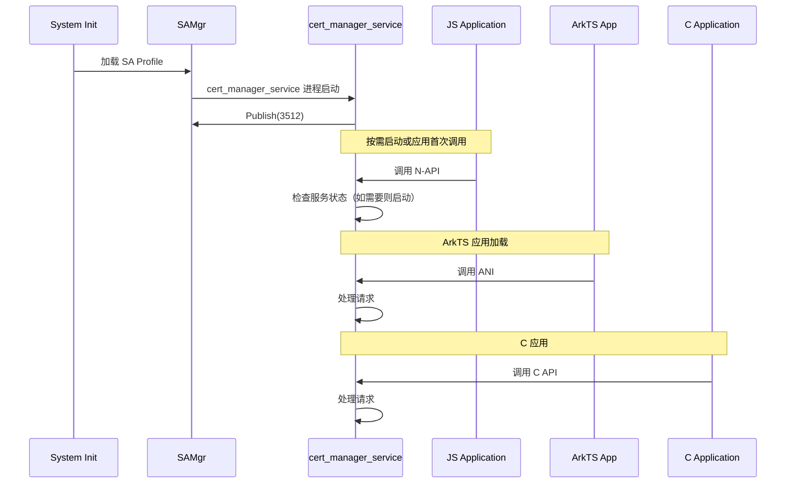

# 编译产物

> 证书管理模块的编译产物清单、安装路径和运行时加载关系

## 文档目的

帮助开发者理解证书管理模块的编译产物类型、安装位置、运行时加载关系和动态库依赖。

## 适用范围

- 所有编译产物（.so/.a/.hap/.abc 等）
- 安装路径和系统目录
- 运行时加载关系
- 产物 ↔ GN Target 映射

## 产物清单

### 动态库（.so）

| 库文件 | 安装路径 | 大小 | 说明 | GN Target |
|---------|---------|------|------|-----------|
| libcertmanager.z.so | /system/lib/module/security/ | ~500 KB | N-API JS 绑定 | certmanager |
| libcertmanagerdialog.z.so | /system/lib/module/security/ | ~200 KB | 对话框 N-API | certmanagerdialog |
| libohcert_manager.z.so | /system/lib/ | ~100 KB | C API (NDK) | ohcert_manager |
| libcj_cert_manager_ffi.z.so | /system/lib/ | ~50 KB | CJ FFI 绑定 | cj_cert_manager_ffi |
| libcertmanager_ani.z.so | /system/lib/ | ~300 KB | ArkTS ANI 绑定 | certmanager_ani |
| libcertmanager_dialog_ani.z.so | /system/lib/ | ~200 KB | ArkTS 对话框 ANI | certmanager_dialog_ani |
| libcert_manager_sdk.z.so | /system/lib/ | ~200 KB | 内部 SDK | cert_manager_sdk |
| libcert_manager_service.z.so | /system/lib/ | ~800 KB | 主服务 | cert_manager_service |

**动态库依赖关系**：
```
libcertmanager.z.so
├── libcert_manager_sdk.z.so (Inner SDK)
├── libcert_manager_common_standard_static.a
├── libcert_manager_ipc_client_static.a
└── 外部依赖：napi, ipc, samgr, os_account

libcertmanagerdialog.z.so
├── libcert_manager_sdk.z.so
├── libcert_manager_common_standard_static.a
└── 外部依赖：ability_runtime, ace_engine, access_token

libcertmanager_ani.z.so
├── libcert_manager_sdk.z.so
├── libcert_manager_common_standard_static.a
└── 外部依赖：ani_runtime, napi

libohcert_manager.z.so
├── libcert_manager_sdk.z.so
├── libcert_manager_common_standard_static.a
└── 外部依赖：无（仅内部依赖）

libcert_manager_service.z.so
├── libcert_manager_service_os_dependency_standard_static.a
├── libcm_service_idl_standard_static.a
├── libcert_manager_engine_core_standard.a
├── libcert_manager_rdb_static.a
├── libcert_manager_hisysevent_wrapper_static.a
├── libcert_manager_sg_report_static.a
└── 外部依赖：safwk, ipc, openssl, huks, hisysevent, security_guard
```

### 静态库（.a）

| 库文件 | 安装路径 | 说明 | GN Target |
|---------|---------|------|-----------|
| libcert_manager_common_standard_static.a | 链接到.so | 公共组件 | libcert_manager_common_standard_static |
| libcert_manager_ipc_client_static.a | 链接到.so | IPC 客户端 | libcert_manager_ipc_client_static |
| libcert_manager_log_mem_static.a | 链接到.so | 日志/内存工具 | libcert_manager_log_mem_static |
| libcert_manager_engine_core_standard.a | 链接到.so | 引擎核心 | cert_manager_engine_core_standard |
| libcert_manager_rdb_static.a | 链接到.so | RDB 层 | libcert_manager_rdb_static |
| libcert_manager_service_os_dependency_standard_static.a | 链接到.so | 服务 OS 依赖 | libcert_manager_service_os_dependency_standard_static |
| libcm_service_idl_standard_static.a | 链接到.so | IPC 服务接口 | libcm_service_idl_standard_static |
| libcert_manager_hisysevent_wrapper_static.a | 链接到.so | HiSysEvent 封装 | libcert_manager_hisysevent_wrapper_static |
| libcert_manager_sg_report_static.a | 链接到.so | SecurityGuard 上报 | libcert_manager_sg_report_static |

### ArkTS 字节码（.abc）

| 文件 | 安装路径 | 说明 | GN Target |
|------|---------|------|-----------|
| certmanager_abc.abc | /system/framework/ | ArkTS 字节码（主模块） | certmanager_abc |
| certmanager_dialog_abc.abc | /system/framework/ | ArkTS 字节码（对话框） | certmanager_dialog_abc |

**字节码生成**：使用 ArkTS 编译器生成

### 配置文件

| 文件 | 安装路径 | 说明 | GN Target |
|------|---------|------|-----------|
| cert_manager_service.json | /etc/profile/ | SA Profile | cert_manager_sa_profile |
| cert_manager_service.cfg | /system/etc/init/ | 初始化配置 | cert_manager_service.rc |

### 系统证书文件

| 文件模式 | 安装路径 | 数量 | 说明 | GN Target |
|---------|---------|------|------|-----------|
| trusted_system_certificate*.0 | /system/etc/security/certificates/ | 119 | 系统根 CA 证书 | trusted_system_certificate[0-118] |

## 安装路径说明

### /system/lib/

**目的**：系统库加载路径

**内容**：
- `libcertmanager.z.so` - N-API JS 绑定
- `libcertmanagerdialog.z.so` - 对话框 N-API（条件编译）
- `libohcert_manager.z.so` - C API
- `libcj_cert_manager_ffi.z.so` - CJ FFI
- `libcertmanager_ani.z.so` - ArkTS ANI
- `libcertmanager_dialog_ani.z.so` - ArkTS 对话框 ANI（条件编译）
- `libcert_manager_sdk.z.so` - 内部 SDK
- `libcert_manager_service.z.so` - 证书管理服务

**权限**：只读，系统加载

**证据**：interfaces/kits/napi/BUILD.gn:73

### /system/lib/module/security/

**目的**：N-API 专用模块加载路径

**内容**：
- `libcertmanager.z.so`
- `libcertmanagerdialog.z.so`

**说明**：遵循 OpenHarmony 模块加载规范

**证据**：interfaces/kits/napi/BUILD.gn:73, 136

### /system/framework/

**目的**：ArkTS 字节码加载路径

**内容**：
- `certmanager_abc.abc` - 主模块字节码
- `certmanager_dialog_abc.abc` - 对话框字节码（条件编译）

**说明**：用于 ArkTS 运行时动态加载

**证据**：interfaces/kits/ani/BUILD.gn

### /system/lib/ (NDK)

**目的**：NDK 库加载路径

**内容**：
- `libohcert_manager.z.so`

**说明**：供 NDK 应用直接调用 C API

**证据**：interfaces/kits/c/BUILD.gn

### /system/etc/profile/

**目的**：SA Profile 配置目录

**内容**：
- `cert_manager_service.json` - SA 配置文件

**SA 配置**：
```json
{
    "process": "cert_manager_service",
    "systemability": [{
        "name": 3512,
        "libpath": "libcert_manager_service.z.so",
        "run-on-create": false,
        "auto-restart": true,
        "start-on-demand": {
            "commonevent": [
                {"name": "usual.event.USER_REMOVED"},
                {"name": "usual.event.PACKAGE_REMOVED"}
            ]
        }
    }]
}
```

**证据**：services/cert_manager_standard/cert_manager_service/main/os_dependency/sa/sa_profile/cert_manager_service.json:1-24

### /system/etc/init/

**目的**：系统初始化配置目录

**内容**：
- `cert_manager_service.cfg` - 服务初始化配置

**配置内容**（cert_manager_service.rc）：
- 服务进程：`cert_manager_service`
- UID/GID：cert_manager_server
- 服务权限：SELinux 上下文
- 启动策略：按需启动

**证据**：services/cert_manager_standard/cert_manager_service/main/os_dependency/sa/sa_profile

### /system/etc/security/certificates/

**目的**：系统可信根证书存储目录

**内容**：
- 119 个系统 CA 证书文件（`trusted_system_certificate0.0` 到 `trusted_system_certificate118.0`）

**格式**：PEM/DER 格式

**用途**：用于 HTTPS/TLS 证书验证、应用签名验证

**证据**：config/BUILD.gn:6-119

### /data/service/el1/public/cert_manager_service/

**目的**：证书管理服务数据目录

**子目录结构**：
```
/data/service/el1/public/cert_manager_service/
├── certificates/          # 证书文件
│   ├── user_open/       # 用户 CA 证书
│   ├── credential/      # 应用凭证
│   └── system/          # 系统应用证书
└── rdb/                  # 关系型数据库
```

**权限**：仅 cert_manager_service 进程可访问

**证据**：services/cert_manager_standard/cert_manager_service.cfg

## 运行时加载关系

### 服务启动时序



### 库加载顺序

**服务启动时**：
1. **init 进程**加载 `cert_manager_service.cfg`
2. **init 进程**启动 `cert_manager_service` 进程
3. **cert_manager_service 进程**加载：
   - `libcert_manager_service.z.so`（主库）
   - 依赖的静态库（.a）
   - 外部依赖（HUKS、OpenSSL、safwk、hisysevent 等）

**应用调用时**：
1. **JS 应用**：加载 `libcertmanager.z.so`
2. **ArkTS 应用**：加载 `libcertmanager_ani.z.so` 和 `certmanager_abc.abc`
3. **C/NDK 应用**：加载 `libohcert_manager.z.so`
4. **CJ 应用**：加载 `libcj_cert_manager_ffi.z.so`

**N-API 库依赖**：
```
libcertmanager.z.so
├── 链接到 libcert_manager_sdk.z.so
├── 链接到 libcert_manager_common_standard_static.a
├── 链接到 libcert_manager_ipc_client_static.a
└── 依赖外部：libnapi.z.so, libipc_core.z.so, libz.so
```

### 按需启动机制

**触发条件**（SA Profile 配置）：
1. `usual.event.USER_REMOVED` - 用户删除事件
2. `usual.event.PACKAGE_REMOVED` - 应用卸载事件

**启动流程**：
```
HiSysEvent → SAMgr → cert_manager_service (按需启动)
```

**卸载机制**（`DelayUnload()`）：
- 60 秒无活动后自动卸载
- 释放资源
- 停止服务进程

**证据**：cm_sa.h:58

## 动态库依赖分析

### 外部依赖

| 库名 | 用途 | 证据 |
|------|------|------|
| libnapi.z.so | N-API 运行时 | bundle.json:60 |
| libipc_core.z.so | IPC 框架 | bundle.json:54 |
| libz.so | 压缩库 | bundle.json:48 |
| libhilog_ndk.z.so | 日志框架 | bundle.json:52 |
| libhisysevent.z.so | 系统事件 | bundle.json:51 |
| libhitrace_ndk.z.so | 追踪框架 | (隐式依赖) |
| libhitrace_ndk.z.so | 追踪框架 | (隐式依赖) |
| libhuks_ndk.z.so | HUKS NDK | bundle.json:53 |
| librelational_store_ndk.z.so | RDB NDK | bundle.json:58 |
| libbase.z.so | 基础库 | (隐式依赖) |
| libbundle_framework.z.so | Bundle 框架 | bundle.json:46 |
| libappexecfwk_core.z.so | 应用框架核心 | bundle.json:46 |
| libappexecfwk_base.z.so | 应用框架基础 | bundle.json:46 |
| libability_runtime.z.so | 能力运行时 | bundle.json:43 |
| libnapi_base_context.z.so | N-API 上下文 | bundle.json:60 |
| libnapi_common.z.so | N-API 公共 | bundle.json:60 |
| libnative_buffer.z.so | 本地缓冲区 | (隐式依赖) |
| libutils.z.so | 工具库 | bundle.json:49 |
| libaccess_token.z.so | 访问令牌 | bundle.json:44 |
| libsafwk.z.so | 系统能力框架 | bundle.json:55 |
| libsamgr.z.so | 系统能力管理器 | bundle.json:55 |
| libace_uicontent.z.so | ACE UI 内容 | bundle.json:60 |
| libace_engine.z.so | ACE 引擎 | bundle.json:60 |
| libsecurity_guard.z.so | 安全防护 | bundle.json:61 |

### 运行时加载路径

```
/system/lib/
├── libnapi.z.so
├── libipc_core.z.so
├── libhilog_ndk.z.so
├── libhisysevent.z.so
├── libhuks_ndk.z.so
├── librelational_store_ndk.z.so
├── libbase.z.so
├── libbundle_framework.z.so
├── libappexecfwk_core.z.so
├── libappexecfwk_base.z.so
├── libability_runtime.z.so
├── libnapi_base_context.z.so
├── libnapi_common.z.so
├── libaccess_token.z.so
├── libsafwk.z.so
├── libsamgr.z.so
└── ...

/system/lib/module/security/
└── libcertmanager.z.so

/system/framework/
└── certmanager_abc.abc
```

## 产物大小估算

| 组件类型 | ROM 占用 | 说明 |
|-----------|----------|------|
| N-API 模块 | ~1 MB | certmanager + certmanagerdialog |
| ANI 模块 | ~500 KB | certmanager_ani + dialog_ani |
| C/NDK 模块 | ~100 KB | ohcert_manager |
| CJ 模块 | ~50 KB | cj_cert_manager_ffi |
| Service + Engine | ~2 MB | service + 所有静态库 |
| 系统证书 | ~1.5 MB | 119 个 CA 证书 |
| **总计** | ~5 MB | 与 bundle.json 申明一致 |

**证据**：bundle.json:37-38

## 文件权限

| 路径 | 权限 | 说明 |
|------|------|------|
| /system/lib/ | 0755 | 可读可执行，用户可读 |
| /system/etc/security/certificates/ | 0644 | 只读，root 可写 |
| /system/etc/init/ | 0644 | root 可读可写 |
| /data/service/el1/public/cert_manager_service/ | 0700 | cert_manager_server 仅可读写 |
| /data/service/el1/public/cert_manager_service/rdb/ | 0600 | cert_manager_server 可读写，同组可读 |

**证据**：services/cert_manager_standard/cert_manager_service/main/os_dependency/sa/sa_profile (隐式 SELinux 配置）

## 相关跳转

- [项目概述](00_Overview.md)
- [GN 构建目标](05_GN_Targets.md)
- [架构说明](02_Architecture.md)

---

*更新时间：2026-02-06*
