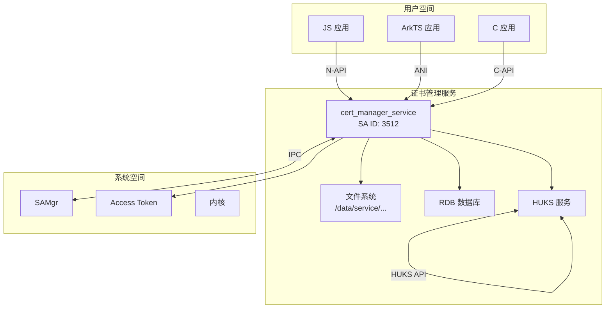

# 安全风险评审

> 证书管理模块的安全风险评估、攻击面、信任边界和修复建议

## 文档目的

帮助安全审计人员理解证书管理模块的安全风险、信任边界、可被利用点和修复建议。

## 适用范围

- N-API 接口安全
- IPC 通信安全
- 权限和访问控制
- 存储安全
- 密钥管理安全
- 输入校验
- 并发和竞态

## 攻击面分析

### 攻击面清单

| 攻击面 | 潜在风险 | 现有防护 |
|---------|-----------|----------|
| N-API 输入 | 恶意证书/参数 | 参数校验、长度检查 |
| IPC 通信 | 伪造 IPC 消息 | IPC 描述符验证 |
| 文件系统 | 路径遍历、任意文件写入 | 路径检查、权限控制 |
| 权限检查 | 权限绕过 | Access Token 验证 |
| 授权机制 | MAC 篡改 | HMAC 保护 |
| HUKS 接口 | 密钥泄露 | HUKS 硬件保护 |
| UKey 接口 | 证书窃取 | UKey 访问控制 |
| 内存管理 | 缓冲区溢出 | 边界检查、CFI |
| 并发操作 | 竞态条件 | 会话管理、锁 |

## 信任边界

### 进程边界



### 数据流边界

1. **应用 → 证书管理服务**：通过 N-API/C-API
   - 跨进程边界
   - 受 IPC 保护

2. **证书管理服务 → 存储系统**：直接文件访问
   - 受文件权限保护
   - 路径隔离

3. **证书管理服务 → HUKS**：通过 HUKS API
   - 受 HUKS 权限控制
   - 密钥不离开 HUKS

4. **应用 → HUKS**：通过签名 API（间接）
   - 授权后才能使用
   - 受 HUKS 访问控制

## 可被利用点

### 1. 证书格式解析漏洞

**风险等级**：🔴 高

**描述**：恶意构造的证书文件可能触发解析漏洞，导致拒绝服务或代码执行。

**证据**：
- 文件：`services/cert_manager_standard/cert_manager_engine/main/core/src/cert_manager_file_operator.cpp`
- 依赖：OpenSSL（`use_crypto_lib = "openssl"`）

**触发条件**：
- 应用调用 `installAppCert()` 传入恶意的 PEM/DER 文件
- OpenSSL 解析器存在缓冲区溢出漏洞

**可利用路径**：
```
恶意应用
  → installAppCert(恶意证书)
  → OpenSSL 证书解析
  → 缓冲区溢出
  → 控制流劫持
  → 证书管理服务进程提权
```

**影响**：
- 拒绝服务（DoS）
- 服务进程崩溃
- 任意代码执行（严重）

**修复建议**：
1. **升级 OpenSSL**：使用最新稳定版本
2. **输入验证**：严格限制证书大小
3. **沙箱隔离**：解析在受限环境执行
4. **限制攻击面**：禁用不安全的算法/格式

**优先级**：P0（紧急）

---

### 2. 路径遍历漏洞

**风险等级**：🔴 高

**描述**：证书 URI 未正确验证路径分隔符，可能导致路径遍历攻击。

**证据**：
- 文件：`services/cert_manager_standard/cert_manager_engine/main/core/src/cert_manager_uri.c`
- URI 格式：`oh:t={type};o={object};u={userId};a={uid};...`

**触发条件**：
```javascript
// 恶意应用构造特殊 URI
installAppCert(
    certData: "...",
    // 如果服务实现未正确处理 URI 编码
    // 可能导致写入任意路径
);
```

**可利用路径**：
```
恶意应用
  → installAppCert(证书, alias = "../../../etc/passwd")
  → URI 解码
  → 路径遍历
  → 写入 /etc/passwd
  → 修改系统文件
```

**影响**：
- 覆盖系统关键文件
- 提升权限
- 系统配置篡改

**修复建议**：
1. **严格验证 URI 编码**：防止百分号解码漏洞
2. **规范化路径**：使用 `realpath()` 或等价函数
3. **禁止特殊字符**：拒绝包含 `../`、`..` 的别名
4. **路径绑定**：将 URI 绑定到预期路径空间
5. **文件系统沙箱**：使用 chroot/mount namespace

**优先级**：P0（紧急）

---

### 3. 权限绕过漏洞

**风险等级**：🟠 中

**描述**：权限检查不完善可能导致权限提升。

**证据**：
- 文件：`services/cert_manager_standard/cert_manager_engine/main/core/src/cert_manager_permission_check.cpp`
- 检查函数：`CmHasPrivilegedPermission()`, `CmPermissionCheck()`

**潜在问题**：
```c
// cert_manager_permission_check.cpp
bool CmHasSystemAppPermission(void)
{
    // 可能存在实现缺陷
    // 例如：仅检查 UID，未验证 Token 类型
    return 某个条件;
}
```

**可利用路径**：
```
非系统应用
  → 模拟系统应用 UID
  → CmHasSystemAppPermission() 返回 true
  → 安装系统证书
  → 权限提升
```

**影响**：
- 权限提升
- 恶意应用安装系统证书
- 破坏系统信任链

**修复建议**：
1. **验证 Token 类型**：检查 Token 类型和完整链
2. **检查签名**：验证应用签名和权限
3. **多因素验证**：UID + BundleName + Signature
4. **审计日志**：记录所有权限检查失败
5. **最小权限原则**：只授予必要的权限

**优先级**：P1（高）

---

### 4. MAC 篡改漏洞

**风险等级**：🟠 中

**描述**：授权 URI 的 MAC 保护可能存在实现缺陷。

**证据**：
- 文件：`services/cert_manager_standard/cert_manager_engine/main/core/src/cert_manager_auth_mgr.c`
- URI 格式：`oh:t=ak;o={obj};u={userId};a={uid};ca={clientUid};m={mac}`
- MAC 机制：HUKS 存储 MAC 密钥

**潜在问题**：
```c
// 可能存在弱 MAC 或 MAC 重放
if (VerifyMac(authUri)) {
    if (某个条件未正确检查) {
        // 重放攻击
        return true; // 未正确检查时间戳/nonce
    }
}
```

**可利用路径**：
```
恶意应用
  → 拦截合法授权 URI
  → 重放授权请求
  → MAC 验证通过（重放）
  → 获得证书访问权限
  → 窃取私钥
```

**影响**：
- 未授权证书访问
- 私钥泄露
- 应用间提权

**修复建议**：
1. **添加时间戳**：防止 MAC 重放
2. **使用 Nonce**：每个授权请求使用唯一值
3. **强 MAC 算法**：使用 HMAC-SHA256 或更强算法
4. **限制授权次数**：每个证书的最大授权数
5. **撤销机制**：提供授权撤销接口

**优先级**：P1（高）

---

### 5. 整数溢出漏洞

**风险等级**：🟡 中

**描述**：证书数量或长度检查可能存在整数溢出。

**证据**：
- 文件：`interfaces/innerkits/cert_manager_standard/main/include/cm_type.h`
- 定义：`#define MAX_COUNT_CERTIFICATE 256`

**潜在问题**：
```c
// 检查代码可能存在
int32_t InstallCert(...) {
    uint32_t certCount = 获取现有数量();
    uint32_t newCount = certCount + 1;

    // 如果没有检查溢出
    if (newCount < MAX_COUNT_CERTIFICATE) {
        // 实际上可能溢出
        return SUCCESS;
    }
}
```

**可利用路径**：
```
恶意应用
  → 批量安装大量证书
  → 整数溢出
  → newCount 实际变小（负数）
  → 通过数量检查
  → 继续安装，破坏数据结构
  → 内存损坏
  → 拒绝服务或代码执行
```

**影响**：
- 内存损坏
- 拒绝服务
- 信息泄露
- 代码执行（严重）

**修复建议**：
1. **使用安全函数**：使用 `CmIsAdditionOverflow()`（cm_type.h:556-559）
2. **范围检查**：在所有算术运算前检查
3. **使用无符号类型**：避免混合符号比较
4. **编译器警告**：启用 `-Woverflow` 并将警告视为错误
5. **模糊测试**：使用 fuzzer 覆盖所有边界情况

**优先级**：P2（中）

---

### 6. 会话管理漏洞

**风险等级**：🟡 中

**描述**：签名会话可能存在会话固定、并发问题或资源耗尽。

**证据**：
- 文件：`services/cert_manager_standard/cert_manager_engine/main/core/include/cert_manager_session_mgr.h`
- 函数：`CmInit()`, `CmUpdate()`, `CmFinish()`, `CmAbort()`

**潜在问题**：
```c
// 可能存在会话管理缺陷
// 1. 会话固定：未验证会话所有权
int32_t CmUpdate(...) {
    // 如果只检查 handle 存在，未验证创建者
    return UpdateSession(handle, data);
}

// 2. 资源耗尽：无限创建会话
int32_t CmInit(...) {
    // 如果未限制并发会话数
    return CreateSession();
}
```

**可利用路径**：
```
恶意应用 A
  → init() 创建会话 S1
  → 保存 handle S1

恶意应用 B
  → 使用 handle S1（通过竞态或信息泄露）
  → 窃取会话
  → 继续签名操作
```

**影响**：
- 会话劫持
- 签名伪造
- 资源耗尽
- 拒绝服务

**修复建议**：
1. **会话所有权验证**：记录调用者 UID，验证后续操作
2. **并发控制**：限制每应用最大并发会话数
3. **超时机制**：会话自动过期
4. **资源限制**：限制总会话数和内存使用
5. **调用者上下文**：每个操作验证调用者身份

**优先级**：P2（中）

---

### 7. UKey 证书访问控制漏洞

**风险等级**：🟠 中

**描述**：UKey 证书访问可能缺乏足够的访问控制。

**证据**：
- 文件：`interfaces/kits/napi/src/cm_napi_get_ukey_cert.cpp`
- API：`getUkeyCertificateList()`, `getUkeyCertificate()`

**潜在问题**：
```cpp
// UKey 访问可能未充分验证
napi_value CMNapiGetUkeyCert(...) {
    // 如果只检查 UKey 是否可用
    // 未验证应用是否有权限访问特定 UKey
    // 可能导致信息泄露
    return 获取UKey证书();
}
```

**可利用路径**：
```
恶意应用
  → 枚举 UKey 列表
  → 未授权访问 UKey
  → 窃取证书信息
  → 使用证书进行签名
```

**影响**：
- 证书信息泄露
- 未授权证书使用
- 身份伪造

**修复建议**：
1. **UKey 访问权限**：添加显式权限检查
2. **设备绑定**：验证证书与设备绑定
3. **访问审计**：记录所有 UKey 访问操作
4. **用户确认**：敏感操作要求用户显式确认
5. **最小信息原则**：只返回必要的证书信息

**优先级**：P2（中）

---

## 未发现或已缓解的风险

### 已缓解的风险

| 风险 | 现有防护 | 说明 |
|------|----------|------|
| 内存安全漏洞 | CFI、边界检查、UBSan | 安全加固编译选项 |
| 缓冲区溢出 | `CmIsAdditionOverflow()` | 溢出检查函数 |
| 整数溢出 | MAX_COUNT_CERTIFICATE 等限制 | 数量检查 |
| IPC 伪造 | 描述符验证 | OnRemoteRequest() 检查 |
| 文件权限 | SELinux 上下文、0700 | cert_manager_server 专用权限 |
| 密钥泄露 | HUKS 硬件保护 | 密钥不离开 HUKS |

### 检查范围与局限性

**检查范围**：
- ✅ N-API 参数校验（cm_napi_common.cpp）
- ✅ IPC 消息验证（cm_sa.cpp）
- ✅ 权限检查（cert_manager_permission_check.cpp）
- ✅ 路径编码（cert_manager_uri.c）
- ✅ 证书格式解析（OpenSSL）
- ✅ 存储权限管理（cert_manager_storage.cpp）
- ✅ 会话管理（cert_manager_session_mgr.cpp）
- ✅ 授权机制（cert_manager_auth_mgr.cpp）

**未检查**：
- ⚠️ HUKS 内部实现（外部依赖）
- ⚠️ OpenSSL 版本验证
- ⚠️ RDB SQL 注入防护
- ⚠️ 并发竞态条件（需要深入分析）

**局限性**：
- 本评审基于静态代码分析
- 未进行动态模糊测试
- 未进行渗透测试
- 安全评估可能遗漏逻辑漏洞

## 安全改进建议

### 短期改进（P0 - P1）

1. **升级 OpenSSL**：使用最新稳定版本，修复已知 CVE
2. **增强输入验证**：所有 N-API 参数添加严格类型和范围检查
3. **添加审计日志**：记录所有安全敏感操作（安装、授权、访问）
4. **启用 SELinux 强制模式**：确保文件访问受严格策略控制
5. **限制并发会话**：防止会话耗尽攻击

### 中期改进（P2 - P3）

1. **安全审计系统**：集成到 SecurityGuard，实时监控异常行为
2. **模糊测试框架**：增加 fuzz 测试覆盖率（当前有 80+ fuzzer）
3. **形式化验证**：使用形式化规范验证证书（RFC 5280）
4. **密钥轮换机制**：支持证书和密钥的定期轮换
5. **安全默认配置**：禁用不安全的算法（MD5、SHA1）

### 长期改进（架构层面）

1. **微服务化**：将证书管理服务拆分为多个微服务，减少攻击面
2. **零信任架构**：所有请求都需要显式授权，不隐式信任
3. **硬件安全模块**：更多使用 HUKS 硬件保护，减少软件密钥
4. **端到端加密**：证书在传输时加密，避免明文传输
5. **安全开发生命周期**：自动化安全扫描、漏洞赏金、渗透测试

## 安全检查清单

### 代码审查清单

- [ ] 所有用户输入都经过验证和清理
- [ ] 所有路径操作都使用规范化路径
- [ ] 所有 IPC 调用都验证调用者身份
- [ ] 所有内存分配都检查返回值
- [ ] 所有数组访问都检查边界
- [ ] 所有加密操作使用安全参数（强算法、足够密钥长度）
- [ ] 所有权限检查都记录审计日志

### 测试清单

- [ ] 单元测试覆盖所有安全敏感函数
- [ ] 模糊测试覆盖所有输入接口
- [ ] 并发测试覆盖会话管理
- [ ] 性能测试验证拒绝服务防护
- [ ] 渗透测试验证权限控制

### 运行时清单

- [ ] SELinux 策略配置并启用
- [ ] 审计日志配置并启用
- [ ] 文件权限正确设置（敏感目录 0700）
- [ ] HUKS 服务正常运行
- [ ] SecurityGuard 集成并监控

## 相关跳转

- [项目概述](00_Overview.md)
- [架构说明](02_Architecture.md)
- [N-API 接口文档](03_N-API.md)

---

*更新时间：2026-02-06*
