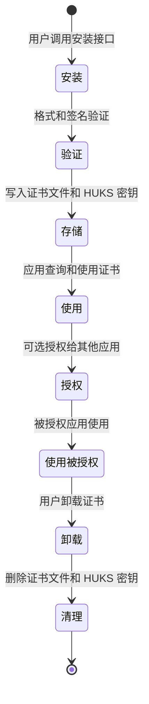
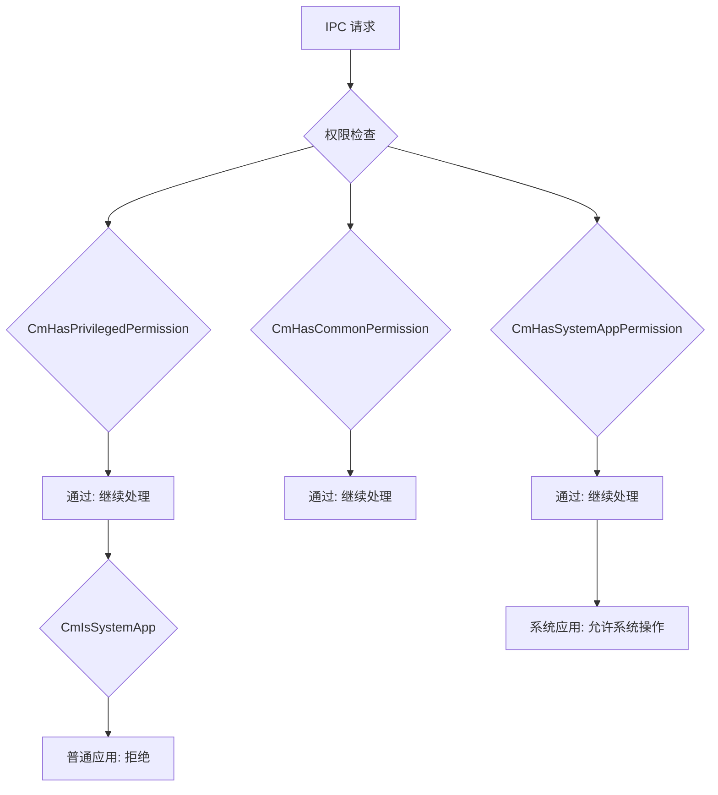

# 内部实现细节 (Internal Implementation Details)

## 文档目的
本文档深入分析 certificate_manager 模块的核心类、资源生命周期和内部 API 契约。

---

## 核心类与结构体

### 服务层主类

#### CertManagerService
**文件**: `services/.../sa/cm_sa.h`

| 属性 | 类型 | 说明 |
|------|------|------|
| 继承 | SystemAbility | 系统能力基类 |
| SA ID | 3512 | 在 SystemAbilityManager 中注册的 ID |
| 接口 | ICertManagerService | 远程代理接口 |

**关键方法**:
```cpp
// 服务启动
int32_t CertManagerService::OnStart();

// IPC 请求处理
int32_t CertManagerService::OnRemoteRequest(
    uint32_t code,
    MessageParcel &data,
    MessageParcel &reply,
    MessageOption &option);

// 服务停止
int32_t CertManagerService::OnStop();
```

### 引擎层核心类

#### 证书管理器
**文件**: `services/.../engine/main/core/src/cert_manager_service.c`

主要函数：
```c
// 安装应用证书
int32_t CmServicInstallAppCert(
    struct CmContext *context,
    const struct CmAppCertParam *certParam,
    struct CmBlob *keyUri);

// 获取应用证书
int32_t CmServiceGetAppCert(
    struct CmContext *context,
    uint32_t store,
    struct CmBlob *keyUri,
    struct CmBlob *certBlob);

// 授权证书
int32_t CmServiceGrantAppCertificate(
    struct CmContext *context,
    const struct CmBlob *keyUri,
    uint32_t appUid,
    struct CmBlob *authUri);

// 获取授权列表
int32_t CmServiceGetAuthorizedAppList(
    struct CmContext *context,
    const struct CmBlob *keyUri,
    struct CmAppUidList *appUidList);
```

#### 授权管理器
**文件**: `services/.../engine/main/core/src/cert_manager_auth_mgr.c`

主要函数：
```c
// 添加授权 UID
int32_t CmAuthMgrAddAuthUid(const struct CmBlob *keyUri, uint32_t appUid);

// 检查授权
int32_t CmAuthMgrIsAuthorizedApp(const struct CmBlob *authUri);

// 移除授权 UID
int32_t CmAuthMgrRemoveAuthUid(const struct CmBlob *keyUri, uint32_t appUid);

// 获取授权列表
int32_t CmAuthMgrGetAuthorizedAppList(const struct CmBlob *keyUri);
```

### IPC 处理器
**文件**: `services/.../engine/main/os_dependency/idl/cm_ipc/cm_ipc_service.c`

关键函数：
```c
// IPC 消息处理表
static const CmIpcHandler g_cmIpcHandler[] = {
    {CM_MSG_GET_CERTIFICATE_LIST, CmIpcServiceGetCertificateList},
    {CM_MSG_GET_CERTIFICATE_INFO, CmIpcServiceGetCertificateInfo},
    // ... 27 个处理函数
};

// 主 IPC 处理入口
int32_t CmIpcServiceHandler(const CmBlob *inBlob, struct CmBlob *outBlob, const struct CmContext *context);
```

---

## 资源生命周期

### 证书生命周期



**详细流程**：

#### 1. 证书安装流程

```
应用 (N-API installPublicCertificate)
    ↓
IPC 客户端 (cm_request.cpp)
    ↓
CertManagerService::OnRemoteRequest()
    ↓
CmIpcServiceInstallAppCert()
    ↓
CmServicInstallAppCert() [Engine Layer]
    ↓ ├─ CmCheckCallerIsProducer() // 权限检查
    ↓ ├─ CmParseCert()          // 证书解析
    ↓ ├─ CmCheckCertName()      // 名称检查
    ↓ ├─ CmGetCertificatePath()  // 路径生成
    ↓ ├─ CmCheckCertAliasLen()  // 别名长度检查
    ↓ ├─ HUKS 导入密钥      // HUKS HuksImportKey()
    ↓ ├─ 写入证书文件         // 文件系统操作
    ↓ └─ RDB 记录元数据      // cm_cert_property_rdb.c
    ↓
返回证书 URI
```

#### 2. 证书查询流程

```
应用 (N-API getPublicCertificate)
    ↓
IPC 客户端
    ↓
CertManagerService::OnRemoteRequest()
    ↓
CmIpcServiceGetAppCert()
    ↓
CmServiceGetAppCert() [Engine Layer]
    ↓ ├─ CmCheckCallerIsProducer() // 权限检查
    ↓ ├─ CmCheckAndGetCommonUri()  // URI 验证
    ↓ ├─ CmGetCertificatePath()  // 路径获取
    ↓ ├─ 读取证书文件         // 文件系统操作
    ↓ ├─ HUKS 导出密钥        // HUKS HuksExportKey()
    ↓ └─ 打包返回数据          // MessageParcel
    ↓
返回证书数据
```

#### 3. 授权流程

```
应用 A (N-API grantPublicCertificate)
    ↓
指定证书 URI 和目标应用 UID
    ↓
IPC 客户端
    ↓
CmIpcServiceGrantAppCertificate()
    ↓
CmServiceGrantAppCertificate() [Engine Layer]
    ↓ ├─ CmCheckCallerIsProducer() // 权限检查（必须拥有者）
    ↓ ├─ CmAuthMgrAddAuthUid()   // 添加授权
    ↓ ├─ RDB 记录授权关系      // cm_cert_property_rdb.c
    ↓ └─ 生成授权 URI
    ↓
返回授权 URI
```

应用 B (被授权应用)
```
应用 B (N-API getPrivateCertificate)
    ↓
使用授权 URI
    ↓
IPC 客户端
    ↓
CmIpcServiceGetAppCert()
    ↓
CmServiceGetAppCert() [Engine Layer]
    ↓ ├─ CmIsAuthorizedApp()     // 检查授权有效性
    ↓ ├─ CmCheckCallerIsProducer() // 验证调用者
    ↓ ├─ 读取证书文件
    ↓ ├─ HUKS 导出密钥
    ↓ └─ 打包返回数据
    ↓
返回证书和密钥
```

---

## HUKS 集成

### 密钥操作

| 操作 | HUKS API | 引用位置 |
|------|-----------|----------|
| **导入密钥** | HuksImportKey() | cert_manager_key_operation.c |
| **删除密钥** | HuksDeleteKey() | cert_manager_key_operation.c |
| **导出密钥** | HuksExportKey() | cert_manager_key_operation.c |
| **签名操作** | HuksSign() / HuksVerify() | cert_manager_crypto_operation.c |

### 密钥别名管理

**URI 格式**:
```
cert://<userId>/<uid>/<type>/<object>
```

**示例**:
```
cert://100/100/0/123456789
         ↓   ↓   ↓         ↓
      用户  UID 证书类型 对象标识
```

**别名到 HUKS 别名映射**：
- 证书 URI 作为 HUKS key 的别名
- 通过 CmCheckAndGetCommonUri() 提取别名部分

---

## 内部 API 契约

### 稳定接口 vs 内部接口

| 类别 | 接口类型 | 稳定性 | 说明 |
|------|-----------|--------|------|
| N-API | 外部接口 | ✅ 稳定 | 公开 API，向开发者承诺稳定性 |
| Inner C API | 内部接口 | ⚠️ 不稳定 | 可能在版本间变更 |

### 不稳定的内部接口

以下内部接口标记为不稳定（可能在版本间变更）：

| 函数 | 文件 | 用途 |
|------|------|------|
| CmCreateSession() | cert_manager_session_mgr.h | 创建操作会话 |
| CmDestroySession() | cert_manager_session_mgr.h | 销毁操作会话 |
| CmGetSession() | cert_manager_session_mgr.h | 获取会话信息 |

**建议**：仅使用 N-API (`security.certmanager`) 进行证书管理操作。

---

## Session 管理

### 密码学操作 Session

**Session 生命周期**：
```c
// 初始化
CmInit() -> 返回 handle
    ↓
// 更新（可多次调用）
CmUpdate(handle, inData)
    ↓
// 完成或中止
CmFinish(handle, inData, outData) 或 CmAbort(handle)
```

### Session 限制

| 限制 | 值 | 说明 |
|------|-----|------|
| 最大会话数 | CM_MAX_SESSION_COUNT | 防止资源耗尽 |
| 会话超时 | 无文档 | TODO(需确认超时设置) |

---

## 文件系统操作

### 存储路径管理

**文件**: `services/.../engine/main/core/src/cert_manager_storage.c`

关键函数：
```c
// 获取证书路径
int32_t CmGetCertificatePath(enum CmCertType type, uint32_t userId, char *path, uint32_t pathLen);

// 创建目录
int32_t CmMkdir(const char *path);

// 删除文件
int32_t CmRemoveFile(const char *filePath);

// 检查文件是否存在
bool CmIsFileExist(const char *filePath);
```

### 路径规范化

**文件**: `services/.../engine/main/core/src/cert_manager_file_operator.c`

```c
// URI 路径解析
int32_t CmGetUriPath(const struct CmContext *context, const struct CmBlob *uri, char *path, uint32_t pathLen);

// 构建证书文件路径
int32_t CmGetCertFilePath(const struct CmContext *context, const struct CmBlob *uri, struct CmMutableBlob *pathBlob);
```

---

## 权限控制实现

### 权限检查层次



### 权限类型

| 权限函数 | 权限字符串 | 检查逻辑 |
|----------|-----------|----------|
| CmHasPrivilegedPermission() | ohos.permission.ACCESS_CERT_MANAGER_INTERNAL | 检查系统内部权限 |
| CmHasCommonPermission() | ohos.permission.ACCESS_CERT_MANAGER | 检查基础证书访问权限 |
| CmHasUserTrustedPermission() | ohos.permission.ACCESS_USER_TRUSTED_CERT | 检查用户信任证书权限 |
| CmHasSystemAppPermission() | - | 检查是否为系统应用（token 验证）|

### 权限矩阵

| 操作 | 存储类型 | 所需权限 | 系统应用要求 |
|------|-----------|-------------|-------------|
| 安装应用证书 | CM_CREDENTIAL_STORE (0) | Privileged + Common | 系统应用 |
| 查询应用证书 | CM_PRI_CREDENTIAL_STORE (3) | Common | - |
| 系统证书操作 | CM_SYS_CREDENTIAL_STORE (4) | Common + SystemApp | 系统应用 |

---

## 事件监听

### 系统事件

**文件**: `services/.../sa/cm_event_observer.cpp`

| 事件 | 用途 | 处理函数 |
|------|------|----------|
| usual.event.USER_REMOVED | 用户删除时清理证书 | OnUserRemoved() |
| usual.event.PACKAGE_REMOVED | 应用卸载时清理证书 | OnPackageRemoved() |

**清理流程**：
```
用户删除
    ↓
SystemEvent 发布 USER_REMOVED
    ↓
cm_event_observer 订阅
    ↓
OnUserRemoved()
    ↓
CmUninstallAllUserCert(userId)
    ↓
删除该用户所有证书
```

---

## 数据持久化

### RDB 存储

**文件**: `services/.../engine/main/rdb/src/cm_cert_property_rdb.c`

| 操作 | 用途 |
|------|------|
| 插入元数据 | 记录证书属性（URI、别名、状态）|
| 查询元数据 | 检索证书信息 |
| 更新元数据 | 更新证书状态 |
| 删除元数据 | 清理已删除证书记录 |

**数据表**（TODO(需确认表结构）:
- cert_property: 存储证书基本属性
- auth_relation: 存储授权关系

---

## 内存管理

### 内存分配

| 限制 | 值 | 说明 |
|------|-----|------|
| 单个证书数据 | MAX_LEN_CERTIFICATE | 8196 字节 |
| 证书列表 | MAX_COUNT_CERTIFICATE | 256 个 |
| IPC 缓冲区 | MAX_IPC_BUF_SIZE | 64KB |
| IPC 分配 | MAX_MALLOC_LEN | 1MB |

### 内存清理

**文件**: `interfaces/.../cm_type.h`

```c
// 释放 UKey 证书
CM_API_EXPORT void CmFreeUkeyCertificate(struct CredentialDetailList *certificateList);

// 释放凭证
CM_API_EXPORT void CmFreeCredential(struct Credential *certificate);
```

---

## 错误处理

### 错误传播

```
Engine Layer
    ↓ 返回 int32_t 错误码
IPC Layer
    ↓ 序列化到 MessageParcel
Service Layer (SA)
    ↓ 通过 IPC 返回
N-API Layer
    ↓ 映射 C 错误码到 JS 错误码
    ↓
应用收到 BusinessError
```

### 错误码映射

**文件**: `interfaces/kits/napi/src/cm_napi_common.cpp`

| C 错误码 | JS 错误码 | 映射逻辑 |
|----------|-----------|----------|
| CM_SUCCESS | - | 操作成功 |
| CM_FAILURE | INNER_FAILURE | 内部失败 |
| CMR_ERROR_PERMISSION_DENIED | HAS_NO_PERMISSION | 权限被拒绝 |
| CMR_ERROR_NOT_SYSTEMP_APP | NOT_SYSTEM_APP | 不是系统应用 |
| CMR_ERROR_INVALID_ARGUMENT | PARAM_ERROR | 参数无效 |
| CMR_ERROR_NOT_FOUND | NOT_FOUND | 未找到 |
| CMR_ERROR_PASSWORD_IS_ERR | PASSWORD_IS_ERROR | 密码错误 |

---

## 并发安全

### 线程模型

| 组件 | 线程模型 | 说明 |
|------|---------|------|
| CertManagerService (SA) | 32 个工作线程 | 处理 IPC 请求 |
| IPC 客户端 | 同步调用 | 单线程等待响应 |
| Engine Layer | 无明确线程池 | 可能使用 RDB 线程 |

### 竞态条件风险

| 位置 | 潜在问题 | 缓解措施 |
|------|---------|----------|
| 证书文件读写 | TOCTOU | 使用原子操作 |
| HUKS 密钥操作 | 竞态条件 | TODO(需验证) |
| RDB 操作 | 并发冲突 | 使用事务机制 |

---

## 待确认事项

### 需要进一步验证

| 问题 | 优先级 |
|------|--------|
| Session 超时机制 | 高 | 未文档中说明超时设置 |
| TOCTOU 保护 | 高 | 文件系统操作未明确原子性 |
| HUKS 密钥池限制 | 中 | 是否存在密钥数量限制 |
| RDB 并发机制 | 中 | 事务隔离级别未知 |

---

## 相关链接

- [接口文档](04_Interface.md) - 查看稳定 API 契约
- [构建文档](07_Build.md) - 了解编译产物和依赖
- [代码地图](03_CodeMap.md) - 定位核心类位置

---

**适用范围**：本文档适用于 OpenHarmony 4.0 版本的 certificate_manager 模块

**最后更新**：2026-02-07
