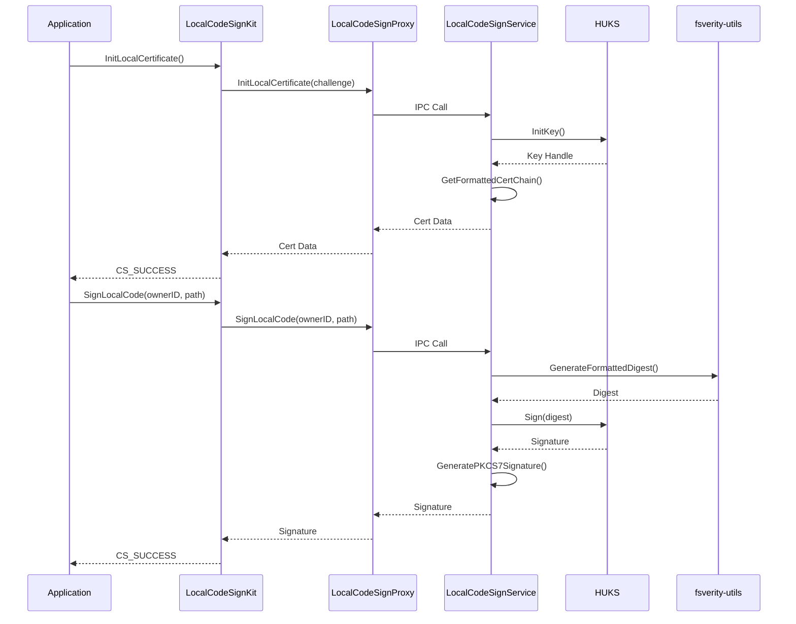
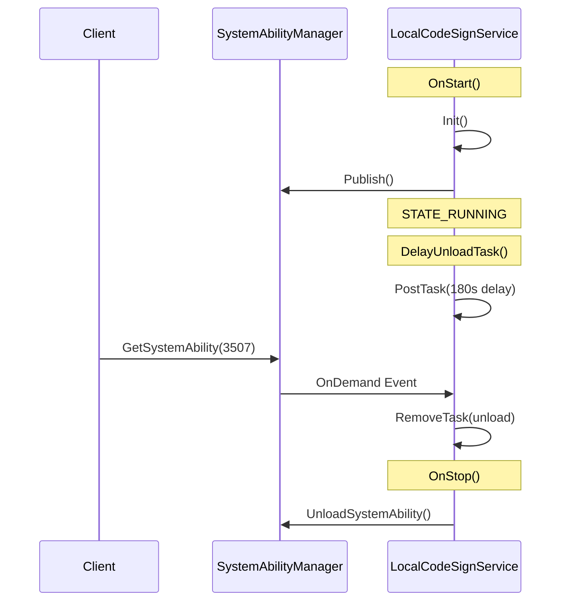

# 架构说明

## 1. 整体架构

### 1.1 架构图

```
┌─────────────────────────────────────────────────────────────────────────┐
│                         OpenHarmony System                               │
├─────────────────────────────────────────────────────────────────────────┤
│                                                                          │
│  ┌──────────────────────────────────────────────────────────────────────┐│
│  │                     User Space Applications                          ││
│  │     (HAP/Native Apps calling Code Sign APIs)                         ││
│  └──────────────────────────────────────────────────────────────────────┘│
│                                      │                                    │
│                                      ▼                                    │
│  ┌──────────────────────────────────────────────────────────────────────┐│
│  │                      Interface Layer (Inner API)                     ││
│  │  ┌─────────────┬─────────────┬─────────────┬─────────────────────┐ ││
│  │  │code_sign_   │code_sign_   │local_code_  │jit_code_sign        │ ││
│  │  │utils        │attr_utils   │sign_kit     │                     │ ││
│  │  │             │             │             │                     │ ││
│  │  │EnforceCode- │InitXpm      │InitLocal-   │JitCodeSigner        │ ││
│  │  │SignForApp   │SetXpmOwnerId│Certificate  │                     │ ││
│  │  │             │             │SignLocal-   │                     │ ││
│  │  │             │             │Code         │                     │ ││
│  │  └─────────────┴─────────────┴─────────────┴─────────────────────┘ ││
│  └──────────────────────────────────────────────────────────────────────┘│
│                                      │                                    │
│                                      ▼                                    │
│  ┌──────────────────────────────────────────────────────────────────────┐│
│  │                        Service Layer                                   ││
│  │                                                                      ││
│  │  ┌─────────────────────┐      ┌─────────────────────┐               ││
│  │  │  key_enable         │      │  local_code_sign    │               ││
│  │  │  (Rust)             │      │  (SA ID: 3507)      │               ││
│  │  │                     │      │                     │               ││
│  │  │ - Cert Init        │      │ - InitLocalCert     │               ││
│  │  │ - Profile Mgmt     │      │ - SignLocalCode    │               ││
│  │  │ - Enterprise Resign│      │                     │               ││
│  │  └─────────────────────┘      └─────────────────────┘               ││
│  └──────────────────────────────────────────────────────────────────────┘│
│                                      │                                    │
│                     ┌────────────────┼────────────────┐                  │
│                     │                │                │                  │
│                     ▼                ▼                ▼                  │
│  ┌─────────────────────┐ ┌─────────────────────┐ ┌─────────────────────┐│
│  │  HUKS              │ │  IPC Framework     │ │  OpenSSL          ││
│  │  (Key Storage)     │ │  (Samgr/Binder)    │ │  (Crypto Ops)     ││
│  └─────────────────────┘ └─────────────────────┘ └─────────────────────┘│
│                                                                          │
├─────────────────────────────────────────────────────────────────────────┤
│                         Kernel Space                                     │
│                                                                          │
│  ┌─────────────────────┐ ┌─────────────────────┐                       │
│  │  fs-verity          │ │  SELinux            │                       │
│  │  (File Integrity)   │ │  (Access Control)   │                       │
│  └─────────────────────┘ └─────────────────────┘                       │
│                                                                          │
└─────────────────────────────────────────────────────────────────────────┘
```

### 1.2 分层说明

| 层次 | 职责 | 关键组件 |
|------|------|----------|
| **应用层** | 调用代码签名 API | HAP/原生应用 |
| **接口层** | 提供 Inner API | CodeSignUtils, LocalCodeSignKit, CodeSignAttrUtils, JitCodeSigner |
| **服务层** | 核心业务逻辑 | key_enable (Rust), local_code_sign (SA) |
| **基础层** | 系统服务依赖 | HUKS, IPC, OpenSSL, fsverity-utils |

## 2. 模块职责

### 2.1 接口层模块

#### code_sign_utils
- **职责**：代码签名启用
- **关键类**：`CodeSignUtils`
- **依赖**：`utils/` (cert_utils, pkcs7_generator, file_helper)

#### code_sign_attr_utils
- **职责**：XPM 和 OwnerId 管理
- **关键函数**：`InitXpm`, `SetXpmOwnerId`
- **依赖**：内核 XPM 驱动

#### local_code_sign
- **职责**：本地代码签名客户端
- **关键类**：`LocalCodeSignKit`, `LocalCodeSignProxy`
- **依赖**：IPC 框架

#### jit_code_sign
- **职责**：JIT 代码签名
- **关键类**：`JitCodeSigner`, `JitFortHelper`
- **依赖**：ARMv8.3-A PAC

### 2.2 服务层模块

#### key_enable (Rust)
- **职责**：
  - 设备证书初始化
  - Profile 证书管理
  - 企业重签名证书管理
- **关键文件**：
  - `src/key_enable.rs`
  - `src/cert_utils.rs`
  - `src/profile_utils.rs`
  - `src/lib.rs`

#### local_code_sign (SA)
- **职责**：
  - 本地签名证书初始化
  - 本地代码签名
- **关键文件**：
  - `src/local_code_sign_service.cpp`
  - `src/local_code_sign_stub.cpp`
  - `src/local_sign_key.cpp`
- **SA ID**：3507
- **启动方式**：ondemand (按需启动)
- **延迟卸载**：180秒后自动卸载

### 2.3 工具层模块

| 模块 | 职责 |
|------|------|
| cert_utils | 证书操作 |
| pkcs7_generator | PKCS7 签名生成 |
| fsverity_utils_helper | fs-verity 辅助工具 |
| elf_code_sign_block | ELF 签名块处理 |
| signer_info | 签名者信息 |
| huks_attest_verifier | HUKS 证书验证 |
| openssl_utils | OpenSSL 封装 |
| file_helper | 文件操作 |

## 3. 线程模型

### 3.1 LocalCodeSignService 线程模型

```
┌─────────────────────────────────────────────────────────────┐
│              LocalCodeSignService Thread Model               │
├─────────────────────────────────────────────────────────────┤
│                                                              │
│  ┌─────────────────────────┐                                │
│  │   Main Thread (IPC)     │                                │
│  │                         │                                │
│  │  - OnStart/OnStop       │                                │
│  │  - OnRemoteRequest      │                                │
│  │  - IPC Handler          │                                │
│  └─────────────────────────┘                                │
│           │              │                                   │
│           │              │ Async                            │
│           │              │ Processing                        │
│           ▼              ▼                                   │
│  ┌─────────────────────────┐                                │
│  │   FFRT Event Handler    │                                │
│  │                         │                                │
│  │  - DelayUnloadTask      │                                │
│  │  - SA Unload Timer      │                                │
│  └─────────────────────────┘                                │
│                                                              │
└─────────────────────────────────────────────────────────────┘
```

### 3.2 线程职责

| 线程 | 职责 | 说明 |
|------|------|------|
| **Main Thread** | IPC 请求处理 | 处理来自客户端的 IPC 调用 |
| **FFRT Handler** | 延迟任务处理 | 180秒延迟卸载定时器 |

### 3.3 SA 生命周期

```
OnStart()
    │
    ├─► Init()
    │       └─► Create FFRT EventRunner
    │
    ├─► Publish() → SA Manager
    │
    ├─► state_ = STATE_RUNNING
    │
    └─► DelayUnloadTask()
            │
            └─► PostTask(180s delay)
                    │
                    └─► UnloadSystemAbility()
                            │
                            └─► OnStop()
                                    │
                                    └─► Cleanup
```

## 4. 数据流

### 4.1 代码签名启用流程

```
┌──────────────┐     ┌──────────────────┐     ┌─────────────────┐
│   App/Install │────►│   CodeSignUtils  │────►│  fsverity-utils │
│   Manager     │     │  EnforceCodeSign │     │  (IOCTL)        │
└──────────────┘     │  ForApp          │     └─────────────────┘
                      └──────────────────┘             │
                                                      │
                      ┌──────────────────┐             │
                      │  ELF Code Sign   │◄────────────┘
                      │  Block Handler   │
                      └──────────────────┘
```

### 4.2 本地签名流程

```
┌──────────────┐     ┌──────────────────┐     ┌─────────────────┐
│ LocalCodeSign│────►│  IPC Proxy       │────►│ LocalCodeSign   │
│ Kit          │     │  (SA:3507)       │     │ Service         │
└──────────────┘     └──────────────────┘     └─────────────────┘
                                                      │
                                                      ▼
                      ┌──────────────────┐     ┌─────────────────┐
                      │  PKCS7Generator  │◄────│  FsverityUtils  │
                      │  (Signature)     │     │  (Digest)       │
                      └──────────────────┘     └─────────────────┘
                                                      │
                                                      ▼
                                              ┌─────────────────┐
                                              │   HUKS          │
                                              │   (Signing Key) │
                                              └─────────────────┘
```

## 5. 关键时序图

### 5.1 本地代码签名时序



### 5.2 SA 启动与卸载时序



## 6. 依赖关系

### 6.1 模块依赖图

```
┌─────────────────────────────────────────────────────────────┐
│                        Dependencies                         │
├─────────────────────────────────────────────────────────────┤
│                                                              │
│   code_sign_utils ──────► utils/*                           │
│          │                    │                              │
│          │                    ├── cert_utils                │
│          │                    ├── pkcs7_generator            │
│          │                    ├── fsverity_utils_helper      │
│          │                    └── elf_code_sign_block       │
│          │                                                   │
│   local_code_sign_kit ───► IPC Framework                     │
│          │                    │                              │
│          │                    └── local_code_sign (SA)       │
│          │                                                   │
│   key_enable (Rust) ─────► HUKS                             │
│          │                    │                              │
│          │                    └── OpenSSL                    │
│          │                                                   │
└─────────────────────────────────────────────────────────────┘
```

### 6.2 外部依赖

| 依赖组件 | 用途 | 集成方式 |
|----------|------|----------|
| HUKS | 密钥存储和签名 | external_deps |
| OpenSSL | 加密操作 | external_deps |
| fsverity-utils | 文件完整性 | external_deps |
| IPC (ipc_core) | 进程间通信 | external_deps |
| SAMGR | 服务管理 | external_deps |
| SAFWK | SA 框架 | external_deps |
| Hilog | 日志 | external_deps |
| Hitrace | 追踪 | external_deps |
| HISYSEVENT | 事件 | external_deps |
| AccessToken | 权限 | external_deps |
| BundleFramework | 包管理 | external_deps |
| SELinux | 安全策略 | external_deps |
