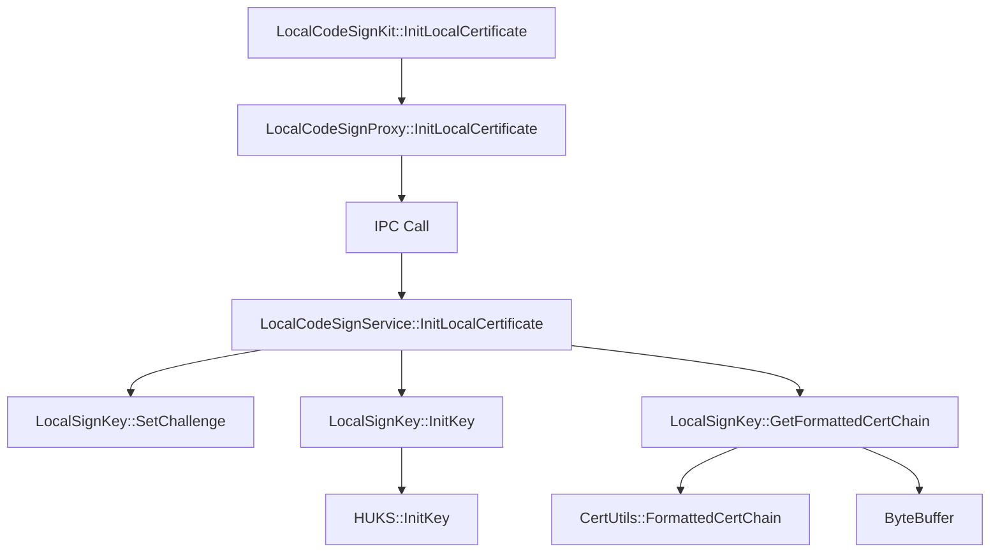
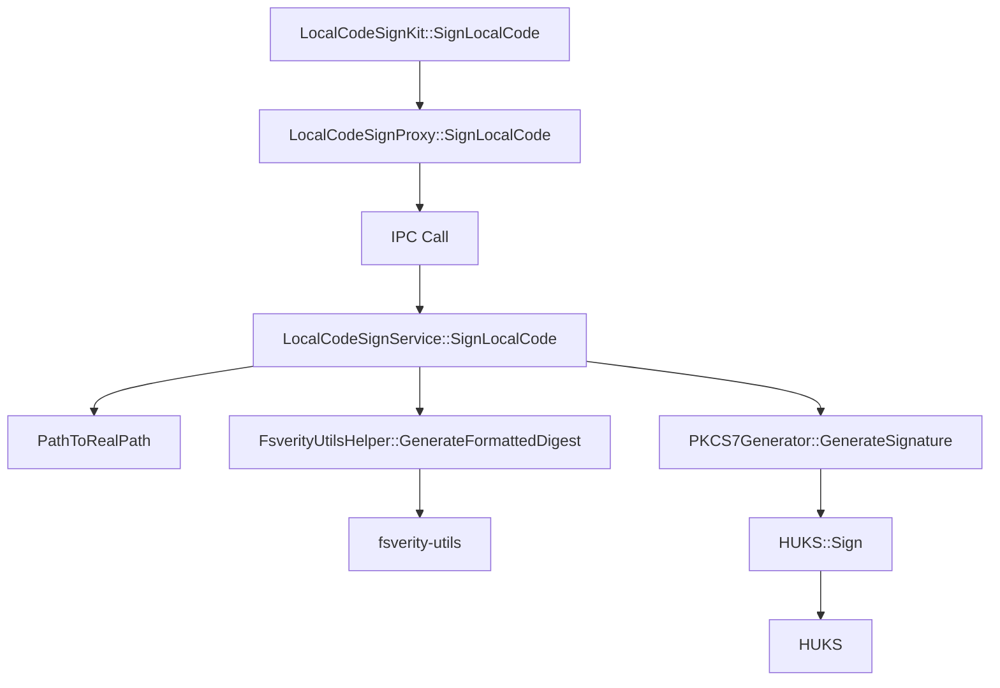
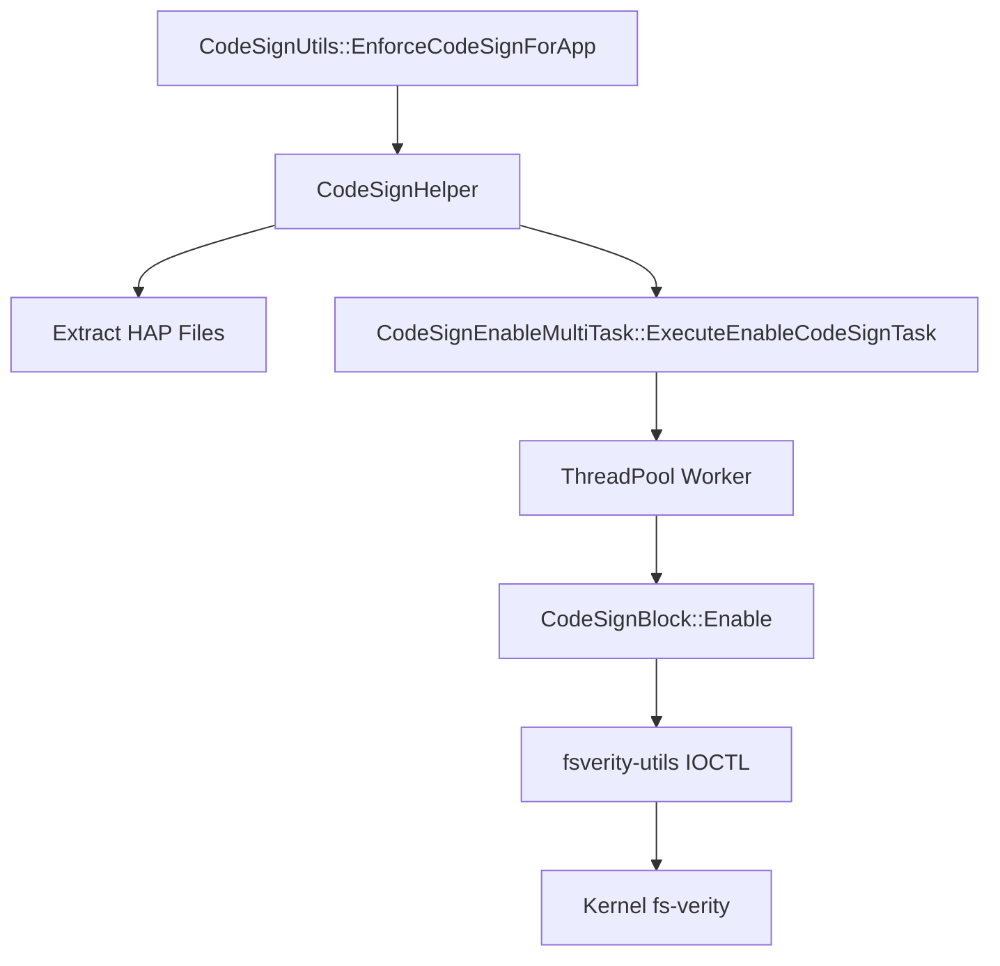
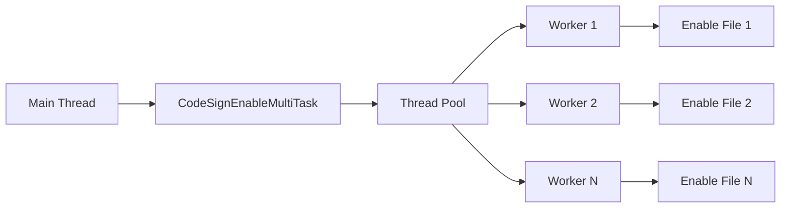
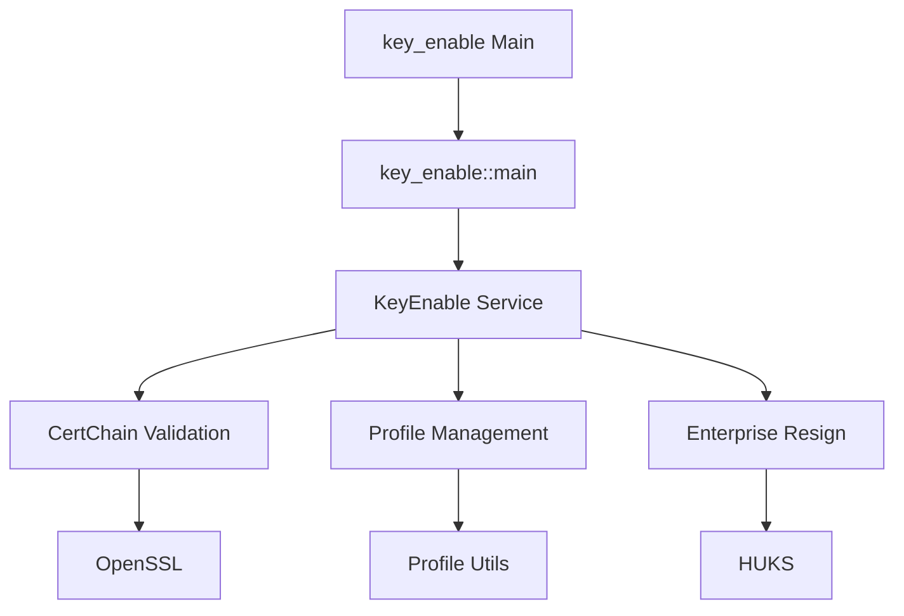
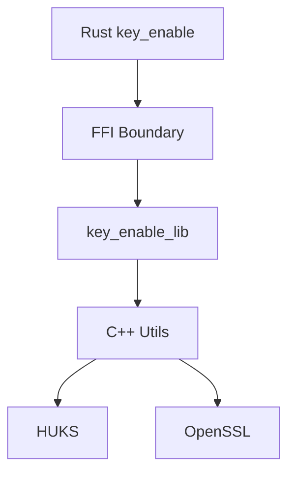
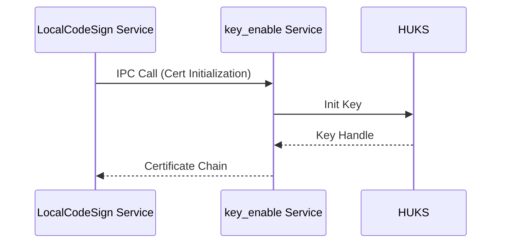

# 关键调用链

本文档描述 `code_signature` 组件的关键调用链，包括 API 调用路径、IPC 调用和服务间通信。

## 目录

- [InitLocalCertificate 调用链](#initlocalcertificate-调用链)
- [SignLocalCode 调用链](#signlocalcode-调用链)
- [EnforceCodeSignForApp 调用链](#enforcecodesignforapp-调用链)

---

## InitLocalCertificate 调用链

### 调用链图



### 详细步骤

| 步骤 | 组件 | 方法 | 说明 |
|------|------|------|------|
| 1 | 接口层 | `LocalCodeSignKit::InitLocalCertificate` | 客户端入口 |
| 2 | 接口层 | `LocalCodeSignProxy::InitLocalCertificate` | IPC Proxy |
| 3 | IPC | `MessageParcel::Write*` | 序列化参数 |
| 4 | 服务层 | `LocalCodeSignService::InitLocalCertificate` | SA 处理 |
| 5 | 服务层 | `LocalSignKey::SetChallenge` | 设置挑战值 |
| 6 | 服务层 | `LocalSignKey::InitKey` | 初始化密钥 |
| 7 | 基础层 | `HUKS::InitKey` | HUKS 密钥初始化 |
| 8 | 服务层 | `LocalSignKey::GetFormattedCertChain` | 获取证书链 |
| 9 | 工具层 | `CertUtils::FormattedCertChain` | 格式化证书链 |

### 源文件位置

| 组件 | 文件路径 |
|------|----------|
| LocalCodeSignKit | `interfaces/inner_api/local_code_sign/src/local_code_sign_kit.cpp` |
| LocalCodeSignProxy | `interfaces/inner_api/local_code_sign/src/local_code_sign_proxy.cpp` |
| LocalCodeSignService | `services/local_code_sign/src/local_code_sign_service.cpp` |
| LocalSignKey | `services/local_code_sign/src/local_sign_key.cpp` |
| CertUtils | `utils/src/cert_utils.cpp` |

---

## SignLocalCode 调用链

### 调用链图



### 详细步骤

| 步骤 | 组件 | 方法 | 说明 |
|------|------|------|------|
| 1 | 接口层 | `LocalCodeSignKit::SignLocalCode` | 客户端入口 |
| 2 | 接口层 | `LocalCodeSignProxy::SignLocalCode` | IPC Proxy |
| 3 | IPC | `MessageParcel::Write*` | 序列化参数 |
| 4 | 服务层 | `LocalCodeSignService::SignLocalCode` | SA 处理 |
| 5 | 服务层 | `PathToRealPath` | 路径规范化 |
| 6 | 服务层 | `FsverityUtilsHelper::GenerateFormattedDigest` | 生成 fs-verity digest |
| 7 | 基础层 | `fsverity-utils` | 文件完整性计算 |
| 8 | 服务层 | `PKCS7Generator::GenerateSignature` | 生成 PKCS7 签名 |
| 9 | 基础层 | `HUKS::Sign` | 使用 HUKS 密钥签名 |

### 权限检查

| 步骤 | 检查 | 文件 |
|------|------|------|
| IPC 前 | `IsValidCallerOfLocalCodeSign` | `permission_utils.cpp` |
| 参数 | `ownerID.length() <= MAX_OWNER_ID_LEN` | `local_code_sign_service.cpp:124` |
| 路径 | `PathToRealPath` | `local_code_sign_service.cpp:130` |

### 源文件位置

| 组件 | 文件路径 |
|------|----------|
| PKCS7Generator | `utils/src/pkcs7_generator.cpp` |
| FsverityUtilsHelper | `utils/src/fsverity_utils_helper.cpp` |
| PermissionUtils | `services/local_code_sign/src/permission_utils.cpp` |

---

## EnforceCodeSignForApp 调用链

### 调用链图



### 详细步骤

| 步骤 | 组件 | 方法 | 说明 |
|------|------|------|------|
| 1 | 接口层 | `CodeSignUtils::EnforceCodeSignForApp` | 客户端入口 |
| 2 | 接口层 | `CodeSignHelper` | HAP 处理 |
| 3 | 接口层 | `ExtractHapFiles` | 解压 HAP |
| 4 | 接口层 | `CodeSignEnableMultiTask::ExecuteEnableCodeSignTask` | 多任务执行 |
| 5 | 工具层 | `ThreadPool` | 线程池 |
| 6 | 工具层 | `CodeSignBlock::Enable` | 启用签名块 |
| 7 | 基础层 | `fsverity-utils IOCTL` | 调用内核 fs-verity |
| 8 | 内核 | `fs-verity` | 文件完整性验证 |

### 并发模型



### 源文件位置

| 组件 | 文件路径 |
|------|----------|
| CodeSignUtils | `interfaces/inner_api/code_sign_utils/src/code_sign_utils.cpp` |
| CodeSignHelper | `interfaces/inner_api/code_sign_utils/src/code_sign_helper.cpp` |
| CodeSignEnableMultiTask | `interfaces/inner_api/code_sign_utils/src/code_sign_enable_multi_task.cpp` |
| CodeSignBlock | `utils/src/code_sign_block.cpp` |

---

## key_enable 服务调用链

### 调用链图



### Rust/C++ 边界



### 源文件位置

| 组件 | 文件路径 |
|------|----------|
| key_enable main | `services/key_enable/src/main.rs` |
| key_enable lib | `services/key_enable/src/lib.rs` |
| Cert utils | `services/key_enable/src/cert_utils.rs` |
| Profile utils | `services/key_enable/src/profile_utils.rs` |

---

## 跨服务通信

### LocalCodeSign ↔ key_enable



### 权限传递

```
LocalCodeSign SA (UID: code_sign)
    │
    └──► AccessTokenKit::GetNativeTokenId("key_enable")
            │
            └──► Verify caller is in whitelist
```
