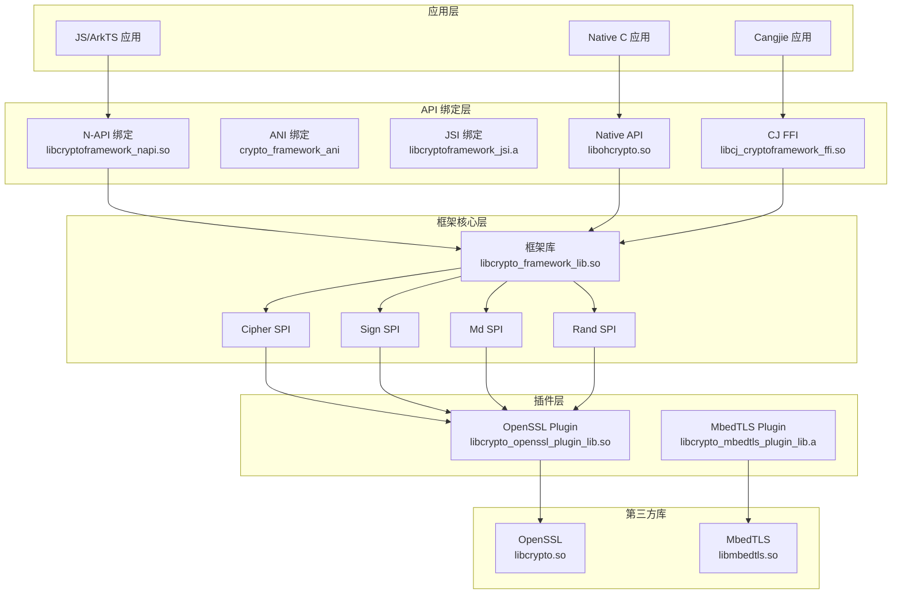
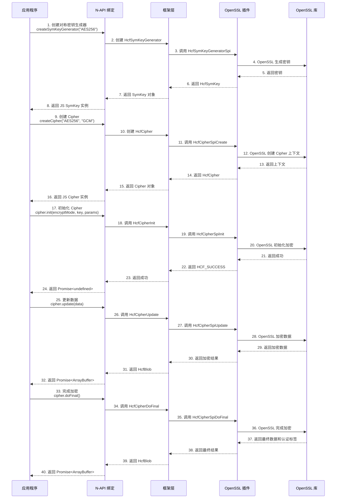
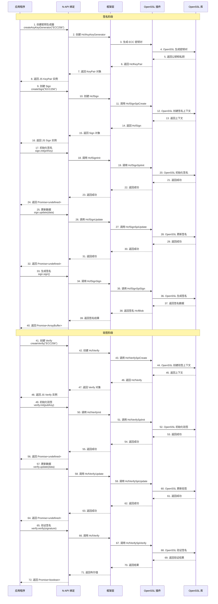
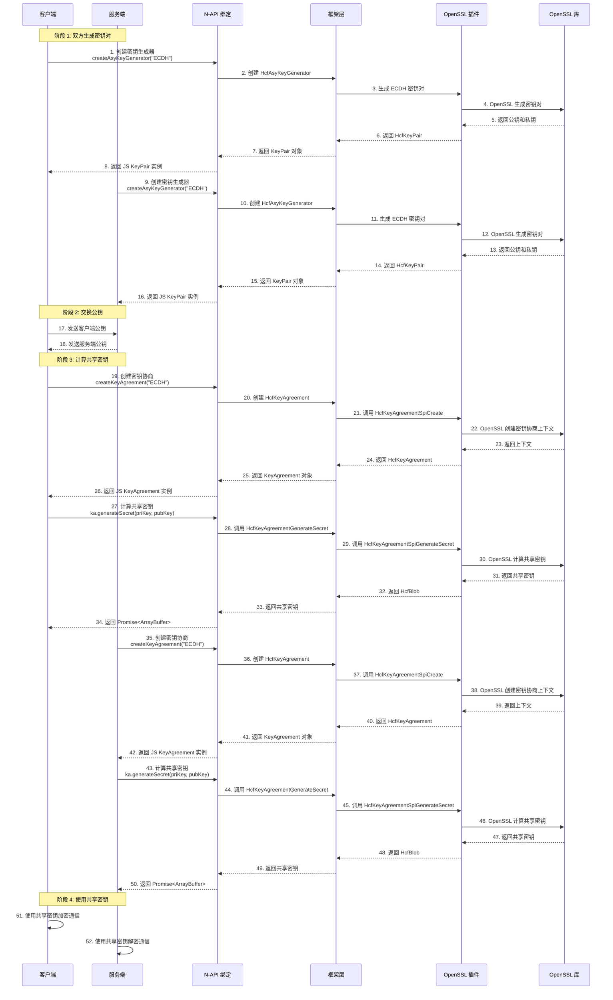
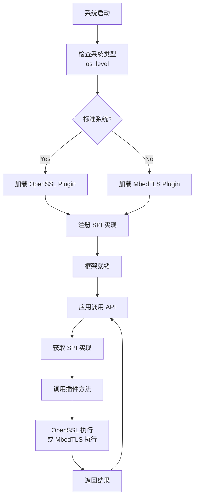
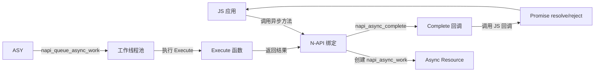
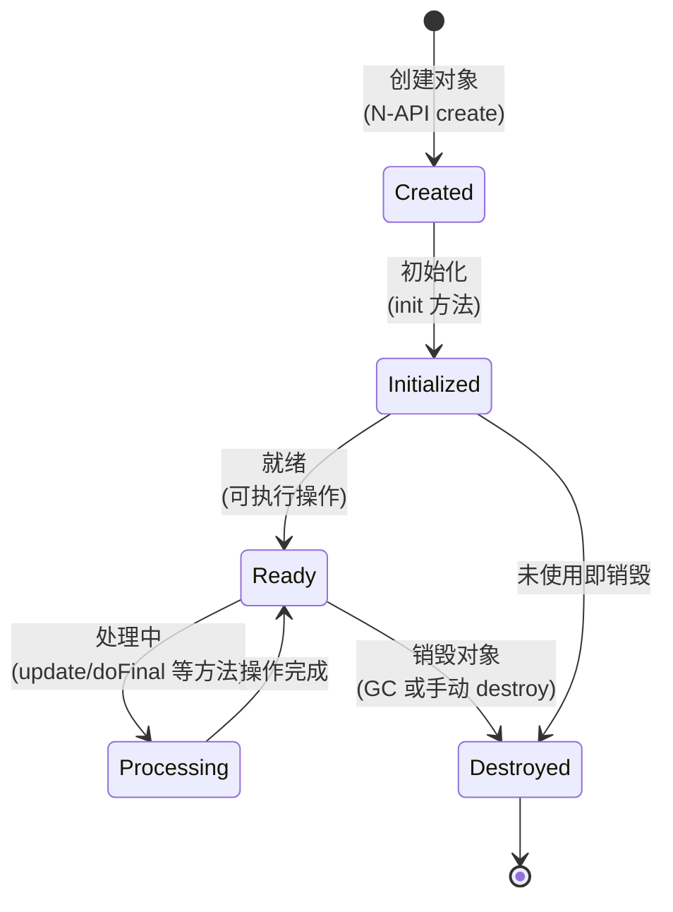
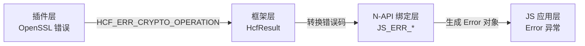

# 架构说明

## 目的

本文档详细说明 crypto_framework 的架构设计，包括分层架构、组件关系、数据流转、线程模型和关键时序。

## 适用范围

- **目标读者**: 架构师、高级开发者、安全审计人员
- **阅读时长**: 30 分钟

## 分层架构

crypto_framework 采用经典的分层架构设计，分为四层：

```
┌─────────────────────────────────────────────────────────────┐
│                    应用层 (Application Layer)               │
│  - JS/ArkTS 应用 (通过 N-API/ANI)                      │
│  - Native C 应用 (通过 OH_Crypto_* API)               │
│  - Cangjie 应用 (通过 CJ FFI)                          │
└──────────────────────┬──────────────────────────────────────┘
                       │
┌──────────────────────▼──────────────────────────────────────┐
│                   API 绑定层 (Binding Layer)             │
│  - N-API 绑定 (frameworks/js/napi/)                   │
│  - ANI 绑定 (frameworks/js/ani/)                     │
│  - JSI 绑定 (frameworks/js/jsi/)                      │
│  - CJ FFI 绑定 (frameworks/cj/)                      │
│  - Native API (frameworks/native/)                       │
└──────────────────────┬──────────────────────────────────────┘
                       │
┌──────────────────────▼──────────────────────────────────────┐
│                  框架核心层 (Framework Layer)             │
│  - 密码操作封装 (frameworks/crypto_operation/)            │
│  - 密钥材料管理 (frameworks/key/)                      │
│  - SPI 接口定义 (frameworks/spi/)                     │
│  - 算法参数 (frameworks/algorithm_parameter/)            │
└──────────────────────┬──────────────────────────────────────┘
                       │
┌──────────────────────▼──────────────────────────────────────┐
│                   插件层 (Plugin Layer)                  │
│  - OpenSSL Plugin (plugin/openssl_plugin/)                 │
│  - MbedTLS Plugin (plugin/mbedtls_plugin/)                │
└──────────────────────────────────────────────────────────────┘
```

### 各层职责

| 层次 | 职责 | 关键文件 |
|------|------|----------|
| **应用层** | 使用加密功能，处理业务逻辑 | 应用代码 |
| **API 绑定层** | 将框架接口封装为各语言可调用的接口 | `frameworks/js/`, `frameworks/native/`, `frameworks/cj/` |
| **框架核心层** | 实现密码操作的统一逻辑，管理密钥材料 | `frameworks/crypto_operation/`, `frameworks/key/` |
| **插件层** | 实现具体的密码算法，适配第三方库 | `plugin/openssl_plugin/`, `plugin/mbedtls_plugin/` |

## 组件图

### 核心组件关系



### 模块依赖关系

```
crypto_framework_component (group)
├── crypto_framework_lib (shared_library)
│   ├── crypto_plugin_common (static_library)
│   └── crypto_openssl_plugin_lib (shared_library)
│       └── crypto_plugin_common
├── ohcrypto (shared_library)
│   └── crypto_framework_lib
├── cryptoframework_napi (shared_library)
│   └── crypto_framework_lib
├── cj_cryptoframework_ffi (shared_library)
│   └── crypto_framework_lib
└── crypto_openssl_plugin_lib (shared_library)
    └── crypto_plugin_common
```

## 数据流

### 对称加密流程



### 签名验签流程



### 密钥协商流程



## SPI 机制

### SPI 架构

SPI (Service Provider Interface) 是 crypto_framework 的核心扩展机制，允许插入不同的密码算法库实现。

### SPI 接口层次

```
框架层定义 SPI 接口 (frameworks/spi/)
    ↑
插件层实现 SPI 接口 (plugin/)
    ↑
第三方库提供算法实现 (OpenSSL, MbedTLS)
```

### 关键 SPI 接口

| SPI 接口 | 方法 | 说明 | 插件实现位置 |
|----------|------|--------------|
| **HcfMdSpi** | Update, DoFinal, GetMdLength | `plugin/openssl_plugin/crypto_operation/md/` |
| **HcfSignSpi** | Init, Update, Sign | `plugin/openssl_plugin/crypto_operation/signature/` |
| **HcfMacSpi** | Init, Update, DoFinal | `plugin/openssl_plugin/crypto_operation/hmac/` |
| **HcfCipherSpi** | Init, Update, DoFinal | `plugin/openssl_plugin/crypto_operation/cipher/` |
| **HcfKeyAgreementSpi** | GenerateSecret | `plugin/openssl_plugin/crypto_operation/key_agreement/` |
| **HcfKdfSpi** | GenerateSecret | `plugin/openssl_plugin/crypto_operation/kdf/` |
| **HcfRandSpi** | GenerateRandom | `plugin/openssl_plugin/crypto_operation/rand/` |
| **HcfAsyKeyGeneratorSpi** | GenerateKeyPair, ConvertKey | `plugin/openssl_plugin/key/asy_key_generator/` |
| **HcfSymKeyFactorySpi** | GenerateSymKey | `plugin/openssl_plugin/key/sym_key_generator/` |

**证据位置**: `frameworks/spi/` 目录

### 插件加载流程



## 插件系统

### OpenSSL Plugin 结构

```
openssl_plugin/
├── common/                 # 通用工具和适配器
│   ├── inc/
│   │   ├── openssl_adapter.h      # OpenSSL 适配器
│   │   ├── ecc_openssl_common.h   # ECC 通用处理
│   │   └── ...
│   └── src/
├── crypto_operation/        # 密码操作实现
│   ├── cipher/            # 加密/解密
│   │   ├── inc/
│   │   │   ├── cipher_aes_openssl.h
│   │   │   └── cipher_sm4_openssl.h
│   │   └── src/
│   │       ├── cipher_aes_openssl.c
│   │       └── cipher_sm4_openssl.c
│   ├── hmac/              # HMAC/CMAC
│   ├── md/                # 摘要
│   ├── kdf/               # 密钥派生
│   ├── key_agreement/     # 密钥协商
│   ├── signature/          # 签名验签
│   └── rand/              # 随机数
└── key/                  # 密钥生成
    ├── asy_key_generator/ # 非对称密钥
    └── sym_key_generator/ # 对称密钥
```

### OpenSSL Adapter 模式

crypto_framework 通过 OpenSSL Adapter 层屏蔽底层 API 差异：

```c
// 伪代码示例
struct OpensslAdapter {
    // 将框架参数转换为 OpenSSL 参数
    HcfResult (*ConvertParams)(HcfAsyKeyParamsSpec*, EVP_PKEY_CTX*);
    
    // 调用 OpenSSL API
    HcfResult (*PerformOperation)(EVP_PKEY_CTX*, HcfBlob*, HcfBlob*);
    
    // 转换结果为框架格式
    HcfResult (*ConvertResult)(HcfBlob*, HcfResult*);
};
```

**证据位置**: `plugin/openssl_plugin/common/inc/openssl_adapter.h`

## 线程模型

### 同步操作

- **特点**: 阻塞当前线程，直接返回结果
- **适用**: 简单操作、小数据量
- **方法名**: `methodNameSync` (如 `digestSync`, `signSync`)

### 异步操作

- **特点**: 不阻塞当前线程，通过 Promise 或 Callback 返回结果
- **适用**: 耗时操作、大数据量
- **方法名**: `methodName` (如 `digest`, `sign`)

### N-API 异步模式

crypto_framework 使用 N-API 的异步工作队列实现异步操作：



**关键函数**:
- `napi_create_async_work`: 创建异步工作
- `napi_queue_async_work`: 加入工作队列
- `Execute`: 执行函数（在工作线程）
- `Complete`: 完成回调（在主线程）

**证据位置**:
- 各 napi 源文件中的 `New*AsyncWork` 函数
- `frameworks/js/napi/crypto/src/napi_utils.cpp` (工具函数)

## 资源生命周期

### 对象生命周期



### 内存管理

**框架层内存管理**:
- 对象分配：使用 `HcfMalloc` 包装
- 对象释放：通过 `HcfDestroy` 接口
- 敏感数据清除：`clearMem` 方法

**N-API 内存管理**:
- ArrayBuffer：由 V8 引擎管理
- 外部内存：使用 `napi_create_external_arraybuffer`

**证据位置**:
- `interfaces/inner_api/common/object_base.h` (HcfObjectBase)
- `common/inc/memory.h` (HcfMalloc/HcfFree)

## 错误传播机制

### 错误码传播



### 错误码映射

| 插件错误 | 框架错误 | N-API 错误 | JS 错误 |
|----------|----------|-------------|----------|
| OpenSSL `ERR_*` | `HCF_ERR_CRYPTO_OPERATION` | `JS_ERR_CRYPTO_OPERATION` | `Error(17630001)` |
| 参数无效 | `HCF_INVALID_PARAMS` | `JS_ERR_INVALID_PARAMS` | `Error(401)` |
| 内存不足 | `HCF_ERR_MALLOC` | `JS_ERR_OUT_OF_MEMORY` | `Error(17620001)` |

**证据位置**:
- `interfaces/inner_api/common/result.h` (HcfResult)
- `frameworks/js/napi/crypto/inc/napi_utils.h` (JS_ERR_*)

## 相关跳转

- **目录结构**: [02_Directory_Structure.md](02_Directory_Structure.md)
- **对外 API**: [04_External_API.md](04_External_API.md)
- **内部 API**: [05_Internal_API.md](05_Internal_API.md)

## 更新记录

- **2026-02-06**: 创建文档，基于架构分析生成

## TODO

- [ ] 补充异步操作的详细流程图
- [ ] 添加插件动态加载机制的说明
- [ ] 补充对象引用计数机制
