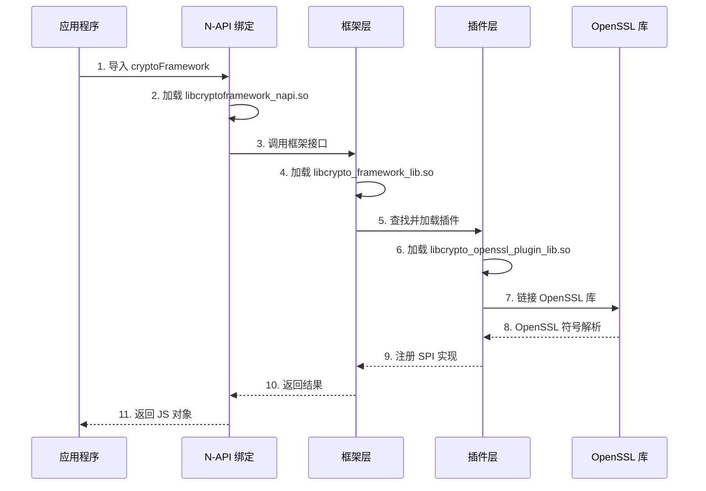

# GN Targets 与编译产物

## 目的

本文档详细说明 crypto_framework 的 GN 构建系统，包括 targets 列表、依赖关系、编译产物和安装路径。

## 适用范围

- **目标读者**: 构建工程师、系统集成人员
- **阅读时长**: 20 分钟

## 根 BUILD.gn

**文件位置**: `BUILD.gn`

### 主要 Targets

#### crypto_framework_component (group)

**说明**: 主组件入口，根据系统类型选择不同的依赖

**Standard 系统** (`os_level == "standard"`):
```gn
deps = [
  "frameworks:crypto_framework_lib",
  "frameworks/cj:cj_cryptoframework_ffi",
  "frameworks/js/ani:cryptoframework_ani",
  "frameworks/js/napi/crypto:cryptoframework_napi",
  "frameworks/native:ohcrypto",
  "plugin:crypto_openssl_plugin_lib",
]
```

**Mini 系统** (`os_level == "mini"`):
```gn
deps = [
  "frameworks:crypto_framework_lib",
  "frameworks/js/jsi:cryptoframework_jsi",
  "plugin:crypto_mbedtls_plugin_lib",
]
```

**位置**: `BUILD.gn:18-34`

#### crypto_framework_test (group)

**说明**: 单元测试入口

```gn
deps = [ "test/unittest:crypto_framework_test" ]
```

**位置**: `BUILD.gn:37-42`

#### crypto_framework_fuzztest (group)

**说明**: Fuzz 测试入口，包含 14 个 fuzzer

**位置**: `BUILD.gn:44-64`

## 主要 Targets 清单

### 框架核心层 Targets

#### crypto_framework_lib (shared_library/static_library)

**位置**: `frameworks/BUILD.gn`

**类型**:
- Standard: `ohos_shared_library`
- Mini: `ohos_static_library`

**输出名**: `libcrypto_framework_lib.so` / `libcrypto_framework_lib.a`

**依赖**:
- `common:crypto_plugin_common`
- `plugin:crypto_openssl_plugin_lib` / `plugin:crypto_mbedtls_plugin_lib`

**外部依赖**:
- `c_utils:utils`
- `hilog:libhilog` / `hilog_lite:hilog_lite`

**包含路径**:
- `interfaces/inner_api/`
- `frameworks/spi/`
- `common/inc/`

### API 绑定层 Targets

#### ohcrypto (ohos_shared_library)

**位置**: `frameworks/native/BUILD.gn`

**输出名**: `libohcrypto.so`

**依赖**:
- `frameworks:crypto_framework_lib`

**外部依赖**:
- `bounds_checking_function:libsec_shared`
- `hilog:libhilog`

**包含路径**:
- `interfaces/kits/native/include/`
- `include/`
- `frameworks_inc_path`

**输出扩展名**: `.so`

**内部 API 标签**: `["ndk"]`

**位置**: `frameworks/native/BUILD.gn:18-66`

#### cryptoframework_napi (ohos_shared_library)

**位置**: `frameworks/js/napi/crypto/BUILD.gn`

**输出名**: `libcryptoframework_napi.so`

**依赖**:
- `frameworks:crypto_framework_lib`

**外部依赖**:
- `bounds_checking_function:libsec_shared`
- `hilog:libhilog`
- `napi:ace_napi`

**安装路径**: `module/security`

**包含路径**:
- `inc/`
- `frameworks_inc_path`

**编译标志**:
- `-DHILOG_ENABLE`
- `-fPIC`
- `-g3`

**安全特性** (Standard):
- CFI: enabled
- CFI cross DSO: enabled
- Branch protector: PAC_RET

**位置**: `frameworks/js/napi/crypto/BUILD.gn:18-72`

#### cj_cryptoframework_ffi (ohos_shared_library)

**位置**: `frameworks/cj/BUILD.gn`

**输出名**: `libcj_cryptoframework_ffi.so`

**依赖**:
- `frameworks:crypto_framework_lib`

**外部依赖**:
- `bounds_checking_function:libsec_shared`
- `hilog:libhilog`
- `napi:ace_napi`
- `napi:cj_bind_ffi`
- `napi:cj_bind_native`

**平台条件**:
- 如果 `product_name == "qemu-arm-linux-min"` 或 `rk3568_mini_system`，使用 mock 实现
- 否则使用完整实现

**内部 API 标签**: `["platformsdk"]`

**位置**: `frameworks/cj/BUILD.gn:18-92`

### 插件层 Targets

#### crypto_openssl_plugin_lib (ohos_shared_library)

**位置**: `plugin/BUILD.gn`

**输出名**: `libcrypto_openssl_plugin_lib.so`

**依赖**:
- `common:crypto_plugin_common`

**外部依赖**:
- `openssl:libcrypto_shared`

**包含路径**:
- `plugin/openssl_plugin/common/inc/`

**实现内容**:
- 对称加密: AES, SM4
- 非对称加密: RSA, SM2
- 摘要: SHA 系列, SM3, MD5
- 签名: RSA, ECDSA, SM2, Ed25519
- MAC: HMAC, CMAC
- KDF: PBKDF2, HKDF, Scrypt
- 密钥协商: ECDH, DH, X25519
- 密钥生成: RSA, ECC, DSA, AES, SM4

#### crypto_mbedtls_plugin_lib (ohos_static_library)

**位置**: `plugin/BUILD.gn`

**输出名**: `libcrypto_mbedtls_plugin_lib.a`

**依赖**:
- `common:crypto_common_lite`

**外部依赖**:
- `mbedtls`

**包含路径**:
- `plugin/mbedtls_plugin/common/inc/`

**实现内容**:
- 基础摘要算法
- 随机数生成

### 公共模块 Targets

#### crypto_plugin_common (ohos_static_library)

**位置**: `common/BUILD.gn`

**输出名**: `libcrypto_plugin_common.a`

**源文件**:
- `blob.c`
- `hcf_parcel.c`
- `hcf_string.c`
- `memory.c`
- `object_base.c`
- `params_parser.c`
- `utils.c`

**头文件**:
- `config.h`
- `hcf_parcel.h`
- `hcf_string.h`
- `log.h`
- `memory.h`
- `params_parser.h`
- `utils.h`

#### crypto_common_lite (ohos_static_library)

**位置**: `common/BUILD.gn`

**输出名**: `libcrypto_common_lite.a`

**用途**: 轻量系统的公共模块（Mini 系统）

## Target 依赖关系图

```
crypto_framework_component (group)
├── frameworks:crypto_framework_lib (shared_library)
│   ├── common:crypto_plugin_common (static_library)
│   └── plugin:crypto_openssl_plugin_lib (shared_library)
│       └── common:crypto_plugin_common
│
├── frameworks/native:ohcrypto (shared_library)
│   └── frameworks:crypto_framework_lib
│
├── frameworks/js/napi:cryptoframework_napi (shared_library)
│   └── frameworks:crypto_framework_lib
│
├── frameworks/cj:cj_cryptoframework_ffi (shared_library)
│   └── frameworks:crypto_framework_lib
│
└── plugin:crypto_openssl_plugin_lib (shared_library)
    └── common:crypto_plugin_common
```

## 配置文件

### .gni 文件清单

| 文件 | 职责 | 定义内容 |
|------|------|----------|
| `build/config.gni` | 全局构建配置 | (当前为空) |
| `common/common.gni` | 公共模块源文件和头文件路径 | `common_inc_path`, `common_src_path` |
| `frameworks/frameworks.gni` | 框架层源文件和头文件路径 | `frameworks_inc_path`, `frameworks_src_path` |
| `plugin/plugin.gni` | 插件层源文件和头文件路径 | `openssl_plugin_inc_path`, `openssl_plugin_src_path` |

### 条件编译

#### os_level

```gn
if (os_level == "standard") {
    deps = [
        "frameworks:crypto_framework_lib",
        "frameworks/native:ohcrypto",
        "frameworks/js/napi/crypto:cryptoframework_napi",
        "plugin:crypto_openssl_plugin_lib",
    ]
} else if (os_level == "mini") {
    deps = [
        "frameworks:crypto_framework_lib",
        "frameworks/js/jsi:cryptoframework_jsi",
        "plugin:crypto_mbedtls_plugin_lib",
    ]
}
```

**位置**: `BUILD.gn:19-34`

#### product_name 条件

```gn
if (!ohos_indep_compiler_enable && !build_ohos_sdk &&
    product_name != "qemu-arm-linux-min" &&
    product_name != "rk3568_mini_system") {
    deps = [ "${framework_path}:crypto_framework_lib" ]
    sources = [
        # 完整实现源文件
    ]
} else {
    defines += [ "PREVIEWER" ]
    sources = [ "src/crypto_mock.cpp" ]
}
```

**位置**: `frameworks/cj/BUILD.gn:41-78`

## 编译产物

### 主要编译产物

| Target | 产物类型 | 产物名称 | 安装路径 | 适用系统 |
|--------|----------|----------|----------|----------|
| **crypto_framework_lib** | shared/static lib | `libcrypto_framework_lib.so`<br/>`libcrypto_framework_lib.a` | (共享库) | Standard/Mini |
| **ohcrypto** | shared lib | `libohcrypto.so` | `/usr/lib/` 或 `/system/lib/` | Standard |
| **cryptoframework_napi** | shared lib | `libcryptoframework_napi.so` | `module/security/` | Standard |
| **cj_cryptoframework_ffi** | shared lib | `libcj_cryptoframework_ffi.so` | `/usr/lib/` 或 `/system/lib/` | Standard |
| **crypto_openssl_plugin_lib** | shared lib | `libcrypto_openssl_plugin_lib.so` | `/usr/lib/` 或 `/system/lib/` | Standard |
| **crypto_mbedtls_plugin_lib** | static lib | `libcrypto_mbedtls_plugin_lib.a` | (链接到应用) | Mini |

### 安装路径

#### Standard 系统

```
/system/lib/
├── libcrypto_framework_lib.so
├── libohcrypto.so
├── libcryptoframework_napi.so
├── libcj_cryptoframework_ffi.so
├── libcrypto_openssl_plugin_lib.so
└── libcrypto.so (来自 OpenSSL 组件)

/module/security/
└── libcryptoframework_napi.so
```

#### Mini 系统

```
/lib/
├── libcrypto_framework_lib.a
├── libcryptoframework_jsi.a
└── libcrypto_mbedtls_plugin_lib.a
```

## 运行时加载关系

### 加载顺序



### 依赖关系

```
应用程序
    ↓ 依赖
libcryptoframework_napi.so (N-API 绑定)
    ↓ 依赖
libcrypto_framework_lib.so (框架核心)
    ↓ 依赖
libcrypto_openssl_plugin_lib.so (OpenSSL 插件)
    ↓ 依赖
libcrypto.so (OpenSSL 库)
```

## 构建配置特性

### 安全特性 (Standard 系统)

| 特性 | 说明 | 配置位置 |
|------|------|----------|
| **CFI (Control Flow Integrity)** | 控制流完整性保护 | `frameworks/js/napi/crypto/BUILD.gn:28` |
| **CFI cross DSO** | 跨 DSO 的 CFI 保护 | `frameworks/js/napi/crypto/BUILD.gn:29` |
| **PAC_RET** | 返回地址指针认证 | `frameworks/js/napi/crypto/BUILD.gn:19` |
| **SecureC** | 安全 C 库 | 通过 `bounds_checking_function` 依赖 |

### 编译标志

#### 通用标志

```gn
cflags = [
    "-DHILOG_ENABLE",
    "-fPIC",
    "-g3",
]
```

**位置**: `frameworks/js/napi/crypto/BUILD.gn:34-38`

#### 条件定义

```gn
defines = []

if (is_ohos) {
    defines += [ "OHOS_PLATFORM" ]
}

if (is_mingw) {
    defines += [ "WINDOWS_PLATFORM" ]
}
```

**位置**: `frameworks/cj/BUILD.gn:80-86`

## 构建命令示例

### 构建 crypto_framework_component

```bash
# 生成构建文件
gn gen out --args='os_level="standard"'

# 编译所有 targets
ninja -C out crypto_framework_component

# 只编译 framework
ninja -C out frameworks:crypto_framework_lib

# 清理
ninja -C out -t clean
```

### 查看 target 依赖

```bash
# 查看依赖关系
gn analyze out/ out/dep.json "//base/security/crypto_framework:crypto_framework_component"

# 查看依赖图
gn analyze --out=out/ dep-graph.json "//base/security/crypto_framework:crypto_framework_component"
dot -Tpng dep-graph.json > dep-graph.png
```

## 相关跳转

- **目录结构**: [02_Directory_Structure.md](02_Directory_Structure.md)
- **编译产物**: [07_Build_Artifacts.md](07_Build_Artifacts.md)
- **架构设计**: [03_Architecture.md](03_Architecture.md)

## 更新记录

- **2026-02-06**: 创建文档，基于 BUILD.gn 分析生成

## TODO

- [ ] 补充完整 target 列表（包含所有测试 target）
- [ ] 补充构建时序图
- [ ] 添加构建优化建议
