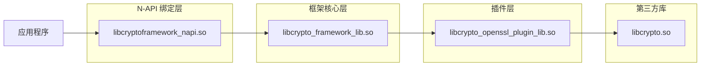

# 编译产物 (Build Artifacts)

## 目的

本文档说明 crypto_framework 的编译产物清单、预计输出路径和运行时加载关系。

## 适用范围

- **目标读者**: 构建工程师、系统集成人员、发布工程师
- **阅读时长**: 15 分钟

## 主要编译产物

### Standard 系统

| 产物名称 | 产物类型 | 文件名 | 大小估算 | 位置 |
|----------|----------|----------|----------|--------|
| **框架库** | 动态库 | `libcrypto_framework_lib.so` | ~500KB | `/system/lib/` 或 `/usr/lib/` |
| **NDK 接口库** | 动态库 | `libohcrypto.so` | ~100KB | `/system/lib/` 或 `/usr/lib/` |
| **N-API 绑定库** | 动态库 | `libcryptoframework_napi.so` | ~300KB | `/system/lib/` 或 `/usr/lib/` 和 `/module/security/` |
| **CJ FFI 库** | 动态库 | `libcj_cryptoframework_ffi.so` | ~200KB | `/system/lib/` 或 `/usr/lib/` |
| **OpenSSL 插件库** | 动态库 | `libcrypto_openssl_plugin_lib.so` | ~400KB | `/system/lib/` 或 `/usr/lib/` |

### Mini 系统

| 产物名称 | 产物类型 | 文件名 | 大小估算 | 位置 |
|----------|----------|----------|----------|--------|
| **框架库** | 静态库 | `libcrypto_framework_lib.a` | ~300KB | 链接到应用 |
| **JSI 绑定库** | 静态库 | `libcryptoframework_jsi.a` | ~150KB | 链接到应用 |
| **MbedTLS 插件库** | 静态库 | `libcrypto_mbedtls_plugin_lib.a` | ~100KB | 链接到应用 |

## 安装路径

### Standard 系统目录布局

```
/system/
├── lib/
│   ├── libcrypto_framework_lib.so          # 框架核心库
│   ├── libohcrypto.so                   # NDK 接口库
│   ├── libcryptoframework_napi.so       # N-API 绑定
│   ├── libcj_cryptoframework_ffi.so     # CJ FFI 绑定
│   ├── libcrypto_openssl_plugin_lib.so   # OpenSSL 插件
│   └── libcrypto.so                   # OpenSSL 库（来自 OpenSSL 组件）
│
└── module/
    └── security/
        └── libcryptoframework_napi.so   # N-API 模块（符号链接）
```

**位置**: `frameworks/js/napi/crypto/BUILD.gn:22`
```gn
relative_install_dir = "module/security"
```

### Mini 系统目录布局

```
/lib/
├── libcrypto_framework_lib.a            # 框架核心库（静态）
├── libcryptoframework_jsi.a           # JSI 绑定（静态）
├── libcrypto_mbedtls_plugin_lib.a       # MbedTLS 插件（静态）
└── libmbedtls.so                      # MbedTLS 库（来自 MbedTLS 组件）
```

## 运行时加载关系

### 库依赖链



### 动态链接依赖

使用 `ldd` 或 `readelf -d` 查看：

```bash
$ readelf -d libcryptoframework_napi.so

Dynamic section at offset 0x... contains 21 entries:
  Tag        Type                         Name/Value
  0x0000000000000000001 NEEDED      libcrypto_framework_lib.so
  0x0000000000000000001 NEEDED      libace_napi.z.so
  0x0000000000000000001 NEEDED      libhilog_ndk.z.so
  0x0000000000000000001 NEEDED      libsec_shared.z.so
```

### 符号导出

使用 `readelf -s` 或 `nm -D` 查看：

```bash
$ nm -D libcrypto_framework_lib.so | grep "Hcf"

00012345 T HcfCipherInit
00012346 T HcfCipherUpdate
00012347 T HcfMdDoFinal
00012348 T HcfSignSign
...
```

## 特殊产物

### Mock 实现

**文件**: `frameworks/cj/src/crypto_mock.cpp`

**条件**: `product_name == "qemu-arm-linux-min"` 或 `rk3568_mini_system"`

**用途**: 预览环境或不支持的设备使用，所有操作返回 `HCF_NOT_SUPPORT`

**位置**: `frameworks/cj/BUILD.gn:76`

### Prebuilt 文件

**文件**: `frameworks/js/ani/` 目录下的 prebuilt 文件

**用途**: ANI 绑定需要的一些预编译资源

## 构建输出验证

### 检查产物是否存在

```bash
# Standard 系统
ls -l out/system/lib/libcrypto_framework_lib.so
ls -l out/system/lib/libohcrypto.so
ls -l out/system/lib/libcryptoframework_napi.so
ls -l out/module/security/libcryptoframework_napi.so

# Mini 系统
ls -l out/lib/libcrypto_framework_lib.a
ls -l out/lib/libcryptoframework_jsi.a
```

### 检查符号导出

```bash
# 检查框架库符号
nm -D out/system/lib/libcrypto_framework_lib.so | grep "^Hcf"

# 检查 N-API 符号
nm -D out/system/lib/libcryptoframework_napi.so | grep "RegisterModule"
```

### 检查依赖关系

```bash
# 检查 N-API 库依赖
readelf -d out/system/lib/libcryptoframework_napi.so

# 检查框架库依赖
readelf -d out/system/lib/libcrypto_framework_lib.so
```

## 打包产物

### HAP 包

如果作为 HAP (Harmony Ability Package) 的一部分，产物会打包到 HAP 中：

```
MyApp.hap
├── libs/
│   ├── arm64-v8a/
│   │   └── libcryptoframework_napi.so
│   └── armeabi-v7a/
│       └── libcryptoframework_napi.so
└── module.json
```

### 系统镜像

在系统镜像构建中，产物会包含在 `system.img` 或 `vendor.img` 中：

```
system.img
├── system/
│   ├── lib/
│   │   ├── libcrypto_framework_lib.so
│   │   ├── libohcrypto.so
│   │   └── ...
│   └── module/
│       └── security/
│           └── libcryptoframework_napi.so
└── ...
```

## ROM 占用

根据 `bundle.json` 配置：

```json
"rom": "2048KB"
```

**说明**: 这是 crypto_framework 组件占用 ROM 的估算值，包括：
- 框架库: ~500KB
- N-API 绑定: ~300KB
- Native API: ~100KB
- OpenSSL 插件: ~400KB
- 其他: ~748KB（包含头文件、配置等）

## 运行时内存

### 静态内存占用

| 模块 | 估算 |
|------|------|
| **框架库代码段** | ~200KB |
| **框架库数据段** | ~50KB |
| **OpenSSL 插件代码段** | ~150KB |
| **OpenSSL 插件数据段** | ~30KB |

### 动态内存占用

典型使用场景下的内存分配：

```c
// 示例：AES-GCM 加密
HcfSymKey *key = ...;           // ~1KB
HcfCipher *cipher = ...;          // ~2KB
HcfBlob *plaintext = ...;         // 用户数据
HcfBlob *ciphertext = ...;        // ~plaintext + 16 bytes (GCM tag)
```

## 产物版本控制

### 版本信息

版本信息通过 `bundle.json` 定义：

```json
{
    "name": "@ohos/crypto_framework",
    "version": "3.2",
    ...
}
```

### ABI 兼容性

不同系统类型使用不同的产物：

| 系统类型 | ABI | 产物类型 | 兼容性 |
|----------|-----|----------|----------|
| **standard** | ARM64, ARM32 | 动态库 (.so) | 向后兼容 |
| **mini** | ARM32 | 静态库 (.a) | 可能不兼容 |

## 相关跳转

- **GN Targets**: [06_GN_Targets.md](06_GN_Targets.md)
- **目录结构**: [02_Directory_Structure.md](02_Directory_Structure.md)
- **架构设计**: [03_Architecture.md](03_Architecture.md)

## 更新记录

- **2026-02-06**: 创建文档，基于构建产物分析生成

## TODO

- [ ] 补充精确的 ROM 占用数据
- [ ] 补充内存占用分析
- [ ] 添加产物签名验证说明
