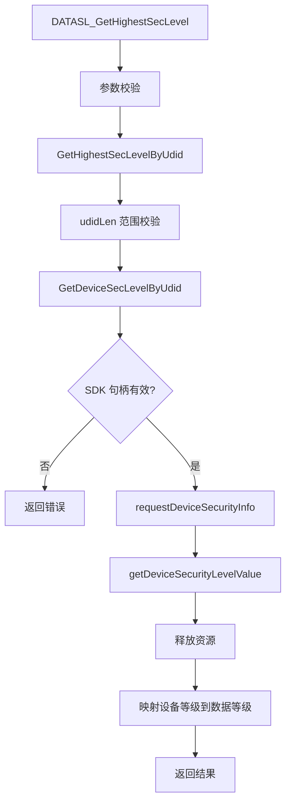
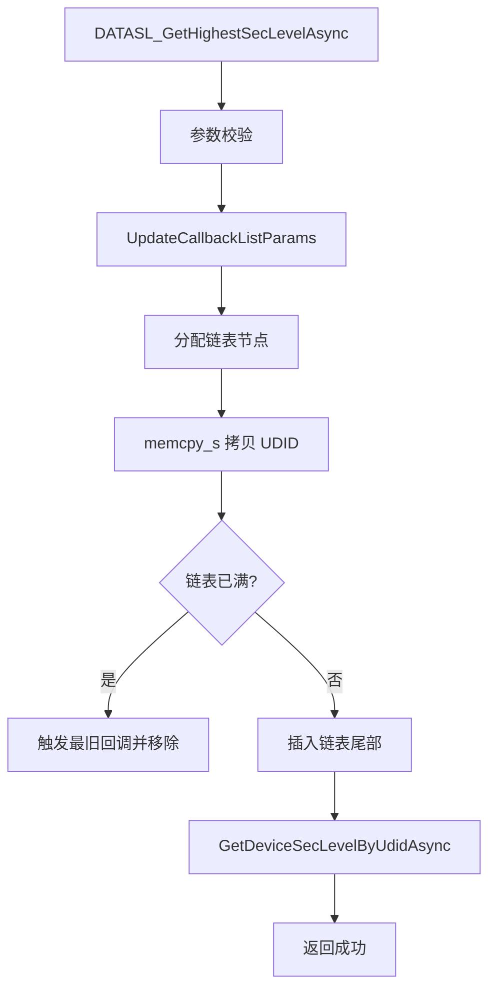
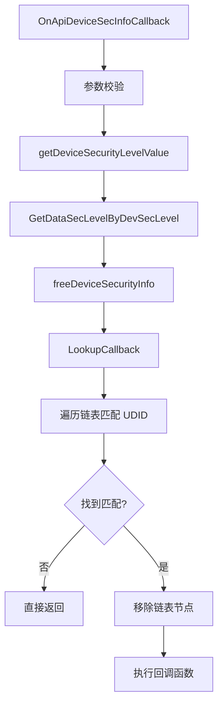
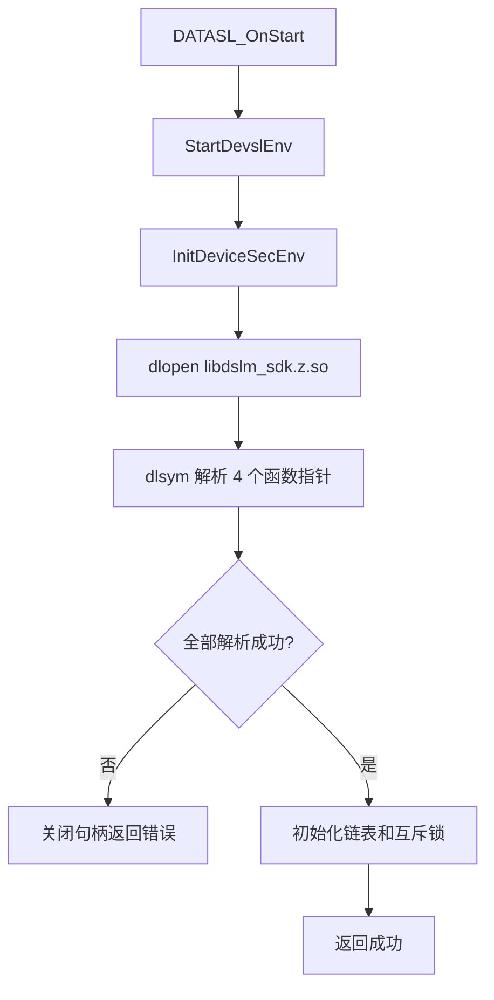
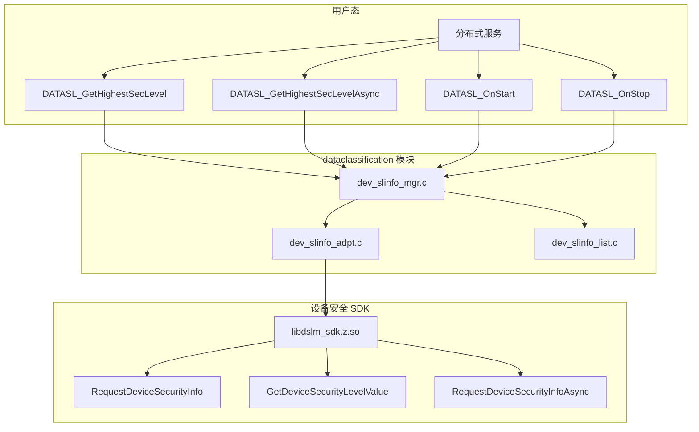

# 关键调用链

## 同步查询调用链

```
DATASL_GetHighestSecLevel()
    │
    ├── 验证参数 (queryParams, levelInfo 非 NULL)
    │   └── dev_slinfo_mgr.c:73-75
    │
    └── GetHighestSecLevelByUdid()
        │
        ├── 验证 udidLen 范围 (1-64)
        │   └── dev_slinfo_mgr.c:31
        │
        └── GetDeviceSecLevelByUdid()
            │
            ├── 验证 SDK 句柄有效性
            │   └── dev_slinfo_adpt.c:137-150
            │
            ├── 调用 requestDeviceSecurityInfo()
            │   └── dev_slinfo_adpt.c:165
            │
            ├── 调用 getDeviceSecurityLevelValue()
            │   └── dev_slinfo_adpt.c:172
            │
            └── 释放 DeviceSecurityInfo
                └── dev_slinfo_adpt.c:168-169, 175-176
```

**Mermaid 图示**：



> 证据来源：`dev_slinfo_mgr.c:69-81`、`dev_slinfo_adpt.c:134-182`

---

## 异步查询调用链

```
DATASL_GetHighestSecLevelAsync()
    │
    ├── 验证参数 (queryParams, callback 非 NULL, udidLen 范围)
    │   └── dev_slinfo_mgr.c:103
    │
    └── UpdateCallbackListParams()
        │
        ├── 分配链表节点
        │   └── dev_slinfo_adpt.c:314-318
        │
        ├── 拷贝 UDID 到链表节点
        │   └── dev_slinfo_adpt.c:320-326
        │
        ├── 检查链表长度 (MAX: 128)
        │   └── dev_slinfo_adpt.c:329-332
        │
        └── 插入链表节点
            └── dev_slinfo_adpt.c:335
```

**Mermaid 图示**：



> 证据来源：`dev_slinfo_mgr.c:98-116`、`dev_slinfo_adpt.c:307-337`

---

## SDK 异步回调调用链

```
OnApiDeviceSecInfoCallback()
    │
    ├── 验证参数 (identify, info 非 NULL)
    │   └── dev_slinfo_adpt.c:187-205
    │
    ├── 调用 getDeviceSecurityLevelValue()
    │   └── dev_slinfo_adpt.c:211
    │
    ├── 映射设备等级到数据等级
    │   └── dev_slinfo_adpt.c:215
    │
    ├── 释放 DeviceSecurityInfo
    │   └── dev_slinfo_adpt.c:217
    │
    ├── 查找匹配的回调
    │   └── LookupCallback()
    │       │
    │       ├── 按 UDID 遍历链表
    │       │   └── dev_slinfo_list.c:125-140
    │       │
    │       └── 找到后移除链表节点
    │           └── dev_slinfo_list.c:132-137
    │
    └── 执行原始回调函数
        └── dev_slinfo_list.c:144
```

**Mermaid 图示**：



> 证据来源：`dev_slinfo_adpt.c:184-233`

---

## 初始化调用链

```
DATASL_OnStart()
    │
    └── StartDevslEnv()
        │
        └── InitDeviceSecEnv()
            │
            ├── dlopen libdslm_sdk.z.so
            │   └── dev_slinfo_adpt.c:45
            │
            ├── dlsym RequestDeviceSecurityInfo
            │   └── dev_slinfo_adpt.c:64-65
            │
            ├── dlsym FreeDeviceSecurityInfo
            │   └── dev_slinfo_adpt.c:72-73
            │
            ├── dlsym GetDeviceSecurityLevelValue
            │   └── dev_slinfo_adpt.c:80-81
            │
            └── dlsym RequestDeviceSecurityInfoAsync
                └── dev_slinfo_adpt.c:88-89
```

**Mermaid 图示**：



> 证据来源：`dev_slinfo_mgr.c:46-59`、`dev_slinfo_adpt.c:43-102`

---

## 去初始化调用链

```
DATASL_OnStop()
    │
    └── FinishDevslEnv()
        │
        ├── DestroyDeviceSecEnv()
        │   │
        │   ├── memset_s 清零 g_deviceSecEnv
        │   │   └── dev_slinfo_adpt.c:96
        │   │
        │   └── dlclose SDK 句柄
        │       └── dev_slinfo_adpt.c:33-34
        │
        └── DestroyPthreadMutex()
            └── dev_slinfo_list.c:155-157
```

> 证据来源：`dev_slinfo_mgr.c:61-67`、`dev_slinfo_adpt.c:29-41`

---

## 调用关系图


