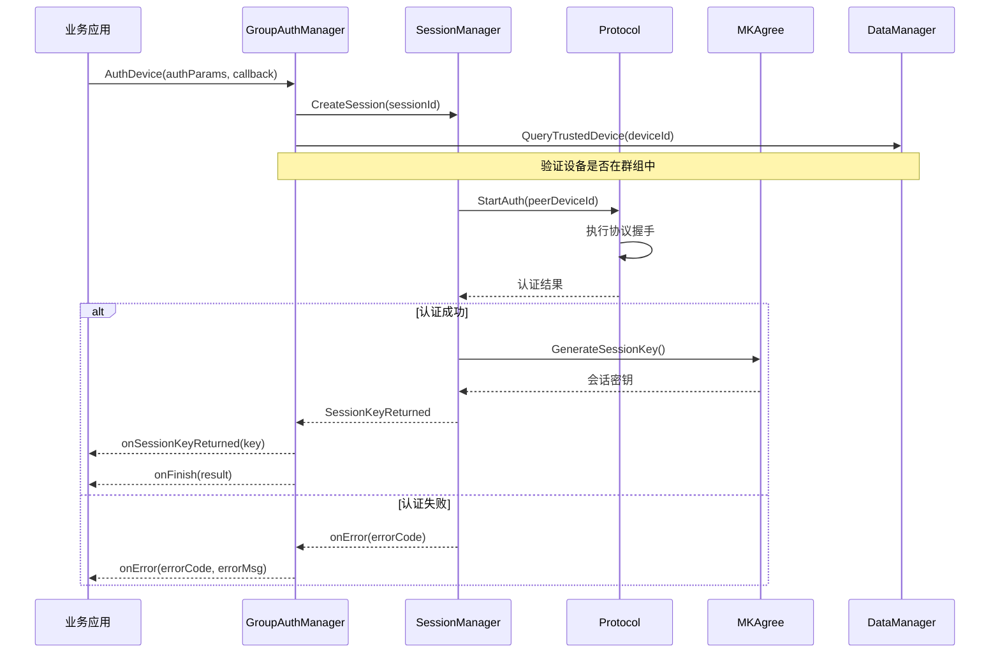
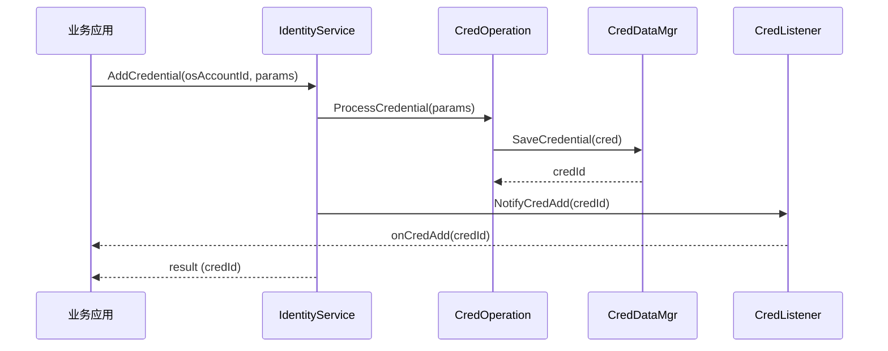

# 架构设计

> 目的：帮助开发者理解设备互信认证模块的内部架构设计，包括组件关系、数据流、线程模型和关键时序。
>
> 适用范围：需要深入理解本模块工作原理的开发者。

---

## 1. 整体架构

### 1.1 架构概览

```
┌─────────────────────────────────────────────────────────────────────────────┐
│                           应用层 (Application Layer)                         │
│                                                                             │
│   ┌─────────────────────────────────────────────────────────────────────┐ │
│   │                     上层业务 (Business Apps)                          │ │
│   └─────────────────────────────────────────────────────────────────────┘ │
│                                      │                                      │
│                           N-API 调用 (JS/TS)                               │
└──────────────────────────────────────┼──────────────────────────────────────┘
                                       │
┌──────────────────────────────────────┼──────────────────────────────────────┐
│                           接口层 (Interface Layer)                          │
│                                                                             │
│   ┌─────────────────────────────┐    ┌─────────────────────────────┐        │
│   │      N-API (JS 接口)        │    │    Inner API (C/C++ 接口)   │        │
│   │   security.deviceauth       │    │   GetGmInstance/GetGaInstance│       │
│   │   CredManager              │    │   GetCredMgrInstance        │        │
│   └─────────────┬───────────────┘    └──────────────┬──────────────┘        │
│                 │                                   │                         │
└─────────────────┼───────────────────────────────────┼───────────────────────┘
                  │                                   │
┌─────────────────┼───────────────────────────────────┼───────────────────────┐
│                 │                            ┌──────┴──────┐                  │
│                 │                            │              │                  │
│   ┌─────────────┴─────────────┐    ┌────────┴────────┐   │                  │
│   │     IPC 客户端层          │    │  System Ability │   │                  │
│   │   (Proxy/Stub)           │    │     SA 4701     │   │                  │
│   │                          │    │  DeviceAuthAbility│   │                  │
│   └─────────────┬─────────────┘    └───────┬────────┘   │                  │
│                 │                          │              │                  │
└─────────────────┼──────────────────────────┼──────────────┼──────────────────┘
                  │                          │              │
┌─────────────────┼──────────────────────────┼──────────────┐
│                 │                          │              │
│   ┌─────────────┴─────────────┐    ┌──────┴────────┐   │
│   │      IPC 服务端层          │    │  服务框架层   │   │
│   │   (Stub/Proxy)           │    │  Framework    │   │
│   │                          │    │              │   │
│   └─────────────┬─────────────┘    └───────┬────────┘   │
│                 │                          │              │
└─────────────────┼──────────────────────────┼──────────────┘
                  │                          │
┌─────────────────┴──────────────────────────┴───────────────────────────────┐
│                           核心服务层 (Core Service Layer)                   │
│                                                                             │
│   ┌────────────────┐ ┌────────────────┐ ┌────────────────┐ ┌──────────────┐│
│   │   GroupManager │ │   GroupAuth    │ │ IdentityService│ │SessionManager ││
│   │   (群组管理)    │ │   (群组认证)    │ │  (凭证管理)    │ │  (会话管理)   ││
│   └───────┬────────┘ └───────┬────────┘ └───────┬────────┘ └──────┬───────┘│
│           │                   │                   │                  │        │
│           └───────────────────┴───────────────────┴──────────────────┘        │
│                                   │                                            │
│   ┌───────────────────────────────┼─────────────────────────────────────────┐ │
│   │                         数据管理层                                        │ │
│   │   ┌─────────────┐ ┌─────────────┐ ┌─────────────┐ ┌─────────────────┐ │ │
│   │   │GroupDataMgr │ │CredDataMgr │ │OpDataMgr    │ │PrivacyEnhancement│ │ │
│   │   │ (群组数据)   │ │ (凭证数据)   │ │ (操作数据)   │ │  (隐私增强)     │ │ │
│   │   └─────────────┘ └─────────────┘ └─────────────┘ └─────────────────┘ │ │
│   └───────────────────────────────────────────────────────────────────────┘ │
└─────────────────────────────────────────────────────────────────────────────┘
                                   │
┌───────────────────────────────────┴───────────────────────────────────────────┐
│                           协议与加密层                                        │
│                                                                             │
│   ┌────────────────┐ ┌────────────────┐ ┌────────────────┐ ┌──────────────┐│
│   │     Protocol   │ │    MK Agree    │ │  Key Mgmt      │ │Crypto Library││
│   │   (ISO/PAKE/   │ │   (主密钥协商)  │ │    Adapter     │ │mbedtls/openssl││
│   │    EC/DL-SPEKE)│ │                │ │   (HUKS)      │ │              ││
│   └────────────────┘ └────────────────┘ └────────────────┘ └──────────────┘│
└─────────────────────────────────────────────────────────────────────────────┘
                                   │
┌───────────────────────────────────┴───────────────────────────────────────────┐
│                           系统适配层                                          │
│                                                                             │
│   ┌────────────────┐ ┌────────────────┐ ┌────────────────┐ ┌──────────────┐│
│   │  OS Adapter    │ │  IPC Adapter   │ │ Account Adapter│ │HiView Adapter││
│   │  (Linux/LiteOS │ │ (Binder/SAMGR) │ │               │ │              ││
│   └────────────────┘ └────────────────┘ └────────────────┘ └──────────────┘│
└───────────────────────────────────────────────────────────────────────────┘
```

### 1.2 架构分层说明

| 层级 | 组件 | 说明 |
|------|------|------|
| **应用层** | 上层业务 | 调用 N-API 或 Inner API 使用设备认证能力 |
| **接口层** | N-API / Inner API | 对外暴露的编程接口 |
| **IPC 层** | Proxy / Stub / SA | 跨进程通信，支持本地/远程调用 |
| **服务框架层** | Framework | 任务调度、模块管理、适配器 |
| **核心服务层** | GM/GA/IS/SM | 群组管理、群组认证、凭证管理、会话管理 |
| **数据管理层** | Data Managers | 持久化存储（群组、凭证、操作数据） |
| **协议加密层** | Protocol / MK Agree | 加密协议实现、密钥协商 |
| **系统适配层** | Adapters | OS、IPC、账号、HiView 等系统适配 |

---

## 2. 组件详细说明

### 2.1 接口层组件

#### N-API 组件

| 组件 | 路径 | 说明 |
|------|------|------|
| `credmgr_napi.cpp` | `interfaces/kits/napi/src/` | N-API 主实现 |
| `credmgr_napi.h` | `interfaces/kits/napi/include/` | N-API 头文件 |

**功能**：
- 提供 JS/TS 接口访问设备认证能力
- 支持 Promise 和 Callback 两种异步模式
- 自动管理 native 对象生命周期

**证据**：`interfaces/kits/napi/src/credmgr_napi.cpp:1-419`

#### Inner API 组件

| 组件 | 路径 | 说明 |
|------|------|------|
| `device_auth.h` | `interfaces/inner_api/` | 主接口定义 |
| `device_auth_defines.h` | `interfaces/inner_api/` | 错误码与定义 |
| `device_auth_ext.h` | `interfaces/inner_api/` | 扩展接口 |

**功能**：
- 提供 C/C++ 接口供其他模块调用
- 定义错误码和回调结构体
- 支持同步和异步操作

**证据**：`interfaces/inner_api/device_auth.h`

### 2.2 IPC 层组件

#### System Ability

| 项目 | 值 |
|------|-----|
| **SA ID** | `4701` |
| **SA 类** | `DeviceAuthAbility` |
| **注册位置** | `frameworks/src/deviceauth_sa.cpp` |
| **运行模式** | 按需加载 (Load On Demand) |

**IPC 实现**：
| 系统类型 | 机制 | 关键类 |
|----------|------|--------|
| **standard** | C++ Binder | `ServiceDevAuth` / `ProxyDevAuth` |
| **small/lite** | C SAMGR | `DevAuthService` (lite) |

**证据**：`frameworks/inc/deviceauth_sa.h:7`

#### IPC 方法分类

| 类别 | 方法数 | 说明 |
|------|--------|------|
| GM (群组管理) | 22 | 创建/删除群组、成员管理 |
| GA (群组认证) | 5 | 设备认证、会话处理 |
| DA (直接认证) | 4 | 凭证认证、认证请求处理 |
| CM (凭证管理) | 11 | 凭证 CRUD、批量更新 |
| CA (凭证认证) | 2 | 凭证认证、数据处理 |
| AV (账户验证) | 2 | 共享密钥获取 |
| LA (轻量账户) | 2 | 轻量账户认证 |

**证据**：`frameworks/inc/ipc_sdk_defines.h`

### 2.3 核心服务层组件

#### Group Manager（群组管理服务）

**路径**：`services/legacy/group_manager/`

**职责**：
- 设备群组的创建、删除
- 群组成员的添加、删除
- 群组信息查询
- 数据变更监听

**关键类**：
| 类名 | 职责 |
|------|------|
| `GroupManager` | 主入口，管理群组生命周期 |
| `GroupOperation` | 群组操作实现 |
| `CallbackManager` | 回调处理 |
| `ChannelManager` | 通信通道管理 |

**证据**：`services/legacy/group_manager/inc/group_manager.h`

#### Group Auth（群组认证服务）

**路径**：`services/legacy/group_auth/`

**职责**：
- 群组内设备认证
- 会话密钥协商
- 认证回调处理

**关键类**：
| 类名 | 职责 |
|------|------|
| `GroupAuthManager` | 主入口，管理认证会话 |
| `BaseGroupAuth` | 认证基类 |
| `AccountRelatedGroupAuth` | 同账号认证 |
| `AccountUnrelatedGroupAuth` | 跨账号/P2P 认证 |

**证据**：`services/legacy/group_auth/inc/group_auth_manager.h`

#### Identity Service（身份认证服务）

**路径**：`services/identity_service/`

**职责**：
- 凭证管理（增删改查）
- 凭证协商
- 凭证变更通知

**关键类**：
| 类名 | 职责 |
|------|------|
| `IdentityService` | 主入口 |
| `CredManager` | 凭证管理实现 |
| `CredListener` | 凭证变更监听 |

**证据**：`services/identity_service/inc/identity_service.h`

#### Session Manager（会话管理服务）

**路径**：`services/session_manager/`

**职责**：
- 认证会话生命周期管理
- 支持 v1、v2、mini 三种会话版本

**会话版本**：
| 版本 | 说明 | 适用场景 |
|------|------|----------|
| **v1** | 兼容模式 | 旧设备兼容 |
| **v2** | 现代模式 | 标准/小型设备 |
| **mini** | 轻量模式 | 资源受限设备 |

**证据**：`services/session_manager/inc/dev_session_mgr.h`

### 2.4 协议层组件

#### Protocol Library（认证协议库）

**路径**：`services/protocol/`

**支持的协议**：
| 协议 | 实现文件 | 说明 |
|------|----------|------|
| **ISO** | `iso_protocol/` | ISO/IEC 11770-3 |
| **PAKE v1** | `pake_protocol/pake_v1_protocol/` | 密码认证密钥交换 v1 |
| **PAKE v2** | `pake_protocol/pake_v2_protocol/` | 密码认证密钥交换 v2 |
| **EC-SPEKE** | `pake_protocol/` | 椭圆曲线 SPEKE |
| **DL-SPEKE** | `pake_protocol/` | 离散对数 SPEKE |
| **STS** | `key_agreement/` | Station-to-Station |

**证据**：`services/protocol/inc/protocol_common.h`

#### MK Agree（主密钥协商）

**路径**：`services/mk_agree/`

**职责**：
- 设备级主密钥协商
- 生成会话密钥材料
- 密钥派生

**证据**：`services/mk_agree/inc/mk_agree_task.h`

---

## 3. 数据流

### 3.1 设备认证数据流

```
┌─────────┐     AuthDevice()     ┌─────────────┐
│  Client │ ────────────────────►│ GroupAuthMgr│
│   App   │                      │             │
└─────────┘                      └──────┬──────┘
                                          │
                         ┌────────────────┼────────────────┐
                         ▼                ▼                ▼
                 ┌─────────────┐  ┌─────────────┐  ┌─────────────┐
                 │SessionManager│  │Authenticator│  │   Protocol  │
                 │             │◄─│             │◄─│             │
                 └──────┬──────┘  └─────────────┘  └─────────────┘
                        │
                        ▼
                 ┌─────────────┐
                 │   MK Agree  │ ──► 生成会话密钥
                 │             │
                 └──────┬──────┘
                        │
                        ▼
                 ┌─────────────┐
                 │   Callback  │ ──► onFinish / onSessionKeyReturned
                 │   (App)     │     onError
                 └─────────────┘
```

### 3.2 凭证管理数据流

```
┌─────────┐   AddCredential()    ┌─────────────┐
│  Client │ ────────────────────►│IdentityService│
│   App   │                      │              │
└─────────┘                      └──────┬───────┘
                                         │
                         ┌───────────────┼───────────────┐
                         ▼               ▼               ▼
                 ┌─────────────┐ ┌─────────────┐ ┌─────────────┐
                 │CredOperation│ │CredSession  │ │CredDataMgr  │
                 │             │ │             │ │             │
                 └─────────────┘ └──────┬──────┘ └─────────────┘
                                         │
                                         ▼
                                  ┌─────────────┐
                                  │CredListener │ ──► onCredAdd / onCredDelete
                                  │             │     onCredUpdate
                                  └─────────────┘
```

---

## 4. 线程模型

### 4.1 线程策略

| 组件 | 线程模型 | 说明 |
|------|----------|------|
| **SA 主线程** | 单线程 | 处理 IPC 请求，`DEV_AUTH_MAX_THREAD_NUM = 1` |
| **异步工作** | 线程池 | N-API 异步操作使用 `napi_async_work` |
| **协议计算** | 工作线程 | 加密运算不阻塞主线程 |
| **IPC 通信** | 主线程 | Binder/SAMGR 通信在主线程处理 |

### 4.2 线程安全

| 资源 | 保护机制 |
|------|----------|
| 全局实例 | `std::mutex` (如 `g_instanceLock`) |
| 回调引用 | `napi_ref` 管理 |
| 异步上下文 | `BatchUpdateCredsCtx` 结构体 |

**证据**：`interfaces/kits/napi/src/credmgr_napi.cpp:30`

---

## 5. 关键时序

### 5.1 设备认证时序图



### 5.2 凭证管理时序图



---

## 6. 信任边界

### 6.1 边界定义

```
┌─────────────────────────────────────────────────────────────────────────┐
│                           信任边界 (Trust Boundary)                        │
│                                                                         │
│  ┌─────────────────────────────────────────────────────────────────────┐ │
│  │                      设备内部 (Trusted Domain)                       │ │
│  │                                                                      │ │
│  │   ┌─────────────────────────────────────────────────────────────┐    │ │
│  │   │                    进程内 (Same Process)                      │    │ │
│  │   │                                                              │    │ │
│  │   │   ┌─────────────┐ ┌─────────────┐ ┌─────────────────────┐   │    │ │
│  │   │   │  GroupManager│ │  GroupAuth  │ │  IdentityService   │   │    │ │
│  │   │   └─────────────┘ └─────────────┘ └─────────────────────┘   │    │ │
│  │   │                                                              │    │ │
│  │   │   ┌─────────────┐ ┌─────────────┐ ┌─────────────────────┐   │    │ │
│  │   │   │  DataManager │ │  Protocol   │ │  MK Agree          │   │    │ │
│  │   │   └─────────────┘ └─────────────┘ └─────────────────────┘   │    │ │
│  │   │                                                              │    │ │
│  │   └─────────────────────────────────────────────────────────────┘    │ │
│  │                                                                      │ │
│  └─────────────────────────────────────────────────────────────────────┘ │
│                                │                                           │
│  ┌────────────────────────────┼─────────────────────────────────────┐  │
│  │                            │                                     │  │
│  │  ┌─────────────────────────┴─────────────────────────┐           │  │
│  │  │              进程边界 (IPC Boundary)               │           │  │
│  │  │                                                  │           │  │
│  │  │   ┌───────────────────────────────────────────┐   │           │  │
│  │  │   │           System Ability 4701            │   │           │  │
│  │  │   │         (deviceauth_service)             │   │           │  │
│  │  │   └───────────────────────────────────────────┘   │           │  │
│  │  │                                                  │           │  │
│  │  └─────────────────────────┬─────────────────────────┘           │  │
│  │                            │                                         │  │
│  └────────────────────────────┼─────────────────────────────────────┘  │
│                               │                                           │
│  ┌────────────────────────────┼─────────────────────────────────────┐  │
│  │                            │                                     │  │
│  │  ┌─────────────────────────┴─────────────────────────┐           │  │
│  │  │             外部设备 (Untrusted Domain)            │           │  │
│  │  │                                                   │           │  │
│  │  │   ┌─────────┐     ┌─────────┐     ┌─────────┐    │           │  │
│  │  │   │设备 A   │◄───►│ SoftBus │◄───►│ 设备 B  │   │           │  │
│  │  │   └─────────┘     └─────────┘     └─────────┘    │           │  │
│  │  │                                                   │           │  │
│  │  └───────────────────────────────────────────────────┘           │  │
│  │                                                                   │  │
│  └───────────────────────────────────────────────────────────────────┘  │
│                                                                         │
└─────────────────────────────────────────────────────────────────────────┘
```

### 6.2 边界说明

| 区域 | 信任级别 | 说明 |
|------|----------|------|
| **进程内** | 高 | 同一进程内可直接调用，无需校验 |
| **SA 进程** | 中 | 通过 IPC 调用，需参数校验 |
| **外部设备** | 低 | 需认证协议验证身份 |

---

## 7. 相关跳转

| 内容 | 文档 |
|------|------|
| API 接口 | [03_API_Reference.md](./03_API_Reference.md) |
| 内部 API | [04_Inner_API.md](./04_Inner_API.md) |
| 构建配置 | [05_Build_Config.md](./05_Build_Config.md) |
| 安全评审 | [06_Security_Review.md](./06_Security_Review.md) |
| 调用链图 | [appendix/Callgraphs.md](./appendix/Callgraphs.md) |

---

*本文档最后更新：2026-02-06*
