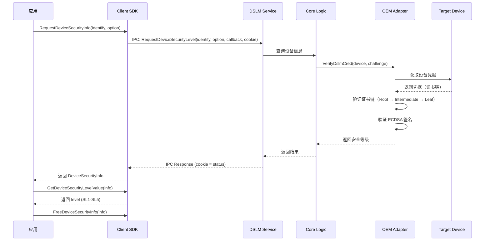
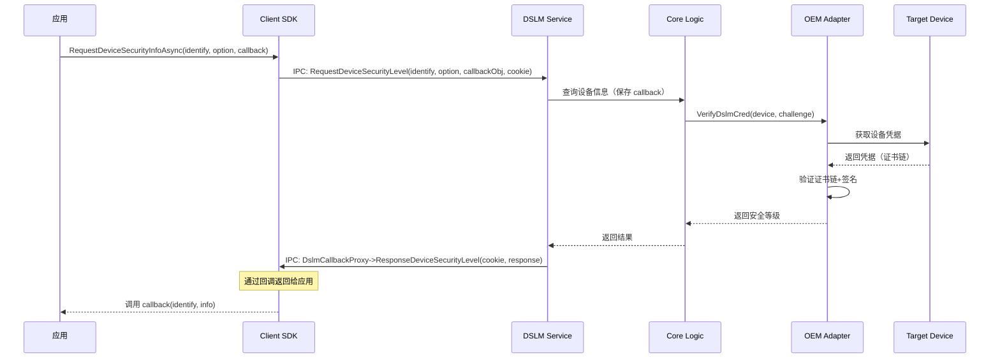
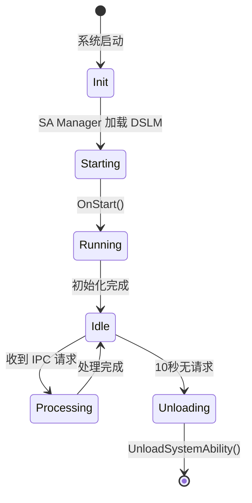
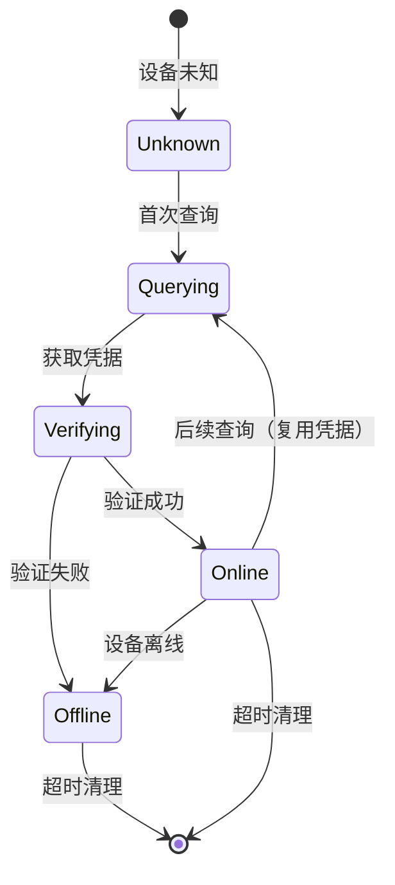

# 架构说明

## 目的

本文档详细说明 DSLM 模块的系统架构，包括组件图、数据流、线程模型和关键时序。

## 适用范围

- ✅ 整体架构图
- ✅ 数据流说明
- ✅ 线程模型
- ✅ 关键时序图

## 整体架构

### 层次架构

```
┌─────────────────────────────────────────────────────────────────────────┐
│                         应用层（Apps）                              │
│  ┌─────────────────────────────────────────────────────────────────┐   │
│  │  RequestDeviceSecurityInfoAsync() / RequestDeviceSecurityInfo()  │   │
│  └─────────────────────────────────────────────────────────────────┘   │
│                              │ C API Call                          │
└──────────────────────────────┬──────────────────────────────────────────┘
                               ▼
┌─────────────────────────────────────────────────────────────────────┐
│                   DSLM Client SDK（libdslm_sdk.z.so）              │
│  ┌─────────────────────────────────────────────────────────────────┐   │
│  │  DeviceSecurityLevelProxy (IRemoteProxy)                 │   │
│  │  - SendRequest(CMD_GET_DEVICE_SECURITY_LEVEL, ...)          │   │
│  │  - DeviceSecurityLevelCallbackStub (回调接收)            │   │
│  └─────────────────────────────────────────────────────────────────┘   │
└──────────────────────────────┬──────────────────────────────────────────┘
                               │ IPC (Binder)
                               ▼
┌─────────────────────────────────────────────────────────────────────┐
│              DSLM Service（SA 3511）                          │
│  ┌─────────────────────────────────────────────────────────────────┐   │
│  │  DslmService (SystemAbility + IRemoteStub)              │   │
│  │  - OnRemoteRequest() 处理 IPC 请求                      │   │
│  │  - DslmCallbackProxy (回调发送)                       │   │
│  └─────────────────────────────────────────────────────────────────┘   │
│                              │ 调用核心逻辑                      │
└──────────────────────────────┬──────────────────────────────────────────┘
                               ▼
┌─────────────────────────────────────────────────────────────────────┐
│              DSLM Core Logic                                   │
│  ┌─────────────────────────────────────────────────────────────────┐   │
│  │  DslmDeviceInfo List（设备列表）                           │   │
│  │  - 每个设备：State Machine + CredInfo                  │   │
│  └─────────────────────────────────────────────────────────────────┘   │
│                              │ 请求凭据验证                    │
└──────────────────────────────┬──────────────────────────────────────────┘
                               ▼
┌─────────────────────────────────────────────────────────────────────┐
│              OEM Adapter（oem_property）                           │
│  ┌─────────────────────────────────────────────────────────────────┐   │
│  │  GetDeviceCred() - 从目标设备获取凭据                 │   │
│  │  VerifyDslmCred() - 验证凭据（证书链+签名）       │   │
│  └─────────────────────────────────────────────────────────────────┘   │
│                              │                                  │
└──────────────────────────────┬──────────────────────────────────┘
                               ▼
                    ┌─────────────┬─────────────┐
                    ▼             ▼             ▼
         ┌─────────────┐  ┌─────────────┐  ┌─────────────┐
         │DeviceManager│  │    Huks     │  │  DSoftBus    │
         │(SA 4700)  │  │  (SA 3510) │  │              │
         └─────────────┘  └─────────────┘  └─────────────┘
```

### 模块职责

| 模块 | 职责 | 证据 |
|------|------|------|
| **Client SDK** | 提供 C API，封装 IPC Proxy | `interfaces/inner_api/` |
| **SA Service** | 处理 IPC 请求，管理服务生命周期 | `services/sa/standard/dslm_service.cpp` |
| **Core Logic** | 设备列表、状态机、凭据请求 | `services/dslm/` |
| **OEM Adapter** | 设备凭据验证（证书链+签名） | `oem_property/ohos/common/` |
| **Message Lib** | 跨设备消息封装 | `baselib/msglib/` |

## 数据流

### 同步查询流程



### 异步查询流程



## 线程模型

### SA 服务线程模型

**证据**：`services/sa/standard/dslm_service.cpp:86-96`

```
┌─────────────────────────────────────────────────────────────────┐
│              DSLM Service 进程                            │
│  ┌─────────────────────────────────────────────────────────────┐   │
│  │  主线程（系统调用）                                │   │
│  │  - OnStart()                                        │   │
│  │  - OnStop()                                         │   │
│  │  - OnRemoteRequest()                                  │   │
│  └─────────────────────────────────────────────────────────────┘   │
│                              │ OnStart 启动                 │
│                              ▼                              │
│  ┌─────────────────────────────────────────────────────────────┐   │
│  │  初始化线程（独立线程）                              │   │
│  │  - InitService()                                     │   │
│  │  - Publish(this)                                    │   │
│  │  - 设置自动卸载定时器                                │   │
│  └─────────────────────────────────────────────────────────────┘   │
└─────────────────────────────────────────────────────────────────┘
```

**线程特性**：
- **独立初始化线程**：`OnStart()` 启动独立线程执行初始化
- **主线程**：处理 IPC 请求（`OnRemoteRequest()`）
- **自动卸载**：10 秒无请求后自动卸载 SA（定时器触发）
- **插件加载**：支持动态加载插件（`dlopen/dlclose`）

## 组件交互

### IPC 调用链

```
应用进程                          服务进程
    │                                    │
    │ RequestDeviceSecurityInfo()          │
    ▼                                    │
┌──────────────────┐                     │
│ Proxy          │                     │
├──────────────────┤                     │
│ Remote → SendRequest                   │
└──────────────────┘                     │
    │ IPC (Binder)                       │
    └──────────────────────────────────────────┘
    │                                    │
    ▼                                    │
┌──────────────────┐                     │
│ Stub           │                     │
├──────────────────┤                     │
│ OnRemoteRequest → ProcessGetDeviceSecurityLevel
└──────────────────┘                     │
```

### 消息通信链

```
DSLM 进程                                    目标设备进程
    │                                             │
    │ DslmCoreProcess.SendCredentialRequest    │
    ▼                                             │
┌──────────────────┐                              │
│ Messenger      │                              │
├──────────────────┤                              │
│ DSoftBus Device Manager                      │
│ SendMsgTo(deviceId, msg)                     │
└──────────────────┘                              │
    │ RPC (DSoftBus)                           │
    └──────────────────────────────────────────────┘
    │                                             │
    ▼                                             │
┌──────────────────┐                              │
│ Target Device  │                              │
├──────────────────┤                              │
│ Receive credential request │
│ Build credential chain │
│ Sign credential        │
└──────────────────┘                              │
    │                                             │
    └──────────────────────────────────────────────┘
```

## 关键时序

### SA 生命周期



### 设备状态机



## 关键结论

1. **分层架构**：应用层 → Client SDK → SA Service → Core Logic → OEM Adapter
2. **同步/异步**：提供同步（阻塞）和异步（回调）两种查询方式
3. **线程模型**：SA 独立初始化线程 + 主线程 + 自动卸载定时器
4. **消息通信**：通过 Messenger 封装 DSoftBus，实现跨设备通信
5. **设备状态机**：Unknown → Querying → Verifying → Online/Offline

## 相关跳转

- [00_Overview.md](./00_Overview.md) - 项目概览
- [02_Directory_Structure.md](./02_Directory_Structure.md) - 目录结构
- [05_Inner_APIs.md](./05_Inner_APIs.md) - 内部接口
- [appendix/Callgraphs.md](./appendix/Callgraphs.md) - 调用链详解
