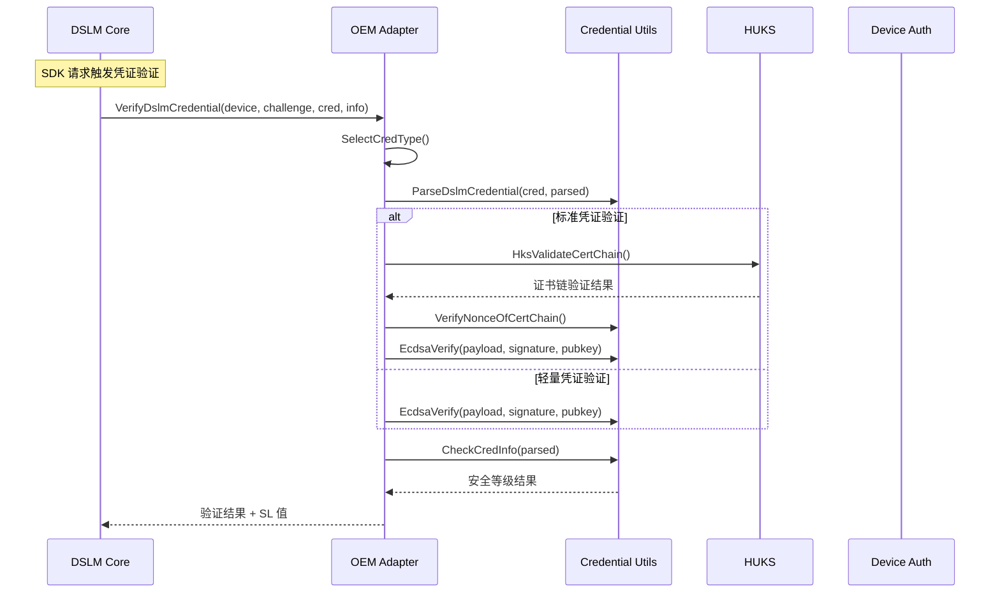

# 内部实现细节

> 最后更新：2026-02-07
> 版本：v3.0.0

## 8.1 核心数据结构

### DslmDeviceInfo - 设备信息结构

```c
// services/dslm/dslm_core_defines.h:38-61
typedef struct DslmDeviceInfo {
    ListNode linkNode;                    // 设备链表节点
    StateMachine machine;                 // 状态机
    DeviceIdentify identity;              // 设备标识
    uint32_t version;                    // 协议版本
    uint32_t onlineStatus;               // 在线状态
    uint64_t nonce;                      // 挑战值
    uint64_t nonceTimeStamp;             // 挑战时间戳
    uint64_t lastOnlineTime;             // 最后上线时间
    uint64_t lastOfflineTime;            // 最后下线时间
    uint64_t lastRequestTime;            // 最后请求时间
    uint64_t lastResponseTime;           // 最后响应时间
    uint64_t lastVerifyTime;             // 最后验证时间
    uint64_t transNum;                   // 事务号
    TimerHandle timeHandle;               // 定时器句柄
    uint32_t queryTimes;                 // 查询次数
    uint32_t result;                     // 操作结果
    DslmCredInfo credInfo;               // 凭证信息
    uint32_t notifyListSize;             // 回调列表大小
    ListHead notifyList;                 // 回调链表头
    uint32_t historyListSize;            // 历史列表大小
    ListHead historyList;                // 历史链表头
    uint32_t osType;                     // 操作系统类型
} DslmDeviceInfo;
```

**字段说明**：

| 字段 | 类型 | 用途 |
|------|------|------|
| `linkNode` | `ListNode` | 挂载到全局设备链表 |
| `machine` | `StateMachine` | 设备状态机 |
| `identity` | `DeviceIdentify` | 设备唯一标识 |
| `nonce` | `uint64_t` | 防重放攻击的挑战值 |
| `notifyList` | `ListHead` | 待通知的回调列表 |

---

### DslmCredInfo - 凭证信息结构

```c
// oem_property/include/dslm_cred.h
typedef struct DslmCredInfo {
    uint32_t magicNum;                      // 验证魔数 0xABCD1234
    uint32_t credType;                       // 凭证类型
    uint32_t securityLevel;                 // 安全等级 (SL1-SL5)
    uint8_t udid[DEVICE_ID_MAX_LEN];       // 设备唯一标识
    char manufacture[64];                   // 制造商
    char brand[64];                         // 品牌
    char model[64];                          // 型号
    char softwareVersion[64];               // 软件版本
    char securityLevelStr[16];              // 安全等级字符串
    uint64_t signTime;                     // 签名时间
    uint64_t notBefore;                    // 有效期起始
    uint64_t notAfter;                     // 有效期结束
    uint8_t pkInfo[1024];                  // 公钥信息
    uint32_t pkInfoLen;                    // 公钥信息长度
} DslmCredInfo;
```

---

### DslmCredBuff - 凭证缓冲区

```c
// oem_property/include/dslm_cred.h
typedef struct DslmCredBuff {
    uint8_t credBuff[CRED_BUFF_MAX_SIZE];  // 凭证缓冲区
    uint32_t credBuffSize;                  // 缓冲区大小
    uint8_t payload[CRED_BUFF_MAX_SIZE];   // 载荷缓冲区
    uint32_t payloadSize;                   // 载荷大小
} DslmCredBuff;
```

---

## 8.2 状态机实现

### 状态定义

```c
// services/dslm/dslm_fsm_process.h:28-33
typedef enum {
    STATE_INIT = 0,                   // 初始状态
    STATE_WAITING_CRED_RSP = 1,      // 等待凭证响应
    STATE_SUCCESS = 2,               // 成功获取等级
    STATE_FAILED = 3,                // 获取失败
} DslmState;
```

### 事件定义

```c
// services/dslm/dslm_fsm_process.h:36-46
typedef enum {
    EVENT_DEVICE_ONLINE = 0,         // 设备上线
    EVENT_CRED_RSP = 1,             // 收到凭证响应
    EVENT_MSG_SEND_FAILED = 2,       // 消息发送失败
    EVENT_DEVICE_OFFLINE = 3,        // 设备下线
    EVENT_TIME_OUT = 4,              // 超时
    EVENT_SDK_GET = 5,              // SDK 请求
    EVENT_SDK_TIMEOUT = 6,           // SDK 超时
    EVENT_CHECK = 7,                 // 周期检查
    EVENT_TO_SYNC = 8,               // 同步触发
} DslmEvent;
```

### 状态转移逻辑

```c
// services/dslm/dslm_fsm_process.c:67-89
void ScheduleDslmStateMachine(uint32_t event)
{
    DslmUtilsLock(mutex_);
    
    DslmState currentState = GetState(device);
    
    switch (currentState) {
        case STATE_INIT:
            if (event == EVENT_SDK_GET) {
                // 发送凭证请求
                int32_t ret = SendCredentialRequest(device);
                if (ret == SUCCESS) {
                    SetState(device, STATE_WAITING_CRED_RSP);
                    // 启动超时定时器
                    StartTimer(device);
                } else {
                    SetState(device, STATE_FAILED);
                }
            }
            break;
            
        case STATE_WAITING_CRED_RSP:
            if (event == EVENT_CRED_RSP) {
                // 处理凭证响应
                int32_t result = VerifyCredential(device);
                SetState(device, result == SUCCESS ? 
                         STATE_SUCCESS : STATE_FAILED);
                // 通知所有等待的回调
                NotifyAllCallbacks(device);
            } else if (event == EVENT_TIME_OUT) {
                SetState(device, STATE_FAILED);
                NotifyAllCallbacks(device);
            }
            break;
            
        case STATE_SUCCESS:
        case STATE_FAILED:
            if (event == EVENT_TO_SYNC) {
                // 重置到初始状态
                SetState(device, STATE_INIT);
            }
            break;
    }
    
    DslmUtilsUnlock(mutex_);
}
```

---

## 8.3 内部 API 契约

### 稳定接口 (Stable)

以下接口可在模块内部使用，稳定性保证：

| 接口 | 文件 | 稳定性 | 说明 |
|------|------|--------|------|
| `CreatOrGetDslmDeviceInfo()` | `dslm_device_list.h` | 稳定 | 获取或创建设备 |
| `DestroyDslmDeviceInfo()` | `dslm_device_list.h` | 稳定 | 销毁设备 |
| `ScheduleDslmStateMachine()` | `dslm_fsm_process.h` | 稳定 | 驱动状态机 |
| `OnRequestDeviceSecLevelInfo()` | `dslm_core_process.h` | 稳定 | 请求处理入口 |

### 内部实现 (Internal)

以下接口仅限模块内部使用，可能变更：

| 接口 | 文件 | 说明 |
|------|------|------|
| `InitDslmProcess()` | `dslm_rpc_process.c` | 初始化 DSLM 进程 |
| `InitMessenger()` | `dslm_rpc_process.c` | 初始化消息器 |
| `OnPeerMsgReceived()` | `dslm_rpc_process.c` | 接收对端消息 |
| `OnPeerStatusReceiver()` | `dslm_rpc_process.c` | 设备状态变化 |

---

## 8.4 资源生命周期

### 设备对象生命周期

```
┌─────────────────────────────────────────────────────────────────┐
│                     设备对象生命周期                               │
├─────────────────────────────────────────────────────────────────┤
│                                                                  │
│   [创建]                                                         │
│      │                                                          │
│      ▼                                                          │
│   CreatOrGetDslmDeviceInfo()                                    │
│      │                                                          │
│      │ 设备上线 / SDK 请求                                       │
│      ▼                                                          │
│   STATE_INIT                                                    │
│      │                                                          │
│      │ EVENT_SDK_GET                                            │
│      ▼                                                          │
│   STATE_WAITING_CRED_RSP                                        │
│      │                                                          │
│      │ EVENT_CRED_RSP / EVENT_TIME_OUT                          │
│      ▼                                                          │
│   STATE_SUCCESS / STATE_FAILED                                   │
│      │                                                          │
│      │ EVENT_TO_SYNC                                            │
│      ▼                                                          │
│   STATE_INIT ←────────────────────────────────────────────────┘ │
│                                                                  │
│   [销毁]                                                         │
│      │                                                          │
│      ▼                                                          │
│   OnPeerStatusReceiver(OFFLINE)                                 │
│      │                                                          │
│      ▼                                                          │
│   DestroyDslmDeviceInfo()                                       │
│                                                                  │
└─────────────────────────────────────────────────────────────────┘
```

### 回调对象生命周期

```c
// 回调对象在 SDK 请求时创建
DslmNotifyListNode *node = (DslmNotifyListNode *)DslmMalloc(
    sizeof(DslmNotifyListNode));

// 设置回调信息
node->callback = callback;           // 用户回调
node->cookie = cookie;               // 用户数据
node->requestTime = GetCurrentTime();

// 添加到设备回调列表
ListAddInsert(&device->notifyList, &node->linkNode, &device->notifyList);
device->notifyListSize++;

// ... 等待状态机处理 ...

// 结果返回后清理
ListNode *next = NULL;
LIST_FOR_EACH(next, &device->notifyList) {
    DslmNotifyListNode *n = LIST_ENTRY(next, DslmNotifyListNode, linkNode);
    
    // 调用用户回调
    if (n->callback != NULL) {
        n->callback(identify, info);
    }
    
    // 释放节点内存
    DslmFree(n);
}

// 重置列表
ListInit(&device->notifyList);
device->notifyListSize = 0;
```

---

## 8.5 插件机制

### 插件接口定义

```c
// oem_property/include/dslm_credential.h:18-32
typedef struct ProcessDslmCredFunctions {
    /**
     * @brief 初始化凭证
     */
    int32_t (*InitDslmCredential)(
        DslmCredBuff *credBuff, 
        DslmCredInfo *credInfo);
    
    /**
     * @brief 请求凭证
     */
    int32_t (*RequestDslmCredential)(
        DslmCredBuff *credBuff, 
        uint32_t credType);
    
    /**
     * @brief 验证凭证
     */
    int32_t (*VerifyDslmCredential)(
        const DslmDeviceInfo *device, 
        uint64_t challenge,
        const DslmCredBuff *credBuff, 
        DslmCredInfo *credInfo);
} ProcessDslmCredFunctions;
```

### 插件注册

```c
// oem_property/common/dslm_credential.c:45-67
static ProcessDslmCredFunctions g_ohosFuncs = {
    .InitDslmCredential = InitOhosDslmCred,
    .RequestDslmCredential = RequestOhosDslmCred,
    .VerifyDslmCredential = VerifyOhosDslmCred,
};

void InitDslmCredentialFunctions(ProcessDslmCredFunctions *funcs)
{
    if (funcs == NULL) {
        return;
    }
    
    // 注册 OHOS 平台实现
    funcs->InitDslmCredential = InitOhosDslmCred;
    funcs->RequestDslmCredential = RequestOhosDslmCred;
    funcs->VerifyDslmCredential = VerifyOhosDslmCred;
}
```

### 动态库加载

```cpp
// services/sa/standard/dslm_service.cpp:181-189
void DslmService::ProcessLoadPlugin(void)
{
#ifdef PLUGIN_SO_PATH
    handle_ = dlopen(PLUGIN_SO_PATH, RTLD_NOW);
    if (!handle_) {
        SECURITY_LOG_ERROR("load %{public}s failed for %{public}s", 
                           PLUGIN_SO_PATH, dlerror());
        return;
    }
    
    // 加载插件符号
    InitDslmCredentialFunc initFunc = 
        (InitDslmCredentialFunc)dlsym(handle_, "InitDslmCredentialFunctions");
    
    if (initFunc != NULL) {
        initFunc(&g_ohosFuncs);
    }
#endif
}
```

---

## 8.6 凭证类型

### 凭证类型枚举

```c
// oem_property/include/dslm_cred.h
typedef enum {
    CRED_TYPE_MINI = 1000,       // Mini 设备凭证
    CRED_TYPE_SMALL = 2000,      // Small 设备凭证  
    CRED_TYPE_STANDARD = 3000,   // Standard 设备凭证
    CRED_TYPE_LARGE = 4000,      // Large 设备凭证 (保留)
} CredType;
```

### 凭证类型选择

```c
// oem_property/ohos/common/dslm_ohos_request.c:103-117
static int32_t SelectDslmCredType(const DslmDeviceInfo *device)
{
    // 根据设备 OS 类型选择凭证类型
    switch (device->osType) {
        case OS_TYPE_STANDARD:
            return CRED_TYPE_STANDARD;
            
        case OS_TYPE_SMALL:
            return CRED_TYPE_SMALL;
            
        case OS_TYPE_MINI:
            return CRED_TYPE_MINI;
            
        default:
            return CRED_TYPE_SMALL;  // 默认使用 Small
    }
}
```

---

## 8.7 JWS 凭证格式

### JWS 结构

```
┌─────────────────────────────────────────────────────────────────┐
│                     JWS 凭证格式                                 │
├─────────────────────────────────────────────────────────────────┤
│                                                                  │
│   <base64url(header)>.<base64url(payload)>.<signature>.<cert>  │
│                                                                  │
│   ├── Header: {"alg": "ES256", "typ": "DSL"}                    │
│   │                                                              │
│   ├── Payload: {                                                 │
│   │   "type": "debug|release",                                   │
│   │   "manufacture": "厂商名",                                   │
│   │   "brand": "品牌",                                           │
│   │   "model": "型号",                                           │
│   │   "softwareVersion": "版本",                                 │
│   │   "securityLevel": "SL1|SL2|SL3|SL4|SL5",                  │
│   │   "signTime": 1234567890,                                    │
│   │   "udid": "设备唯一标识",                                    │
│   │   "version": 1                                               │
│   │   }                                                         │
│   │                                                              │
│   ├── Signature: ECDSA-SHA256 签名                               │
│   │                                                              │
│   └── Certificate: X.509 证书链                                 │
│                                                                  │
└─────────────────────────────────────────────────────────────────┘
```

### 凭证解析流程

```c
// oem_property/common/dslm_credential_utils.c:89-150
int32_t ParseDslmCredential(
    const DslmCredBuff *credBuff, 
    DslmCredInfo *credInfo)
{
    // 1. 按 "." 分割 JWS
    char *saveptr = NULL;
    char *token = strtok_r((char *)credBuff->credBuff, ".", &saveptr);
    
    // 2. 解析 Header
    JSON *header = cJSON_ParseWithLength(
        token, strlen(token));
    if (header == NULL) {
        return ERR_JSON_ERR;
    }
    
    // 3. 验证 Header 类型
    JSON *typeJson = cJSON_GetObjectItem(header, "type");
    if (typeJson == NULL || typeJson->valuestring == NULL) {
        cJSON_Delete(header);
        return ERR_JSON_ERR;
    }
    
    // 4. 获取 Payload
    token = strtok_r(NULL, ".", &saveptr);
    JSON *payload = cJSON_Parse(token);
    
    // 5. 提取 Payload 字段
    JSON *levelJson = cJSON_GetObjectItem(payload, "securityLevel");
    if (levelJson != NULL) {
        credInfo->securityLevel = atoi(levelJson->valuestring);
    }
    
    // 6. 验证签名
    token = strtok_r(NULL, ".", &saveptr);
    // ...
}
```

---

## 8.8 内存安全

### 内存分配封装

```c
// baselib/utils/include/utils_mem.h
void *DslmMalloc(uint32_t size);
void DslmFree(void *ptr);
void *DslmCalloc(uint32_t num, uint32_t size);
void *DslmRealloc(void *ptr, uint32_t size);
```

### 安全内存操作

```c
// 使用 securec.h 函数
#include <securec.h>

// 安全复制
int32_t ret = memcpy_s(dest, destSize, src, srcSize);
if (ret != EOK) {
    return ERR_MEMORY_ERR;
}

// 安全设置
int32_t ret = memset_s(buf, bufSize, 0, bufSize);
if (ret != EOK) {
    return ERR_MEMORY_ERR;
}

// 安全字符串复制
int32_t ret = strcpy_s(dest, destSize, src);
if (ret != EOK) {
    return ERR_MEMORY_ERR;
}
```

---

## 8.9 扩展点

### 可扩展组件

| 扩展点 | 接口 | 说明 |
|--------|------|------|
| **凭证实现** | `ProcessDslmCredFunctions` | OEM 可替换凭证处理 |
| **消息传输** | `Messenger` | 可替换消息传输机制 |
| **日志输出** | `UtilsLog` | 可替换日志实现 |
| **加密算法** | `EcdsaVerify` | 可替换签名验证 |

### 扩展示例

```c
// 自定义凭证实现示例
static ProcessDslmCredFunctions g_customCredFuncs = {
    .InitDslmCredential = CustomInitDslmCred,
    .RequestDslmCredential = CustomRequestDslmCred,
    .VerifyDslmCredential = CustomVerifyDslmCred,
};

// 注册自定义实现
void InitCustomCredential(void)
{
    InitDslmCredentialFunctions(&g_customCredFuncs);
}
```

---

## 8.10 关键时序图

### 凭证验证完整时序



---

## 附录

### 相关文件索引

| 功能 | 关键文件 |
|------|----------|
| 设备管理 | `services/dslm/dslm_device_list.c` |
| 状态机 | `services/dslm/dslm_fsm_process.c` |
| 凭证解析 | `oem_property/common/dslm_credential_utils.c` |
| 凭证验证 | `oem_property/ohos/common/dslm_ohos_verify.c` |
| HUKS 适配 | `oem_property/ohos/common/hks_adapter.c` |
| SA 服务 | `services/sa/standard/dslm_service.cpp` |
