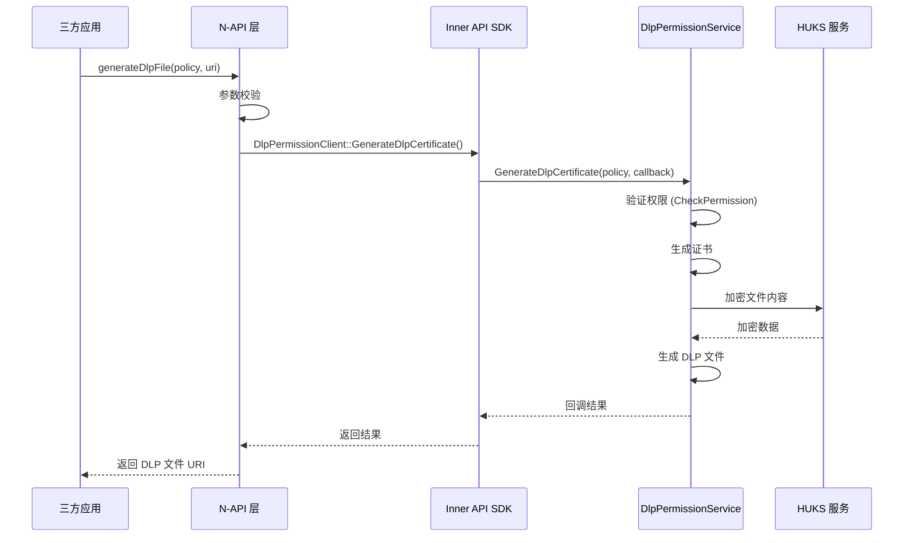
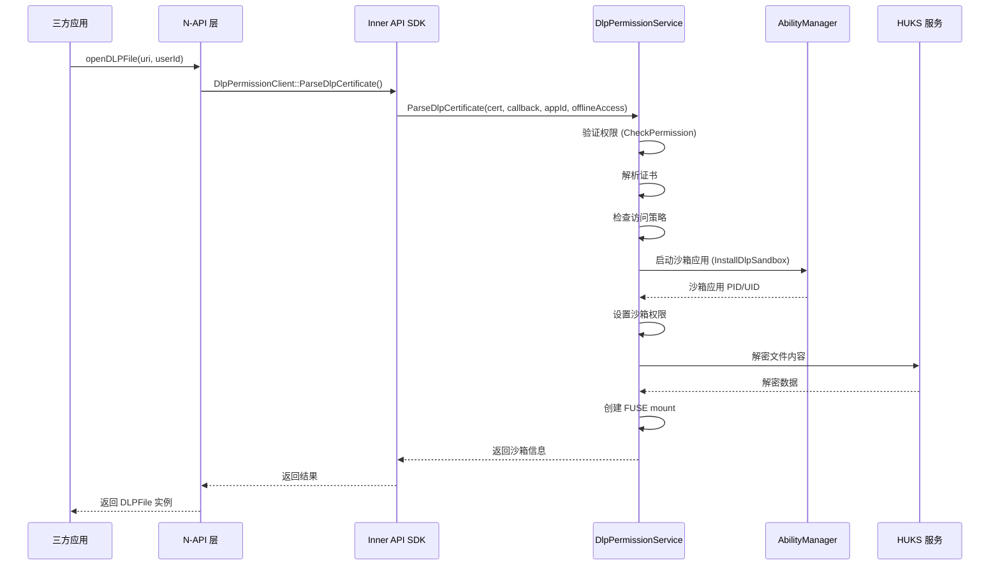
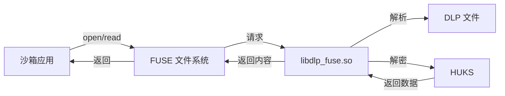
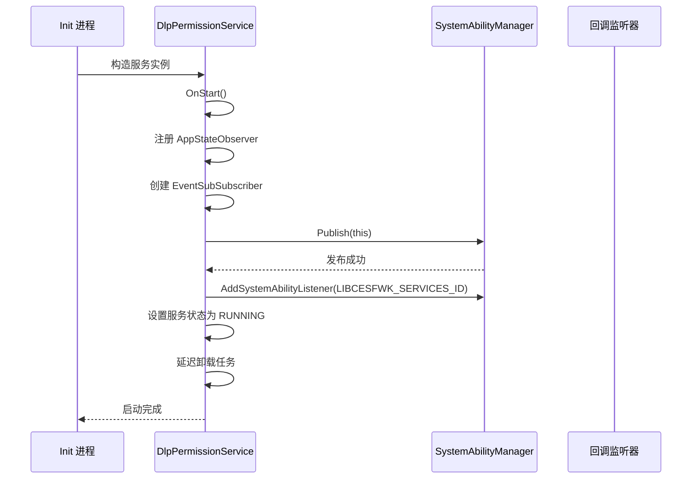
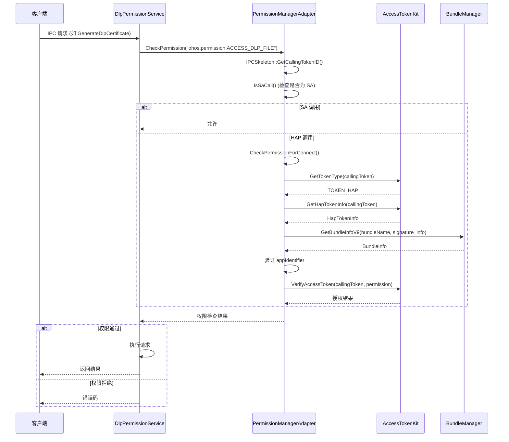
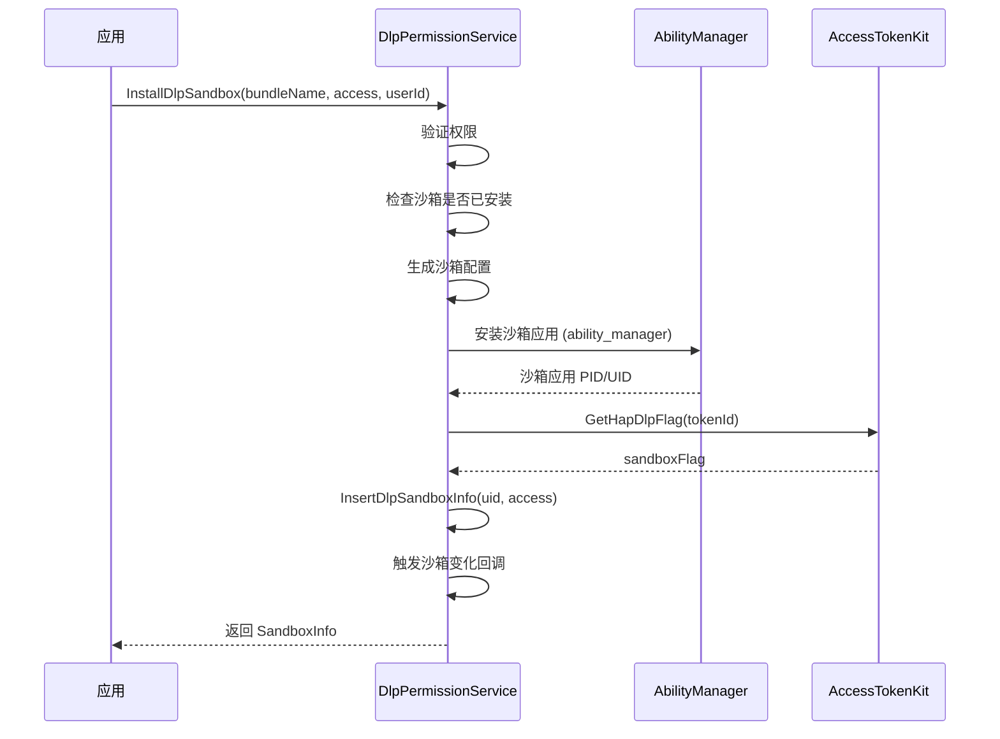

# 架构说明

## 目的

本文档描述 DLP 权限管理服务的架构设计，包括组件关系、数据流、线程模型和关键时序。

## 适用范围

- 目标读者：DLP 权限管理服务的开发者、维护者
- 覆盖内容：组件图、数据流、线程模型、关键时序

---

## 组件图

### 整体架构

```mermaid
graph TB
    subgraph "Client Layer (客户端层)"
        A1["三方应用 (JavaScript)"]
        A2["DLPM 应用 (UI)"]
    end

    subgraph "N-API Layer (N-API 层)"
        B1["libdlppermission_napi.so"]
        B2["libdlpsetdlpfeature_napi.so"]
        B3["identifysensitivecontent_napi.so"]
    end

    subgraph "Inner API Layer (内部接口层)"
        C1["libdlp_permission_sdk.so"]
        C2["libdlpparse_inner.so"]
        C3["libdlp_fuse.so"]
        C4["libdlp_setconfig_sdk.so"]
    end

    subgraph "Service Layer (服务层)"
        D1["DlpPermissionService (SA ID: 3521)"]
        D2["PermissionManagerAdapter"]
        D3["SandboxManager"]
        D4["CertManager"]
        D5["DlpFileParser"]
    end

    subgraph "External Services (外部服务)"
        E1["SystemAbilityManager"]
        E2["AccessTokenKit"]
        E3["BundleManager"]
        E4["HUKS (加密服务)"]
        E5["AbilityManager"]
    end

    A1 -->|N-API 调用| B1
    A2 -->|N-API 调用| B1
    B1 -->|SDK 调用| C1
    B2 -->|SDK 调用| C1
    C1 -->|IPC (Binder)| D1
    C2 -->|文件解析| D1
    C3 -->|FUSE 文件系统| D1

    D1 -->|SA 注册/发现| E1
    D1 -->|权限验证| E2
    D1 -->|Bundle 信息| E3
    D1 -->|加密/解密| E4
    D1 -->|沙箱应用管理| E5
```

### 组件职责

| 组件 | 职责 |
|------|------|
| **三方应用** | 通过 N-API 调用 DLP 服务 |
| **DLPM 应用** | 提供 UI，调用 DLP 服务生成/打开 DLP 文件 |
| **N-API 层** | JS 到 C++ 的绑定，参数校验，异步工作 |
| **Inner API 层** | SDK 实现，IPC 客户端，文件解析，FUSE 文件系统 |
| **Service 层** | System Ability 实现，权限验证，沙箱管理，证书管理 |
| **外部服务** | 系统基础设施（SA 管理、权限、加密等） |

---

## 数据流

### 1. 生成 DLP 文件流程



**代码证据**：
- N-API 入口：`NapiDlpPermission::GenerateDlpFile()` (napi_dlp_permission.cpp)
- SDK 调用：`DlpPermissionClient::GenerateDlpCertificate()` (dlp_permission_client.cpp)
- IPC 接口：`GenerateDlpCertificate` (IDlpPermissionService.idl:31)
- 服务实现：`DlpPermissionService::GenerateDlpCertificate()` (dlp_permission_service.cpp)

### 2. 打开 DLP 文件流程



**代码证据**：
- N-API 入口：`NapiDlpPermission::OpenDlpFile()` (napi_dlp_permission.cpp)
- SDK 调用：`DlpPermissionClient::ParseDlpCertificate()` (dlp_permission_client.cpp)
- IPC 接口：`ParseDlpCertificate` (IDlpPermissionService.idl:34)
- 服务实现：`DlpPermissionService::ParseDlpCertificate()` (dlp_permission_service.cpp)
- 沙箱安装：`InstallDlpSandbox` (IDlpPermissionService.idl:49)

### 3. FUSE 文件系统流程



**代码证据**：
- FUSE 实现：`fuse_daemon.cpp` (dlp_fuse/)
- link 文件管理：`dlp_link_file.cpp` (dlp_fuse/)
- FUSE 文件描述符：`dlp_fuse_fd.h` (dlp_fuse/)

---

## 线程模型

### 1. N-API 线程模型

N-API 使用异步工作模式避免阻塞 JS 线程：

```
JS 线程 (主线程)
    ↓ napi_create_async_work()
Worker 线程 (napi_async_work)
    ↓ XXXExecute() 执行
    ↓ 调用 SDK / IPC
Worker 线程完成
    ↓ XXXComplete() 回调
    ↓ 返回 JS 结果
JS 线程 (主线程)
```

**代码证据**：
- 异步上下文结构：`napi_common.h` 中的 `AsyncContext` 基类
- 执行函数：`XXXExecute()` 模式 (如 `GenerateDlpFileExecute()`)
- 完成函数：`XXXComplete()` 模式 (如 `GenerateDlpFileComplete()`)

### 2. Service 层线程模型

System Ability 运行在独立进程 (`dlp_permission_service`)：

```
Main Thread (服务主线程)
    ↓ OnStart()
    ├─ 注册 SA
    ├─ 初始化组件
    └─ 启动监听器
    ↓ 处理 IPC 请求
    ├─ OnRemoteRequest()
    ├─ 线程池处理
    └─ 回调发送

Callback Thread (回调线程)
    ↓ RegisterCallback()
    └─ 跨进程发送事件

Observer Thread (观察者线程)
    ↓ OnAddSystemAbility()
    └─ 监听外部服务
```

**代码证据**：
- `OnStart()` 方法 (dlp_permission_service.cpp:129-154)
- `OnRemoteRequest()` 方法 (IDL-generated stub)
- `appStateObserver_` 应用状态观察者 (app_state_observer.cpp)

### 3. FUSE 线程模型

FUSE 运行在独立线程或进程：

```
Main Process
    ↓ fuse_daemon 启动
FUSE Daemon Thread
    ↓ libfuse 事件循环
    ├─ fuse_loop() / fuse_loop_mt()
    ├─ 处理文件系统请求
    └─ 调用 DLP 解析/解密
```

**代码证据**：
- `fuse_daemon.cpp` - FUSE daemon 实现

---

## 关键时序

### 1. 服务启动时序



**代码证据**：
- `OnStart()` 方法 (dlp_permission_service.cpp:129-154)
- `REGISTER_SYSTEM_ABILITY_BY_ID` 宏 (dlp_permission_service.cpp:122)

### 2. 权限验证时序



**代码证据**：
- `CheckPermission()` 方法 (permission_manager_adapter.cpp)
- `GetAppIdentifierForCalling()` 方法 (permission_manager_adapter.cpp)
- `CheckHapPermission()` 方法 (bundle_manager_adapter.cpp)

### 3. 沙箱安装时序



**代码证据**：
- `InstallDlpSandbox` IPC 方法 (IDlpPermissionService.idl:49)
- `InsertDlpSandboxInfo()` 方法 (dlp_permission_service.cpp)
- `RegisterDlpSandboxChangeCallback()` IPC 方法 (IDlpPermissionService.idl:65)

---

## 跨模块通信

### IPC 通信

**协议**：OpenHarmony IPC / Binder

**接口**：`IDlpPermissionService` (IDL 定义)

**通信模式**：Proxy-Stub 模式

```
Client Process                Server Process
┌──────────────┐           ┌──────────────┐
│  DlpPermission │  IPC    │ DlpPermission │
│   Proxy      │ ◄────────►│   Service    │
│              │  Binder   │  (Stub)      │
└──────────────┘           └──────────────┘
```

**代码证据**：
- Proxy: `DlpPermissionServiceProxy` (IDL-generated)
- Stub: `DlpPermissionServiceStub` (IDL-generated)
- Client 单例：`DlpPermissionClient` (dlp_permission_client.cpp)

### 回调通信

支持跨进程回调机制：

```
Server Process                Client Process
┌──────────────┐           ┌──────────────┐
│DlpPermission │  回调     │   Client     │
│   Service    │ ◄────────►│  Callback    │
│ (Callback)   │  IPC      │   Stub       │
└──────────────┘           └──────────────┘
```

**代码证据**：
- 回调接口：`IDlpPermissionCallback` (IDL 定义)
- 沙箱变化回调：`DlpSandboxChangeCallbackStub` (dlp_sandbox_change_callback/)
- 打开文件回调：`OpenDlpFileCallbackStub` (open_dlp_file_callback/)

---

## 相关跳转链接

- [对外 N-API](03_NAPI.md) - 查看完整的 N-API 接口列表
- [内部 API](04_Internal_API.md) - 查看内部接口定义
- [安全风险评审](07_Security_Review.md) - 了解安全机制

---

最后更新时间：2026-02-06
